# GC 基础算法

> 从性能评价标准（吞吐量、最大暂停时间、堆使用效率、访问的局部性）讲到各类 GC 算法的过程、优缺点与优化。
>
> 内容整理自语雀笔记，原书为《垃圾回收的算法与实现》（中村成洋 / 相川光）；本轮补充（三色与漏标两条件、两类屏障的正确性与代价、复制与压缩的实现细节、卡表、收集器机制映射、安全点与调优顺序）仍以该书为主线，落到 JVM / Go 的部分另见 [JVM与垃圾回收.md](../java/JVM与垃圾回收.md)。

---

## 概述

评价标准评价GC算法的性能时，有以下4个标准。

- 吞吐量，在单位时间内的处理能力。
- 最大暂停时间。
- 堆使用效率。
- 访问的局部性。

### 吞吐量

在单位时间内的处理能力。

### 最大暂停时间

GC执行过程中令mutator暂停执行。最大暂停时间指的是“因执行GC而暂停执行mutator的最长时间”。

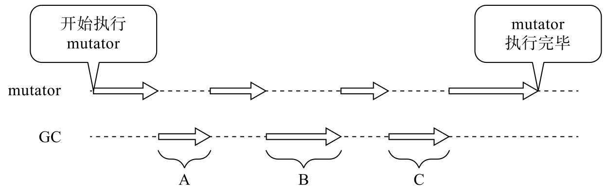

### 堆使用效率

一个是头的大小，另一个是堆的用法。

首先是头的大小。在堆中堆放的信息越多，GC的效率也就越高，吞吐量也就随之得到改善。但毋庸置疑，头越小越好。因此为了执行GC，需要把在头中堆放的信息控制在最小限度。其次，根据堆的用法，堆使用效率也会出现巨大的差异。举个例子，GC复制算法中将堆二等分，每次只使用一半，交替进行，因此总是只能利用堆的一半。相对而言，GC标记-清除算法和引用计数法就能利用整个堆。

> **注意：不管尝试哪种GC算法，我们都会发现较大的吞吐量和较短的最大暂停时间不可兼得。所以应根据执行的应用所重视的指标的不同，来分别采用不同的GC算法。**

### 访问的局部性

PC上有4种存储器，分别是寄存器、缓存、内存、辅助存储器。


具有引用关系的对象之间通常很可能存在连续访问的情况。这在多数程序中都很常见，称为“访问的局部性”。考虑到访问的局部性，把具有引用关系的对象安排在堆中较近的位置，就能提高在缓存中读取到想利用的数据的概率，令mutator高速运行。

## 算法介绍

### GC标记-清除算法

GC标记-清除算法由标记阶段和清除阶段构成。标记阶段是把所有活动对象都做上标记的阶段。清除阶段是把那些没有标记的对象，也就是非活动对象回收的阶段。

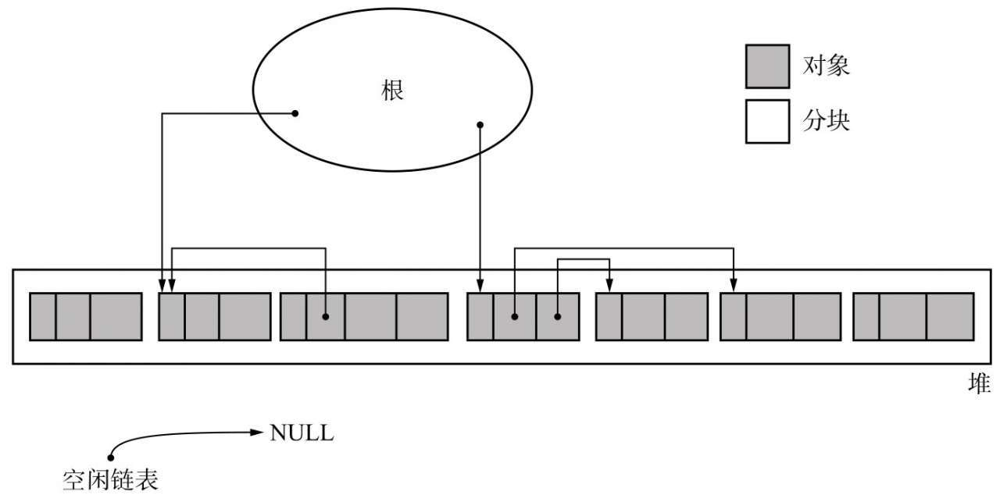

#### 过程

**标记阶段**

标记就是“遍历对象并标记”的处理过程。**这个过程执行一次。**

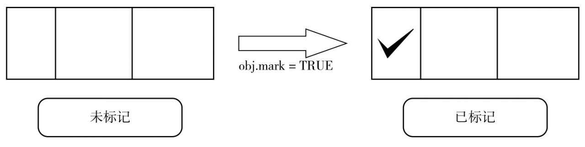


**搜索算法**

**深度优先搜索**

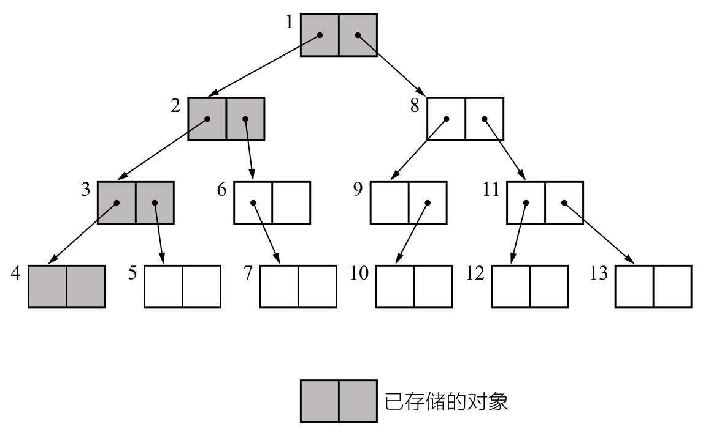

**广度优先搜索**

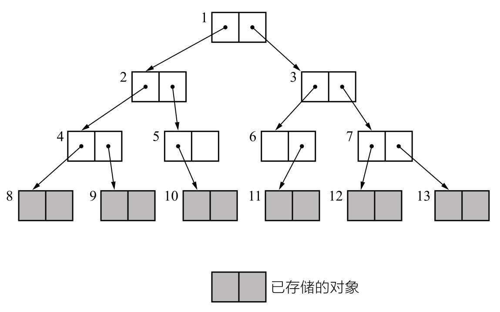

> 比较一下内存使用量（已存储的对象数量）就可以知道，深度优先搜索比广度优先搜索更能压低内存使用量。因此我们在标记阶段经常用到深度优先搜索。

**清除阶段**

我们必须把非活动对象回收再利用。回收对象就是把对象作为分块，连接到被称为“空闲链表”的单向链表。在之后进行分配时只要遍历这个空闲链表，就可以找到分块了。

在清除阶段，程序会遍历所有堆，进行垃圾回收。也就是说，所花费时间与堆大小成正比。堆越大，清除阶段所花费的时间就会越长。


#### 分配

这里的分配是指将回收的垃圾进行再利用。

我们在清除阶段已经把垃圾对象连接到空闲链表了。搜索空闲链表并寻找大小合适的分块，这项操作就叫作分配。

#### 合并

根据分配策略的不同可能会产生大量的小分块。但如果它们是连续的，我们就能把所有的小分块连在一起形成一个大分块。这种“连接连续分块”的操作就叫作合并（coalescing），合并是在清除阶段进行的。

#### 优点

**实现简单**

说到GC标记-清除算法的优点，那当然要数算法简单，实现容易了。打个比方，接下来我们将在第3章中提到引用计数法，在引用计数法中就很难切实管理计数器的增减，实现也很困难。另外，如果算法实现简单，那么它与其他算法的组合也就相应地简单。在第3章和第4章中，我们会为大家介绍把GC标记-清除算法与其他GC算法相结合的方法。

**与保守式GC算法兼容**

在第6章中介绍的保守式GC算法中，对象是不能被移动的。因此保守式GC算法跟把对象从现在的场所复制到其他场所的GC复制算法（第4章）与标记-压缩算法（第5章）不兼容。而GC标记-清除算法因为不会移动对象，所以非常适合搭配保守式GC算法。事实上，在很多采用保守式GC算法的处理程序中也用到了GC标记-清除算法。

#### 缺点

**碎片化**

在GC标记-清除算法的使用过程中会逐渐产生被细化的分块，不久后就会导致无数的小分块散布在堆的各处。我们称这种状况为碎片化（fragmentation）。


把具有引用关系的对象安排在堆中较远的位置，就会增加访问所需的时间。

因为分块在堆中的分布情况取决于mutator的运行情况，所以只要使用GC标记-清除算法，就会或多或少地产生碎片化。为了避免碎片化，可以采用将在第4章以及第5章中介绍的“压缩”，以及在本章介绍的“BiBOP法”。

**分配速度**

GC标记-清除算法中分块不是连续的，因此每次分配都必须遍历空闲链表，找到足够大的分块。最糟的情况就是每次进行分配都得把空闲链表遍历到最后。另一方面，因为在GC复制算法和GC标记-压缩算法中，分块是作为一个连续的内存空间存在的，所以没必要遍历空闲链表，分配就能非常高速地进行，而且还能在堆允许范围内分配很大的对象。本章在后面叙述的多个空闲链表（multiple free-list）和BiBOP法都是为了能在GC标记-清除算法中高速进行分配而想出的方法。

**与写时复制技术不兼容**

写时复制技术（copy-on-write）是在Linux等众多UNIX操作系统的虚拟存储中用到的高速化方法。打个比方，在Linux中复制进程，也就是使用fork()函数时，大部分内存空间都不会被复制。只是复制进程，就复制了所有内存空间的话也太说不过去了吧。因此，写时复制技术只是装作已经复制了内存空间，实际上是将内存空间共享了。

当我们对共享内存空间进行写入时，不能直接重写共享内存。因为从其他程序访问时，会发生数据不一致的情况。在重写时，要复制自己私有空间的数据，对这个私有空间进行重写。复制后只访问这个私有空间，不访问共享内存。像这样，因为这门技术是“在写入时进行复制”的，所以才被称为写时复制技术。

这样的话，GC标记-清除算法就会存在一个问题——与写时复制技术不兼容。即使没重写对象，GC也会设置所有活动对象的标志位，这样就会频繁发生本不应该发生的复制，压迫到内存空间。为了处理这个问题，我们采用位图标记（bitmap marking）的方法。

#### 优化

**多个空闲链表**

之前我们讲的标记-清除算法中只用到了一个空闲链表，在这个空闲链表中，对大的分块和小的分块进行同样的处理。但是这样一来，每次分配的时候都要遍历一次空闲链表来寻找合适大小的分块，这样非常浪费时间。因此，我们有一种方法，就是利用分块大小不同的空闲链表，即创建只连接大分块的空闲链表和只连接小分块的空闲链表。这样一来，只要按照mutator所申请的分块大小选择空闲链表，就能在短时间内找到符合条件的分块了。

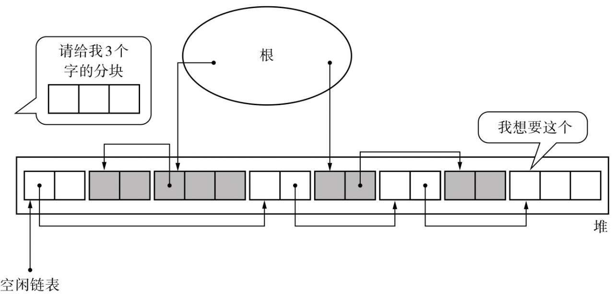

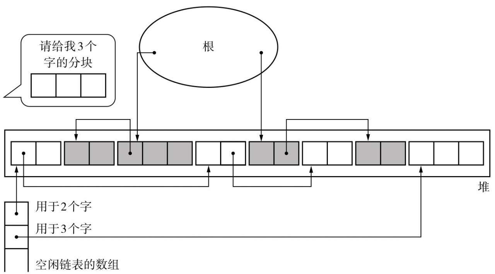

**BiBOP法**

BiBOP是Big Bag Of Pages的缩写。这么说可能比较难懂，用一句话概括就是“将大小相近的对象整理成固定大小的块进行管理的做法”。

把堆分割成固定大小的块，让每个块只能配置同样大小的对象。这就是BiBOP法。

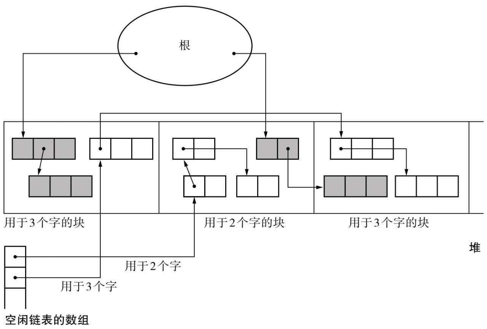

但是，使用BiBOP法并不能完全消除碎片化。比方说在全部用于2个字的块中，只有1到2个活动对象，这种情况下就不能算是有效利用了堆。BiBOP法原本是为了消除碎片化，提高堆使用效率而采用的方法。但像上面这样，在多个块中分散残留着同样大小的对象，反而会降低堆使用效率。

**位图标记**

在单纯的GC标记-清除算法中，用于标记的位是被分配到各个对象的头中的。也就是说，算法是把对象和头一并处理的。然而之前在2.3.3节中也提过，这跟写时复制技术不兼容。

对此我们有个方法，那就是只收集各个对象的标志位并表格化，不跟对象一起管理。在标记的时候，不在对象的头里置位，而是在这个表格中的特定场所置位。像这样集合了用于标记的位的表格称为“位图表格”（bitmap table），利用这个表格进行标记的行为称为“位图标记”。位图表格的实现方法有多种，例如散列表和树形结构等。


- **优点**
  - **与写时复制技术兼容**：以往的标记操作都是直接对对象设置标志位，这会产生无谓的复制。然而，使用位图标记是不会对对象设置标志位的，所以也不会发生无谓的复制。当然，因为对位图表格进行了重写，所以在此处会发生复制。不过，因为位图表格非常小，所以即使被复制也不会有什么大的影响。
  - **清除操作更高效**：不仅在标记阶段，在清除阶段也可以得到好处。以往的清除操作都必须遍历整个堆，把非活动对象连接到空闲链表，同时取消活动对象的标志位。利用了位图表格的清除操作则把所有对象的标志位集合到一处，所以可以快速消去标志位。

**延迟清除法**

延迟清除法（Lazy Sweep）是缩减因清除操作而导致的mutator最大暂停时间的方法。

因为延迟清除法不是一下遍历整个堆，它只在分配时执行必要的遍历，所以可以压缩因清除操作而导致的mutator的暂停时间。这就是“延迟”清除操作的意思。

### 引用计数法

GC原本是一种“释放怎么都无法被引用的对象的机制”。那么人们自然而然地就会想到，可以让所有对象事先记录下“有多少程序引用自己”。让各对象知道自己的“人气指数”，从而让没有人气的对象自己消失，这就是引用计数法（Reference Counting），它是George E. Collins [6]于1960年钻研出来的。

引用计数法中引入了一个概念，那就是“计数器”。计数器表示的是对象的人气指数，也就是有多少程序引用了这个对象（被引用数）。


#### 过程

在变更数组元素等的时候会进行指针的更新。通过更新指针，可能会产生没有被任何程序引用的垃圾对象。

引用计数法中会监督在更新指针的时候是否有产生垃圾，从而在产生垃圾时将其立刻回收。也就是说，这意味着在分配时没有分块的情况下，堆中所有的对象都为活动对象，这时没法新分配对象。另一方面，GC标记-清除算法即使产生了垃圾也不会将其马上回收，只会在没有分块的时候将垃圾一并回收。

像这样，可以说将内存管理和mutator同时运行正是引用计数法的一大特征。

#### 优点

**可即刻回收垃圾**

在引用计数法中，每个对象始终都知道自己的被引用数（就是计数器的值）。当被引用数的值为0时，对象马上就会把自己作为空闲空间连接到空闲链表。也就是说，各个对象在变成垃圾的同时就会立刻被回收。要说这有什么意义，那就是内存空间不会被垃圾占领。垃圾全部都已连接到空闲链表，能作为分块再被利用。

另一方面，在其他的GC算法中，即使对象变成了垃圾，程序也无法立刻判别。只有当分块用尽后GC开始执行时，才能知道哪个对象是垃圾，哪个对象不是垃圾。也就是说，直到GC执行之前，都会有一部分内存空间被垃圾占用。

**最大暂停时间短**

在引用计数法中，只有当通过mutator更新指针时程序才会执行垃圾回收。也就是说，每次通过执行mutator生成垃圾时这部分垃圾都会被回收，因而大幅度地削减了mutator的最大暂停时间。

**没有必要沿指针查找**

引用计数法和GC标记-清除算法不一样，没必要由根沿指针查找。当我们想减少沿指针查找的次数时，它就派上用场了。打个比方，在分布式环境中，如果要沿各个计算节点之间的指针进行查找，成本就会增大，因此需要极力控制沿指针查找的次数。所以，有一种做法是在各个计算节点内回收垃圾时使用GC标记-清除算法，在考虑到节点间的引用关系时则采用引用计数法。

#### 缺点

**计数器值的增减处理繁重**

虽然依据执行的mutator的动作不同而略有差距，我们不能一概而论，不过在大多数情况下指针都会频繁地更新。特别是有根的指针，会以近乎令人目眩的势头飞速地进行更新。这是因为根可以通过mutator直接被引用。在引用计数法中，每当指针更新时，计数器的值都会随之更新，因此值的增减处理必然会变得繁重。

**计数器需要占用很多位**

用于引用计数的计数器最大必须能数完堆中所有对象的引用数。打个比方，假如我们用的是32位机器，那么就有可能要让2的32次方个对象同时引用一个对象。考虑到这种情况，就有必要确保各对象的计数器有32位大小。也就是说，对于所有对象，必须留有32位的空间。这就害得内存空间的使用效率大大降低了。打比方说，假如对象只有2个域，那么其计数器就占了它整体的1/3。

**实现烦琐复杂**

引用计数的算法本身很简单，但事实上实现起来却不容易。进行指针更新操作的update_ptr()函数是在mutator这边调用的。打个比方，我们需要把以往写成 `*ptr=obj` 的地方都重写成 `update_ptr(ptr, obj)`。因为调用update_ptr()函数的地方非常多，所以重写过程中很容易出现遗漏。如果漏掉了某处，内存管理就无法正确进行，就会产生BUG。

**循环引用无法回收**

因为两个对象互相引用，所以各对象的计数器的值都是1。但是这些对象组并没有被其他任何对象引用。因此想一并回收这两个对象都不行，只要它们的计数器值都是1，就无法回收。像这样在两个及两个以上的对象互相循环引用形成对象组的情况下，即使这些对象组都成了垃圾，程序也无法将它们回收。


#### 优化

**延迟引用计数法**

在讲引用计数法的缺点时，我们提到了其中一项是“计数器值的增减处理繁重”。下面就对改善此缺点的方法进行说明，即延迟引用计数法（Deferred Reference Counting）。这个方法是L. Peter Deutsch和Daniel G. Bobrow研究出来的。如2.2.3.1节中所述，计数器值增减处理繁重的原因之一是从根的引用变化频繁。因此，我们就让从根引用的指针的变化不反映在计数器上。打个比方，我们把重写全局变量指针的 `update_ptr($ptr, obj)` 改写成 `*$ptr=obj`。

**优点**

在延迟引用计数法中，程序延迟了根引用的计数，将垃圾一并回收。通过延迟，减轻了因根引用频繁发生变化而导致的计数器增减所带来的额外负担。

**缺点**

为了延迟计数器值的增减，垃圾不能马上得到回收，这样一来垃圾就会压迫堆，我们也就失去了引用计数法的一大优点——可即刻回收垃圾。

另外，scan_zct()函数导致最大暂停时间延长了。执行scan_zct()函数所花费的时间与$zct的大小成正比。$zct越大，要搜索的对象就越多，妨碍mutator运作的时间也就越长。要想缩减因scan_zct()函数而导致的暂停时间，就要缩小$zct。但是这样一来调用scan_zct()函数的频率就增加了，也压低了吞吐量。很明显这样就本末倒置了。

我们在延迟引用计数法中使用ZCT（Zero Count Table）。ZCT是一个表，它会事先记录下计数器值在dec_ref_cnt()函数的作用下变为0的对象。

**Sticky引用计数法**

减少计数器位宽的“Sticky引用计数法”。举个例子，我们假设用于计数器的位数为5位，那么这种计数器最多只能数到2的5次方减1，也就是31个引用数。如果此对象被大于31个对象引用，那么计数器就会溢出。这跟车辆速度计的指针爆表是一个状况。

针对计数器溢出（也就是爆表的对象），需要暂停对计数器的管理。对付这种对象，我们主要有两种方法。

**使用GC标记-清除算法进行管理**

我们在这里介绍的GC标记-清除算法和前面介绍的GC标记-清除算法主要有以下3点不同。

1. 一开始就把所有对象的计数器值设为0
2. 不标记对象，而是对计数器进行增量操作
3. 为了对计数器进行增量操作，算法对活动对象进行了不止一次的搜索

像这样，只要把引用计数法和GC标记-清除算法结合起来，在计数器溢出后即使对象成了垃圾，程序还是能回收它。另外还有一个优点，那就是还能回收循环的垃圾。

**1位引用计数法**

1位引用计数法（1bit Reference Counting）是Sticky引用计数法的一个极端例子。因为计数器只有1位大小，所以瞬间就会溢出，看上去几乎没什么意义。

不过，据Douglas W. Clark和C. Cordell Green [10]观察，“几乎没有对象是被共有的，所有对象都能被马上回收”。考虑到这一点，即使计数器只有1位，通过用0表示被引用数为1，用1表示被引用数大于等于2，这样也能有效率地进行内存管理。

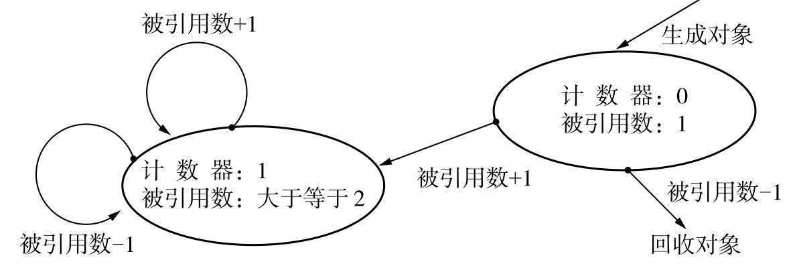

**优点**

1位引用计数法的优点，是不容易出现高速缓存缺失。

缓存作为一块存储空间，比内存的读取速度要快得多。如果要读取的数据就在缓存里的话，计算机就能进行高速处理；但如果需要的数据不在缓存里（即高速缓存缺失）的话，就需要读取内存，从内存中查找数据并将其读取到缓存里，这样一来就会浪费许多时间。

**缺点**

1位引用计数法的缺点跟Sticky引用计数法的缺点基本一样。我们必须想个办法，看看怎么处理计数器溢出的对象。

据Clark和Green的观测结果表明，很多对象的计数器值都不足2。如果这个前提成立，那么把计数器溢出的对象放置不管也肯定没什么坏处。

然而，我们没法保证mutator能一直顺利运行，很可能会出现很多对象计数器溢出的情况。

上述情况下会生成大量计数器溢出的对象（也就是内存管理范围之外的对象），这会给堆带来巨大负担。这样一来，我们就很难保证分块了。

**部分标记-清除算法**

就是只对“可能有循环引用的对象群”使用GC标记-清除算法，对其他对象进行内存管理时使用引用计数法。

部分标记-清除算法的特征就是要涂色的对象和要进行计数器减量的对象不是同一对象，据此就可以很顺利地回收循环垃圾。

**限定搜索对象**

部分标记-清除算法的优点，就是把要搜索的对象限定在阴影对象及其子对象，也就是“可能是循环垃圾的对象群”中。

**部分标记-清除算法的局限性**

部分标记-清除算法并不是完美的，因为从队列搜索对象所付出的成本太大了。被队列记录的对象毕竟是候选垃圾，所以要搜索的对象绝对不在少数。这个算法总计需要查找3次对象，也就是说需要对从队列取出的阴影对象分别执行1次mark_gray()函数、scan_gray()函数以及collect_white()函数。这大大增加了内存管理所花费的时间。此外，搜索对象还害得引用计数法的一大优点——最大暂停时间短荡然无存。

### GC复制算法

GC复制算法（Copying GC）是Marvin L. Minsky在1963年研究出来的算法。说得简单点，就是只把某个空间里的活动对象复制到其他空间，把原空间里的所有对象都回收掉。这是一个相当大胆的算法。在此，我们将复制活动对象的原空间称为From空间，将粘贴活动对象的新空间称为To空间。

GC复制算法是利用From空间进行分配的。当From空间被完全占满时，GC会将活动对象全部复制到To空间。当复制完成后，该算法会把From空间和To空间互换，GC也就结束了。From空间和To空间大小必须一致。这是为了保证能把From空间中的所有活动对象都收纳到To空间里。

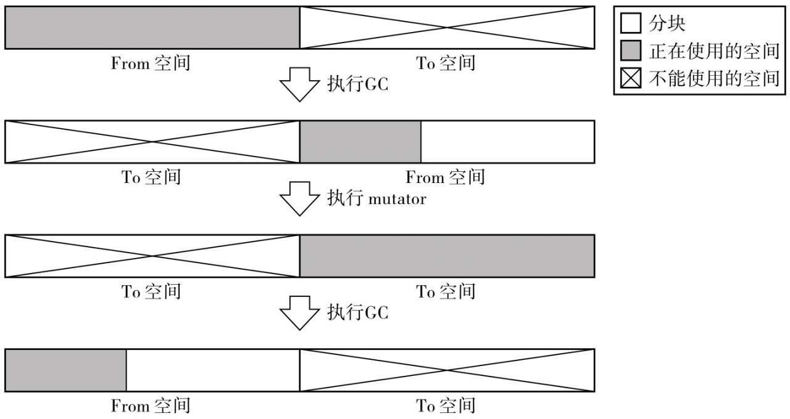


在GC复制算法中，请注意GC完成后只有1个分块的内存空间。在每次分配时，只要把所申请大小的内存空间从这个分块中分割出来给mutator就行了。也就是说，这里的分配跟GC标记-清除算法中的分配不同，不需要遍历空闲链表。

#### 过程

为了给GC做准备，这里事先将$free指针指向To空间的开头。

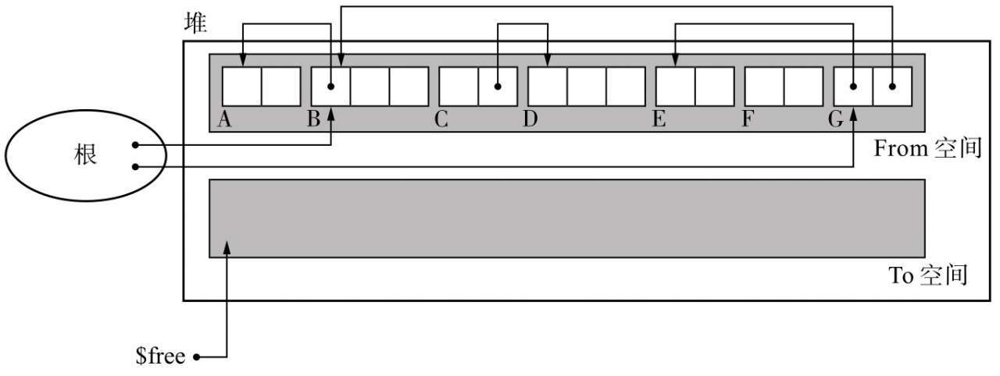

假设就以这种状态开始GC。首先是从根直接引用的对象B和G，B先被复制到了To空间。B被复制后的堆状态如图所示。


在此我们将B被复制后生成的对象称为B′。我们看图4.6中的B，field1已经打上了复制完成的标签，field2里放了一个指向B′的forwarding指针。

但是，这里只把B′复制了过来，它的子对象A还在From空间里。下面我们要把这个A复制到To空间里。

这次才可以说在真正意义上复制了B。因为A没有子对象，所以对A的复制也就完成了。

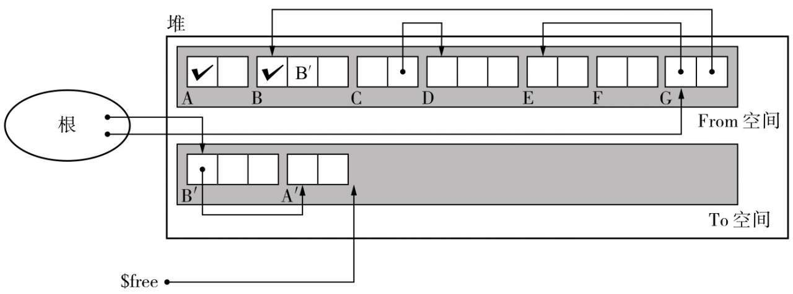

接下来，我们要复制和B一样从根引用的G，以及其子对象E。虽然B也是G的子对象，不过因为已经复制完B了，所以只要把从G指向B的指针换到B′上就行了。

最后只要把From空间和To空间互换，GC就结束了。GC结束时堆的状态如图4.8所示。我们在以后的章节里还会引用这张图，请务必牢记。

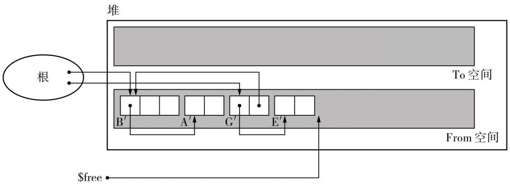

当然了，对象C、D、F因为没法从根查找，所以会被回收。在这里程序是以B、A、G、E的顺序搜索对象的。不知大家发现了没有，这是我们在第2章的专栏中提到的深度优先搜索。这跟广度优先搜索有什么不同呢？关于这一点，我们会在4.3.3节和4.4.3节中为大家说明。

#### 优点

**优秀的吞吐量**

GC标记-清除算法消耗的吞吐量是搜索活动对象（标记阶段）所花费的时间和搜索整体堆（清除阶段）所花费的时间之和。

另一方面，因为GC复制算法只搜索并复制活动对象，所以跟一般的GC标记-清除算法相比，它能在较短时间内完成GC。也就是说，其吞吐量优秀。

尤其是堆越大，差距越明显。GC标记-清除算法在清除阶段所花费的时间会不断增加，但GC复制算法就不会产生这种消耗。毕竟它消耗的时间是与活动对象的数量成比例的。

**可实现高速分配**

GC复制算法不使用空闲链表。这是因为分块是一个连续的内存空间。因此，调查这个分块的大小，只要这个分块大小不小于所申请的大小，那么移动$free指针就可以进行分配了。

比起GC标记-清除算法和引用计数法等使用空闲链表的分配，GC复制算法明显快得多。大家想一下，使用空闲链表时为了找到满足要求的分块，需要遍历空闲链表对吧？最坏的情况就是我们不得不从空闲链表中取出最后一个分块，这样就要花大把时间把所有分块都调查一遍。

**不会发生碎片化**

在GC复制算法中，每次运行GC时都会执行压缩。

因此GC复制算法有个非常优秀的特点，就是不会发生碎片化。也就是说，可以安排分块允许范围内大小的对象。

**与缓存兼容**

在GC复制算法中有引用关系的对象会被安排在堆里离彼此较近的位置。

请再看一下上图“GC结束后”。B′引用A′，G′引用E′，图中按照B′、A′、G′、E′的顺序排列。这种情况有一个优点，那就是mutator执行速度极快。近来很多CPU都通过缓存来高速读取位置较近的对象。这也是借助压缩来完成的，通过压缩来把有引用关系的对象安排在堆中较近的位置。

#### 缺点

**堆使用效率低下**

GC复制算法把堆二等分，通常只能利用其中的一半来安排对象。也就是说，只有一半堆能被使用。相比其他能使用整个堆的GC算法而言，可以说这是GC复制算法的一个重大的缺陷。

**不兼容保守式GC算法**

GC标记-清除算法有着跟保守式GC算法相兼容的优点。因为GC标记-清除算法不用移动对象。另一方面，GC复制算法必须移动对象重写指针，所以有着跟保守式GC算法不相容的性质。

**递归调用函数**

在这里介绍的算法中，复制某个对象时要递归复制它的子对象。因此在每次进行复制的时候都要调用函数，由此带来的额外负担不容忽视。大家都知道比起这种递归算法，迭代算法更能高速地执行。

此外，因为在每次递归调用时都会消耗栈，所以还有栈溢出的可能。

为了消除这个缺点，我们会在下一节中为大家介绍Cheney的GC复制算法——迭代进行复制的算法。

#### 优化

**Cheney的GC复制算法**

C. J. Cheney于1970年研究出了GC算法。相比Fenichel和Yochelson的GC复制算法，Cheney的GC复制算法不是递归地，而是迭代地进行复制。

Fenichel和Yochelson的GC复制算法采用的是深度优先搜索，而Cheney的复制算法采用的则是广度优先搜索。

广度优先搜索需要先入先出（FIFO）结构的队列，即把该搜索的对象保持在队列中，一边取出一边进行搜索。


**优点**

Fenichel和Yochelson的GC复制算法是递归算法，而Cheney的GC复制算法是迭代算法，因此它可以抑制调用函数的额外负担和栈的消耗。特别是拿堆用作队列，省去了用于搜索的内存空间这一点，实在是令人赞叹。

**缺点**

在Fenichel和Yochelson的GC复制算法中，具有引用关系的对象是相邻的，因此才能充分利用缓存的便利。另一方面，就像我们在图4.12中看到的那样，在Cheney的GC复制算法中，有引用关系的对象，也就是G′和E′、B′和A′并不相邻。

因此我们没法说Cheney的GC复制算法兼容缓存，只能说它比GC标记-清除算法和引用计数法要好一些而已。

**近似深度优先搜索方法**

**多空间复制算法**

GC复制算法最大的缺点是只能利用半个堆。这是因为该算法将整个堆分成了两半，每次都要腾出一半。

多空间复制算法说白了就是把堆N等分，对其中2块空间执行GC复制算法，对剩下的（N-2）块空间执行GC标记-清除算法，也就是把这2种算法组合起来使用。

**优点**

多空间复制算法没有将堆二等分，而是分割成了更多块空间，从而更有效地利用了堆。以往的GC复制算法只能使用半个堆，而多空间复制算法仅仅需要空出一个分块，不能使用的只有1/N个堆。

**缺点**

执行GC复制算法的只有N等分中的两块空间，对于剩下的（N-2）块空间执行的是GC标记-清除算法。因此就出现了GC标记-清除算法固有的问题——分配耗费时间、分块碎片化等。

### GC标记-压缩算法

GC标记-压缩算法（Mark Compact GC）是将GC标记-清除算法与GC复制算法相结合的产物。

GC标记-压缩算法由标记阶段和压缩阶段构成。

#### 过程

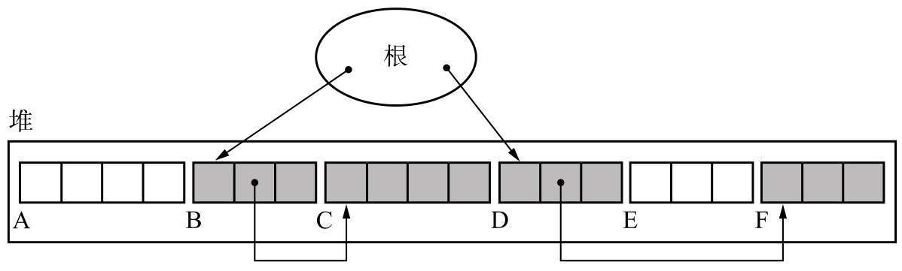

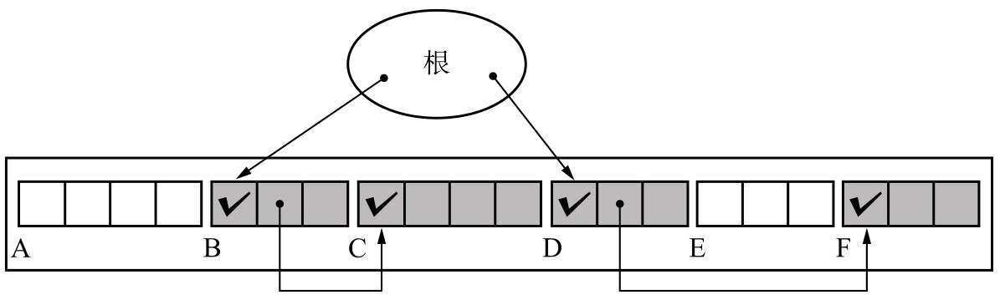

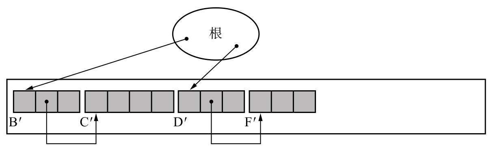

**标记阶段**

这里的标记阶段和我们在讲解GC标记-清除算法时提到的标记阶段完全一样。

**压缩（Lisp2算法）**

压缩阶段由以下3个步骤构成。

1. 设定forwarding指针
2. 更新指针
3. 移动对象

#### 优点

可有效利用堆，GC标记-压缩算法和其他算法相比而言，堆利用效率高。

在GC标记-压缩算法中会执行压缩。执行压缩所带来的优点我们已经在4.2节中提过了。

而且GC标记-压缩算法不会出现GC复制算法那样只能利用半个堆的情况。GC标记-压缩算法可以在整个堆中安排对象，堆使用效率几乎是GC复制算法的2倍。用“几乎”这个词，是因为要留出用于forwarding指针的空间，所以严格来说不到2倍。

另一方面，尽管GC标记-清除算法也能利用整个堆，但因为没有压缩的过程，所以会产生碎片化，不能充分有效地利用堆。

#### 缺点

压缩花费计算成本。

如上所述，压缩有着巨大的好处。不过为了享受这些好处，我们也必须做出巨大的牺牲。

在本节介绍的Lisp2算法的压缩中，必须对整个堆进行3次搜索。也就是说，执行该算法所花费的时间是和堆大小成正比的。GC标记-压缩算法的吞吐量要劣于其他算法。

> 在GC标记-清除算法中，清除阶段也要搜索整个堆，不过搜索1次就够了。但GC标记-压缩算法要搜索3次，这样就要花费约3倍的时间，这是一个相当巨大的缺陷，特别是堆越大，所消耗的成本也就越大。

#### 优化

**Two-Finger算法**

Two-Finger算法有着很大的制约条件，那就是“必须将所有对象整理成大小一致”。之前介绍的算法都没有这种限制，而Two-Finger算法就必须严格遵守这个制约条件。

Two-Finger算法由以下2个步骤构成。

1. 移动对象
2. 更新指针

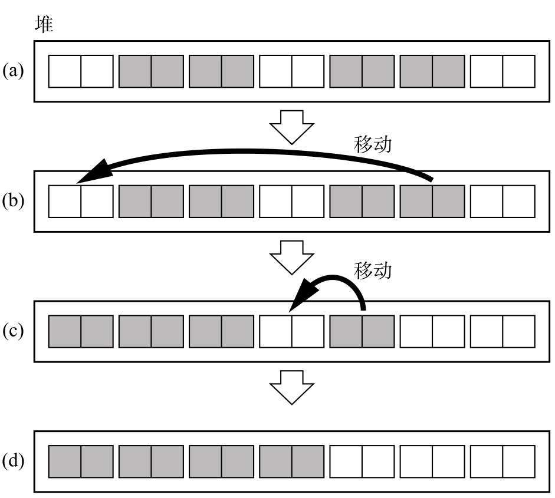

在Lisp2算法中，通过执行压缩操作使活动对象往左边滑动。而在Two-Finger算法中，则是通过执行压缩操作来让活动对象填补空闲空间。此时为了让对象能恰好填补空闲空间，必须让所有对象大小一致。

**优点**

Lisp2算法要事先确保每个对象都留有1个字用于forwarding指针，这就压迫了堆。然而因为Two-Finger算法能把forwarding指针设置在移动前的对象的域里，所以不需要额外的内存空间以用于forwarding指针，因此在内存的使用效率上，该算法要比Lisp2算法的使用效率高。

> 此外，在Two-Finger算法中，压缩所带来的搜索次数只有2次，比Lisp2算法少1次，在吞吐量方面占优势。

**缺点**

就像我们在介绍GC复制算法时所说的那样，将具有引用关系的对象安排在堆中较近的位置，就能够通过缓存来提高访问速度。不过Two-Finger算法则不考虑对象间的引用关系，一律对其进行压缩，结果就导致对象的顺序在压缩前后产生了巨大的变化。因此，我们基本上也无法期待这个算法能沾缓存的光。

此外该算法还有一个限制条件，那就是所有对象的大小必须一致。因为能消除这个限制的处理系统不太多，所以这点制约了Two-Finger算法的应用范围。不过，我们用前面介绍到的BiBOP法就能克服这个问题。只要把同一大小的对象安排在同一个分块里，就能对每个分块应用Two-Finger算法了。

**表格算法**

这个算法和Two-Finger算法一样，都是执行2次压缩操作。

表格算法通过以下2个步骤来执行压缩。

1. 移动对象（群）以及构筑间隙表格（break table）
2. 更新指针

**优点**

在表格算法中，没有必要为压缩准备出多余的空间，这是因为该算法很好地利用了分块，保留了更换指针所必需的信息。

虽然在不需要多余空间这一点上表格算法跟Two-Finger一样，不过在压缩前后保留对象顺序这一点上，表格算法可以说比Two-Finger要优秀得多。这是因为在表格算法中，可以通过缓存来提高对象的访问速度。

**缺点**

要维持间隙表格需要付出很高的代价。考虑到每次移动活动对象群都要进行表格的移动和更新，代价高也是理所当然的。

此外，在更新指针时也不能忽略搜索表格所带来的消耗。在更新指针前，如果先将表格排序，则表格的搜索就能高速化。不过排序表格也需要相应的消耗，所以并不能从根本上解决问题。

**ImmixGC算法**

ImmixGC把堆分为一定大小的“块”（block），再把每个块分成一定大小的“线”（line）。这个算法不是以对象为单位，而是以线为单位回收垃圾的。分配时程序首先寻找空的线，然后安排对象。没找到空的线时就执行GC。

GC分为以下3个步骤执行。

1. 选定备用的From块
2. 搜索阶段
3. 清除阶段

**优点**

ImmixGC最大的特征是将对象分为块和线两个阶段进行管理。

打个比方，分配的时候我们优先使用的是RECYCLABLE块而不是FREE块对吧。这样一来就容易把对象安排在同一个块里，因此碎片化问题就得到了解决，同时也能将缓存加以利用。

不过另一方面，如果只以块为单位来管理对象，就会白白浪费很多堆。举个极端的例子，即使1个块里只有1个活动对象，也必须保留这个块里所有的残留垃圾。

因此，我们把块分成了更小的线。这样一来，就能更精确地管理块里的对象，抑制堆的消耗量。

此外，因为我们将碎片化严重的块拿来当备用From块，所以可以有效地解决碎片化问题。

**缺点**

在Immix的压缩过程中，对象不是按顺序保存的，所以不要期待ImmixGC能沾缓存的光。毕竟它只是为了防止碎片化而进行的压缩。

还请大家回忆一下，我们曾经做过保守的标记。那些没有活动对象的线有可能无法被回收。虽然我们对吞吐量予以了足够的重视，但却无法有效地使用堆。

### 保守式GC

简单来说，保守式GC（Conservative GC）指的是“不能识别指针和非指针的GC”。

不明确的根（ambiguous roots）指的是什么呢？

1. 寄存器
2. 调用栈
3. 全局变量空间

事实上它们都是不明确的根。

在不明确的根这一条件下，GC不能识别指针和非指针。也就是说，不明确的根里所有的值都有可能是指针。然而这样一来，在GC时就会大量出现指针和被错误识别成指针的非指针。因此保守式GC会检查不明确的根，以“某种程度”的精度来识别指针。

> 在采用GC标记-清除算法的情况下，一找到貌似指针的非指针，程序就会将非指针指向的对象错误地识别为活动对象，对其进行标记。因为被错误识别的对象不会被废弃而会被保留，所以遵守了GC的原则——“不废弃活动对象”。像这样，在运行GC时采取的是一种保守的态度，即“把可疑的东西看作指针，稳妥处理”，所以我们称这种方法为“保守式GC”。

#### 优点

语言处理程序不依赖于GC。

保守式GC的优点在于容易编写语言处理程序。处理程序基本上不用在意GC就可以编写代码。语言处理程序的实现者即使没有意识到GC的存在，程序也会自己回收垃圾。因此语言处理程序的实现要比准确式GC简单。

#### 缺点

**识别指针和非指针需要付出成本**

识别不明确的根和数据结构的值为“指针”或“非指针”时，我们需要付出一定的成本。而这一成本在后面要为大家介绍的准确式GC里是不存在的。

**错误识别指针会压迫堆**

当存在貌似指针的非指针时，保守式GC会把被引用的对象错误识别为活动对象。如果这个对象存在大量的子对象，那么它们一律都会被看成活动对象。因为程序把已经死了的非活动对象看成了活动对象，所以垃圾对象会严重压迫堆。

**能够使用的GC算法有限**

在无法正确识别指针的环境中，我们基本上不能使用GC复制算法等移动对象的GC算法。就如我们之前在第4章中所讲的那样，GC复制算法在复制对象的时候，会将根的值重写到新空间。要是我们想用不明确的根这么办的话，就可能把非指针重写了。此外，在对象内重写指针时，也有可能因为不明确的数据结构而重写了非指针。一旦重写了非指针，就会产生意想不到的BUG。

#### 优化（准确式GC）

准确式GC（Exact GC）和保守式GC正好相反，它是能正确识别指针和非指针的GC。

准确式GC和保守式GC不同，它是基于能精确地识别指针和非指针的“正确的根”（exact roots）来执行GC的。

创建正确的根的方法有很多种，不过这些方法有个共通点，就是需要“语言处理程序的支援”，所以正确的根的创建方法是依赖于语言处理程序的实现的。

本章中我们将为大家介绍几种创建方法。

**打标签**

第一个方法是打标签（tag），目的是将不明确的根里的所有非指针都与指针区别开来。打标签的方法种类繁多，在这里我们为大家解说的是用最基本的低1位作为标签的方法。

**优点**

首先，准确式GC完全没有保守式GC固有的问题——错误识别指针。也就是说，它不会认为已经死了的对象还活着。GC之后，堆里只会留下活动对象。此外，它可以实现GC复制算法等移动对象的算法。因为准确式GC能明确识别指针跟非指针，所以即使移动对象，重写根的值，这个对象也不可能是非指针。

**缺点**

当创建准确式GC时，语言处理程序必须对GC进行一些支援。也就是说，在创建语言处理程序时必须顾及GC。排除某些特殊的实现方法，这会给实现者带来相当沉重的负担。可见在处理程序的实现上，准确式GC比保守式GC麻烦。

此外，要创建正确的根就必须付出一定的代价，而这种代价在保守式GC中是不存在的。好比打标签，因为每次进行计算时都需要取消标签，然后再重新设置，这就关系到语言处理程序整体的执行速度了。

**间接引用**

不知道大家是否还记得，保守式GC有个缺点，就是“不能使用GC复制算法等移动对象的算法”。解决这个问题的方法之一就是“间接引用”。

为什么在保守式GC中无法使用GC复制算法这样的算法呢？大家可以想到，这是因为在重写不明确的根（或不明确的数据结构）时，重写的对象有可能是非指针。解决这个问题的办法就是经由句柄（handle）来间接地处理对象。

**优点**

因为在使用间接引用的情况下有可能实现GC复制算法，所以可以得到GC复制算法所带来的好处，例如消除碎片化等。详情请参考GC复制算法。

另外，我们还能实现GC标记-压缩算法。

**缺点**

因为必须将所有对象都（经由句柄）间接引用，所以会拉低访问对象内数据的速度，这会关系到整个语言处理程序的速度。

**MostlyCopyingGC**

MostlyCopyingGC就是“把那些不明确的根指向的对象以外的对象都复制的GC算法”。Mostly是“大部分”的意思。说白了，MostlyCopyingGC就是抛开那些不能移动的对象，将其他“大部分”的对象都进行复制的GC算法。

MostlyCopyingGC还有如下这些前提条件。

1. 根是不明确的根
2. 没有不明确的数据结构
3. 对象大小随意
4. CPU是32位

**优点和缺点**

说起MostlyCopyingGC的优点，首先就是能在保守式GC里使用GC复制算法。也就是说，使用MostlyCopyingGC的话，能够直接继承GC复制算法的优点。

话说回来，当然它的缺点也跟GC复制算法很像。MostlyCopyingGC特有的缺点就是，在包含有从根引用的对象的页内，所有的对象都会被看成活动对象。也就是说，垃圾对象也会被看成活动对象，这样一来就拉低了内存的使用效率。

**黑名单**

顾名思义，黑名单就是一种创建“需要注意的地址的名单”的方法。这个黑名单里记录的是“不明确的根内的非指针，其指向的是有可能被分配对象的地址”。我们将这项记录操作称为“记入黑名单”。

黑名单里记录的是“需要注意的地址”。一旦分配程序把对象分配到这些需要注意的地址中，这个对象就很可能被非指针值所引用。也就是说，即使分配后对象成了垃圾，也很有可能被错误识别成“它还活着”。

为此，在将对象分配到需要注意的地址时，所分配的对象有着如下限制条件。

1. 小对象
2. 没有子对象的对象

为什么只能分配上述这样的对象呢？因为如果这样的对象成了垃圾，即使被错误识别了，也不会有什么大的损失。

**优点和缺点**

这样一来，保守式GC因错误识别指针而压迫堆这个保守式GC的一大问题就得到了缓解，堆的使用效率也得到了提升。因此，这里的GC对象少于通常的保守式GC里的对象，GC的执行速度也大大提升了。不过相应地，在分配对象时则需要花功夫来检查黑名单。

### 分代垃圾回收

分代垃圾回收（Generational GC）在对象中导入了“年龄”的概念，通过优先回收容易成为垃圾的对象，提高垃圾回收的效率。

人们从众多程序案例中总结出了一个经验：“大部分的对象在生成后马上就变成了垃圾，很少有对象能活得很久。”分代垃圾回收利用该经验，在对象中导入了“年龄”的概念，经历过一次GC后活下来的对象年龄为1岁。

#### 新生代对象和老年代对象

- 新生代GC（minor GC）-GC标记-复制算法
- 老年代GC（major GC）-GC标记-清除算法

分代垃圾回收中把对象分类成几代，针对不同的代使用不同的GC算法，我们把刚生成的对象称为新生代对象，到达一定年龄的对象则称为老年代对象。

众所周知，新生代对象大部分会变成垃圾。如果我们只对这些新生代对象执行GC会怎么样呢？除了引用计数法以外的基本算法，都会进行只寻找活动对象的操作（如GC标记-清除算法的标记阶段和GC复制算法等）。因此，如果很多对象都会死去，花费在GC上的时间应该就能减少。

#### Ungar的分代垃圾回收

**过程**

在Ungar的分代垃圾回收中，堆的结构如图所示。我们总共需要利用4个空间，分别是生成空间、2个大小相等的幸存空间以及老年代空间，并分别用$new_start、$survivor1_start、$survivor2_start、$old_start这4个变量引用它们的开头。我们将生成空间和幸存空间合称为新生代空间。新生代对象会被分配到新生代空间，老年代对象则会被分配到老年代空间里。Ungar在论文里把生成空间、幸存空间以及老年代空间的大小分别设成了140K字节、28K字节和940K字节。

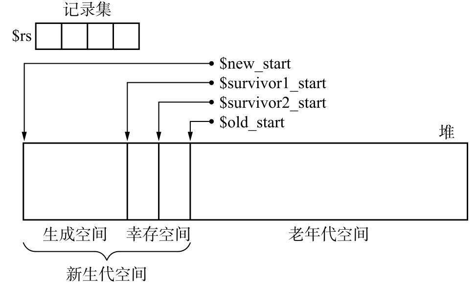

此外我们准备出一个和堆不同的数组，称为记录集（remembered set），设为$rs。

生成空间就如它的字面意思一样，是生成对象的空间，也就是进行分配的空间。当生成空间满了的时候，新生代GC就会启动，将生成空间中的所有活动对象复制，这跟GC复制算法是一个道理。目标空间是幸存空间。

2个幸存空间和GC复制算法里的From空间、To空间很像，我们经常只利用其中的一个。在每次执行新生代GC的时候，活动对象就会被复制到另一个幸存空间里。在此我们将正在使用的幸存空间作为From幸存空间，将没有使用的幸存空间作为To幸存空间。

不过新生代GC也必须复制生成空间里的对象。也就是说，生成空间和From幸存空间这两个空间里的活动对象都会被复制到To幸存空间里去。这就是新生代GC。

只有从一定次数的新生代GC中存活下来的对象才会得到晋升，也就是会被复制到老年代空间去。

**幸存空间满了怎么办？**

通常的GC复制算法把空间二等分为From空间和To空间，即使From空间里的对象都还活着，也确保能把它们收纳到To空间里去。不过在Ungar的分代垃圾回收里，To幸存空间必须收纳From幸存空间以及生成空间中的活动对象。From幸存空间和生存空间的总大小比To幸存空间大，所以如果活动对象很多，To幸存空间就无法容纳下它们。

当发生这种情况时，稳妥起见只能把老年代空间作为复制的目标空间。当然，如果频繁发生这种情况，分代垃圾回收的优点就会淡化。


在执行新生代GC时有一点需要注意，那就是我们必须考虑到从老年代空间到新生代空间的引用。新生代对象不只会被根和新生代空间引用，也可能被老年代对象引用。因此，除了一般GC里的根，我们还需要将从老年代空间的引用当作根（像根一样的东西）来处理。


分代垃圾回收的优点是只将垃圾回收的重点放在新生代对象身上，以此来缩减GC所需要的时间。不过考虑到从老年代对象的引用，结果还是要搜索堆中的所有对象，这样一来就大大削减了分代垃圾回收的优势。

通过新生代GC得到晋升的对象把老年代空间占满后，就要执行老年代GC了。老年代GC没什么难的地方，它只用到了我们在第2章中介绍过的GC标记-清除算法。

**记录集**

记录集被用于高效地寻找从老年代对象到新生代对象的引用。具体来说，在新生代GC时将记录集看成根（像根一样的东西），并进行搜索，以发现指向新生代空间的指针。

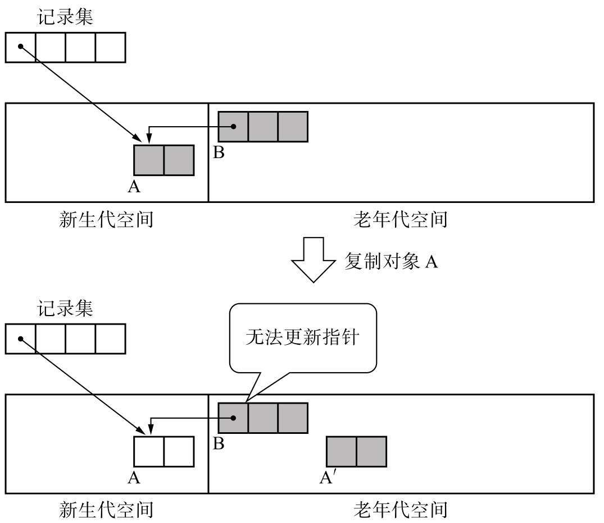

通过查找记录集，可知对象A是新生代GC的对象。执行新生代GC后，A晋升成A′。不过这个状态下我们无法把B的指针的引用目标由A改写为A′。这是因为在图7.4中，记录集里没有存储“老年代对象B引用了新生代对象A”这一信息。

因此，在记录集里不会记录引用的目标对象，而是记录发出引用的对象。这样一来，我们就能通过记录集搜索发出引用的对象，进而晋升引用的目标对象，再将发出引用的对象的指针更新到目标空间了。


**写入屏障**

在分代垃圾回收中，为了将老年代对象记录到记录集里，我们利用写入屏障（write barrier）。在mutator更新对象间的指针的操作中，写入屏障是不可或缺的。

**优点**

吞吐量得到改善。“很多对象年纪轻轻就会死”这一法则虽然是经验之谈，不过还是适用于大多数情况的。以这个法则为前提，新生代GC只将刚生成的对象当成对象，这样一来就能减少时间上的消耗。

反过来，因为老年代GC是针对很难变成垃圾的老年代对象执行的，所以要比新生代GC花的时间长。不过，在经过新生代GC而晋升的对象把老年代空间填满之前，老年代GC都不会被执行。因此，老年代GC的执行频率要比新生代GC低。

综合来看，通过使用分代垃圾回收，可以改善GC所花费的时间（吞吐量）。正如Ungar所说的那样：“据实验表明，分代垃圾回收花费的时间是GC复制算法的1/4。”可见分代垃圾回收的导入非常明显地改善了吞吐量。

另一方面，因为老年代GC很费时间，所以我们没法缩短mutator的最大暂停时间。关于使用分代垃圾回收来缩减mutator最大暂停时间的方法，我们将在下面的“列车垃圾回收”为大家介绍。

**缺点**

在部分程序中会起到反作用。

“很多对象年纪轻轻就会死”这个法则毕竟只适合大多数情况，并不适用于所有程序。当然，对象会活得很久的程序也有很多。对这样的程序执行分代垃圾回收，就会产生以下两个问题。

- 新生代GC所花费的时间增多
- 老年代GC频繁运行

考虑到这两点，恐怕我们没法利用到分代垃圾回收的优点，或者就算利用到了，效果也甚微。

而且，写入屏障导致的额外负担降低了吞吐量。只有当新生代GC带来的速度提升效果大于写入屏障对速度造成的影响时，分代垃圾回收才能够更好地发挥作用。当这个大小关系不成立时，分代垃圾回收就没有什么作用，或者说反而可能会起到反作用。这种情况下我们还是使用基本算法更好。

#### 记录各代之间的引用的方法

Ungar的分代垃圾回收是使用记录集来记录各代间的引用的。

**卡片标记**

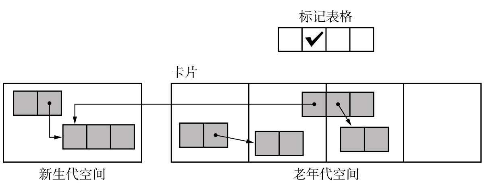

GC时会寻找位图表格。当找到设置了标志位的卡片时，就会从卡片开头开始寻找指向新生代空间的引用。这就是卡片标记。

卡片标记的一大特征就是能有效利用内存空间。因为每个128字节（1024位）的新生代空间都只需要一个位来用作标记，所以整个位表（bit table）只需要老年代空间的1/1024的空间。也就是说，我们只要多准备出老年代空间的0.1%大小的内存空间就够了。

此外，无论从老年代空间指向新生代空间的引用怎么增加，都不会发生像记录集那样溢出的情况。另一方面，这个方法还有个缺点，比如如果在标记表格里设置了很多位，那么可能就会在搜索卡片上花费大量时间。因此只有在局部存在从老年代空间指向新生代空间的引用时，卡片标记才能发挥作用。

**页面标记**


#### 多代垃圾回收


分代数量越多，对象变成垃圾的机会也就越大，所以这个方法确实能减少活到最老代的对象。

但是我们也不能过度增加分代数量。分代数量越多，每代的空间也就相应地变小了，这样一来各代之间的引用就变多了，各代中垃圾回收花费的时间也就越来越长了。

> 综合来看，少设置一些分代能得到更优秀的吞吐量，据说分为2代或者3代是最好的。

#### 列车垃圾回收

列车垃圾回收（Train GC）是由Richard L. Hudson和J. Eliot B. Moss发明的方法。它是为了在分代垃圾回收中利用老年代GC而采用的算法，可以控制老年代GC中暂停时间的增长。

**堆的结构**

列车垃圾回收中将老年代空间按照一定大小划分，每个划分出来的空间称为车厢，由1个以上的车厢连接成的东西就叫作列车。这就是列车垃圾回收名字的由来。1次老年代GC是以1个车厢作为GC对象的。

每个列车和每个车厢都按其产生的顺序被赋予了编号，互相连接。车厢就是以这个顺序作为GC对象的。

此外，我们要为各列车和各车厢准备记录集。列车的记录集里记录的是来自其他列车的引用，车厢的记录集中记录的则是来自同一列车的其他车厢的引用。

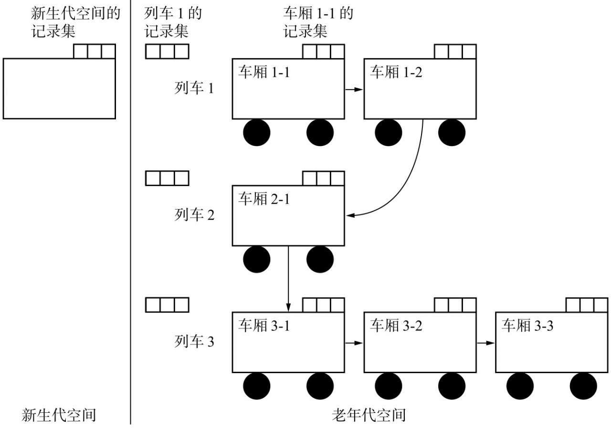

当通过新生代GC将对象从新生代空间晋升时，我们要准备已有的车厢或者空的车厢，将对象安排在分块里。各车厢里的分块是单独作为一个连续的内存空间存在的。也就是说，我们在这里执行GC时，也利用了GC复制算法的原理。

在新生代GC结束后，就该执行老年代GC了。在执行老年代GC时，开头列车的开头车厢是GC的对象。在老年代GC执行后，因为那些作为GC对象的车厢里只剩下了垃圾，所以我们将这些车厢作为空车厢保留，以便执行下一次新生代GC。

此外，列车垃圾回收里的对象结构和在Ungar的分代垃圾回收里用到的对象结构完全一致。

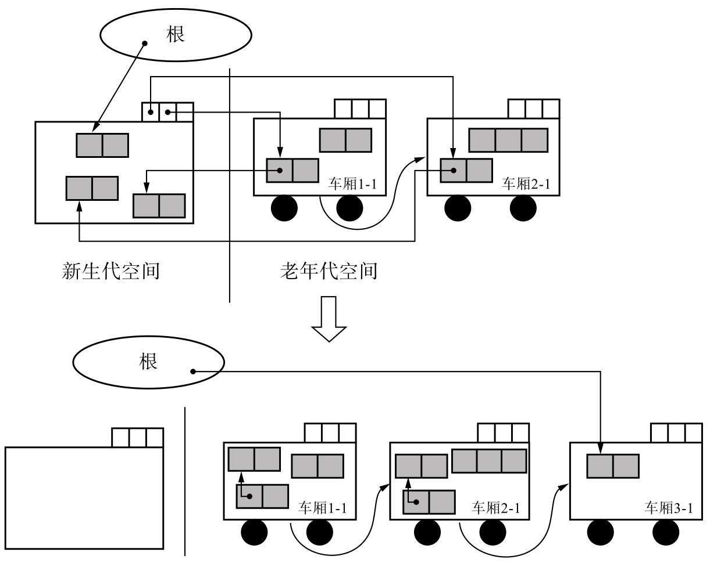

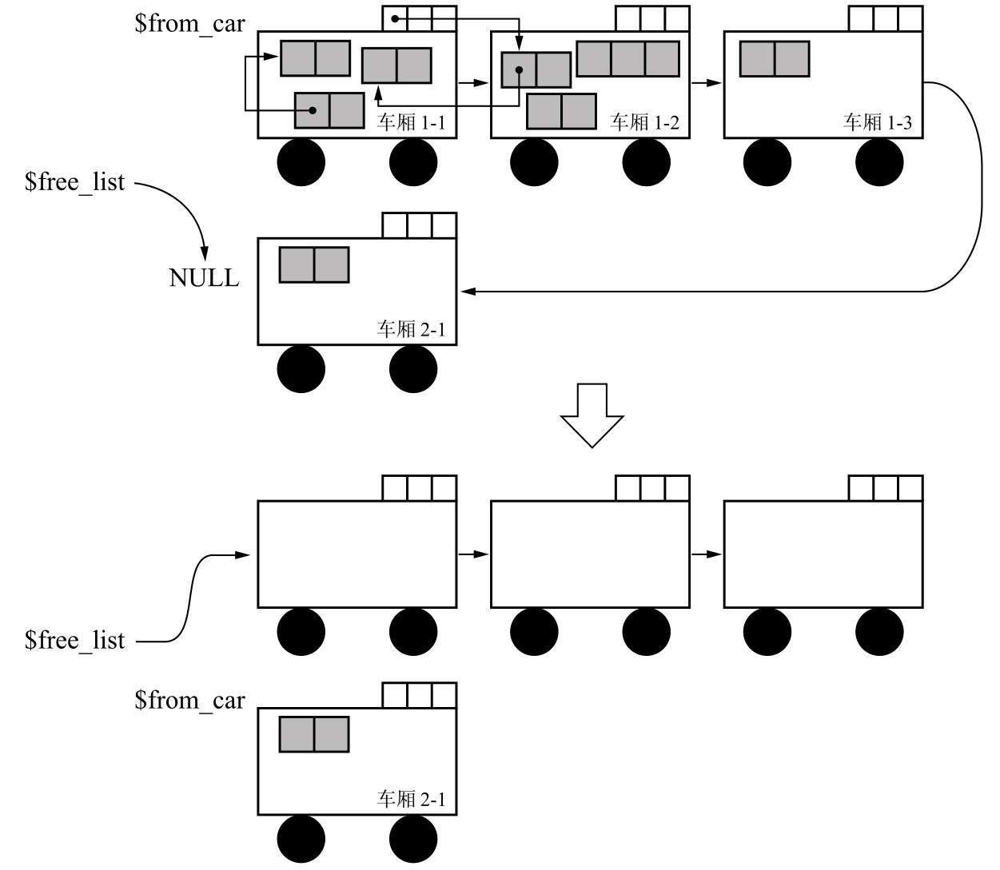

**记录集**

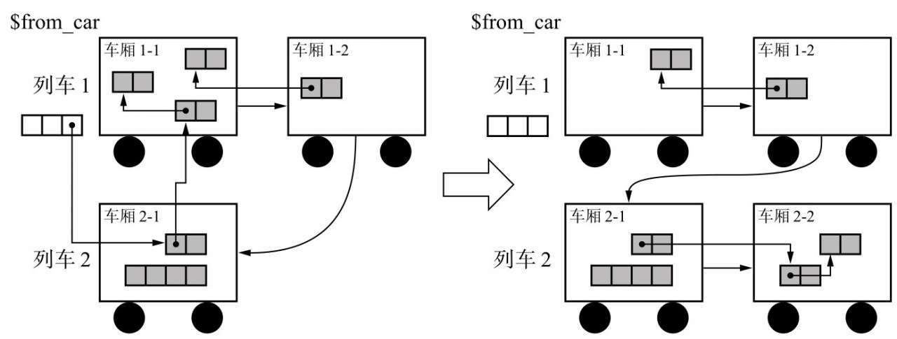

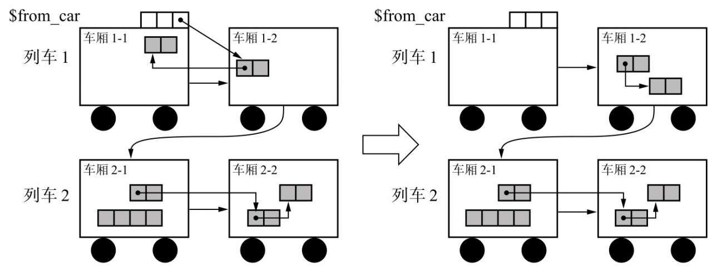

**记录集的溢出**

事实上我们在前面介绍write_barrier()函数的伪代码时留了一个陷阱，那就是没有考虑到记录集满了的情况。

如果新生代空间的记录集满了，就必须执行新生代GC来清空新生代空间，要不然就没法继续进行分配。

另一方面，在老年代空间中，如果某个车厢C的记录集满了应该怎么办呢？此时车厢C不一定是老年代GC的对象车厢。就算我们硬要对车厢C执行GC，也必须考虑C前面的列车及车厢对C的引用。此外，因为记录集已满，所以搜索记录集所需要的时间也会比平常所需时间长。

本来记录集满了就意味着此车厢里挤满了受欢迎（也就是被引用数非常大）的对象。这样的对象很难成为垃圾，每次执行GC都需要对其进行复制操作。

为了省去花费在这项复制操作上的时间，我们有个办法，那就是索性把车厢C排除到GC对象的范围之外去。这看上去像是白白浪费了一个车厢，不过考虑到车厢C中大多数对象都会在执行GC后存活下来，所以一开始就不对其执行GC可能要更为划算些。

**写入屏障**

**优点**

以Ungar的分代垃圾回收为代表的一般的分代垃圾回收都因为老年代GC而增加了mutator的最大暂停时间。这是因为分代垃圾回收将整个老年代空间这个比较大的堆当成了老年代GC的对象。而在列车垃圾回收中，一次老年代GC只将堆中非常小的一部分（即车厢）当成GC的对象，因此就能缩减各老年代GC所造成的mutator的最大暂停时间了。

此外，列车垃圾回收还能回收循环的大型垃圾，这一点不容忽视。列车垃圾回收之所以能回收跨多个块（在这里也就是车厢）的大型垃圾，是因为列车垃圾回收会把互相引用的对象安排在同一辆列车上。请大家回忆一下在老年代GC中是如何选择to_car的。在列车垃圾回收中，我们采用的方针是将要复制的对象跟发出引用的对象安排在同一辆列车上。这样一来，在重复执行老年代GC的过程中，所有构成垃圾的对象群早晚会被安排到同一辆列车上，因此我们就能整个回收这辆列车。

如果我们没有考虑到这点会怎么样呢？打个比方，通过使用在“GC复制算法”提到的多空间复制算法，就可以跟列车垃圾回收一样，在一次老年代GC中只针对老年代空间的一个块执行GC了。


对象群A到C形成了循环垃圾。在此状态下，如果我们将$heap[1]作为From空间，将$heap[0]作为To空间，以此来执行多空间复制算法，结果会如何呢？

虽然A本来是垃圾，不过因为它被其他块引用了，所以会被当成活动对象而复制到heap[0]去。同样，B、C也会被按顺序复制过去。

像这样，在循环垃圾对象群跨复数个块时，因为多空间复制算法只能将已经成为垃圾的对象群进行部分移动，所以再怎么重复执行GC，也没法回收这样的垃圾。

**缺点**

在列车垃圾回收中执行写入屏障所产生的额外负担，要比在Ungar的分代垃圾回收中执行时所产生的更大，因此在吞吐量方面，列车垃圾回收要比Ungar的分代垃圾回收差一些。不止是这样。

实际上minor_gc()函数和major_gc()函数的伪代码也有个很大的陷阱，那就是没有考虑到比车厢大的对象。列车垃圾回收是以每个对象都小于一个车厢为前提的。

本书中虽然没有提及，不过对于比车厢大的对象，需要将其安排到新生代空间和老年代空间以外的堆，使用跟列车垃圾回收不同的方法来执行GC。

### 增量式垃圾回收

增量式垃圾回收（Incremental GC）是一种通过逐渐推进垃圾回收来控制mutator最大暂停时间的方法。

通常的GC处理很繁重，一旦GC开始执行，不过多久mutator就没法执行了，这是常有的事。也就是说，GC本来是从事幕后工作的，可是它却一下子嚣张起来，害得mutator这个主角都没法发挥作用了。我们将像这样的在执行时害得mutator完全停止运行的GC叫作停止型GC。


根据应用程序（mutator）的用途不同，有时停止型GC是很要命的。因此人们想出了增量式垃圾回收这种方法。增量（incremental）这个词有“慢慢发生变化”的意思。

就如它的名字一样，增量式垃圾回收是将GC和mutator一点点交替运行的手法。

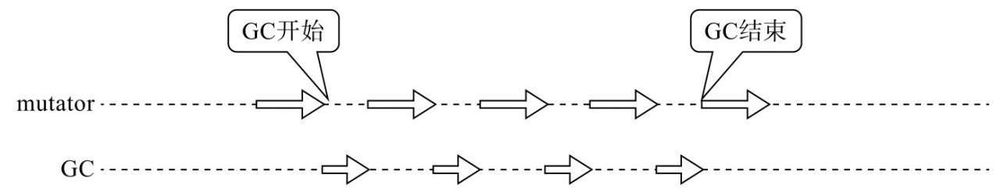

#### 增量回收算法

**三色标记算法**

描述增量式垃圾回收的算法时我们有个方便的概念，那就是Edsger W. Dijkstra等人提出的三色标记算法（Tri-color marking）[15]。顾名思义，这个算法就是将GC中的对象按照各自的情况分成三种，这三种颜色和所包含的意思分别如下所示。

- 白色：还未搜索过的对象
- 灰色：正在搜索的对象
- 黑色：搜索完成的对象

GC开始运行前所有的对象都是白色。GC一开始运行，所有从根能到达的对象都会被标记，然后被堆到栈里。GC只是发现了这样的对象，但还没有搜索完它们，所以这些对象就成了灰色对象。

灰色对象会被依次从栈中取出，其子对象也会被涂成灰色。当其所有的子对象都被涂成灰色时，对象就会被涂成黑色。

当GC结束时已经不存在灰色对象了，活动对象全部为黑色，垃圾则为白色。

**GC标记-清除算法的分割**

增量式的GC标记-清除算法可分为以下三个阶段。

- 根查找阶段
- 标记阶段
- 清除阶段

我们在根查找阶段把能直接从根引用的对象涂成灰色。在标记阶段查找灰色对象，将其子对象也涂成灰色，查找结束后将灰色对象涂成黑色。在清除阶段则查找堆，将白色对象连接到空闲链表，将黑色对象变回白色。

**优点和缺点**

**缩短最大暂停时间。**

增量式垃圾回收不是一口气运行GC，而是和mutator交替运行的，因此不会长时间妨碍到mutator的运行。

增量式垃圾回收适合那些比起提高吞吐量，更重视缩短最大暂停时间的应用程序。

**降低了吞吐量。**

只要用到写入屏障，就会增加额外负担。在分代垃圾回收里，我们还能盼着通过缩短GC时间来抵消写入屏障带来的额外负担，但在增量式GC里就不用想了。因为我们的目的毕竟是缩短最大暂停时间，所以就要有做出一定的牺牲的心理准备。

**Steele的算法**

Steele 于 1977 年提出（论文名就叫 *Deletion*，面向实时 Lisp 系统）。核心手法是**前写屏障 + 删除式记录**：mutator 每次要覆盖一个指针字段，屏障先斩后奏地把**即将被删除的旧引用**记入一个类似记录集的集合，然后才真正执行写入。被删掉的路径因此"留了底"，白色对象虽然失去了灰侧的正常引用，仍可以从这个集合重新被标记到——维持的是**弱三色不变式**。代价是集合里的对象之后必须**重新扫描**（本书伪代码里对应的就是"重扫记录集"这一步），这笔账最终记在暂停或后续增量步里。它的思想直接影响了后来 CMS 一系"并发标记 + 停下补扫"的设计。

**汤浅的算法**

汤浅（Yuasa）1990 年的算法同样拦截"删除引用"这一侧，但做法更果断：写屏障触发时，**当场把被覆盖旧值所指向的对象"冻结"**（直接标成已保护的颜色），不给它留"以后再扫"的尾巴，所以基本免除大范围重扫。这个手法在文献里叫 freeze-on-attempt（尝试删除即冻结），Boehm GC 的 YUA（Yuasa's Unicolor Accumulator）是它的工程化后代。需要注意两点：

- 汤浅原文的颜色语义与现在通行的"白=未标、黑=完成"**相反**（原文是"从全黑开始、把疑似垃圾标灰"的思路），阅读原始文献时极易混淆；
- 冻结是**单向**的：当场保护的对象哪怕是垃圾也要留到下一轮，等于用更多的浮动垃圾换更小的重扫成本。

**比较各个写入屏障**

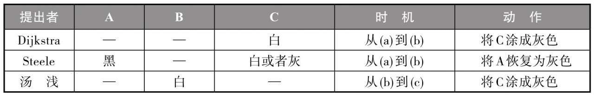

把本节出现的屏障放到一张表里对照（"拦哪条边"是理解一切变体的钥匙）：

| 屏障 | 拦截时机 | 保护对象 | 维护的不变式 | 重标记要不要重扫 | 代表 |
| --- | --- | --- | --- | --- | --- |
| 分代写屏障 | 写入**后**（后屏障） | 记下"写了指向年轻对象引用的老年对象" | 与三色无关（跨代记账） | 不需要，记录集/卡表直接当根 | Ungar 分代、JVM 卡表 |
| Steele（删除式） | 写入**前**（前屏障） | 被删除旧引用的目标对象（入集合待扫） | 弱三色 | **要**（重扫记录集） | 增量式回收 |
| 汤浅（freeze-on-attempt） | 写入**前** | 被删除旧值的目标，当场冻结 | 弱三色（保守化） | 基本不要 | Boehm GC（YUA） |
| Dijkstra 插入式 | 写入处 | **新加入**引用的目标染灰 | 强三色 | 不要，但"新分配对象"要特殊配合 | 教科书方案 |
| Shaston | 写入前 | 仅当"目标黑、新值白"时保护新值 | 强三色 | 不要 | IBM J9（snapshot within） |
| SATB（原始快照） | 写入**前** | 被覆盖的旧值记入缓冲区，由标记线程消化 | 弱三色 / 快照成立时点 | 不要重扫黑对象，只消化缓冲 | G1、Shenandoah |
| 增量更新 | 写入**前** | 记下字段被改的**黑对象**本身 | 强三色（暂时破坏、延后修复） | **要**（重扫被记录的黑对象） | CMS |
| 读屏障 | **读取**指针时 | 使用旧引用的现场（修正/拦截） | 与三色无关（多用于并发移动） | — | ZGC、（早期）Azul C4 |

细节以各收集器官方文档为准；本表只主张一点：**屏障的名字不重要，"在写发生前还是后、保护新边还是旧边"才决定它维护哪种不变式、留下什么代价**。

### RC Immix算法

RC Immix算法将引用计数法的一大缺点——吞吐量低改善到了实用级别。本算法将改善了引用计数法的“合并型引用计数法”（Coalesced Reference Counting）和我们在前面介绍的Immix组合了起来。

#### 合并型引用计数法

在吞吐量方面，引用计数法比不上搜索型GC。原因之一就是“计数器增减频繁”。举个例子，某个对象A和对象B的计数器的变化如图所示。

在从（a）到（d）的过程中，每当X的指针发生变更，A和B的计数器都会有所增减。像这样，在引用计数法中，每当对象间的引用关系发生变化，都要增减该对象的计数器，以保证其数值一直是正确的。众所周知，这是通过写入屏障实现的。如果计数器频繁发生增减，那么写入屏障的执行频率就会增加，处理就会变得繁重。

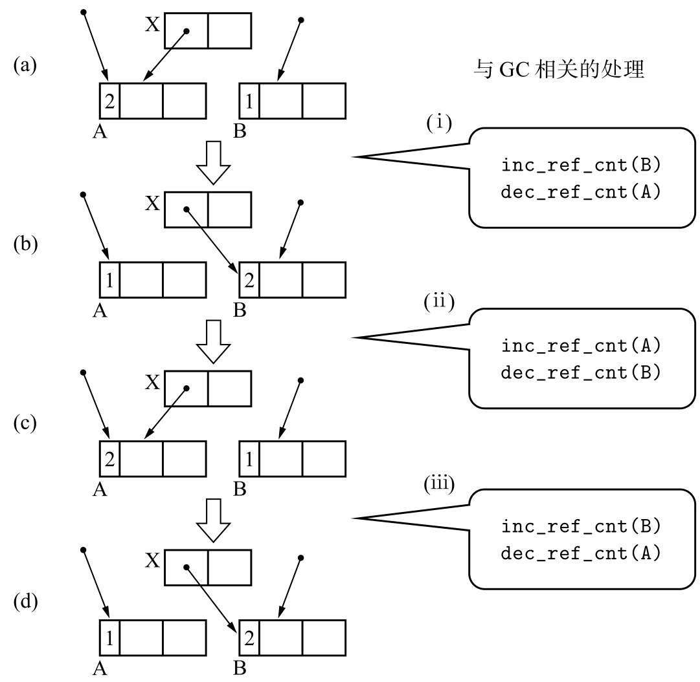

由此可知，比起一直保持计数器的正确状态，通过使计数器的增量和减量互相抵消，更能有效地管理计数器。

把注意力放在某一时期最初和最后的状态上，在该期间内不进行计数器的增减。这就是合并型引用计数法（Coalesced Reference Counting）。在合并型引用计数法中，即使指针发生改动，计数器也不会增减。指针改动时的信息会被注册到更改缓冲区（Modified Buffer）。

如果在对象间的引用关系发生变化时计数器没有增减的话，就会导致有一段时间计数器值是错误的。不过这跟我们在第3章中介绍的“延迟引用计数法”没什么两样。在延迟引用计数法中，如果ZCT满了的话，我们就要查找ZCT，重新正确设置计数器的值。

另一方面，在合并型引用计数法中要将指针发生改动的对象和其所有子对象注册到更改缓冲区中。这项操作是通过写入屏障来执行的。不过因为这时候我们不更新计数器，所以计数器会保持错误的值。

#### 优点和缺点

合并型引用计数法的优点是增加了吞吐量。它不是逐次进行计数器的增减处理，而是在某种程度上一并执行，所以能无视增量和减量相抵消的部分。尤其在一个对象频繁更新指针的情况下，合并型引用计数法能起到很大的作用。

它的缺点就是增加了mutator的暂停时间，这是因为在查找更改缓冲区的过程中需要让mutator暂停。当然，如果更改缓冲区的大小比较小，就能相应缩短暂停时间，不过这种情况下就没法指望增加吞吐量。这方面需要我们加以权衡好好调整。

#### 优化

**合并型引用计数法和Immix的融合**

在以往的合并型引用计数法中，通过查找更改缓冲区，计数器值为0的对象会被连接到空闲链表，为之后的分配做准备。可见这和单纯的引用计数法是一样的。

**优点**

通过RC Immix，引用计数法最大的缺点——吞吐量低得到了大幅度的改善。据论文记载，与以往的引用计数法相比，其吞吐量平均提升了12%。根据基准测试程序的情况，甚至会超过搜索型GC。

吞吐量得到改善的原因有两个。其一是导入了合并型引用计数法。因为没有通过写入屏障来执行计数器的增减操作，所以即使对象间的引用关系频繁发生变化，吞吐量也不会下降太多。

另一个原因是撤除了空闲链表。通过以线为单位来管理分块，只要在线内移动指针就可以进行分配了。此外，这里还省去了把分块重新连接到空闲链表的处理。这部分我们在第4章讲GC复制算法的优点时已经解释过了。

**缺点**

RC Immix和合并型引用计数法一样，都会增加暂停时间。不过如前所述，可以通过调整更改缓冲区的大小来缩短暂停时间。

另一个缺点是“只要线内还有一个非垃圾对象，就无法将其回收”。在线的计数器是1，也就是说线内还有一个活动对象的情况下，会白白消耗大部分线。

## 往下挖：实现细节与并发标记正确性

前面各节把"算法做什么"讲完了，这一整章回答另外两问：**工程上怎么做**（指针、位图、缓冲区、屏障）与**并发时凭什么是对的**。JVM/Go 收集器的取舍几乎都能从这里找到出处。三色标记的基础定义见"增量式垃圾回收"一节，JVM 侧的漏标两条件与增量更新/SATB 对照见 [JVM与垃圾回收.md](../java/JVM与垃圾回收.md)，此处不重复科普，直接往深处走。

### 三色抽象与并发标记的正确性 ⭐

#### 不变式：三色不只是三种颜色

白/灰/黑真正的价值在于它们定义了两个**可以在并发执行中被验证的局部性质**（不变式）：

- **强三色不变式**：任何黑对象都不存在直接指向白对象的引用。黑 = "我扫完了，我不会再看你"，所以黑指向谁，谁就必须至少是灰。
- **弱三色不变式**：允许黑直指白，但该白对象必须**存在一条从某个灰对象出发的可达路径**（且这条路径被屏障"保护"——删除它的尝试会被记账）。

一句话区分：**强不变式管的是"边"（不许出现黑→白），弱不变式管的是"路径"（出现了也别断后路）**。串行标记两个不变式天然同时成立；只有当 mutator 与收集器并发跑、双方都在改同一张引用图时，它们才成为需要花钱维护的约束。

#### 漏标（消失的引用）发生的两个必要条件 ⭐

并发标记中"活对象被当垃圾回收"（漏标，mis-colour / lost marking），**必须同时满足**：

1. 某个**黑对象新增了一条指向白对象的引用**（且这条新边没被任何机制记下——黑对象已扫描完毕，不会再被重看）；
2. 某个**灰对象（或灰的下游）删除了通往该白对象的全部路径**（且这次删除没被记下——否则标记线程还能顺藤摸瓜找到它）。

```text

正常世界:   灰 G ──→ 白 W          W 迟早被 G 扫到, 安全
第一步:     黑 B ──→ 白 W (新增)   B 不会再被扫, 但路径还在, 仍安全
第二步:     灰 G ╳──→ 白 W (删除)  最后一条"会被看到的"路径也没了
结果:       W 及其整条下游子图对标记线程永远隐身 → 被当作垃圾清除
```

两个条件缺一不可，所以正确性策略就是**二选一地破坏它**：盯住"新增边"或盯住"删除边"。这就是强/弱三色两条路线的分水岭，也是上面那张屏障对比表的组织逻辑。

#### 强三色路线（Dijkstra 插入屏障 / Shaston）

- 做法：拦截**条件 1**。mutator 往一个（已变黑的）对象里写入指向白对象的新引用时，屏障立刻把新值染灰（Dijkstra：目标为黑时一律保护新值；Shaston 更省：只有"目标是黑 **且** 新值是白"才触发慢路径，多数写入两次位测试就走人）。
- 正确性论据：黑永不指白 ⇒ 标记终结时（无灰）白必然不可达 ⇒ 清除安全。
- 难点在**新分配对象**：新对象天然是白，若被黑对象直接引用而颜色字段还未初始化，屏障可能读到错误的色（Dijkstra 原始方案对"引用倒置 / 黑指新白"力不从心）。工程解法是让新对象"出生即被保护"（生来灰/黑，或由分配屏障兜底）——代价转嫁给了分配路径。
- 优点：不保护"快照之后新变成垃圾"的对象，**浮动垃圾相对少**。

#### 弱三色路线（SATB 快照）

- 做法：拦截**条件 2**。标记启动时把所有根直接引用的对象当"灰"入账——相当于给此刻的可达集拍了一张**快照**；此后 mutator 每删除一条引用（覆盖旧值），前写屏障把**旧值**记入线程局部的 SATB 缓冲区，标记线程异步消化、照常涂色。于是快照里"灰到白"的路径被删除时只是改道进了缓冲区，弱不变式始终成立。
- 正确性论据：标记完成的不是"堆现在的可达集"，而是**"标记开始那一刻的可达集"**——凡快照时活着的必被标为活。
- 两个后果：(1) 不需要重扫黑对象，重新标记阶段只需消化缓冲区，暂停对"引用修改次数"不敏感（G1 选它正是为了停顿可预测）；(2) 快照后死掉的对象照样被当成活的——**浮动垃圾是这条路线的内生账单**，不是实现缺陷。

#### 浮动垃圾：并发回收必然的代价

- **为什么必然**：并发标记的产出只能是"标记窗口内某一时点的可达集"的超集。正确性要求屏障**宁可多保（把垃圾当活的），不可少保（把活的当垃圾）**——少标一个活对象就是应用层的悬垂引用事故。多保的部分，就是浮动垃圾。停止型 GC 没这个问题，纯粹因为它拿的是"清除那一刻"的精确答案。
- **何时被收**：浮动垃圾在下一轮标记开始前就已不可达，下一轮正常回收即可带走它（在哪个区就随那个区的回收走）。因此它占用的是一个 GC 周期的内存，并发周期越长、存活集变动越剧烈，浮动垃圾越多——这是大堆上做长时间并发标记时内存水位反而升高的原因之一。

#### 重新标记（remark / rescan）在两种方案里各在做什么

| 维度 | 增量更新（CMS，破条件 1） | SATB（G1，破条件 2） |
| --- | --- | --- |
| 并发期记账内容 | 字段被改动的**黑对象**（或卡） | 被删除的**旧引用值**（进缓冲区） |
| 重新标记的主要工作 | 以这些黑对象为根**重扫**其字段，补上漏掉的新边 | 消化残余缓冲区/标记栈，把剩余灰对象处理完 |
| 暂停与什么成正比 | 并发期引用修改的次数与对象大小 | 缓冲区残余量（对写引用频率不敏感） |
| 浮动垃圾 | 较少（新增边被跟踪） | 较多（快照把死对象也保了） |

两种方案在 JVM 里都还有一笔公共账：重新标记是 STW 的，且要做**根重新扫描**（线程栈、JNI 等）与**弱/软/虚引用处理**——这两项与引用修改频率无关，通常才是重新标记暂停的稳定构成。

### 屏障的工程代价 ⭐

正确性讲完了，接下来算钱。屏障是"每次指针操作额外执行的一小段代码"，它的成本结构决定收集器选型。

#### 读屏障 vs 写屏障：拦截"使用边"还是"增删边"

- **写屏障**拦在**引用图的增删**上（store 指令附近）。漏标的两个条件都发生在写入侧，所以**并发标记的正确性问题用写屏障就够**——这是它成为主流的原因：Java/C# 这类托管语言的字段写入全部可被 JIT 插桩，实现路径成熟。
- **读屏障**拦在**引用图的使用**上（load 之后、解引用之前）。它慢路径触发条件"读到了状态不对的引用"，天然适合**并发移动**：对象搬家后旧地址留在各处引用里，只有读取现场能拦截并修正。写屏障无法胜任——它不知道谁会来读。
- **前/后**之分：前写屏障（pre-barrier）在执行写入前看到**旧值**，适合"保护被删除的引用"（SATB、Steele、汤浅、增量更新记录被改对象）；后写屏障（post-barrier）在写入后执行，拿到的是**新值/目标对象**，适合分代记账（"这个老年对象现在引用了年轻对象"）。

| 维度 | 读屏障 | 写屏障 |
| --- | --- | --- |
| 触发点 | 每次加载引用字段 | 每次写入引用字段 |
| 适合解决 | 并发**移动**（指针修正/自恢复） | 并发**标记**正确性、分代记账 |
| 典型实现 | 测试指针色位（着色指针）、陷阱地址 | 置脏卡、SATB 缓冲入队、当场染灰 |
| 主要风险 | 读远多于写，热点路径全被打扰 | 写风暴时缓冲区积压，标记追不上分配 |
| 代表 | ZGC、（历史上）Azul C4 | G1/Shenandoah（SATB）、CMS（增量更新）、几乎所有分代收集器 |

#### Brooks 指针：把"搬家转发"藏进对象头

```text

每个对象头额外留一个字 fwd("自转发指针"):
  正常时:   obj.fwd == &obj        // 指向自己
  被移动后: obj.fwd == &obj_new    // 指向新家
访问任意字段前都要先多 load 一次 fwd 再寻址(旧地址仍然可用, 只是多一跳)
写屏障的职责变成: 存引用前, 把"还指向旧地址"的值 unfold 成真实地址
```

- 妙处：移动对象后**不需要立刻更新全堆引用**，旧引用自动"穿针"到新家，于是复制/整理可以完全并发地进行（Shenandoah 的并发整理即建立在此类机制上，细节以其设计文档为准）。
- 开销是三笔账：每次字段访问多一次内存读取（读放大的税）；对象头膨胀一个字（空间税）；对象基址不再是自身、编译器难以证明别名关系与做预取（优化损失税）。
- 这条税太重，ZGC 在 JDK 11 用了 Brooks 指针后，JDK 13 起重构为把转发信息直接放进对象/页表，省掉常态下的一次间接——**"能不用自转发就不用"是并发整理演进的方向**。

#### SATB 的账本：前屏障 + 并发标记缓冲区

SATB 的写屏障本体不贵（判断 + 把旧值塞进队列），贵在三样：

1. **缓冲区生命周期**：线程局部 buffer 写满要向全局队列加锁换新的，分配/归还/同步是持续负担；缓冲区本身占内存。
2. **生产消费速率失配**：mutator 改引用速度 > 标记线程消化速度时，标记进度落后、堆持续增长——G1 表现为并发标记"追不上"而被迫扩大堆或提前再标记（没有银弹，这是并发回收的容量规划问题）。
3. **浮动垃圾**（见上节）：本质也是 SATB 账本上的负债，用内存换暂停平稳。

#### 着色指针：几乎零读开销，但钱付在了别处

把元数据（标记色、是否已修正等）编码进**指针自身的高位**，而不是对象头：

- 读侧检查只是"指针 & 掩码看某位是否置起"——一次寄存器级位测试，**不需要访问对象额外字段**，这就是"几乎零读开销"的由来。
- 前提相当苛刻：(1) 体系结构的虚拟地址有闲置高位可占用（如 x86-64 只用 48/57 位）；(2) 解引用前必须按位与（AND）抹掉色位才能当地址用，这个"解色"操作要编译器和硬件寻址路径配合；(3) **OS 与加载器必须保证**：对象真实地址永不碰到这些高位、页表能按位配合（ZGC 用"同一物理页映射多个虚拟地址"的三色页表技巧，直接改 Linux 内核内存管理来支持）。所以着色指针是"运行时 + 编译器 + OS"三方共建的机制，移植性最差、收益也最大。
- 它本身不消除读屏障，只是把读屏障的**热路径检查**变便宜，慢路径仍去修正指针/转发对象。

### 复制算法的实现细节：指针、地址与两跳

#### 半空间复制：to/from/scan 三指针，灰集合根本不用另存

```pseudocode

// 半空间复制(Cheney 形态): "未处理区"本身就是灰集合
to_start = to = from_end          // to..free 是 to 空间中已分配区
free     = to_start               // 分配指针(bump pointer)
for (scan = to_start; scan < free; scan = scan + size(obj)) {
    obj = object_at(scan)         // [to_start, free) 区间 = 灰色待扫对象
    for each reference field f of obj {
        if *f ∈ from_space {
            if already_forwarded(*f)  *f = forwarding(*f)
            else {
                new = (*f 复制到 free 端, free 前移)
                (*f 原地留 forwarding 指向 new)
                *f  = new               // 复制即改写, 一遍完成
            }
        }
    }
}
// 循环结束: [to_start, scan) 已处理(黑), [scan, free) 待处理(灰), 白色不在此空间
```

三个值得记住的实现要点：

- **为什么灰集合免费**：新复制来的对象天然"自身在场、子引用未追"——正是灰的定义。用空间布局代替显式队列，这是 Cheney 把堆当队列用的精髓。
- **为什么必须递归/迭代地把复制做下去**：复制一个对象只解决了"它自己在哪"，它字段里指向 from 空间的引用还悬着；追进去改写，直到闭包收敛。等价说法：复制是**把可达集从根开始重新排一遍**，漏追一层就是悬垂指针。
- **对象地址必变**：新地址 = 分配指针推进的位置，由遍历顺序决定。因此**一切引用入口**（根、对象字段、栈上/寄存器里的裸指针）都必须被找出来改写。找不到它们的系统（保守式）就只能配"不承诺搬家"的算法，或者走下面的间接引用。

#### Lisp2（forwarding 指针）vs 不更新引用（间接/双跳转）

| 维度 | Lisp2：前向指针 + 全量更新 | 间接引用：不更新旧引用 |
| --- | --- | --- |
| 旧位置存什么 | 被移走对象的头部留 forwarding 指针（本书要求所有字段都是指针型才能放得下，Two-Finger 用域回收缓解了这点） | 句柄表/间接 cell 保持地址稳定，对象随便搬 |
| 引用修正 | 复制时顺便改写（如上面伪代码），或事后再扫一遍全堆（本书 Lisp2 的三步） | 无需修正，旧引用经一跳自动生效 |
| 访问代价 | 修正完成后与不搬家算法无异 | **每次访问多一次跳转**（load 句柄 + load 对象），缓存与寄存器压力上升 |
| 与保守式共存 | 不能（不知道哪是指针） | 能（根只指向稳定的句柄） |
| 代表思路 | Serial/ParNew/G1 的 Evacuation（常见描述，细节以版本文档为准） | Handle 体系；双跳转（to-space 对象再经原位置转发）作为省一遍扫描的变体 |

一句话："**搬家必留 forwarding，区别只在于是谁、在何时、为多少引用付改写的钱**"——Lisp2 让 GC 付（一遍扫全堆改引用），间接引用让 mutator 付（每次访问多一跳），两条付费路线贯穿了后面并发整理的所有设计。

### 标记-压缩的实现细节：前缀和与不借空间的技巧

本书 Lisp2/Two-Finger/表格算法之外，现代实现共享几个构件：

**标记位图**：每堆字一个 bit 集中存放（对应本书"位图标记"）。除了兼容写时复制，它还有第二个红利：**清理工可以按机器字整块处理**——全 0 字（连续死区）、全 1 字（连续活区）一次带过，不必逐对象看标记位。压缩阶段与"空闲链/已用链"的交替扫描（Bit-su 一系的思路）都建立在位图可批量读之上。

**压缩 = 前缀和**：每个活对象的新地址 = 压缩区起点 + 它之前所有活对象的大小之和：

```text

堆:        [活4][死8][活4][死4][活8] ...
存活字节:    4          4        8
前缀和:      0          4        8      ← 各对象新家偏移
新地址 = 压缩基址 + (它之前的活对象大小之和)
```

麻烦在于：算前缀和与写新地址之间，"旧位置"还要放转发信息。不额外要空间的三类技巧：

1. **偷对象自己的字**：Lisp2/Cheney 形态（复制时顺手留 forwarding）；
2. **双向游标**：Two-Finger 把放得下转发的空间从死对象里"抠"出来（代价：不打乱顺序的要求满足不了）；
3. **方向位 + 撞位处理**：标记时顺手在对象头上放 1 bit"往哪个方向搬"，第一遍只算**目的地址**并就地存放，只有当两个对象撞进同一槽时才把其中之一暂存到别处（Thread-2/Stuart 一系的思想，现代 JVM 老年代压缩与位图组合使用的思路与此同源；具体实现以 JDK 版本文档为准）。它依赖一个前提——对象头有富余位，这也是位图标记常配"头位不够用位图补"的原因。

**压缩为什么改善缓存局部性**：整理后的布局是"可达性遍历序"的投影，引用相近的对象物理相邻（前文复制算法一节已论证），再加上空洞消失、预取器按线性地址流预测命中。反过来，标记-清除长期使用后局部性单调劣化——这就是"跑了 Full GC/压缩整理之后应用短暂无敌"这一工程玄学的算法解释。

**代价的本质**：移动对象 + 全量改引用，要么 STW，要么像上节 Brooks 指针/着色指针那样用屏障把成本摊平。**标记-压缩是"暂停换局部性"的算法，它和"屏障换并发度"是同一枚硬币的两面。**

### 标记-清除与引用计数的工程补遗

**标记-清除的"分配慢"还有一层**：前文讲了遍历空闲链。补两个工程细节：

- **合并时机二选一**：eager coalescing（释放时立刻合并相邻空闲块，成本前置）vs lazy coalescing（分配失败时才回头合并，成本落在最要命的分配路径上）。选哪头决定了"分配毛刺"出现在何时。
- **多线程分配的锁**：共享空闲链的每次摘取都要互斥，于是有了"每线程切一块再自由分配"（TLAB/mcache 思路，Go 侧对应 mcache/mcentral 分层，见 [go/内存分配器.md](../go/内存分配器.md)）——线程本地缓冲又引入新的碎片（缓冲里的零头归还时机）。碎片化的终极危害也不是浪费，而是**总量够但连续不够**：JVM 里的 promotion failure / concurrent mode failure 就是这么来的。

**引用计数：增量式 RC 与实时性账本**

- **增量式 RC**（Bacon & Rajan）：把计数拆成"外部引用数（跨内存块）+ 内部引用数（块内）"，块内指针怎么折腾，屏障只做两个计数器间的 ±1 搬运，O(1) 且与引用次数解耦；外部计数归零时才做**试探删除**（块内互减），剩下的才可能是真根。这是把"写屏障贵"从逐次摊薄到账本合并的代表作。
- **为什么实时/交互语言偏爱 RC**：回收就地发生，没有全局同步的 GC 周期，单次操作的延迟**有界且可解释**（多数写入只碰两个对象头）。风险也在这：析构级联（深层容器递归 drop）让一次释放的代价变成"引用链长度"，工程上要么改迭代断开、要么把级联甩给后台线程（Python 的参考计数 + 专管循环的代式收集器是标准组合）。
- 循环垃圾兜底与本书"部分标记-清除/延迟引用计数/Sticky"是同一思想族：**RC 负责绝大多数即时回收，周期式扫描只处理"RC 说不清"的那一小撮**。

### 分代的理论前提与卡表的技术账

**两条假说 + 一条隐含观察**（标签沿用 [JVM与垃圾回收.md](../java/JVM与垃圾回收.md) 的口径）：

- 弱分代假说：绝大多数对象朝生夕死 → 新生代只扫年轻对象就有活可干；
- 强分代假说：熬过越多轮 GC 的对象越难死 → 老年代可以放心少动；
- 隐含的第三条：**跨代引用稀少** → 卡表/记忆集才划得来。第三条不成立时（老对象疯狂指向新对象），分代退化成每次minor GC 都近乎扫全堆。

**卡表为什么不能省**：minor GC 的正确性要求找出**一切**指向年轻代的引用，其中来自老年代的那部分，要么每次全堆扫（分代优势清零），要么平时记账。**卡表就是"跨代引用的记账本"**：把老年代切成等长卡片（HotSpot 以 512 字节为卡，以官方文档为准），每卡一个字节的状态，即"脏卡 = 卡内可能有跨代引用"。

**写屏障怎么把卡标脏**（后写屏障，分代记账的标准形态）：

```pseudocode

// 把 ref 字段写入 old 对象后执行
if (new_value 可能位于年轻代) {
    card_index = (uintptr_t)&ref_field >> CARD_SHIFT   // 512B 卡 → 右移 9 位
    card_table[card_index] = DIRTY_VALUE               // 一次字节写
}
// minor GC 时: 脏卡覆盖的内存范围当作"像根一样的东西"扫描
```

屏障本体通常只是"比较 + 一次字节存"（配合"把脏值写成与 0 相反的一端，靠 memset 批量清干净"的技巧，正常路径近乎免费）；真正的成本在**扫描脏卡的补账**——粒度太粗，一张脏卡连带扫过整卡内无关字段；粒度太细，表体本身变大、脏卡分散、缓存不友好。

**记账结构的谱系**（按"记录粒度"从细到粗）：

| 结构 | 记录什么 | 优点 | 缺点 | 出现处 |
| --- | --- | --- | --- | --- |
| 记录集（本书/Ungar） | 发出引用的对象指针 | 精确 | 需写屏障维护、可能溢出 | 本书伪代码、Train GC |
| 卡表 | "这段内存里可能有跨代引用" | 成本极低、不会溢出 | 扫描时按卡粗化，做废扫 | JVM 各分代收集器 |
| G1 记忆集 | 每 Region 维护"谁引用了我"（卡级粒度的反向索引） | 回收单个 Region 时近乎精确 | 内存占用显著、屏障更重 | G1 |

（任务里提到的"集点表"即本书的**记录集**（remembered set，亦译记忆集），不另造名词。）

### GC 与缓存：局部性原理，以及"停顿比吞吐更致命"的原因

**复制式改善局部性的机理**：可达性遍历是对引用图的一次拓扑化访问，复制按遍历序重排对象，等于把"程序接下来大概率先访问谁"的结构信息**从引用关系翻译成了地址相邻性**。地址相邻 → 同一缓存行/相邻缓存行 → 硬件预取命中 → mutator 变快。这就是"复制自带压缩、压缩自带局部性"的完整因果链；也是前文 Cheney 版（广度优先布局）不如递归版（深度优先布局）缓存友好的根因。

**为什么线上系统更怕最大暂停而不是低吞吐**：

- 现代服务靠**超时 + 重试**维持可用性：一次长 STW 让该实例**在途请求全部冻结**；上游超时后重试，压力转移到别的实例并可能触发它们同时 GC → 重试风暴把单点停顿放大成面障。
- SLO 按 P99/P999 计，**平均值是掩盖方差的艺术**：吞吐 99% 但偶发 2s 停顿的服务，比吞吐 95% 停顿恒定 20ms 的服务更难伺候。
- 所以对在线服务，GC 优化的目标函数是**"最大暂停 + 其方差"**，吞吐量只是预算；批处理则反过来买吞吐、停掉无所谓。增量式/列车/并发收集器整条演进线，都是在把"总工作量"打碎、摊平、甚至搬到并发时段去付。

## 适用场景

上述算法没有绝对的优劣，只有是否匹配应用特征。下表从特点、优点、缺点、典型适用场景四个维度做横向对比，作为全篇的选型总表。

| 算法 | 核心特点 | 优点 | 缺点 | 典型适用场景 |
| --- | --- | --- | --- | --- |
| GC标记-清除 | 先标记活动对象，再遍历整个堆回收未标记对象；对象不移动 | 实现简单，易与其他算法组合；与保守式GC兼容；能利用整个堆 | 碎片化；分配需遍历空闲链表；与写时复制技术不兼容 | 简单的运行时/嵌入式场景；与保守式GC搭配；对象存活率高、不移动的堆（如老年代） |
| 引用计数法 | 每个对象维护被引用计数，计数归零立即回收 | 可即刻回收垃圾，内存不被垃圾长期占用；最大暂停时间短；不必由根沿指针查找 | 计数器增减频繁、占位多；实现烦琐易漏改；无法回收循环引用 | 分布式环境中管理节点间引用；对最大暂停时间和内存即时回收敏感的场景 |
| GC复制算法 | From/To 空间二等分，GC 时把活动对象整体复制并交换空间 | 吞吐量优秀；分配高速（移动 $free 指针即可）；无碎片；对有引用关系的对象缓存友好 | 只能用一半堆；不兼容保守式GC；递归复制有函数调用与栈开销 | 新生代（对象“朝生夕死”）；对吞吐量与分配速度要求高的场景 |
| GC标记-压缩算法 | 先标记，再把活动对象滑动/压缩到堆的一端 | 堆利用效率高（接近复制算法的 2 倍）；无碎片；分配可用连续分块 | 压缩需多次搜索整个堆，吞吐量偏低；需为 forwarding 指针留空间 | 老年代等需要消除碎片又不想浪费一半堆的场景（对应 Serial Old / Parallel Old） |
| 保守式GC | 不区分指针与非指针，把可疑值都保守地当作指针处理 | 语言处理程序无需配合 GC，实现简单 | 误判使垃圾被当成活动对象、压迫堆；对象不能移动；可用算法受限 | C/C++ 等缺少类型信息的运行时；与不移动对象的标记-清除算法搭配 |
| 分代垃圾回收 | 按“年龄”分代，新生代用复制、老年代用标记-清除 | 吞吐量显著改善（Ungar 实验：耗时约为复制算法的 1/4） | 对长寿对象多的程序会起反作用；写入屏障有额外开销；老年代GC暂停长 | 绝大多数业务/面向对象应用（对象年轻时大量死亡的规律成立） |
| 增量式垃圾回收 | 基于三色标记，GC 与 mutator 交替小步执行 | 大幅缩短最大暂停时间；停顿可控 | 吞吐量下降；写入屏障开销无法被缩短的 GC 时间抵消 | 交互式、对停顿敏感、更看重最大暂停时间而非吞吐量的应用 |
| RC Immix | 合并型引用计数法（更改缓冲区合并计数器增减）+ Immix 的块/线管理 | 把引用计数法吞吐量提升到实用级别（平均 +12%）；撤除空闲链表，分配更快 | 查找更改缓冲区会带来暂停；线内残留一个非垃圾对象即无法回收该线 | 希望保留引用计数特性（即时回收、无需沿指针查找）同时要求吞吐量的场景 |

> 选型要点：先确定应用更看重“吞吐量”还是“最大暂停时间”，再结合对象生命周期特征（是否朝生夕死）、对象是否允许移动（是否要与保守式GC共存）以及内存紧张程度，从表中挑选组合方案。

## 分析和优化

### 四个评价维度

- **吞吐量**：单位时间内的处理能力，即 mutator 实际干活的时间占比。写入屏障、多次搜索全堆、计数器增减都会拉低吞吐量。
- **最大暂停时间**：因执行 GC 而暂停 mutator 的最长时间。停止型 GC 越长，交互体验越差；增量式、引用计数、列车垃圾回收都在设法削减它。
- **堆使用效率**：一是对象头的大小（头越小越好），二是堆的用法。复制算法只用一半堆，标记-压缩要留 forwarding 空间，标记-清除与引用计数能用整个堆。
- **访问的局部性**：把有引用关系的对象安排在堆中较近的位置，提高缓存命中率。压缩（复制、标记-压缩、表格算法、Immix）能改善局部性；Two-Finger、Cheney 复制、Immix 则不打乱/不考虑引用关系或顺序，牺牲了局部性。

### 各算法的取舍

- **要吞吐量**：GC 复制算法、分代垃圾回收、RC Immix。它们只处理活动对象或只处理一部分堆，把时间花在“有用的对象”上。
- **要短停顿**：引用计数法、延迟清除法、增量式垃圾回收、列车垃圾回收。代价是吞吐量下降或写入屏障负担加重。
- **要省内存**：GC 标记-压缩算法（整个堆可用+无碎片）、BiBOP 法、多空间复制算法。代价是压缩/管理成本上升。
- **要兼顾局部性**：GC 复制算法、表格算法最好；Cheney 复制、Two-Finger、Immix 次之；单纯标记-清除最差（碎片化）。

### 优化手法的两条主线

1. **减少搜索量**：分代（只回收新生代对象）、延迟清除（只在分配时按需清除）、列车垃圾回收（一次只回收一个车厢）、多空间复制（只复制 2/N 的堆）。
2. **降低单次成本**：多个空闲链表与 BiBOP 法加速分配；位图标记避开写时复制的无谓复制；Sticky/1 位引用计数法压缩计数器位宽；合并型引用计数法把计数器增减合并成一次批量处理。

### 核心结论

> **吞吐量与最大暂停时间不可兼得。** 提高吞吐量通常意味着把 GC 做得“更集中更高效”，而缩短最大暂停时间则要求把 GC 拆成许多小步、频繁中断 mutator；两者在本质上互相拉扯。工程上不存在通吃的算法，只能根据应用更重视哪个指标（以及对象生命周期、内存预算、是否允许移动对象）来组合选取，并通过调参（分代数量、更改缓冲区大小、堆分块比例等）在两者之间寻找平衡点。

### 安全点（Safepoint）：暂停从哪里开始 ⭐

全停顿式与并发式的分界，最终都落在同一个问题上——**GC 什么时刻能拿到一致的引用图**。

- **为什么需要安全点**：GC 的根包含每个线程栈上的局部变量与 callee-saved 寄存器。线程执行到任意一条指令时，这些槽位可能正在被复用、指向中间态，JIT 过的代码里"哪些槽是指针"甚至没有定论。只有让所有线程停在编译器预先埋好的**安全点**（方法边界、回边、循环出口等处），栈map 才是完整可解释的。移动对象的阶段更是必须在安全点上做——引用改写到一半时外界看到的图是碎的。
- **一次暂停的时间构成**：`发起安全点请求 → 所有线程到齐（STW 开始）→ GC 工作 → 解除`。常被忽略的是第一段：**到齐时间不由 GC 决定，由"最慢的那个线程"决定**。
- 拖长"到齐"的典型因素（定性）：
  - 长时间不被打断的热循环，若循环体里没有安全点轮询（老版本对 counted loop 的优化曾制造过此类问题），线程要到循环外才能停；
  - 线程在 JNI/本地代码或系统调用里迟迟不返回（它不构成安全点等待，但持有的引用要按规则处理）；
  - 需要"不安分"操作的配合，如撤销偏向锁、锁瘦化等运行时操作（是否触发安全点与 JDK 版本策略有关，以版本文档为准）。
- **对算法层的含义**：三色标记 + 屏障技术把"必须 STW 的工作"压缩到根扫描/枚举与重新标记两段，安全点从"GC 的全部"退化成"GC 的门铃"；但门铃本身也可能很响——停顿调优时先分清**同步开销**和**回收工作开销**，两者的药方完全不同。

### GC 线程数、堆大小与暂停：三个容易讲错的定性结论

- **并行度不是越大越好**：多线程只压缩"扫描/复制/搬运"这类可分片工作；根扫描的串行成分、到齐等待、内存带宽争用不会随线程数消失。堆很小、活动集很小时，加线程的调度与同步成本甚至反超收益（客户端模式下 JVM 会压低并行线程数，具体策略以版本文档为准）。暂停时间近似看"Amdahl + 最慢线程"，不是核数除法。
- **"降低堆大小一定降低暂停"不成立**：复制/压缩类阶段的耗时与**存活集大小**成正比，与堆总量只在"要不要扫空洞"的间接关系上。把堆调小：minor GC 的复制成本不变（活着的还是那些），但 GC 频率上升、总暂停占比上升，还可能因容纳不下突发分配触发更重的收集。堆调小真正省的是"与堆大小成正比"的那部分（如标记-清除的全堆扫描、位图遍历）——这正是不同算法对堆大小敏感度不同的来源。
- **吞吐-暂停取舍曲线怎么讲**：把任一收集器在固定负载上的行为画成"最大暂停 vs 吞吐量"平面上的点：停止型集中回收在右下（吞吐高、暂停长），增量/并发摊平在左上（暂停短、吞吐有税）。**屏障与并发机制的意义不是取消取舍，而是把整条曲线朝左上方推移**——用内存（浮动垃圾、记忆集、缓冲区）和 CPU（并发阶段与 mutator 抢核）买停顿。面试里能讲出"你在用什么换什么"，比背任何参数默认值都有说服力。

### 工程调优思路：不看参数默认值也能讲清楚的顺序 ⭐

调 GC 之前先承认：GC 是**分配行为的镜子**。推荐的观察-归因-干预顺序：

1. **先读 GC 日志里的三个量**：
   - **分配速率**（单位时间堆分配字节/对象数，可由相邻回收间隔内的分配量推出）——一切新生代问题的源头；
   - **晋升速率**（每次 minor GC 进入老年代的量）——决定 major/Full 的频率；晋升速率长期偏高，调什么收集器都是治标；
   - **暂停分布**（不是平均值：minor/major 各自的次数、间隔、最大暂停、暂停时间占比）。
2. **分配速率过高，先改代码再调 JVM**：对象复用/池化、热路径避免隐式装箱与临时字符串拼接、把"每次构造"变成"缓存命中"、缩短对象生命周期作用域（对应 Go 里看逃逸分析，见 [go/内存逃逸.md](../go/内存逃逸.md)）。分配速率降一半，往往比任何收集器参数都更接近"免费的性能"。
3. **再看堆与代际比例**：目标是让"对象死在新生代"这条假说在你的负载上成立——新生代太小则晋升风暴（提前变老、major 变频），太大则 minor GC 的扫描/复制变贵且幸存集膨胀；老年代配比看晋升速率与存活集。方向性原则：让 minor 足够便宜、让 major 足够罕见，而不是凑某个固定比例。
4. **最后才换收集器**：吞吐优先的批处理选"停止型 + 并行 + 压缩"一族；在线服务选"并发标记 +（必要时）并发移动"一族；巨型堆 + 亚毫秒停顿诉求才上读屏障/着色指针系（它们用内存和 CPU 买暂停，见上文屏障的工程代价）。换收集器的收益上限由第 2 步欠的账决定。

## 与 Java GC 的关系

本文件讲的是通用算法，JVM 的收集器基本都是它们的工程化实现与组合：

| 本文算法 | JVM 中的对应实现 |
| --- | --- |
| GC标记-清除 | CMS 的基础：并发标记后进行清除，不做压缩 |
| GC标记-压缩 | Serial Old、Parallel Old；G1 的 Full GC 也以标记-压缩收尾 |
| GC复制算法 | 新生代（Serial/ParNew/Parallel Scavenge）的 Eden 与 Survivor 间的复制 |
| 分代垃圾回收 | JVM 的分代收集，新生代 + 老年代的分区策略；记录集/卡片标记对应卡表（card table） |
| 引用计数法 | JVM 未采用为主算法，但相关思路（如循环引用不可回收）常被用来解释为什么选择可达性分析 |
| 增量式垃圾回收 | 并发/并行收集的雏形；G1、ZGC 等把停顿拆分为可预测的小段 |

- **可达性分析与三色标记**：JVM 用可达性分析代替引用计数，其标记过程就是三色标记法（白=未访问、灰=待扫描、黑=已完成）。
- **增量更新 / SATB**：并发标记阶段 mutator 仍会改指针，需要写入屏障维持三色不变式。CMS 用增量更新（incremental update），G1 用 SATB（Snapshot-At-The-Beginning），本质上都是本文“写入屏障 + 记录集”的现代变体。
- **读写屏障**：本文的写入屏障在 JVM 中进一步扩展为读屏障（ZGC 等使用），用于并发整理时修正指针。
- **堆布局优化**：BiBOP、Immix 的块/线思想对应 TLAB（线程本地分配缓冲）与 Region 化堆（G1、ZGC 的 Region）。
- **停顿控制**：增量式与列车垃圾回收追求“可控停顿”，对应到 JVM 就是 Stop-The-World 时长优化与并发收集器的暂停目标（如 `-XX:MaxGCPauseMillis`）。

进一步的 JVM 实现细节、收集器选型与调参，见 [JVM与垃圾回收.md](../java/JVM与垃圾回收.md)。

### 算法机制到真实收集器的映射 ⭐

把本文的机制拆成列，看每个收集器"用了哪几块乐高、主要矛盾是什么"（行内机制为公开文档/著述的常见描述，细节与开关以各 JDK 版本文档为准）：

| 收集器 | 回收骨架 | 三色/屏障 | 并发阶段 | 并发移动 | 解决的主要矛盾 |
| --- | --- | --- | --- | --- | --- |
| Serial | 新生代复制 + 老年代标记-压缩 | 单线程 STW 标记，无需并发屏障 | 无 | 无 | 简单与低内存footprint（客户端/小容器） |
| ParNew | Serial 新生代的多线程复制 | 同上（标记仍 STW，只是并行） | 无 | 无 | 用多核缩短 young GC 暂停 |
| Parallel Scavenge / Parallel Old | 分代复制 + 并行标记-压缩 | 同上；自适应调整代大小 | 无 | 无 | 吞吐量最大化（批处理/后台计算） |
| CMS | 老年代标记-清除（不整理，碎片严重时退化） | 三色 + **增量更新**（记被改的黑对象，重标记重扫） | 并发标记、并发清除 | 无 | 老年代暂停与堆大小初步解耦（换取浮动垃圾与碎片） |
| G1 | 全堆 Region 化，整体近似"分代 + 局部复制（Evacuation）" | 三色 + **SATB**（弱三色）+ 卡表/记忆集 | 并发标记；暂停目标驱动的 Region 回收 | 回收时移动（在 STW 的 Evacuation 暂停内复制） | **可预测停顿**：在"该回收哪些 Region"上做文章（换取记忆集内存与屏障税） |
| Shenandoah | Region 化 + 堆整体/部分复制 | 三色 + SATB（并发标记阶段） | 并发标记、**并发整理** | 有（Brooks 指针一系的自转发思路，细节以设计文档为准） | 暂停与堆大小解耦：搬运也并发做 |
| ZGC | Region 化 + 全程并发复制 | 三色 + **着色指针**（元数据在指针与页表上） | 标记与移动几乎全并发 | 有（读屏障在**使用现场**修正旧引用） | 亚毫秒级暂停且与堆大小基本无关（官方宣传口径；换取更大的内存/CPU 税与更复杂的 OS 配合） |

三点通读表格后的总结：

- **分代是"少干活"策略，三色+屏障是"边干边改"策略，读屏障/着色指针/Brooks 是"干了还能挪"策略**——三类机制解决的是三个正交的问题（工作量、正确性、移动性），现代收集器都是三者的组合。
- 每一格"有"的背后都站着本文的一节：SATB 站"弱三色路线"，卡表站"分代的理论前提与卡表的技术账"，并发整理站"Brooks 指针"。
- CMS 已自 JDK 14 起移除；ZGC/Shenandoah 的分代化演进（ZGC 自 JDK 21 起支持分代等）以官方发布说明为准，本表描述其经典形态。

### Go GC：同一套乐高的不同拼法

Go 的收集器是"本文机制"的另一个取舍点，与 JVM 的关键差异：

| 维度 | JVM 主流（G1/ZGC） | Go |
| --- | --- | --- |
| 标记 | 三色并发标记 | 三色并发标记 |
| 屏障 | 写屏障为主（SATB/卡表）或读屏障（ZGC） | **混合写屏障**（插入+删除语义合并，一次写入同时保护新旧两侧）+ 新对象分配侧配合，换取**栈不需要在重新标记时重扫** |
| 分代 | 有（G1 逻辑分代、ZGC 新版分代） | **无分代**：没有新生代复制，也没有晋升 |
| 移动/整理 | 复制式回收自带整理 | **标记-清除，不压缩**堆对象（栈可搬，靠 stack barrier）；碎片由 mcache/mcentral/sizeclass 的分层分配器缓解，见 [go/内存分配器.md](../go/内存分配器.md) |
| 触发与暂停 | 堆水位/停顿目标驱动，STW 段短 | 默认约按"2 倍存活堆"的节奏触发（GOGC，以版本文档为准）；STW 只剩标记起始/终止的短段，但有**GC assist**——分配快的 goroutine 要替 GC 干活 |
| 正确性代价 | 浮动垃圾 + 记忆集/缓冲区内存 | 浮动垃圾 + 无整理带来的 RSS 偏高与碎片 |

一句话概括差异：JVM 用"分代 + 复制"控制**工作量**、用各种屏障控制**暂停**；Go 放弃了这两件武器，只保留"并发标记 + 并发清除 + 混合屏障"这一条最简正确性路线，把其余成本（内存水位、碎片、assist）都换算成内存和少量吞吐买低延迟——这与它 goroutine 海量、无 Warmup 心智、单 runtime 绑死语言的设计取向一致。

## 面试官会追问什么

- **并发标记为什么会漏标？** → 必须同时满足两个条件：黑对象新增了指向白对象的引用，且灰对象侧通往该白对象的路径被删除。屏障方案无非二选一：破坏"新增被漏"（增量更新/Shaston/强三色）或破坏"删除无痕"（SATB/弱三色）。
- **强三色和弱三色到底差在哪？** → 强三色禁止"黑→白"这条**边**存在；弱三色允许边存在但保住从灰出发的**路径**（记账进缓冲区）。前者要盯每次插入、后者要盯每次删除，重标记阶段的成本结构因此完全不同。
- **为什么并发标记一定有浮动垃圾？** → 标记产出的是"标记窗口内某时刻可达集"的超集；正确性要求屏障宁可多保护、绝不能少保护。多保的垃圾本轮不收、下轮回收——这是"不停世界"的定价，不是 bug。
- **SATB 和增量更新在重新标记时各做什么？** → 增量更新以"被记录的黑对象"为根重扫字段，暂停随引用修改次数增长（CMS 的痛点）；SATB 只消化缓冲区剩余 + 重扫根，暂停对写引用频率不敏感（G1 停顿可预测的原因之一）。
- **卡表为什么不能省？** → 不记跨代引用，minor GC 就得扫全老年代找根，分代收益清零。卡表把这笔账摊到每次写入（一次位运算+一字节存），回收时只扫脏卡——本质是"弱分代（跨代引用稀少）"假设的兑现工具。
- **写屏障标脏的粒度怎么权衡？** → 卡大：表小、脏卡少，但一张脏卡连带重扫整卡内存；卡小：精确但表体大、脏卡碎、缓存差。HotSpot 选 512B 卡（该值以官方文档为准）。
- **复制算法为什么对象地址一定变？变了对谁有影响？** → 新地址由遍历序+bump 指针决定，不可能原地保留；于是根、字段、栈/寄存器里的每个引用入口都必须被找到并改写，漏一个就是悬垂指针——这决定了保守式 GC 与复制式互斥。
- **Lisp2 和间接引用怎么选？** → Lisp2 让 GC 付钱（多一遍扫堆改引用、要留 forwarding 位），间接引用让 mutator 付钱（每次访问多一跳）。搬家频繁、读取更频繁时倾向前者；无法精确定位引用（保守环境）时只剩后者。
- **ZGC 靠什么把停顿和堆大小解耦？** → 着色指针把元数据放进指针高位与页表位，读检查近乎免费；并发标记+并发复制让"与堆/存活集规模成正比"的工作全部移出 STW，STW 只剩恒定的根相关小段。代价：指针宽度/元数据、RSS、并发 CPU 与 OS 深度配合。
- **Brooks 指针贵在哪？ZGC 为什么后来弃用它？** → 每次字段访问多一次 load、头膨胀一字、破坏编译器别名分析/预取；JDK 13 起 ZGC 改为对象头/页表直接承载转发信息，去掉常态间接跳转（演进细节以发布说明为准）。
- **为什么着色指针"几乎零读开销"却很少人用？** → 检查只是位与/位测试，但要求地址空间闲置高位、解引用前解色、OS/加载器/页表三方配合——是运行时+编译器+内核的联合工程，可移植性最差。
- **读屏障和写屏障分别在什么时候必须用？** → 写屏障解决"图的增删被漏看"（并发标记正确性、分代记账）；对象可能被**并发搬走**时，只有"读到旧引用的现场"能补救，所以并发移动需要读屏障或自转发指针（Brooks）这类机制。
- **安全点为什么会拖长暂停？** → 暂停 = 到齐时间 + 工作时间。无轮询的长循环、迟迟不回的用户态/本地代码、需要撤销的运行时优化，都会拉长"到齐"；到齐由最慢线程决定，与 GC 本身无关。
- **堆调小了暂停一定变短吗？** → 不一定。复制/压缩成本看**存活集**而非堆总量；堆小→GC 更频繁→总暂停占比可能升、还可能触发更重的收集路径。只有"与堆大小成正比"的阶段（全堆扫描/清除）才随堆缩小。
- **G1 的停顿预测模型在算法上靠什么？** → Region 化让"工作量"离散可选，按历史耗时给每个 Region 打分，在用户目标内挑收益最高的回收集——把"一次 GC 做多少"从固定变成了可调旋钮（模型细节与参数以版本文档为准）。
- **引用计数在实时系统为什么仍有市场？** → 回收就地发生、无全局同步周期、单次延迟有界可解释；循环引用用试探删除/周期扫描兜底（增量式 RC、Python 组合）。代价写在账上：写屏障密集、计数位宽、缓存不友好。

## 关联

- [java/JVM与垃圾回收.md](../java/JVM与垃圾回收.md)：三色标记在 JVM 的落地、收集器组合、安全点与调优命令、类加载对根扫描的影响见 [java/类加载机制.md](../java/类加载机制.md)。
- [go/内存分配器.md](../go/内存分配器.md)：Go 的 mcache/mcentral/sizeclass 分层与"无整理靠分配器缓解碎片"的实现。
- [go/内存逃逸.md](../go/内存逃逸.md)：分配速率问题的代码侧根源（逃逸决定堆分配量，直接影响 GC 压力）。
- [algorithms/复杂度与算法对比.md](../algorithms/复杂度与算法对比.md)：本文反复用到的"阶段复杂度 × 堆大小/存活集大小"分析方法。
