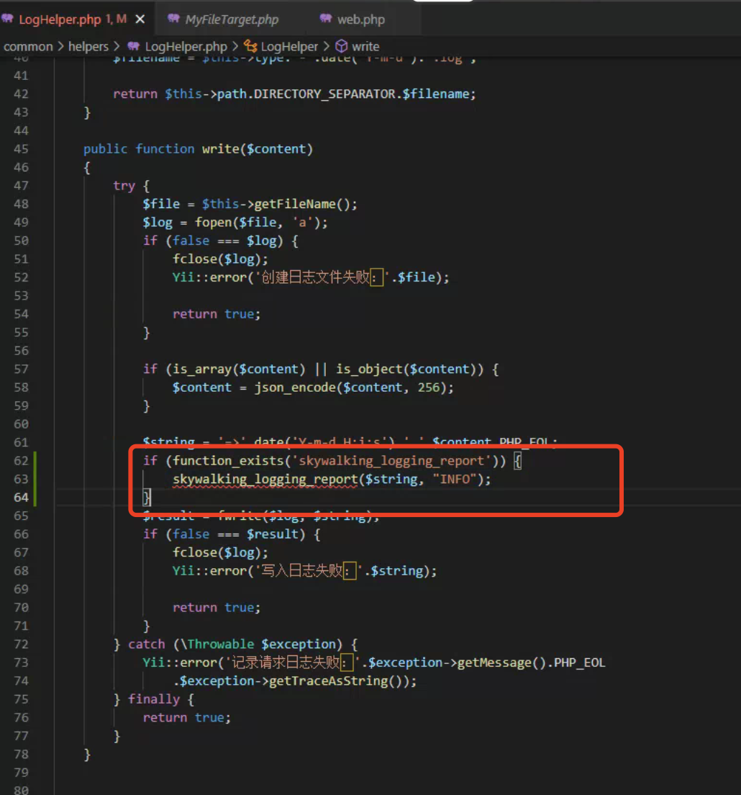
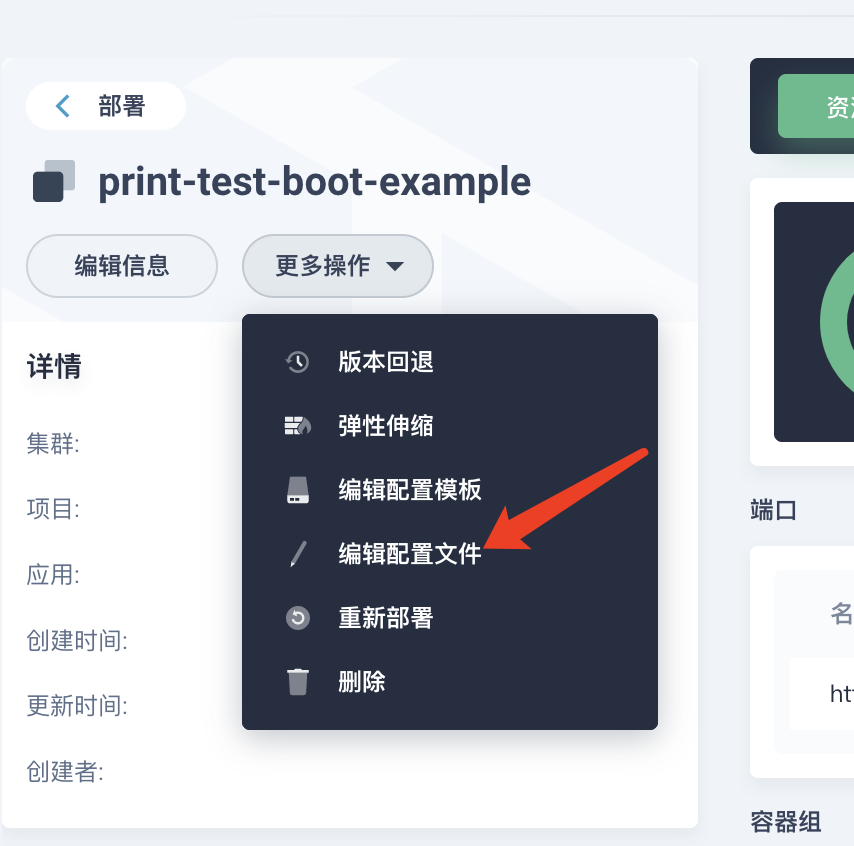
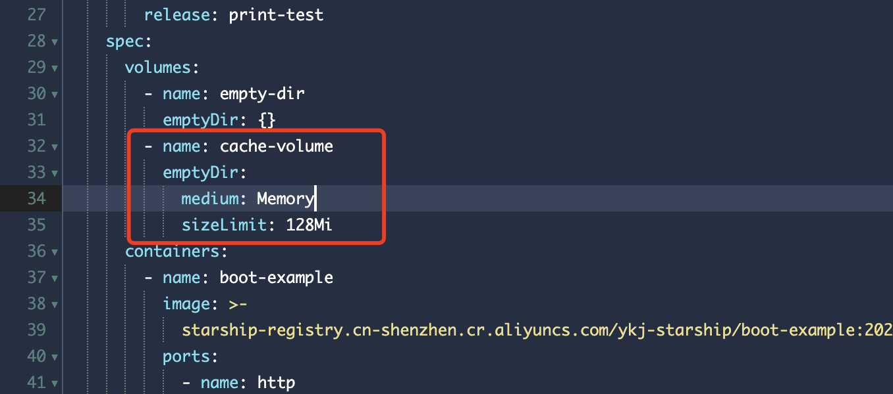

# PHP-FPM 接入 Skywalking 对接步骤

> 本文覆盖基于自研 PHP-FPM 基础镜像接入 Skywalking 的完整操作步骤：基础镜像与 php.ini、run.sh 启动脚本、环境变量、业务日志上报、shm 共享内存、重启验证与自定义链路。
>
> 内容整理自个人学习笔记。Skywalking 本体与 Go/Java 接入见 [../observability/Skywalking.md](../observability/Skywalking.md)。

## 一、修改 Dockerfile

### 1.1 更换最新 PHP-FPM 基础镜像为

```bash
registry.cn-shenzhen.aliyuncs.com/ykj-baseimages/nginx-php7.0.33-skywalking:1.0.0
```

### 1.2 标准 Dockerfile

更新后标准的 Dockerfile 如下代码所示：

```dockerfile
FROM registry.cn-shenzhen.aliyuncs.com/ykj-baseimages/nginx-php7.0.33-skywalking:1.0.0
env
WORKDIR /webser/www
WORKDIR /webser/www
RUN mkdir -p /webser/www/rental-backend/rental/protected/runtime/tmp
# 拷贝源项目代码到容器中
COPY ./../rental-backend ${WORKDIR}/rental-backend
# 加载配置文件
COPY rental/docker/ /tmp/rental-backend.myfuwu.com.cn/
#加载启动脚本
COPY rental/docker/run.sh /tmp/run.sh
RUN chmod +x /tmp/run.sh
EXPOSE 80
ENTRYPOINT ["/tmp/run.sh"]
```

> 说明：上面的 `env` 一行与重复的 `WORKDIR` 是原文档中的残留写法，可按需清理；`ENTRYPOINT` 指向 `/tmp/run.sh`，这也是下一节必须改启动脚本的原因。

### 1.3 基础镜像常用目录

- nginx 配置：`/etc/nginx/conf.d/`
- php.ini：`/usr/local/etc/php/conf.d/php.ini`
- fpm 配置：`/usr/local/etc/php-fpm.d/www.conf`
- 启动脚本：`/tmp/run.sh`

### 1.4 自定义 php.ini 时需要把 [skywalking] 的配置复制进来

如果自定义的 php.ini，需要把 `[skywalking]` 的配置复制进来：

```ini
[skywalking]
skywalking.app_code = ${GROUP_NAME}::${SERVICE_NAME}
skywalking.enable = ${SKYWALKING_ENABLE}
skywalking.version = 8
skywalking.log_enable = ${SKYWALKING_DEBUG_LOG_ENABLE}
skywalking.grpc = ${SKYWALKING_SERVER_ADDR}
skywalking.error_handler_enable = 0
skywalking.log_path = /data/log/skywalking.log
skywalking.mq_max_message_length = ${SKYWALKING_MQ_MSG_LEN}
skywalking.logging_enable = ${SKYWALKING_LOGGING_ENABLE}
skywalking.logging_mq_max_message_length = ${SKYWALKING_LOGGING_MQ_MSG_LEN}
skywalking.logging_yii_target_name = ${SKYWALKING_LOGGING_YII_TARGET_NAME}
skywalking.logging_mq_length = ${SKYWALKING_LOGGING_MQ_LEN}
```

要点：`${...}` 是**环境变量占位符**，由容器启动时（第三节配置的那些变量）展开，所以基础镜像与各业务镜像可以共用同一份 php.ini 模板；`skywalking.app_code` 就是链路上显示的服务标识，由 `GROUP_NAME::SERVICE_NAME` 拼成。

## 二、修改 run.sh

### 2.1 PHP-FPM 启动方式必须修改为前台启动

启动的方式如下代码所示：

```bash

/usr/local/sbin/php-fpm -R -F
```

**为什么必须前台启动（`-F`）**：

- 容器里 **PID 1（主进程）退出就等于容器退出**。php-fpm 默认以后台 daemon 方式工作：master 进程 fork 到后台后父进程立即退出，`run.sh` 随之执行完毕、容器被判为已结束，K8s 会不断重启（CrashLoopBackOff）。`-F`（`--nodaemonize`）让 master 常驻前台，作为容器的 PID 1 一直存活。
- `-R`（`--allow-to-run-as-root`）的含义是**允许以 root 身份运行**。php-fpm 出于安全考虑默认拒绝 root 启动，容器内需要显式开启；同时也就接受了「容器以 root 运行」的安全代价，建议配合非特权模式、只读根文件系统等做加固。
- 脚本里 Nginx 是 daemon 方式启动的（`/usr/sbin/nginx` 默认后台运行），真正把脚本「顶住不退出」的是最后那条 `php-fpm -R -F`；一旦删掉它，容器启动后会立即退出。

### 2.2 run.sh 脚本修改后的标准模板

如下代码所示：

```bash

#!/bin/sh
if [ $runtimemode = "prod" ];then
  env="prod"
  cp -r /tmp/rental-backend.myfuwu.com.cn/conf.d/* /etc/nginx/conf.d
  mv  /etc/nginx/conf.d/oss_upload.conf /etc/nginx/
elif  [ $runtimemode = "grey" ];then
  env="prod"
  cp -r /tmp/rental-backend.myfuwu.com.cn/conf.d/* /etc/nginx/conf.d
  mv  /etc/nginx/conf.d/oss_upload.conf /etc/nginx/
elif  [ $runtimemode = "private" ];then
  env="prod"
  cp -r /tmp/rental-backend.myfuwu.com.cn/conf.d/* /etc/nginx/conf.d
  mv  /etc/nginx/conf.d/oss_upload.conf /etc/nginx/
elif  [ $runtimemode = "test" ];then
  env="test"
  cp -r /tmp/rental-backend.myfuwu.com.cn/conf.d/* /etc/nginx/conf.d
  mv  /etc/nginx/conf.d/oss_upload.conf /etc/nginx/
elif  [ $runtimemode = "pressure-test" ];then
  env="pressure-test"
  cp -r /tmp/rental-backend.myfuwu.com.cn/conf.d/* /etc/nginx/conf.d
  mv  /etc/nginx/conf.d/oss_upload.conf /etc/nginx/
fi
echo $runtimemode > /webser/www/$runtimemode
echo $env > /webser/www/env
sed -i s'/request_terminate_timeout = 20s/request_terminate_timeout = 60s/g' /usr/local/etc/php-fpm.d/www.conf
sed -i "s#ENV_OSS_UPLOAD_URL#$ENV_OSS_UPLOAD_URL#g" /etc/nginx/oss_upload.conf
sed -i "s#ENV_FLOW_URL#$ENV_FLOW_URL#g" /etc/nginx/conf.d/rental.conf
sed -i "s#ENV_DATASET_URL#$ENV_DATASET_URL#g" /etc/nginx/conf.d/rental.conf
sed -i "s#ENV_PASS#$ENV_PASS#g" /etc/nginx/conf.d/rental.conf
/usr/sbin/nginx
/usr/local/sbin/php-fpm -R -F
```

### 2.3 与 K8s 优雅停机的关系

- K8s 删除 Pod 时，先给容器的 PID 1 发送 `STOPSIGNAL`（Dockerfile 未指定时默认 `SIGTERM`），然后等待 `terminationGracePeriodSeconds`（默认 30s）；超时未退出就 `SIGKILL` 强杀。
- 如果 PID 1 是 shell 脚本而脚本没有 `exec`，**shell 默认不会把信号转发给子进程**：php-fpm 收不到 SIGTERM，只能干等到 grace period 结束被强杀——正在处理的 PHP 请求被中断，skywalking 的消息队列也来不及 flush，最后一批链路日志就丢了。
- 改进做法：把最后一行改为 `exec /usr/local/sbin/php-fpm -R -F`，让 php-fpm 直接成为 PID 1，信号可直达；或者引入 `tini` / `dumb-init` 作为 init 进程，负责信号转发与僵尸进程回收。
- php-fpm 收到 SIGTERM 后会进入 graceful stop：master 停止接收新连接，等待 worker 处理完当前请求（受 `www.conf` 中 `request_terminate_timeout` 约束，本模板已把它从 20s 调整为 60s）再退出，这段时间也是链路数据上报的最后一个窗口。因此 **`terminationGracePeriodSeconds` 应当大于 `request_terminate_timeout`**，否则 worker 还在跑就被 SIGKILL 了。

## 三、星洲添加环境变量

在星洲上增加 **GROUP_NAME**、**SERVICE_NAME、SKYWALKING_SERVER_ADDR** 环境变量，标准变量如下代码所示：

```bash

GROUP_NAME=租赁组
SERVICE_NAME=债权中心
SKYWALKING_SERVER_ADDR=172.16.68.108:11800
```

其它变量说明：

| 变量名称 | 变量说明 | 默认值 |
| --- | --- | --- |
| GROUP_NAME | 业务组 | |
| SERVICE_NAME | 服务名称 | |
| SKYWALKING_SERVER_ADDR | skywalking oap 服务地址 | |
| SKYWALKING_ENABLE | 是否开启 skywalking，0 关闭 1 开启 | 1 |
| SKYWALKING_DEBUG_LOG_ENABLE | 是否开启 skywalking 调试日志，日志路径 /data/log/skywalking | 0 |
| SKYWALKING_MQ_MSG_LEN | 链路上报消息体大小，超过大小后会丢弃 | 20480 |
| SKYWALKING_LOGGING_ENABLE | 是否开启 skywalking 日志上报 | 1 |
| SKYWALKING_LOGGING_MQ_MSG_LEN | skywalking 日志上报消息体大小，超过大小后会丢弃，最大只能设置为 32KB，详情看[常见问题](https://doc.in.myspacex.cn/pages/viewpage.action?pageId=34064866) | 20480 |
| SKYWALKING_LOGGING_YII_TARGET_NAME | yii 日志目标类，该类输出日志时会上报到 skywalking | yii\log\FileTarget |

注意 `SKYWALKING_SERVER_ADDR` 填的是 **OAP 的 gRPC 端口（默认 11800）**，链路与日志都通过它上报。

## 四、业务日志上报

1. 日志输出使用 `yii\log\Target` 的子类如 `FileTarget` 或自己实现的子类，只需要配置环境变量 `SKYWALKING_LOGGING_YII_TARGET_NAME=子类`，skywalking 会拦截子类的 `export` 方法，并把相应的日志上报到 skywalking。
2. 自己实现的日志输出，需要使用全局方法 `skywalking_logging_report(message, level)` 进行上报。

资管的日志输出类如下：



```php
// 加上 function_exists 判断可以兼容无 skywalking 插件下运行
if (function_exists('skywalking_logging_report')) {
    skywalking_logging_report($string, "INFO");
}
```

> 日志与链路共用 shm 消息队列，单条日志超过 `SKYWALKING_LOGGING_MQ_MSG_LEN`（最大 32KB）会被丢弃，业务侧打印大对象前建议先裁剪。

## 五、修改 shm 共享内存大小

skywalking sdk 上报 php 的日志与链路信息主要使用 shm 共享内存实现的消息队列，计算公式为：

```text
shm_size = (SKYWALKING_MQ_MSG_LEN * 1024) + (SKYWALKING_LOGGING_MQ_MSG_LEN * 1024) + 100KB
```

如果没有调整 `SKYWALKING_MQ_MSG_LEN`、`SKYWALKING_LOGGING_MQ_MSG_LEN` 可忽略此步；如果调整后没有超过 64M 也可忽略此步。

### 5.1 为什么要单独挂载 /dev/shm

- **容器里的 `/dev/shm` 默认只有 64MB**（Docker 默认 `--shm-size=64m`，K8s 下沿用容器运行时的默认值）。它本质是 tmpfs（内存文件系统），**占用的是容器内存**，不是磁盘。
- php-fpm 是**多进程模型**（1 个 master + N 个 worker）：每个 worker 都要把链路与日志写进队列，再由上报逻辑消费，跨进程通信只能靠共享内存，所以 SDK 用 POSIX 共享内存 + 信号量实现消息队列，容量必须覆盖「链路上报 + 日志上报」两块缓冲区。
- 默认值下 `20480KB + 20480KB + 100KB ≈ 41MB < 64MB`，所以常规配置不用改；一旦把日志消息体调大（例如调到 32KB 上限）就可能溢出，表现为队列写失败、链路或日志丢失。
- 把 `/dev/shm` 单独挂成 `emptyDir: medium: Memory` 并设置 `sizeLimit` 后，容量就由 `sizeLimit` 决定；**该 sizeLimit 会计入容器的内存用量**，因此要同步调整 Pod 的 memory limit，避免 OOMKill。

### 5.2 修改方法

修改方法如下：



层次为 `spec.spec.volumes`：

```yaml
- name: cache-volume
  emptyDir:
    medium: Memory
    sizeLimit: 128Mi
```



层次为 `spec.spec.containers.volumeMounts`：

```yaml
- name: cache-volume
  mountPath: /dev/shm
```
