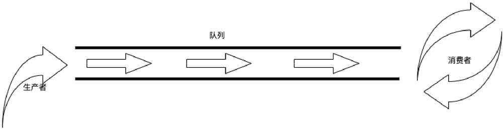
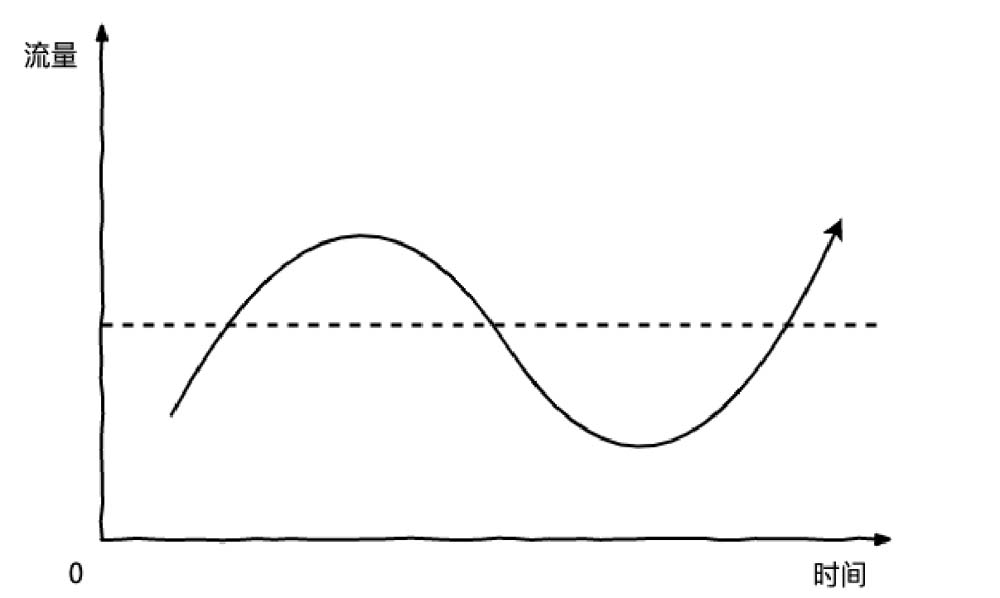
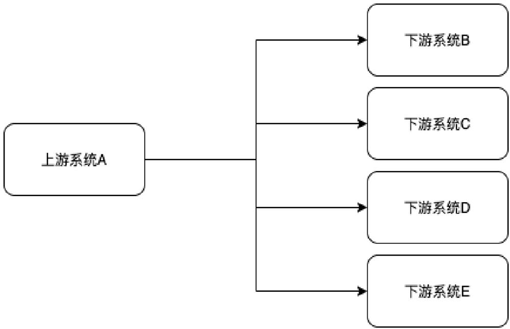
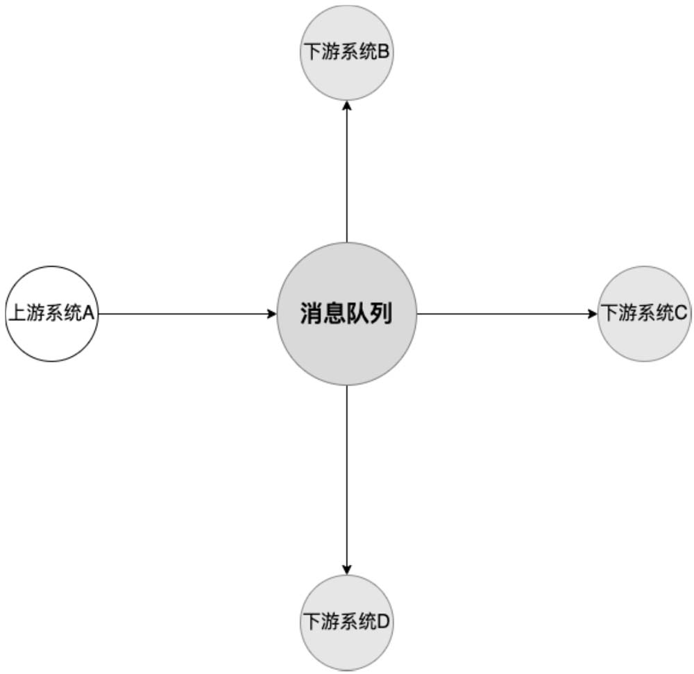
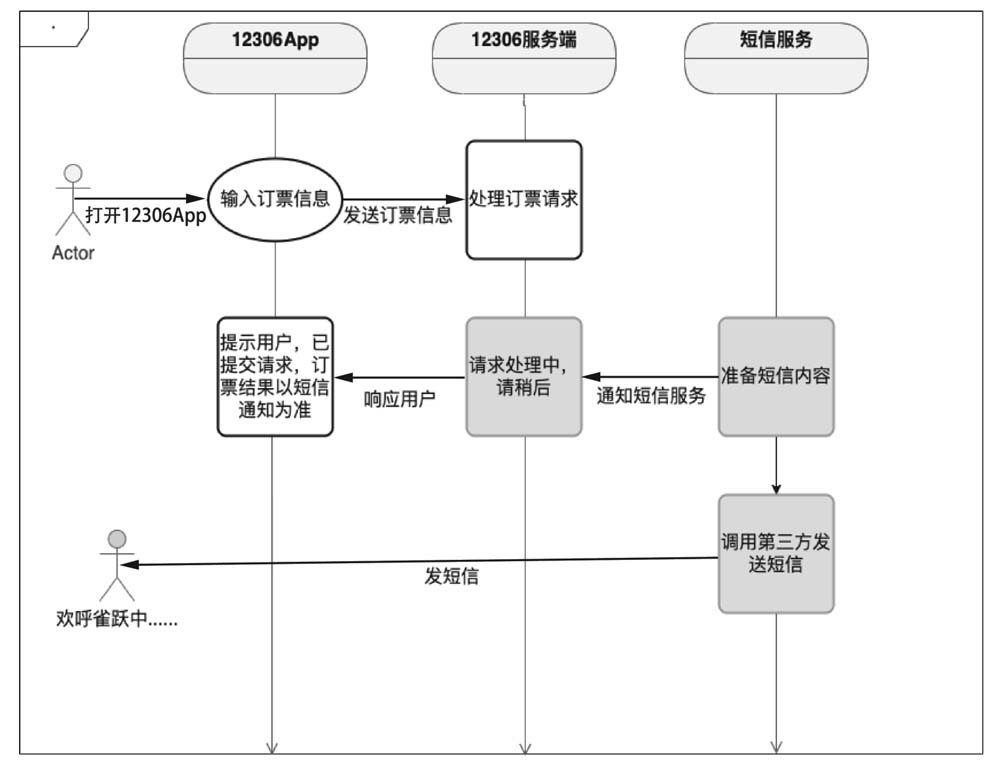
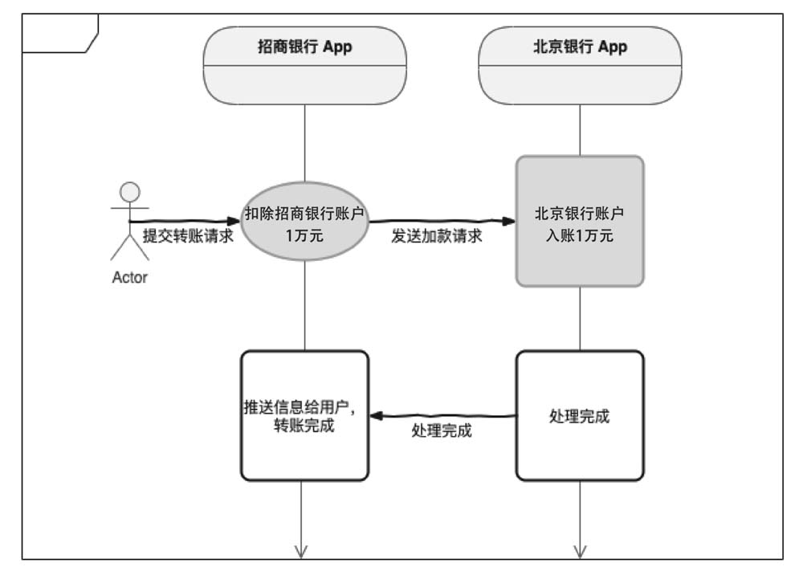
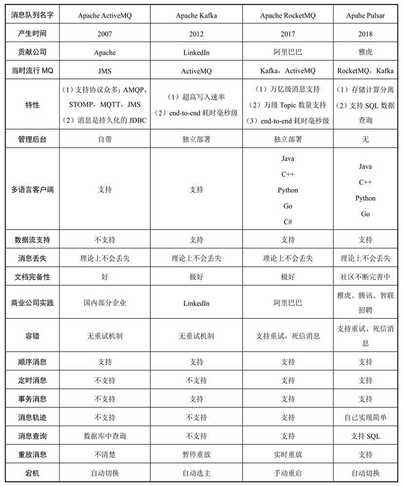

# 消息队列选型

> 从「为什么用 MQ」讲到 Kafka / RabbitMQ / RocketMQ / Pulsar 横向对比、事务消息与延迟队列的实现方案，以及落地时必须避开的坑。
>
> 内容整理自个人学习笔记。各中间件的**具体使用（含 Go / Java 客户端示例）**见分册：
> [Kafka.md](Kafka.md)、[RabbitMQ.md](RabbitMQ.md)、[RocketMQ.md](RocketMQ.md)、[Nats.md](Nats.md)。

## 概述

### 什么是消息队列

消息队列（Message Queue），从广义上讲是一种消息队列服务中间件，提供一套完整的信息生产、传递、消费的软件系统。

消息队列所涵盖的功能远不止于队列（Queue），其本质是两个进程传递信息的一种方法。

### 为什么要用消息队列

#### 削峰填谷

业务系统在超高并发场景中，由于后端服务来不及同步处理过多、过快的请求，可能导致请求堵塞，严重时可能由于高负荷拖垮 Web 服务器。

为了能支持最高峰流量，我们通常采取短平快的方式——直接扩容服务器，增加服务端的吞吐量。

优点是显而易见的，短时间内吞吐量增加了好几倍，甚至数十倍。缺点也明显，流量低峰期服务器相对较闲。

这时消息队列就派上用场了。

#### 程序间解耦

不同的业务端在联合开发功能时，常常由于排期不同、人员调配不方便等原因导致项目延期。其实，其根本原因是业务耦合过度。

加入消息队列后，不同的业务端又会是何种情况呢？如图所示，上下游系统进行开发、联调、上线，彼此完全不依赖，也就是说，系统间解耦了。

#### 异步处理

对于耗时任务，避免等待超时，可以放到后台执行。

#### 数据的最终一致性

多个系统间的协作保证数据最终一致性、缓存和数据库数据同步数据最终一致性、扣库存、转账等。

#### 延迟消息

消息发送后，消费者要在一定时间后，或者指定某个时间点才可以消费。在没有延迟消息时，基本的做法是基于定时计划任务调度，定时发送消息。在 RocketMQ 中只需要在发送消息时设置延迟级别即可实现。

#### 五个场景速览

| 场景 | 解决的问题 | 典型例子 | 落地注意 |
| --- | --- | --- | --- |
| 削峰填谷 | 瞬时流量远高于后端处理能力 | 秒杀下单、大促下单 | 队列深度要设上限，避免磁盘打满 |
| 程序间解耦 | 上下游强依赖、联调排期互相牵制 | 订单创建后通知库存/积分/物流 | 消息契约（字段兼容）要版本化 |
| 异步处理 | 耗时任务阻塞主链路 | 发短信、生成报表、图片处理 | 失败要可重试且有死信兜底 |
| 最终一致性 | 多系统数据需最终对齐 | 缓存与 DB 同步、转账、扣库存 | ⭐ 必须配幂等 + 对账 |
| 延迟消息 | 需要「到点才处理」的定时语义 | 订单超时关闭、优惠券到期提醒 | 消费者需二次校验业务状态 |

## 常见消息队列

主流产品包括 Kafka、RabbitMQ、RocketMQ、Pulsar，以及逐渐退出主舞台的 ActiveMQ；此外还有 NATS（轻量、云原生、以 Core NATS + JetStream 分层）、Redis Stream（轻量但持久化能力弱）等细分选择。

### 核心概念名词对照 ⭐

不同 MQ 对同一件事叫法不同，这是一开始最容易混淆的地方：

| 概念 | Kafka | RabbitMQ | RocketMQ | Pulsar |
| --- | --- | --- | --- | --- |
| 消息通道 | Topic | Exchange + Queue（Binding 绑定） | Topic（内含多个 MessageQueue） | Topic（内含多个 Partition） |
| 分区 / 队列 | Partition | Queue | MessageQueue（读队列 / 写队列） | Partition |
| 消费分组 | Consumer Group | 同一 Queue 的竞争消费者 | Consumer Group | Subscription |
| 消费进度 | Offset | ack / 消费即删 | Offset（ConsumerOffset） | Cursor |
| 元数据 / 路由 | ZooKeeper 或 KRaft（Controller） | Erlang 内置 Mnesia | 轻量 NameServer | ZooKeeper + BookKeeper |
| 消息存储 | 分区日志段（Segment） | 队列文件 + 索引 | CommitLog + ConsumeQueue + IndexFile | BookKeeper Ledger |

### 投递语义（Delivery Semantics）

| 语义 | 含义 | 代价 | 现实情况 |
| --- | --- | --- | --- |
| At Most Once | 最多一次，可能丢 | 无重试、性能最好 | 日志采集等允许丢失的场景 |
| At Least Once | 至少一次，可能重复 | 需要重试 + 幂等 | ⭐ **绝大多数生产系统的实际选择** |
| Exactly Once | 恰好一次 | 依赖事务 / 幂等下沉，跨系统几乎做不到 | Kafka 事务在流内可近似实现；业务侧靠幂等「等价实现」 |

> 结论：不要追求中间件层面的 Exactly Once，而要在**消费端用幂等（唯一键 / 去重表 / 状态机）把 At Least Once 变成业务上的「效果只有一次」**。

### 消息模型：点对点 vs 发布订阅

| 模型 | 结构 | 特点 | 典型实现 |
| --- | --- | --- | --- |
| 点对点（P2P） | 生产者 → Queue → 单个消费者 | 一条消息只被一个消费者处理，队列天然负载均衡 | RabbitMQ 同队列竞争消费、RocketMQ 集群消费 |
| 发布订阅（Pub/Sub） | 生产者 → Topic → 多个订阅者组 | 一条消息被每个订阅组各消费一次，天然广播 | Kafka Consumer Group、RocketMQ 广播消费、Pulsar Subscription |

> 实际使用中两者常混合：**Topic 内部做 P2P（集群消费、负载均衡），Topic 之间做 Pub/Sub（多业务组各自订阅）**。

## 优缺点及适用场景

选型没有银弹，本质是在**吞吐、延迟、可靠性、功能特性、运维成本**这五者之间做取舍。

### 主流消息队列横向对比 ⭐

| 对比维度 | Kafka | RabbitMQ | RocketMQ | Pulsar |
| --- | --- | --- | --- | --- |
| 开发语言 / 生态 | Scala + Java，JVM；大数据生态事实标准（Flink/Spark/Hadoop） | Erlang；AMQP 生态成熟，插件多 | Java；阿里系生态，Spring Cloud Alibaba 原生集成 | Java（Broker）+ C++（BookKeeper）；云原生生态 |
| 单机吞吐量量级 | ⭐ 十万~百万级 msg/s（顺序写 + PageCache + 零拷贝，吞吐之王） | 万级~十万级 msg/s（Erlang 调度器，单机相对低） | 十万级 msg/s（顺序写 CommitLog + 消费队列） | 十万级+ msg/s，水平扩展后更高 |
| 延迟 | 毫秒级（批量为吞吐牺牲部分延迟，量级 ms） | 微秒~毫秒级，⭐ 四者中最低（Erlang 轻量进程） | 毫秒级（同数量级，略低于 RabbitMQ） | 毫秒级，需关注 BookKeeper 写路径 |
| 消息可靠性（持久化 / ACK / 副本） | 多副本 ISR + acks=all + 刷盘可配；default 强于可用性 | 持久化队列 + publisher confirm + 手动 ack；镜像队列 / Quorum Queue | 同步刷盘 + 同步复制（主从）、DLedger 自动主从切换 | 多副本 + BookKeeper 多副本，可配 ack 级别 |
| 顺序消息 | ⭐ 分区内天然有序（单 Partition 单消费者） | 单队列单消费者可保证，多消费者即失序 | ⭐ 队列级严格顺序（MessageQueue 内 FIFO） | Key 分区内有序（Key_Shared 订阅保证同 Key 有序） |
| 延迟消息 | ❌ 不支持（官方无内置，需自建或外部调度） | 需 TTL + DLX 或延迟插件实现（精度中等） | ⭐ 4.x 固定 18 级、5.x 支持任意时间 | 支持延迟投递（deliverAfter / deliverAt） |
| 事务消息 | 提供事务 API（Kafka Transactions），但语义与 RocketMQ 不同，主要用于流处理 exactly-once | 无原生分布式事务消息，靠 confirm + 手动补偿 | ⭐ 半消息（Half Message）+ 事务回查，典型分布式事务方案 | 提供事务 API，用法偏流处理场景 |
| 消息回溯 / 重复消费 | ⭐ 按 offset 任意回溯，日志文件保留期内可反复消费 | 消费即删（ack 后删除），回溯弱（需靠重入队） | ⭐ offset 回溯，Broker 保留期内可重放 | ⭐ 读写分离存算结构，天然支持任意回溯 |
| 运维复杂度 | 中（依赖 ZooKeeper 或 KRaft；调优点集中在磁盘与分区） | 低（管理界面友好，开箱即用；集群镜像配置稍繁琐） | 中（NameServer 轻量无状态，运维成本低于 ZK 方案） | ⭐ 高（Broker + BookKeeper + ZooKeeper 组件多，但解耦后弹性好） |
| 社区活跃度 / 典型使用方 | ⭐ 极活跃；LinkedIn、Uber、Netflix、字节、几乎所有大数据场景 | 活跃；金融、电信、传统企业、中小系统，Rabbit 公司主导 | 活跃；阿里、滴滴、银行/金融、电商交易链路 | 活跃（StreamNative 主导）；腾讯、雅虎、云原生多租户平台 |

### 怎么选 ⭐

| 业务特征 | 推荐 | 理由 |
| --- | --- | --- |
| 日志采集、埋点、大数据流处理、需要极高吞吐与回溯重放 | **Kafka** | 吞吐优先，生态最全，offset 回溯友好；不要求延迟消息与事务消息 |
| 业务系统解耦 + 需要延迟消息与事务消息 + 金融级可靠与严格顺序 | **RocketMQ** | 功能全面：延迟级别、半消息事务、队列级顺序、同步刷盘、DLedger 高可用 |
| 中小规模、路由灵活、协议丰富（AMQP / MQTT / STOMP）、低延迟 | **RabbitMQ** | 微秒~毫秒级低延迟，路由模型（Exchange/Queue/Binding）最灵活，运维最轻 |
| 云原生、多租户、需要存算分离与 tiered storage（冷数据下沉对象存储） | **Pulsar** | 存算分离、多租户原生、分层存储，弹性扩缩容，天然支持回溯 |
| 遗留系统、老项目、JMS 生态 | **ActiveMQ / ActiveMQ Artemis** | 兼容性好但性能与社区均已落后，仅建议维护存量 |

> 经验法则：**数据管道选 Kafka，业务消息选 RocketMQ，小体量灵活路由选 RabbitMQ，云原生多租户选 Pulsar。**

### 分册详解 ⭐

选型定了之后，各中间件的**架构原理、部署与客户端代码**见对应分册：

| 中间件 | 分册 | 核心看点 |
|---|---|---|
| **Kafka** | [Kafka.md](Kafka.md) | Partition / ISR、acks 与幂等生产、消费者组重平衡、KRaft 去 ZK、Go 三种客户端取舍 + Java 原生/Spring Kafka |
| **RabbitMQ** | [RabbitMQ.md](RabbitMQ.md) | 四种交换机（direct/fanout/topic/headers）路由模型、Publisher Confirm、DLX 与两种延迟队列、Quorum 队列 |
| **RocketMQ** | [RocketMQ.md](RocketMQ.md) | 四角色架构、顺序/延迟/事务消息原理、刷盘×复制四种组合、Java 客户端为主 + Go 客户端 |
| **NATS** | [Nats.md](Nats.md) | Core NATS 与 JetStream 的语义差异、Queue Group、Request-Reply、Leaf Node、Go / Java 客户端 |

> 💡 读法建议：**先在本篇按「吞吐 / 延迟 / 功能 / 可靠 / 运维」五个维度定方向，再进分册看落地细节。**
> 本文件只做**横向对比与选型决策**，各中间件的原理与代码不在本篇展开。

### 选型评估清单（落地前必问）⭐

| 评估项 | 要问的问题 | 影响 |
| --- | --- | --- |
| 吞吐与峰值 | 峰值 QPS 多少？是否需要削峰缓冲？ | 决定能否用 RabbitMQ 这类单机吞吐偏低的产品 |
| 延迟要求 | 是微秒级响应链路，还是秒级可接受？ | 低延迟敏感选 RabbitMQ / Pulsar |
| 功能特性 | 是否需要延迟消息、事务消息、严格顺序、消息回溯？ | ⭐ 这一项往往直接筛掉 Kafka |
| 可靠性等级 | 是否允许丢消息？能否接受最终一致？ | 决定刷盘策略、副本数、ACK 配置 |
| 团队与生态 | 团队熟悉哪套技术栈？是否已有运维能力？ | 组件越多的方案（如 Pulsar）运维成本越高 |
| 运维与成本 | 是否需要存算分离、冷热分层、多租户？ | 云原生 / 多租户场景 Pulsar 优势明显 |
| 演进空间 | 未来是否需要跨机房、全球复制、大规模扩容？ | Kafka 跨机房方案较重，Pulsar 分层存储更省成本 |

## 特定场景

### 事务消息

核心问题：**如何保证「本地业务操作」与「消息发送」这两个动作的原子性**——本地改了库但消息没发，或消息发了但本地回滚，都会造成上下游数据不一致。

三种主流实现思路对比 ⭐：

| 方案 | 实现思路 | 一致性强度 | 优点 | 缺点 | 适用场景 |
| --- | --- | --- | --- | --- | --- |
| **本地消息表** | 业务与「待发送消息」写入同一本地事务，再由定时任务 / 异步线程投递 MQ，投递成功才更新消息状态 | 最终一致 | 实现简单、不依赖 MQ 特性、可用任意 MQ | 与业务库耦合、需额外表与轮询、有投递延迟 | 中小系统、异构 MQ、无事务消息能力的中间件 |
| **事务消息（半消息 + 回查）** ⭐ | 先发半消息（对消费者不可见）→ 执行本地事务 → 提交/回滚 → 未收到二次确认时 Broker **回查**生产者本地事务状态 | 最终一致，及时性最好 | 无业务库侵入、无需轮询、RocketMQ 原生支持 | 依赖 MQ 能力、回查接口必须幂等、需处理回查超时 | 电商下单、支付、库存扣减等分布式事务主链路 |
| **最大努力通知** | 业务处理完后由独立服务反复通知下游，直到成功或达最大次数，下游需提供幂等查询/对账接口 | 弱一致性 | 实现门槛最低、与业务解耦 | 不保证一定到达，必须配定期对账兜底 | 非核心通知类场景（积分、短信、运营消息） |

RocketMQ 事务消息流程（半消息 → 本地事务 → Commit/Rollback → 定时回查）：

1. 生产者发送**半消息**到 Broker，此时消息对消费者不可见；
2. 半消息发送成功后执行**本地事务**；
3. 按本地事务结果发送 **Commit 或 Rollback**；
4. 若 Broker 长时间未收到二次确认，主动**回查**生产者的事务状态；
5. 依据回查结果提交或回滚，保证与本地事务一致。

⚠️ 注意：RocketMQ 事务消息保证的是**「本地事务与消息发送」的最终一致**，消费端仍需**自行做幂等**（唯一键 / 去重表 / 状态机），因为消息可能被重复投递。

具体 API 与完整可运行示例见 [RocketMQ.md](RocketMQ.md)。

#### 事务消息的三个必要前提

| 前提 | 说明 |
| --- | --- |
| **回查接口幂等** | Broker 可能多次回查同一事务，回查逻辑必须只读、幂等、可重复执行 |
| **回查结果三态** | 必须能明确回答 Commit / Rollback / 未知（未知则继续等待下次回查），不能含糊 |
| **消费端幂等** | 事务消息只保证「本地事务 ↔ 消息投递」一致，不保证消费不重复，去重逻辑不可省 |

⚠️ 常见误区：把事务消息当成「分布式事务万能药」。它只解决**「本地事务与发消息」的原子性**，下游多个服务的各自业务一致性仍需靠幂等、对账与补偿来兜底。

### 延迟队列

适用场景：订单超时未支付自动关闭、优惠券到期提醒、定时任务触发、失败重试退避、预约/提醒类业务。

三种实现方案对比 ⭐：

| 方案 | 实现思路 | 精度 | 优点 | 代价 / 局限 | 适用 |
| --- | --- | --- | --- | --- | --- |
| **RocketMQ 延迟消息** | 4.x：消息投递到固定延迟级别队列，定时服务到期转投真实 Topic；5.x：基于时间轮 + 定时文件，支持任意时刻 | 4.x：**固定 18 级**（1s/5s/10s/30s/1m…2h），非任意时间；5.x：秒级、任意时间 | 原生能力、无需额外组件、可靠性与普通消息一致 | 4.x 级别不可自定义、精度受级别限制；5.x 需升级 Broker 与客户端 | 业务内定时类消息，主流选择 |
| **RabbitMQ TTL + 死信队列** | 消息设 TTL，过期后进入 DLX（死信交换机），再由死信队列消费者处理 | 中等，受队列头阻塞影响（前一条未过期会阻塞后一条） | 只用原生 TTL/DLX，零额外组件 | ⚠️ 队列头阻塞导致实际延迟偏大；每个延迟粒度需独立队列；延迟时间不可变 | 延迟粒度少、体量小的场景 |
| **RabbitMQ 延迟插件**（rabbitmq_delayed_message_exchange） | 插件在交换机层基于时间轮保存消息，到期投递 | 较高，优于 TTL 方案 | 无需多队列、支持任意延迟时间 | 需安装插件、消息积压在交换机、插件本身不持久化风险 | 需要任意延迟、且能接受插件依赖 |
| **时间轮 / 定时任务扫表** | 应用内时间轮（Netty HashedWheelTimer / Redisson RDelayedQueue）或 DB 定时扫表 + 补偿投递 | 扫表精度取决于扫描间隔（秒~分钟）；时间轮为内存级 | 不依赖 MQ 特性、可控性强 | ⚠️ 扫表对 DB 压力大、集群下需防重复抢单；时间轮进程重启丢任务，需持久化兜底 | 无延迟消息能力时、或需要复杂调度逻辑 |

#### RocketMQ 4.x 的 18 个固定延迟级别

| level | 延迟 | level | 延迟 | level | 延迟 |
| --- | --- | --- | --- | --- | --- |
| 1 | 1s | 7 | 3m | 13 | 10m |
| 2 | 5s | 8 | 4m | 14 | 20m |
| 3 | 10s | 9 | 5m | 15 | 30m |
| 4 | 30s | 10 | 6m | 16 | 1h |
| 5 | 1m | 11 | 7m | 17 | 2h |
| 6 | 2m | 12 | 8m | 18 | 2h |

⚠️ 4.x 的延迟级别通过 Broker 配置 `messageDelayLevel` 定义，**修改需重启 Broker 且只对新消息生效**；若业务需要任意时刻延迟，应升级到 5.x（基于定时文件 + 时间轮）或改用「定时任务 + 状态表」方案。

⚠️ 延迟消息的三条铁律：

- **不能只靠延迟消息保证业务正确性**，要配合「状态查询 / 对账」兜底，防止消息丢失或重复触发；
- 延迟到达后消费者必须**再次校验业务当前状态**（如订单是否已支付），避免「已支付却被关闭」；
- 大延迟跨度的业务（如 7 天）用 MQ 延迟消息成本高，建议**定时任务 + 状态表**实现。

## 使用消息队列的代价与坑

⚠️ 引入 MQ 解决了耦合与峰值问题，同时也引入了新的复杂度，这些是落地时最容易踩的坑。

| 坑 | 说明 | 应对 |
| --- | --- | --- |
| ⚠️ **消息重复消费** | 网络抖动、ACK 丢失、重平衡都会导致重复投递；**至少一次（At Least Once）是常态**，exactly-once 极难做到 | 消费端**必须做幂等**：唯一键去重表、Redis SETNX、状态机判断，或数据库唯一索引兜底 |
| ⚠️ **消息丢失（生产环节）** | 生产者发完即认为成功，Broker 未收到 | 用同步发送 / 带回调的异步发送；Kafka `acks=all` + 重试；RocketMQ 同步发送 + 失败重试 |
| ⚠️ **消息丢失（存储环节）** | Broker 宕机，数据还在 PageCache 未刷盘 | 同步刷盘（SYNC_FLUSH）+ 主从同步复制；Kafka 提高 `min.insync.replicas` |
| ⚠️ **消息丢失（消费环节）** | 先 ack 后处理业务，处理失败消息已丢失 | **先处理业务再 ack**；RocketMQ 靠消费位点提交、失败进重试队列；Kafka 手动提交 offset |
| ⚠️ **消息堆积** | 消费速度跟不上生产速度，磁盘打满后 Broker 拒绝写入 | 提升消费并发 / 增加分区与消费者；业务降级丢弃非关键消息；监控 Lag 告警 |
| ⚠️ **顺序性问题** | 全局顺序几乎不可实现，多分区/多队列必然乱序 | 只保**局部顺序**：同一业务键（订单号）路由到同一分区/队列，且单线程消费；顺序消息不能并行消费 |
| ⚠️ **分布式事务陷阱** | 误以为发消息与本地事务天然原子 | 用事务消息 / 本地消息表 / 最大努力通知 + 对账；见 [RocketMQ.md](RocketMQ.md) |
| ⚠️ **消费位点管理** | 位点提交策略不当会造成漏消费或大量重复 | 明确「先消费后提交」；重平衡期间注意重复；位点重置（earliest/latest）要评估影响 |
| ⚠️ **过度依赖 MQ** | 把 MQ 当数据库用，或所有调用都异步化，链路难以追踪 | 关键链路同步、非关键异步；接入链路追踪（TraceId 透传）与消息轨迹 |

#### 幂等落地的四种常见做法

| 做法 | 原理 | 适用 | 注意 |
| --- | --- | --- | --- |
| 数据库唯一索引 | 业务唯一键建唯一约束，重复插入报错即忽略 | 插入型业务（订单、流水） | 冲突异常要捕获并视为成功，不能抛给上游 |
| 去重表 / 消息表 | 消费前先写「消息已处理」记录，同事务内完成 | 需要严格去重的核心链路 | 去重表会随消息量增长，需定期归档 |
| Redis SETNX / 分布式锁 | 用消息 ID 抢占键，成功才处理 | 高并发、允许少量 Redis 故障风险 | 要设过期时间，避免死锁与内存膨胀 |
| 状态机判断 | 只允许「待支付 → 已支付」这类合法跃迁 | 有明确状态流转的业务 | 必须用带条件的 UPDATE（CAS），不能先查再改 |

⚠️ 无论选哪种，**幂等键必须是业务唯一标识或全局唯一消息 ID**，并且幂等判断与业务处理要落在同一事务边界内，否则仍会出现「判断通过但业务失败」的空窗。

## 高频追问速查 ⭐

| 问题 | 回答要点 |
| --- | --- |
| MQ 的核心价值是什么？ | 削峰填谷、系统解耦、异步化、最终一致性、延迟消息——本质是**用异步换可用性与吞吐** |
| Kafka 为什么快？ | 顺序写磁盘 + PageCache + 零拷贝（sendfile）+ 批量发送 + 分区并行；不谈持久化就是耍流氓 |
| 如何保证消息不丢？ | 生产端（同步发送 / acks=all + 重试）、存储端（同步刷盘 + 多副本）、消费端（先处理业务再 ack）三处都要管 |
| 如何保证不重复消费？ | 中间件无法完全保证，**消费端幂等**：唯一键去重表 / Redis SETNX / 状态机 / DB 唯一索引 |
| 如何保证顺序？ | 只在**局部**保证：同一业务键进同一分区或队列，单线程消费；全局顺序代价极高 |
| RocketMQ 为什么不用 ZooKeeper？ | NameServer 无状态、节点互不通信、靠客户端容错，运维比 ZK 方案轻得多 |
| 延迟消息怎么实现？ | RocketMQ 4.x 固定 18 级 / 5.x 任意时间；RabbitMQ TTL+DLX 或延迟插件；兜底方案是定时任务扫表 |
| 消息堆积怎么处理？ | 先扩消费者并提并发（受分区数上限约束），再考虑临时扩分区、业务降级丢弃、或换 Topic 分流 |
| 事务消息与本地消息表怎么选？ | 追求及时性与低侵入选事务消息；不想依赖 MQ 特性、可接受轮询延迟则选本地消息表 |
| Pulsar 与 Kafka 的本质差别？ | Pulsar 存算分离（Broker + BookKeeper），天然多租户、支持分层存储与任意回溯；代价是组件更多、运维更重 |

**一句话速记**：削峰解耦异步化 → 选型看吞吐/延迟/功能/运维 → 可靠靠刷盘与副本 → 重复靠幂等 → 顺序靠同键同队列 → 一致靠事务消息加对账。

## 关联

- [Kafka.md](Kafka.md)、[RabbitMQ.md](RabbitMQ.md)、[RocketMQ.md](RocketMQ.md)、[Nats.md](Nats.md) — 四款 MQ 的分册详解
- [../../分布式/分布式事务.md](../../分布式/分布式事务.md) — 事务消息与本地消息表
- [../../数据存储/redis/发布订阅.md](../../数据存储/redis/发布订阅.md) — 不需要投递保证时的轻量替代
