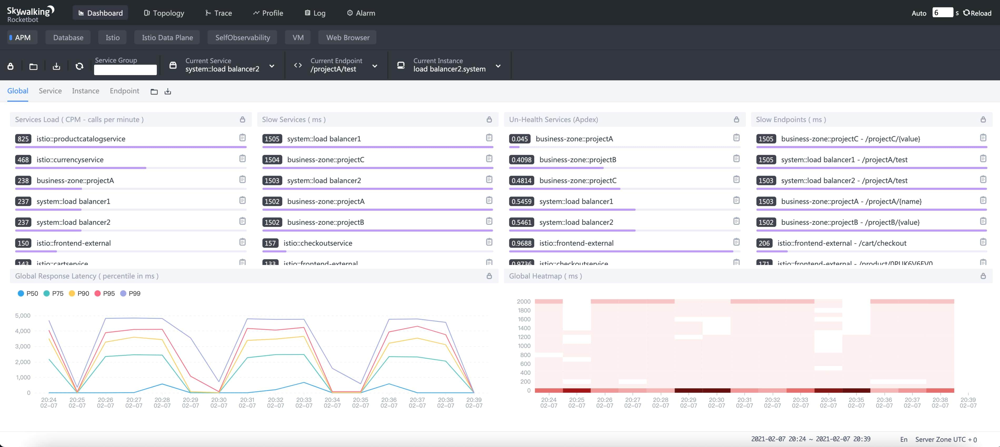
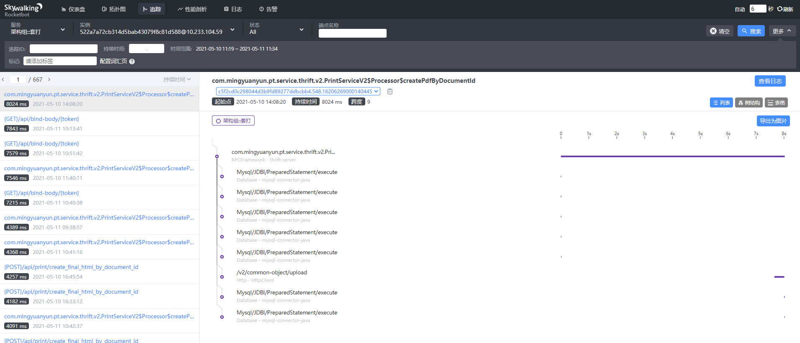
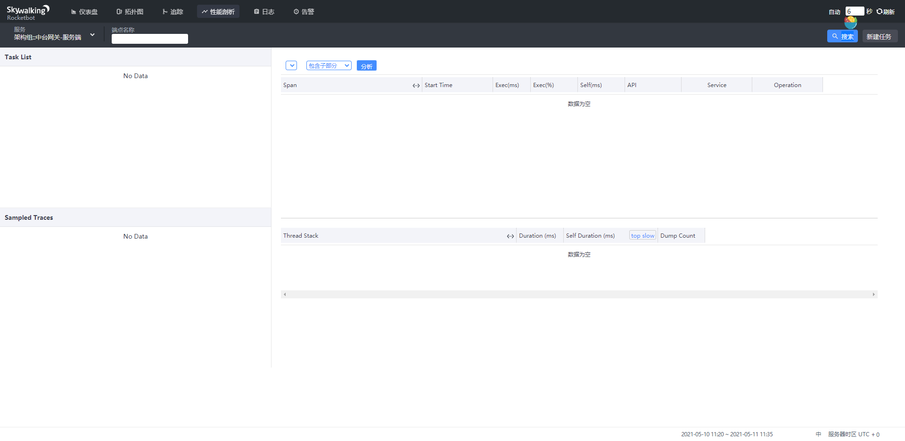
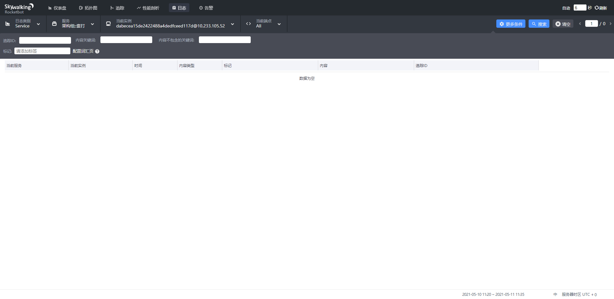
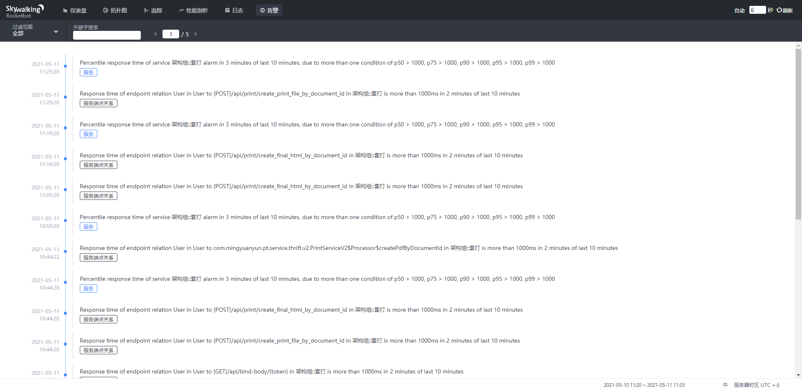
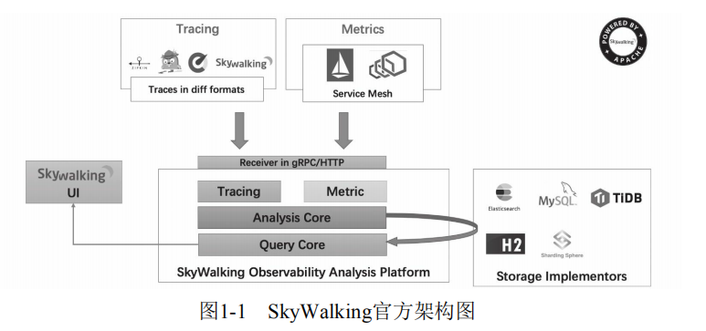
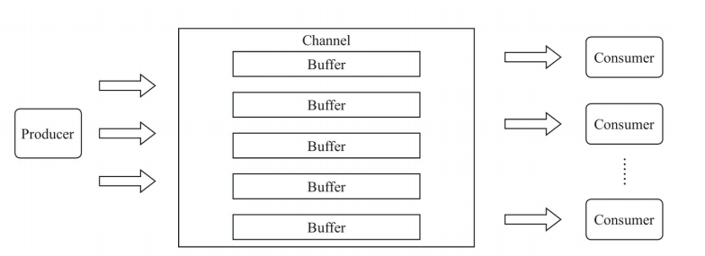
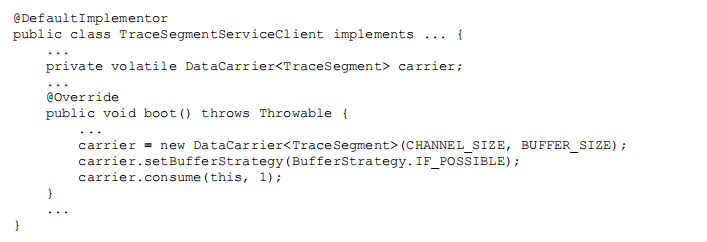
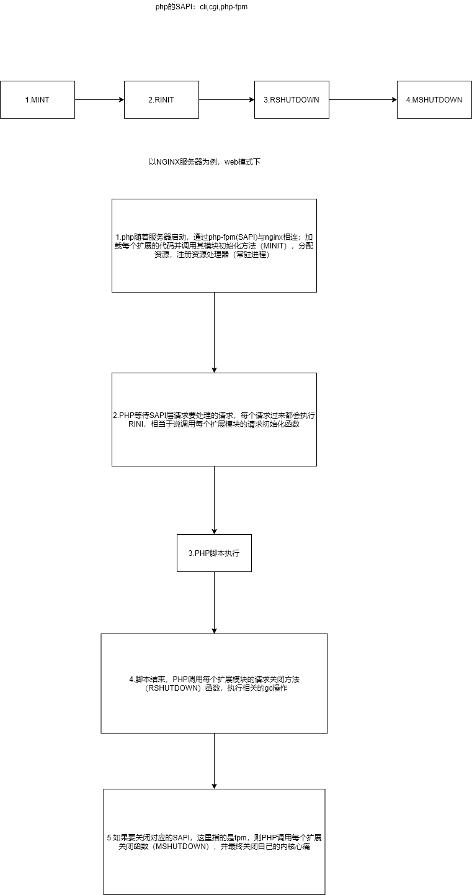

# Skywalking 链路追踪与 APM

> 本文覆盖 SkyWalking 的痛点与案例、UI 面板、整体架构与核心名词、多语言探针实现原理，以及 Java / Go 两种接入方式与选型对比。
>
> 内容整理自个人学习笔记。同目录另有 [Jaeger.md](Jaeger.md)，两者的分工对比见该文件。

## 引言

第一部分会讲解和分析分布式应用遇到的常见问题以及云空间业务痛点，紧接着通过几个实际案例演示 **SkyWalking** 在解决问题中的应用。

第二部分会讲解 **SkyWalking** 的 UI 部分，分别介绍 **Dashboard、拓扑图、Trace、性能、日志、告警** 等面板。

第三部分整体介绍 **SkyWalking** 的架构、核心名词和流程。

第四部分会讲解主体流程中最核心的部分——数据上报部分的探针原理实现。包括 Java 探针、PHP、Node.js、前端等多语言探针。

希望通过本次学习，能对大家快速掌握 SkyWalking 有所帮助或者启发。

## 一、业务痛点及案例讲解

### 1.1 业务痛点

1. 25% 的 BUG 并不知道原因。
2. 出现跨组的问题的时候，需要技术比较资深的工程师解决。比如 PHP 传递一个长度很长的头，Nginx 截取了，后端无法收到请求，PHP、Java、运维三方相互推诿。
3. 业务里面的日志必须业务组打印，但是调用链路，特别是跨组的时候，需要记录链路。
4. 慢 SQL 的问题，无法进行慢 SQL 针对分组推送，只能针对整个 DB 或者服务实例。

### 1.2 分布式或微服务常见问题

1. 一次调用到底穿越了几个服务？
2. 在处理这次请求的时候，每个服务到底做了什么操作？
3. 如果请求变慢了，瓶颈在哪里？
4. 如果请求失败了，到底是哪个服务或服务中的哪个部分出了问题？
5. 异常请求与正常请求的区别是什么？
6. 一次请求中，有些经常调用的服务为什么不调用了？或者，有些不常见的服务为什么被调用了？
7. 调用的关键路径是什么？

### 1.3 案例讲解

1. **正常的请求**：一条完整链路从入口服务一直串到 DB / 下游 RPC，用来确认「服务间是否连通、上下文是否传递成功」。
2. **服务不可用的情况**：拓扑图节点变红 + 告警面板出现响应时间/成功率类告警，Trace 里能直接看到失败的那个 span。
3. **慢 SQL 的情况**：Trace 中 `MySql/DBI/PreparedStatement/execute`、`MySQL/JDBC` 这类 span 的耗时一眼可见，配合性能剖析定位到具体语句。
4. **日志的情况**：日志面板按 Trace ID 反查，把「业务日志」和「调用链路」关联到同一次请求上。
5. **告警的情况**：告警面板列出触发记录（哪个服务/哪个端点、触发了哪条规则、什么时候），可直接跳转到对应的服务或端点。

## 二、UI 面板的内容介绍

### 2.1 Dashboard

Dashboard 是「先看整体，再决定往哪钻」的第一落点，顶部可切时间范围（含时区）、自动刷新开关，正文分 **Service / Instance / Endpoint** 三个 Tab。以 `Service` 维度为例，主要看六块内容：

- **Services Load (CPM, calls per minute)**：服务每分钟调用量，判断流量分布与突增突降。
- **Slow Services (ms)**：慢服务排行，优先点名「谁拖慢了整条链路」。
- **Un-Health Services (Apdex)**：Apdex 不健康的服务。Apdex 综合了成功/失败与响应时间，数值越低越差（0.3045、0.5103 属于明显不健康）。
- **Slow Endpoints (ms)**：慢端点排行，形如 `服务 : 端点`，比慢服务更精确，能直接指到某个 URL/接口。
- **Global Response Latency Percentiles**：全局响应延迟分位数曲线，图例为 **P50 / P75 / P90 / P95 / P99**。**P99 是判断「长尾是否恶化」最常用的指标**——平均值会被大量快请求拉平，P99 才能暴露少数用户正在忍受的慢。
- **Global Heatmap**：热力图，纵轴为响应时间区间、颜色深浅代表请求密度，用来发现「偶发但集中」的慢请求带。

`Instance` 维度看多实例是否均衡（某台机器异常会先体现为它那一列延迟偏高）；`Endpoint` 维度看单接口的延迟与成功率。**典型用法：Service 榜找慢服务 → Slow Endpoints 锁定接口 → 去 Trace 捞该接口的慢请求看 span 瀑布。**（适用场景：已用 SkyWalking 作为统一 APM、希望与 Java/Go 链路一致时优先选 Go 原生探针；已统一 OTel/自建 collector 时走 OTLP 路线。）



### 2.2 拓扑图

拓扑图把「服务 + 中间件」画成有向图：节点是服务/实例/数据库/消息队列，边是调用关系，是排查跨组问题最直观的图。

**节点的颜色与告警含义**（结合告警规则理解）：

- **绿色（正常）**：所选时间窗内没有触发的告警，各项指标在阈值内。
- **红色（告警/异常）**：该服务触发了告警（如响应时间 P99 超阈值、成功率下降），或被标记为 unhealthy；边变红通常表示**调用方到被调方这条链路**上出现了告警。
- **灰色/无色（未知）**：该时间窗内没有数据上报（服务没被访问、探针未接入、或刚重启尚未注册）。

使用方式：用左上角 **Service Group / 服务名** 下拉框限定范围；悬停节点显示该服务的简化指标（CPM、成功率、延迟），点击进入服务详情，再点端点进入 Trace（节点大小通常与 CPM 正相关）。拓扑图的边是从 Trace 数据里「推」出来的——**只有服务间的调用被探针采集到、且上下文（sw8 头）正确传递时，边才会出现**。所以「该有的边没出现」往往意味着上下文没透传（如经过 Nginx/网关时 header 被裁剪，正是 1.1 里的典型扯皮场景）。


### 2.3 Trace

Trace 面板回答「这一次请求到底发生了什么」，界面分三栏：

- **左侧端点列表**：按耗时排序（如 8024 ms、7643 ms、7615 ms…），每行是「端点 + 耗时 + 时间」，用于快速找到最慢的请求；顶部可按 Trace ID、端点关键字、时间范围过滤。
- **右上 Span 树（调用树）**：把一次请求拆成树形结构，缩进表示父子关系：

  ```text
  com.mingyuanyun.pt.service.thrift.v2.PrintServiceV2$Processor$CreatePdfByDocumentId  ← 入口 Entry span
   ├─ MySql/DBI/PreparedStatement/execute      ← Exit span（DB），共 2 次
   ├─ /v2/common/object/upload                 ← Exit span（HTTP 下游）
   └─ MySql/DBI/PreparedStatement/execute
  ```

  span 类型含义：**Entry** 是本服务被调用的入口（HTTP/RPC 服务端）、**Exit** 是本服务调出去的依赖（DB、Redis、下游 HTTP）、**Local** 是服务内部的方法级埋点。

- **右下耗时瀑布图**：横轴为时间，每个 span 是一根条，条长即耗时。看瀑布图有两个目的：**找最长的条（瓶颈）**，以及**找「自己很慢」的条**——SkyWalking 区分 **Duration**（总耗时，含子调用）与 **Self Duration**（自身耗时），self 时间大的 span 才是真的在干活（或真的卡住了），而不是在等下游。

其他常用操作：点击 span 展开 tags（HTTP 状态码、SQL 语句、peer 地址等）；「查看日志」按 Trace ID 跳到日志面板；「保存为图片」用于贴到工单/群里。



### 2.4 性能

「性能」面板对应的是 **性能剖析（Profile）**，与 Dashboard 的性能指标不同：Dashboard 看的是 P99、慢端点这类**结果指标**，Profile 是**对运行中的代码做采样，直接抓出慢在哪一行、哪个线程栈**。

- **左侧 Task List（任务列表）**：在 UI 顶部「新建任务」创建剖析任务，参数一般是「服务 + 端点 + 持续时间 + 采样周期」。任务执行期间才会产生数据，图中 `No Data` 表示当前时间窗没有任务在跑。
- **右侧结果区**有三张表：
  - **Span 表**：`Span / Start Time / Exec(ms) / Exec(%) / Self(ms) / API / Service / Operation`。`Exec(%)` 是该方法占整个请求耗时的比例，从高到低排下来就是「时间都花在哪了」。
  - **Sampled Traces**：被采样的具体请求列表。
  - **Thread Stack**：`Thread Stack / Duration(ms) / Self Duration(ms) / Dump Count`，把采样期间抓到的线程栈聚合起来。**同一个栈被反复 dump 到（Dump Count 高、Duration 接近采样时长）说明请求长时间卡在这个调用栈上**，这是定位代码级瓶颈最有力的证据。

典型用法：Dashboard 发现某端点 P99 高 → 针对该端点发起 Profile 任务 → 在 Span 表里找 `Exec(%)` / `Self(ms)` 最大的方法 → 在 Thread Stack 里看它卡在哪个下游或哪段逻辑。注意 Profile 有额外开销（要 dump 线程栈），只对目标端点短时间开启。



### 2.5 日志

日志面板解决「日志在业务组手里、链路在 APM 里，两边对不上」的问题，做法是把日志**按 Trace 上下文上报到同一套存储**（Java 侧由 log4j/logback 的 toolkit 上报，PHP 侧见 [PHP-FPM对接步骤.md](../php/PHP-FPM对接步骤.md) 的 `skywalking_logging_report`）。

查询条件：**Service / 实例** 限定服务与实例；**Trace ID** 是最常用的入口（先从 Trace 面板拿到 traceId，粘贴回日志面板，直接捞出这一次请求的所有日志）；**内容关键词 / 内容不包含关键词** 做正反向过滤；**标签** 按上报时打的 tag 过滤（日志级别、业务标记等）。结果表字段为 `当前服务 / 当前实例 / 时间 / 内容类型 / 标记 / 内容 / 追溯 ID`，**追溯 ID 即 Trace ID**，点进去可回到对应链路。标准排查姿势：**Trace 找慢/失败的 span → 用 traceId 查日志 → 看业务日志里当时在做什么**。



### 2.6 告警

告警面板按时间倒序列出**已触发的告警记录**，顶部可按「过滤范围（全部 / 服务 / 实例 / 端点）」和关键词过滤。每条记录包含：

- **触发时间**：如 `2021-05-11 11:27:20`。同一规则持续不恢复会不断产生新记录。
- **告警内容**：SkyWalking 的告警文本是模板化生成的，读法固定：
  - `Percentile response time of service 架构组-壹灯 alarm in 3 minutes of last 10 minutes, due to more than one condition of p50 > 1000, p75 > 1000, p80 > 1000, p95 > 1000, p99 > 1000`
    → **服务级延迟告警**：在「最近 10 分钟」的滑动窗口里，按 `3 分钟` 粒度聚合，P50/P75/P80/P95/P99 中**任意一个**超过 1000 ms 就告警（阈值是「或」的关系，不是「且」）。
  - `Response time of endpoint relation User in User to (POST)/api/print/create_final_html_by_document_id in 架构组-壹灯 is more than 1000ms in 2 minutes of last 10 minutes`
    → **端点间关系告警**：`User to (POST)/api/...` 表示调用方 `User` 到该端点这条**关系边**的响应时间超阈值，标题里的 `(POST)/api/print/...` 就是具体端点。
  - `Response time of service relation / endpoint relation ...` 分别为服务间关系、端点间关系告警，粒度为「调用方 → 被调方」这条边。**操作按钮**：「订阅」把该告警订阅到邮箱/webhook（需在 OAP 的 `alarm-settings.yml` 中配置 `webhooks`），也可以直接点服务名跳到对应服务。

告警规则与阈值不在 UI 上改，而在服务端 `config/alarm-settings.yml`（`rules` 定义指标与阈值、`webhooks` 定义通知出口、`silence` 定义静默），UI 只负责展示与订阅。排查用法：**告警面板确定「什么时候开始坏的」→ 拓扑图看哪个节点变红 → Trace 看第一次报错/变慢的 span。**



## 三、整体的架构

### 3.1 整体介绍

#### Skywalking 介绍

[Skywalking](https://skywalking.apache.org/) 是一个针对分布式系统的应用性能监控（Application Performance Monitor，**APM**）和可观测性分析平台（Observability Analysis Platform，**OAP**）。它提供了多维度应用性能分析手段，从分布式拓扑图到应用性能指标、Trace、日志的关联分析与告警。

参考官方文档地址：[Skywalking 文档](https://skywalking.apache.org/docs/main/v8.4.0/en/setup/backend/backend-fetcher/)

#### 总结性描述

- **Skywalking** 是针对分布式、微服务的，包括容器化场景；**不是一个以大数据为基础的 APM 系统**，说明比较轻量。
- **SkyWalking** 不是方法诊断系统；能够追踪方法参数，但是需要注意性能。

### 3.2 整体架构

#### 架构认识

官方的架构如下图所示：



自上而下、自左而右读图：

1. **数据来源**分两类：`Tracing`（各语言探针，traces in diff formats）与 `Metrics`（Service Mesh 等指标），统一上报给 **Receiver in gRPC/HTTP**。
2. **OAP 内核**分三层：`Tracing / Metric` 是两类数据各自的解析与流式处理模块；`Analysis Core` 做聚合、拓扑构建、告警判断；`Query Core` 对外提供统一查询接口。
3. **Storage Implementors**：存储实现，支持 Elasticsearch、MySQL、TiDB、H2、ShardingSphere 等，可插拔；**Skywalking UI** 通过标准 GraphQL 协议向 Query Core 查询并展现。

简化后的架构图如下图所示（数据流向即：探针 → Receiver → 分析内核 → 存储 → UI）。**一句话记忆：探针负责采集，OAP 负责接收与分析，Storage 负责持久化，UI 负责查询展示。**

### 3.3 核心名词解释

- **Agent**：语言探针，主要是 SkyWalking 系统中的数据发送端，通过简单的部署和配置，用户就可以做到无代码侵入式地获取到业务调用链路数据。
- **OAP**（**observability analysis platform**）：它是一个高度组件化的轻量级分析程序，由兼容各种探针的 Receiver、流式分析内核和查询内核三部分构成。
- **Storage**：存储实现，SkyWalking 的 OAP Server 支持多种存储实现，并且提供了标准接口，可以实现其他存储。
- **UI**：通过标准的 GraphQL 协议进行统计数据查询和展现。

## 四、探针实现原理

### 4.1 Java 体系

#### 4.1.1 探针和 javaAgent

**a. 什么是 javaAgent**

javaAgent 是 JVM 提供的一种「JVM 级别插件」机制。JDK 1.5 引入了 `java.lang.instrument` 包，允许外部程序在**类加载时拿到 `Instrumentation` 实例并修改字节码**。两种挂载形态：

- **启动挂载**：`java -javaagent:/path/skywalking-agent.jar -jar app.jar`，JVM 在 `main` 方法执行**之前**调用 agent 的 `premain`。
- **动态挂载（attach）**：通过 Attach API 在运行期把 agent 挂到已启动的 JVM 上，调用 agent 的 `agentmain`。

对业务的价值就是**无侵入**：不改一行业务代码，只改启动参数。SkyWalking Java 探针正是靠它实现的。

**b. javaAgent 的实现过程**

1. **打包成合规的 agent jar**。核心是 `META-INF/MANIFEST.MF`，必须声明入口类和能力：

   ```text
   Premain-Class: org.apache.skywalking.apm.agent.SkyWalkingAgent
   Agent-Class: org.apache.skywalking.apm.agent.SkyWalkingAgent
   Can-Redefine-Classes: true
   Can-Retransform-Classes: true
   ```

   `Premain-Class` 对应 `-javaagent` 启动挂载，`Agent-Class` 对应 attach 动态挂载；两个 `Can-*` 声明允许对已加载的类做重定义/重转换。

2. **premain 被调用**，签名固定：

   ```java
   public static void premain(String agentArgs, Instrumentation inst)
   // 或 public static void premain(String agentArgs)  // 拿不到 inst 时退化
   ```

   `agentArgs` 就是 `-javaagent:xxx.jar=key=value` 里等号后面的内容；`inst` 是改写字节码的唯一入口。

3. **初始化 agent**（SkyWalking 的流程）：解析 `agentArgs` 并读取 `agent.config`；初始化日志（`logging.dir`、`logging.level`）；`PluginBootstrap` 扫描 `plugins/`、`bootstrap-plugins/` 下所有 jar，解析其中的 `skywalking-plugin.def`，构建 `PluginFinder`（插件定义 + 拦截器 + witness 类）；建立到 OAP 的 gRPC 通道（`collector.backend_service`），注册服务与实例、拉取动态配置与性能剖析任务；最后调用 `Instrumentation.addTransformer(...)` 注册字节码转换器。

4. **字节码增强（ByteBuddy）**。底层使用 **ByteBuddy**（SkyWalking 自带的定制版 `net.bytebuddy`）：transformer 里通过 `AgentBuilder` 匹配目标类，在目标方法的前、后、异常分支织入回调——匹配规则由插件定义（类名通配、继承关系、注解、方法签名）；织入点是 `beforeMethod` / `afterMethod` / `handleMethodException`；回调实现分两种拦截器：`InstanceMethodsAroundInterceptor`（实例方法，能拿到 `this`）与 `StaticMethodsAroundInterceptor`（静态方法）。拦截器内部通过 `ContextManager` 创建 **Entry / Exit / Local** span 写入当前线程的 `TraceSegment`，并在 Exit 时把上下文注入下游请求头（sw8）。

5. **运行期**：类加载 → transformer 匹配 → 织入 → 拦截器采集 span → span 写入轻量级队列内核 → 消费者批量上报 OAP。为不影响启动性能，已加载的核心类通过 `retransformClasses` 补增强。**跨线程与异步**场景注意：上下文默认跟线程走，线程池/异步需要 `ContextManager` 快照机制或 `@TraceCrossThread` 注解，否则会出现「子线程丢失 traceId」——这是接入后最常见的问题之一。

#### 4.1.2 轻量级队列内核

**a. 什么是轻量级队列内核**

轻量级队列内核是基于无锁环状队列的生产者——消费者内存消息队列，主要作用是在生产者和消费者之间创建一个缓冲的异步内存队列，**防止因 SkyWalking 收集数据方生产数据的速度远大于往后端发送数据的速度造成数据积压和生产方阻塞。**

组成元素有：

- **Buffer**：Buffer 是 SkyWalking 队列内核中数据的载体，队列之中的数据都存储在 Buffer 中。
- **Channel**：Channel 是管理 Buffer 的载体。
- **DataCarrier**：DataCarrier 是轻量级队列内核的门户，队列内核通过 DataCarrier 与 SkyWalking 的其他模块进行交互与合作。



结构上：一个 `DataCarrier` 对应一个 `Channel`，一个 `Channel` 持有 N 个 `Buffer`，每个 `Buffer` 有独立的消费者线程，形成「多生产者 → 多个环形队列 → 多消费者」的并行结构，从而在并发写入时避免单一队列的竞争。

**b. 上报的数据结构**

队列里流动的「数据」是探针生成的数据结构体，最核心的是 trace 场景的 `TraceSegment`：

```text
TraceSegment                        // 一次请求在「一个服务实例内」的采集单元
 ├─ traceId / segmentId             // 全局链路 ID / 本次 segment 的 ID
 ├─ serviceId / serviceInstanceId     // 服务与实例标识（来自探针配置）
 ├─ refs[]                           // 上游引用：跨进程/跨线程把链路接起来的依据
 └─ spans[]
      ├─ spanId / parentSpanId       // 树形关系的来源
      ├─ spanType: Entry|Exit|Local  // 入口 / 出口 / 本地
      ├─ operationName / peer        // 操作名（HTTP 路径、SQL 等），peer 为对端地址
      ├─ componentId                 // 组件标识（对应 OAP 的 component-libraries.yml）
      ├─ startTime / endTime         // 耗时瀑布图的原始数据
      └─ tags[] / logs[] / events[]  // 标签、日志、事件（异常信息等）
```

指标（meter）与日志（logging）也各走独立的 DataCarrier，互不阻塞。队列本身的数据结构要点：

- **Buffer** = 定长数组（`Object[]`）+ 环形游标。写入时游标原子自增，按数组长度**取模**定位槽位（长度为 2 的幂时可用位运算），因此**入队不需要加锁**。
- **Channel** 持有多个 Buffer，按写入线程（或分区）把数据分散到不同 Buffer，降低写竞争。
- **采样发生在入队之前**：Java 侧先按 `agent.sample_n_per_3_secs` 采样，未命中的直接丢弃，不占用队列。

**c. 如何上报数据**

消息产生主要有 **DataCarrier 的初始化** 和 **API 向队列生产消息** 两部分。消息的源码实现如下图所示：



1）**DataCarrier 的初始化**（对应上图源码）：

```java
carrier = new DataCarrier<TraceSegment>(CHANNEL_SIZE, BUFFER_SIZE);
carrier.setBufferStrategy(BufferStrategy.IF_POSSIBLE);
carrier.consume(this, 1);
```

- 设置 **DataCarrier** 的 **Channel** 中 **Buffer** 队列的数量（`CHANNEL_SIZE`）和每一个 Buffer 队列的长度（`BUFFER_SIZE`）；
- 将 **BufferStrategy** 策略设置为 **IF_POSSIBLE**；
- 设置当前 **DataCarrier** 的消费者（`consume`，第二个参数是消费者线程数）。

2）**通过 API 向队列中生产消息**：调用 `carrier.produce(segment)`，数据写入当前线程归属的 Buffer，返回值可直接反映本次写入是否成功——在 `IF_POSSIBLE` 策略下队列满时返回 `false` 并丢弃，业务线程**不会**被阻塞。这也是 SkyWalking「宁可丢数据，也不拖慢业务」的设计取向。

**d. 如何消费数据**

- `DataCarrier.consume(IConsumer consumer, int num)` 把 Carrier 注册给消费者，`num` 是消费线程数。SkyWalking 里 trace 上报通常只用 1 个消费线程，日志、指标各自独立配置，避免互相拖累。
- 内部由 `IDriver`（`ConsumeDriver`）+ `ConsumerThread` 组织：每个 Buffer 绑一个消费线程，线程内是一个循环——① 读取 Buffer 当前的可读 `index`；② 与上次消费位置比较，**没有新数据就短暂等待/让出 CPU**（只做轻量自旋等待，绝不反过来阻塞生产者）；③ 有新数据就按批取出组成 `List<T>`，回调 `IConsumer.consume(List<T>)`；④ 更新消费位置，继续下一轮。
- SkyWalking 里 `IConsumer` 的实现做的是：把这一批 `TraceSegment` 打包成 gRPC 请求，通过 `TraceSegmentReportServiceClient` **批量发送**给 OAP，OAP 收到后由 Analysis Core 处理并写入 Storage。之所以要「批量 + 异步 + 有界队列」，就是把「产生数据」和「发送数据」彻底解耦：OAP 抖动或网络变慢时只影响队列水位，不影响业务线程；代价是队列写满后按策略丢数据。

**e. 消息存储策略**

数据存储有下面三种策略：

- **BLOCKING**：循环阻塞等待当前 Buffer 队列中对应的 index 空间为空（默认策略）。在循环阻塞之中会回调 Buffer 的回调方法，用户可以通过设置回调方法来感知到是否有数据被 BLOCKING。
- **OVERRIDE**：用新数据覆盖旧数据。
- **IF_POSSIBLE**：从当前 **index** 起往后找 n 位，如果有空余，保存下来；如果没有，丢弃掉。

**n** 是由 **IDataPartitioner** `dataPartitioner` 接口的 **maxRetryCount** 来决定的，默认为 3。对比一下就知道选型取向：`BLOCKING` 保证不丢数据但会阻塞业务线程（默认值只适合低吞吐场景），`IF_POSSIBLE` 宁可丢数据也不阻塞，`OVERRIDE` 适合「只关心最新值」的指标类数据。

#### 4.1.3 Dubbo 插件的生命周期实现流程

Dubbo 插件的生命周期可拆成四个阶段，理解它就能理解所有 Java 插件：

1. **插件发现（JVM 启动期）**：agent 扫描 `plugins/` 与 `bootstrap-plugins/` 下的 jar，解析各自的 `skywalking-plugin.def`，构建 `PluginFinder`。插件除了「要增强哪些类」，还会声明 **witness 类**（Dubbo 插件的 witness 类是 Dubbo 自身的核心类，如 `org.apache.dubbo.rpc.Invoker`）：**只有宿主应用真的加载了这些类，插件才被认为生效**，避免增强一个根本没用的框架、平白增加启动开销。
2. **类增强（类加载期）**：Dubbo 的协议类/调用入口类被加载时 `PluginFinder` 匹配命中，ByteBuddy 在目标方法前后织入拦截器。拦截点分两侧——**Consumer 侧**（发起调用的一方）与 **Provider 侧**（被调用的一方）。
3. **运行期拦截**：Consumer 发起调用前创建 **Exit span**，并通过 Dubbo 的隐式参数（attachment）把上下文以 `sw8` 头的形式带出去；Provider 收到请求后读取 attachment 创建 **Entry span**，从而用同一个 `traceId` 把「服务 A → 服务 B」两个 segment 串起来，拓扑图的边也是这样产生的；调用抛异常时走 `handleMethodException`，把 span 标记为 error 并记录异常堆栈。
4. **停止与 flush（JVM 退出期）**：agent 启动时注册了 ShutdownHook，JVM 退出时触发 AgentService 停止——先停消费者线程并 **flush 队列中还未发送的数据**，再关闭 gRPC 通道。**这也意味着 `kill -9` 会导致最后一批链路数据丢失**，优雅停机对可观测性同样重要（PHP 侧的相关讨论见 [PHP-FPM对接步骤.md](../php/PHP-FPM对接步骤.md)）。

### 4.2 PHP 体系

#### 探针加载生命周期

PHP 探针不是 JVM 那种 agent，而是以 **PHP 扩展（.so）** 形式存在，因此它的生命周期就是 **PHP 的 SAPI 生命周期**（cli/cgi/php-fpm 都一样，只是各阶段被触发的次数不同）：**MINIT → RINIT → 脚本执行 → RSHUTDOWN → MSHUTDOWN**。



以 Nginx 服务器为例，web 模式下：

1. **MINIT（模块初始化）**：PHP 随服务器启动，通过 php-fpm（SAPI）与 Nginx 相连；加载每个扩展的代码并调用其模块初始化方法（MINIT），分配资源、注册资源处理器（**常驻进程**，只执行一次）。
2. **RINIT（请求初始化）**：PHP 等待 SAPI 请求要处理的请求，每个请求都会执行 RINIT，相当于重新调用每个扩展的模块请求初始化函数（每个请求执行一次）。
3. **PHP 脚本执行**：业务代码运行，扩展在此阶段采集 span 与日志，写入由 shm 共享内存实现的消息队列（对接细节见 [PHP-FPM对接步骤.md](../php/PHP-FPM对接步骤.md)）。
4. **RSHUTDOWN（请求关闭）**：脚本结束，PHP 调用每个扩展的模块请求关闭方法（RSHUTDOWN），执行相关的 gc 操作，并把本次请求的链路数据交给上报逻辑。
5. **MSHUTDOWN（模块关闭）**：如果要关闭对应的 SAPI（这里是 fpm），PHP 调用每个扩展关闭函数（MSHUTDOWN），并最终关闭自己的内存核心。

与 Java 的差异要点：PHP 扩展只能在扩展能 hook 到的层面工作（内置函数、curl/PDO/redis 等扩展，以及配合 SDK 对框架层做适配），**无法像 javaagent 那样全量字节码增强**；且 php-fpm 是多进程模型，多 worker 之间靠共享内存通信，因此 `/dev/shm` 的容量与挂载方式必须一起考虑（见 [PHP-FPM对接步骤.md](../php/PHP-FPM对接步骤.md) 的「按需调整 /dev/shm 共享内存」一节）。

### 4.3 Node.js

#### 探针加载生命周期

1. **加载（越早越好）**：要求探针在业务代码之前加载——`node --require skywalking-node app.js`，或在入口文件第一行 `require('skywalking-node')`。**时机错过就无法劫持**：框架模块若已被 require 过，后续再挂探针就抓不到这个模块了。
2. **劫持（monkey patch）**：基于 Node 的模块加载机制打补丁（对 `Module._load` / `require` 做 hook），在 http/https、express/koa、mysql/pg/redis 等模块被加载时把原始实现包一层。
3. **上下文传播**：用 Async Hooks（旧）或 AsyncLocalStorage（新）维护异步调用上下文，让 `async/await`、回调、定时器里都能拿到当前 trace 上下文。
4. **上报与停止**：请求结束时把 segment 批量上报 collector（v8 之后走 gRPC，早期版本是 HTTP）；进程退出前 flush 未发送的队列，与 Java 的 ShutdownHook 语义一致。

### 4.4 Web Client

#### 探针加载生命周期

前端探针（`skywalking-client-js`）的目标是把**用户体验数据**与**后端链路**接起来：

1. **加载**：在页面 `head` 中尽量早地引入脚本，或在 npm 项目中初始化；页面初始化时执行。
2. **注册**：初始化阶段注册各类拦截与监听——fetch/XHR 拦截、全局错误捕获（`window.onerror`、`unhandledrejection`、资源加载错误）、SPA 路由监听。
3. **采集**：借助浏览器 Performance API 采集页面性能（白屏/FCP/LCP 等）、慢资源、慢 API，以及 PV/UV。
4. **传播**：把当前 trace 上下文写入请求头（`sw8` 或 W3C `traceparent`），使前端发出的请求在后端能续上同一条链路；后端返回的上下文再回写到前端轨迹，从而在链路上同时看到「前端 → 网关 → 后端」。
5. **上报**：按批次/定时上报到 collector（浏览器侧常用 beacon 接口，避免阻塞页面卸载）。

## 五、使用方法

### 5.1 Java 接入：javaagent 无侵入埋点

#### 5.1.1 最简接入

```bash
# 1. 下载并解压 agent（以 8.x 为例），目录结构：
#    /opt/skywalking-agent/{skywalking-agent.jar,config/,plugins/,optional-plugins/,bootstrap-plugins/}
tar -zxvf apache-skywalking-java-agent-8.x.x.tgz -C /opt/
# 2. 只需在启动命令上加一个 -javaagent，业务代码零改动
java -javaagent:/opt/skywalking-agent/skywalking-agent.jar \
     -Dskywalking.agent.service_name=order-service \
     -Dskywalking.collector.backend_service=oap.example.com:11800 \
     -jar order-service.jar
```

#### 5.1.2 关键配置项

配置有三种写法，**优先级：启动参数 `-Dxxx` > 环境变量 > `config/agent.config` 默认值**。

| 配置项 | 环境变量 | 说明 |
| --- | --- | --- |
| `agent.service_name` | `SW_AGENT_NAME` | 服务名，UI 上显示的名字，也是拓扑图节点名。默认 `Your_ApplicationName` |
| `collector.backend_service` | `SW_AGENT_COLLECTOR_BACKEND_SERVICES` | OAP 的 gRPC 地址（默认端口 11800），多个用逗号分隔，默认 `127.0.0.1:11800` |
| `agent.sample_n_per_3_secs` | `SW_AGENT_SAMPLE` | 采样率。`-1` 表示全采样（默认）；正数表示「每 3 秒最多采样多少条 trace」 |
| `logging.level` | `SW_LOGGING_LEVEL` | agent 自身日志级别（`DEBUG/INFO/WARN/ERROR`），默认 `INFO`，排查探针问题才开 `DEBUG` |
| `agent.ignore_suffix` | `SW_AGENT_IGNORE_SUFFIX` | 忽略的静态资源后缀，避免 `.js/.css/.png` 请求产生大量无意义链路 |
| `plugin.exclude_plugins` | `SW_AGENT_EXCLUDE_PLUGINS` | 排除指定插件（如 `tomcat-7.x`），用于规避兼容问题 |

推荐做法：**`agent.config` 保持原样不动，全部用环境变量覆盖**，这样同一个 agent 包可在不同环境复用。

#### 5.1.3 插件目录机制

| 目录 | 作用 | 是否默认加载 |
| --- | --- | --- |
| `plugins/` | 常规插件（Tomcat、Spring MVC、Dubbo、MySQL、HttpClient 等） | 是，JVM 启动时全部扫描 |
| `optional-plugins/` | 可选项插件（如 `apm-spring-annotation-plugin`、`apm-cloud-gateway`、日志上报插件、`apm-trace-ignore-plugin`） | 否，需手动拷到 `plugins/` |
| `bootstrap-plugins/` | 需要增强 JDK/JVM 自身类（线程池、`java.net`、日志框架）的插件，必须在 agent core 之前生效 | 是，先于 `plugins/` 加载 |

使用要点：**装插件只需要拷贝 jar，不重新编译业务代码**；反过来想关掉某个插件，直接不放/删掉对应 jar，或用 `plugin.exclude_plugins` 排除。插件支持的框架版本范围在 `skywalking-plugin.def` 里声明，选型时以官方 Support-Version-Matrix 为准。

#### 5.1.4 Spring Boot 启动参数示例

```bash
# 方式一：直接启动 jar
java -javaagent:/opt/skywalking-agent/skywalking-agent.jar \
     -Dskywalking.agent.service_name=order-service \
     -Dskywalking.collector.backend_service=oap.observability:11800 \
     -Dskywalking.logging.level=INFO \
     -jar order-service.jar --spring.profiles.active=prod

# 方式二：Maven 本地调试；IDEA 则把同样内容填到运行配置的 VM options
mvn spring-boot:run -Dspring-boot.run.jvmArguments="-javaagent:/opt/skywalking-agent/skywalking-agent.jar -Dskywalking.agent.service_name=order-service"
```

Spring Boot 无需任何额外配置：Tomcat、Spring MVC、RestTemplate/WebClient、MyBatis/JDBC、Redis、Kafka 等都有现成插件。

#### 5.1.5 Dockerfile 里加 agent

官方提供了带 agent 的镜像，最省事的方式是直接 `--from` 拷贝，避免把 tgz 塞进镜像仓库：

```dockerfile
FROM eclipse-temurin:17-jre
# 1. 从官方 agent 镜像里拷出 agent（tag 按官方发布选择）
COPY --from=apache/skywalking-java-agent:8.16.0-java17 /skywalking/agent /skywalking/agent
# 2. 用环境变量注入配置，不改 agent.config
ENV SW_AGENT_NAME=order-service \
    SW_AGENT_COLLECTOR_BACKEND_SERVICES=oap.observability:11800 \
    SW_AGENT_SAMPLE=1000 \
    SW_LOGGING_LEVEL=INFO

WORKDIR /app
COPY target/order-service.jar /app/order-service.jar

# 3. 启动时挂载 agent
ENTRYPOINT ["sh", "-c", "java -javaagent:/skywalking/agent/skywalking-agent.jar -jar /app/order-service.jar"]
```

K8s 里则把上面这些 `SW_AGENT_*` 交给 Deployment 的 `env`（同一个镜像可跨环境复用），并给 agent 预留额外内存（`resources.limits.memory`）。

### 5.2 Go 接入路线一：Apache SkyWalking Go Agent（编译期注入）

Go 没有 JVM 的 classloader，所有「运行时无侵入」的方案都不成立（eBPF 也做不到全量覆盖），因此 skywalking-go 选择的是**编译期注入**：在 `go build` 过程中插入 AST/代码埋点，产物是「已经埋好点的二进制」，运行期不再做任何指令改写。

#### 5.2.1 安装 agent

```bash
# 从官网下载 Go Agent 发布包（https://skywalking.apache.org/downloads/#GoAgent）
tar -zxvf skywalking-go-<version>-linux-amd64.tar.gz -C /opt/
export PATH=$PATH:/opt/skywalking-go/bin   # 目录内含 skywalking-go-agent
```

#### 5.2.2 编译期注入

```bash
# 方式 A：用注入器改写依赖（推荐，会自动改 go.mod 并植入初始化代码）
/opt/skywalking-go/bin/skywalking-go-agent -inject /path/to/your/project        # 只注入主模块
/opt/skywalking-go/bin/skywalking-go-agent -inject /path/to/your/project -all   # 连子模块一起注入

# 方式 B：手工加依赖（不想让工具改代码时）：go get github.com/apache/skywalking-go
# 并在 main 包里空白导入触发 agent 初始化：# import _ "github.com/apache/skywalking-go"

# 关键：给 go build 加上 -toolexec（以及 -a 强制全量重编译）；需要自定义配置时把配置路径交给它
go build -toolexec="/opt/skywalking-go/bin/skywalking-go-agent" -a -o bin/order-service ./cmd/server
go build -toolexec="/opt/skywalking-go/bin/skywalking-go-agent -config agent.yaml" -a -o bin/order-service ./cmd/server
```

要点：`-toolexec` 把编译过程中的每个工具调用「劫持」一遍，agent 借此分析 AST 并注入埋点代码；配置是**编译期写入产物**的，所以 `-config` 只在编译时生效。集成到 Makefile 后与普通构建无异：

```makefile
GO_AGENT ?= /opt/skywalking-go/bin/skywalking-go-agent
CONFIG   ?= agent.yaml

build:
	CGO_ENABLED=0 GOOS=linux go build \
		-toolexec="$(GO_AGENT) -config $(CONFIG)" -a \
		-ldflags "-s -w" -o bin/order-service ./cmd/server
```

> ⚠️ 因为是指令级注入，**`-a` 不能省**：否则 Go 会复用构建缓存里的旧包，成品里就没有埋点代码。

#### 5.2.3 配置文件

agent 的默认配置主要项如下，大部分值都是 `${ENV:default}` 形式，意味着**运行期先读环境变量，读不到才用默认值**：

```yaml
agent:
  service_name: ${SW_AGENT_NAME:Your_ApplicationName}
  sampler: ${SW_AGENT_SAMPLE:1}          # 0~1 的浮点采样率，1 表示全采样
  ignore_suffix: ${SW_AGENT_IGNORE_SUFFIX:.jpg,.jpeg,.js,.css,.png,.ico,.mp4,.html,.svg}
reporter:
  grpc:
    backend_service: ${SW_AGENT_REPORTER_GRPC_BACKEND_SERVICE:127.0.0.1:11800}
    max_send_queue: ${SW_AGENT_REPORTER_GRPC_MAX_SEND_QUEUE:5000}
```

注意与 Java 的差异：**Go agent 的采样是 0~1 的浮点概率**（`sampler`），而 Java 的 `agent.sample_n_per_3_secs` 是「每 3 秒多少条」，两者不要混着配。

#### 5.2.4 自动埋点覆盖的框架

编译期注入**只对「编译时能识别到调用点」的第三方库生效**，因此插件支持范围是选型的关键。当前支持的主要有：

- **HTTP**：Server 侧 `net/http`（原生）、`gin`、`go-restful v3`、`mux`、`iris`、`fasthttp`、`fiber`、`echo v4`、`goFrame`；Client 侧 `net/http`、`fasthttp`。
- **RPC**：`gRPC`、`dubbo-go`、`kratos v2`、`go-micro v4`。
- **数据与缓存**：`GORM`（MySQL/PostgreSQL 驱动）、`database/sql`（MySQL、pgx stdlib）、MongoDB、go-elasticsearch v8、`go-redis v9`。
- **消息队列**：rocketmq-client-go、AMQP(RabbitMQ)、pulsar-client-go、segmentio-kafka。
- **指标 / 日志**：`runtime/metrics`（原生运行时指标）；`logrus`、`zap`（自动把 trace 上下文写进日志并支持上报日志）。

也就是说：**用 Gin + GORM + gRPC + go-redis 这类主流组合，零代码改动即可拿到完整链路**；一旦用了自研 RPC 或未被覆盖的库，就需要下面这套手动 API。

#### 5.2.5 手动埋点 API

```go
import "github.com/apache/skywalking-go/toolkit/trace"

// 1) 本地 span（最常用：给关键业务方法加一段可观测的耗时）
span, err := trace.CreateLocalSpan("OrderService.Refund")
if err == nil {
    defer span.End()   // 必须在创建 span 的同一个 goroutine 里、LIFO 顺序结束
    trace.SetTag("biz.type", "refund")
    trace.AddEvent(trace.WarnEventType, "refund amount exceeded threshold")
}

// 2) 入口/出口 span：自研 HTTP、RPC 服务端从请求头提取上下文（ExtractorRef）；调下游时把上下文写进请求头（InjectorRef），第二个参数是对端地址
span, err = trace.CreateEntrySpan("EntrySpan", func(headerKey string) (string, error) {
    return r.Header.Get(headerKey), nil
})
span, err = trace.CreateExitSpan("ExitSpan", request.Host, func(headerKey, headerValue string) error {
    request.Header.Add(headerKey, headerValue)
    return nil
})
trace.StopSpan()   // 结束当前上下文中的 span；也可用 span.End() 精确结束某个 SpanRef

// 3) 读上下文（只读 API，仅在当前 goroutine 被追踪时有值）与设置组件 ID
traceId := trace.GetTraceID()     // 另有 GetSegmentID() / GetSpanID()
trace.SetComponent(componentID)   // int32，对应 OAP 的 component-libraries.yml

// 4) 异步与跨 goroutine：先 PrepareAsync 再 AsyncFinish；上下文用快照传递
span.PrepareAsync()
go func() { defer span.AsyncFinish(); doAsyncWork() }()

snapshot := trace.CaptureContext()                                                // 当前 goroutine
go func() { defer trace.StopSpan(); trace.ContinueContext(snapshot); doWork() }() // 目标 goroutine

// 5) 自定义关联数据（随链路传播，最多 3 个 key、每个 value 最长 128 字符）
trace.SetCorrelation("tenantId", "1001")
tenantId := trace.GetCorrelation("tenantId")
```

> 备注：早期版本的手动埋点 API 与当前 `toolkit/trace` 包的写法并不一致（如 `agent.Init()` / `agent.CreateSpan()` 这类风格），主线版本已统一收敛到 `toolkit/trace`；存量代码升级时以所用版本的官方文档为准。

#### 5.2.6 在 Dockerfile 里用 Go agent 构建

官方提供了内置 agent 的基础镜像，把「注入 + 编译」都放进镜像构建阶段：

```dockerfile
# 1. 用官方 Go agent 镜像作为基础镜像（tag 里的 go 版本要匹配你的项目）
FROM apache/skywalking-go:<version>-go<go-version>
# 2. 拷代码
COPY . /workspace
WORKDIR /workspace

# 3. 注入依赖并编译（镜像里 skywalking-go-agent 已在 /usr/local/bin 下）
RUN skywalking-go-agent -inject /workspace && \
    go build -toolexec="skywalking-go-agent" -a -o /workspace/bin/order-service ./cmd/server
```

如果坚持多阶段构建，第二阶段的 `go build` 也必须带上 `-toolexec`，并把 agent 二进制拷进构建阶段——**注入和编译必须发生在同一次构建里**。

### 5.3 Go 接入路线二：OpenTelemetry SDK + OTLP

如果团队已经在用 OpenTelemetry（统一了 collector、在做 OTel 规范治理），可以不动编译链路，改由**应用内初始化 OTel SDK，通过 OTLP 把 trace 直接发给 SkyWalking OAP**。前提是 OAP 侧开启 OTLP receiver（OTLP gRPC 默认 4317、HTTP 默认 4318）：

```yaml
# OAP 的 application.yml
receiver-otel:
  selector: ${SW_OTEL_RECEIVER:default}
  default:
    enabledHandlers: ${SW_OTEL_RECEIVER_ENABLED_HANDLERS:"otlp-traces,otlp-metrics"}
```

Go 侧最小示例：

```go
import (
    "context"

    "go.opentelemetry.io/otel"
    "go.opentelemetry.io/otel/exporters/otlp/otlptrace/otlptracegrpc"
    "go.opentelemetry.io/otel/sdk/resource"
    sdktrace "go.opentelemetry.io/otel/sdk/trace"
    semconv "go.opentelemetry.io/otel/semconv/v1.26.0"
)

func initTracer(ctx context.Context) (func(context.Context) error, error) {
    // 1. exporter：指向 OAP 的 OTLP 端口
    exp, err := otlptracegrpc.New(ctx,
        otlptracegrpc.WithEndpoint("skywalking-oap.observability.svc:4317"),
        otlptracegrpc.WithInsecure())
    if err != nil {
        return nil, err
    }

    // 2. resource：service.name 决定 UI 上的服务名，必须写对
    res, err := resource.New(ctx, resource.WithAttributes(
        semconv.ServiceName("order-service"), semconv.ServiceVersion("1.0.0")))
    if err != nil {
        return nil, err
    }

    // 3. provider：批量上报 + 采样
    tp := sdktrace.NewTracerProvider(
        sdktrace.WithBatcher(exp), sdktrace.WithResource(res),
        sdktrace.WithSampler(sdktrace.ParentBased(sdktrace.TraceIDRatioBased(0.1))))
    otel.SetTracerProvider(tp)
    return tp.Shutdown, nil
}
```

埋点用 OTel 生态的库：`otelhttp`（`otelhttp.NewHandler` / `otelhttp.NewTransport`）包一层 net/http，Gin 用 `otelgin`，GORM 用 `otelgorm`，业务埋点用 `tracer.Start(ctx, "xxx")`。**注意 OTel 默认用 W3C `traceparent` 传播而不是 SkyWalking 的 `sw8`**，跨语言（尤其与 Java/PHP 探针混跑）时要让 OAP 侧能解析两套头，或显式配置传播器。

### 5.4 两条 Go 路线对比

| 维度 | 路线一：skywalking-go（编译期注入） | 路线二：OpenTelemetry SDK + OTLP |
| --- | --- | --- |
| **侵入性** | 低。只需 `-inject` + 改 `go build` 参数，业务代码可零改动（自研框架除外） | 中。需在 `main` 里初始化 SDK、注册 TracerProvider，并用 OTel 库包装框架 |
| **生效时机** | **编译期**写入二进制，运行期无法开关或增删插件（`plugin.excluded` 也只作用于编译期） | 运行期。采样率、导出地址、启停都由配置控制，改配置重启即可 |
| **框架覆盖** | 官方插件集（Gin/gRPC/GORM/go-redis/Dubbo-Go/Kratos/MQ 等），覆盖主流但有限，且有版本范围限制 | OTel contrib 生态最广（含云厂商 SDK、自定义 exporter），新库适配通常更快 |
| **与 Java 侧一致性** | **高**。同一套 OAP 原生 Segment/span 模型、同一套 `sw8` 上下文，Java ↔ Go ↔ PHP 可直接串链 | 中。链路经 `receiver-otel` 转换进入 OAP，服务命名依赖 `service.name`；跨语言串链需统一传播头 |
| **拓扑图 / 告警兼容** | 直接复用 Java 侧已有的告警规则、Apdex、Slow Endpoint 能力 | 拓扑与指标依赖 OAP 的 OTLP 转换规则，部分原生指标（如 JVM 类指标）不适用 |
| **指标与日志** | 原生 runtime 指标采集 + logrus/zap 日志上报，与 trace 天然关联 | 指标走 OTLP metrics（需在 OAP 配 `otel-rules`）；日志需另建 pipeline |
| **成熟度** | Apache 官方项目，迭代活跃，插件支持的版本区间需逐个核对 | OTel 规范与 SDK 生态最成熟、跨厂商标准 |

结论：**以 SkyWalking 为统一 APM 时优先选路线一**（与 Java 侧体验一致、链路能直接互通）；**已有 OTel 基础设施时用路线二**（避免维护两套埋点体系）。

### 5.5 注意事项：两条路线不要同时开启

⚠️ **skywalking-go 与 OTel SDK 不要同时开启上报**。两者都会在同一个入口/出口创建 span，结果是：OAP 侧收到两条重复链路，**调用量、CPM、Apdex 等指标翻倍**，告警阈值全部失真；上下文头混用（`sw8` + `traceparent`）还可能让上下游接上两条不同的 trace，拓扑图出现「幽灵边」。

切换时用以下方式彻底关掉其中一条：

```bash
# 关闭已注入的 Go agent（保留埋点代码但不发数据）
SW_AGENT_REPORTER_DISCARD=true

# 或编译期排除插件（只在编译阶段生效）：agent.yaml 中 plugin.excluded: gin,grpc,gorm
# OTel 侧则用采样器全关：sdktrace.WithSampler(sdktrace.NeverSample())
```

## 六、思考的问题

**框架的主流程是什么？为什么是这样产生的**

答：参考「3.2 整体架构 → 架构认识」部分，依据观测数据流向，产生了架构的流程。面向插件化，提供可插拔机制实现扩展点，代码无入侵。面向模块设计，明确接口边界，使得扩展更容易。

**核心的技术点是什么？**

答：**JavaAgent**、**轻量级队列内核**。（Go 侧的对应技术点是**编译期注入（`go build -toolexec`）**，见 5.2。）

**上报粒度支持哪一些？实际场景如何使用**

答：Request 级别、方法级别、类级别。

**上报策略问题和上报完整度**

答：上报存储数据主要有 3 种：阻塞等待、覆盖和重试丢弃。如果想保证日志信息完整，可根据服务性能消费适当调整重试次数。

## 关联

- [Jaeger.md](Jaeger.md) — Trace 概念的对照与分工
- [../php/PHP-FPM对接步骤.md](../php/PHP-FPM对接步骤.md) — PHP-FPM 侧探针的完整接入步骤
- [../网络/HTTP与gRPC.md](../网络/HTTP与gRPC.md) — 跨进程上下文传播
- [../容器/k8s/K8s部署与生命周期.md](../容器/k8s/K8s部署与生命周期.md) — OAP 与 UI 的部署方式
