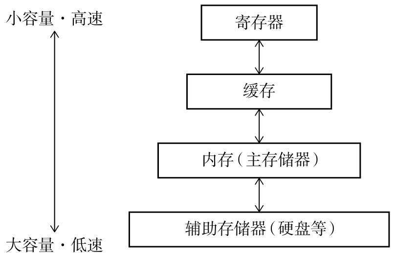

# GC 基础算法

> 从性能评价标准（吞吐量、最大暂停时间、堆使用效率、访问的局部性）讲到各类 GC 算法的横向取舍与性能优化方法，以及它们与 Java / Go 收集器的对应关系。
>
> 内容整理自语雀笔记，原书为《垃圾回收的算法与实现》（中村成洋 / 相川光）；落到 JVM / Go 的部分另见 [JVM与垃圾回收.md](../java/JVM与垃圾回收.md)。
>
> **各算法的详细过程已拆成四篇**：[标记类GC算法.md](标记类GC算法.md)、[复制与分代回收.md](复制与分代回收.md)、[引用计数与增量回收.md](引用计数与增量回收.md)、[并发标记与写屏障.md](并发标记与写屏障.md)。

## 一、GC 要解决什么问题？性能该怎么评价？

评价标准评价GC算法的性能时，有以下4个标准。

- 吞吐量，在单位时间内的处理能力。
- 最大暂停时间。
- 堆使用效率。
- 访问的局部性。

### 吞吐量

在单位时间内的处理能力。

### 最大暂停时间

GC执行过程中令mutator暂停执行。最大暂停时间指的是“因执行GC而暂停执行mutator的最长时间”。

### 堆使用效率

一个是头的大小，另一个是堆的用法。

首先是头的大小。在堆中堆放的信息越多，GC的效率也就越高，吞吐量也就随之得到改善。但毋庸置疑，头越小越好。因此为了执行GC，需要把在头中堆放的信息控制在最小限度。其次，根据堆的用法，堆使用效率也会出现巨大的差异。举个例子，GC复制算法中将堆二等分，每次只使用一半，交替进行，因此总是只能利用堆的一半。相对而言，GC标记-清除算法和引用计数法就能利用整个堆。

> **注意：不管尝试哪种GC算法，我们都会发现较大的吞吐量和较短的最大暂停时间不可兼得。所以应根据执行的应用所重视的指标的不同，来分别采用不同的GC算法。**

### 访问的局部性

PC上有4种存储器，分别是寄存器、缓存、内存、辅助存储器。

具有引用关系的对象之间通常很可能存在连续访问的情况。这在多数程序中都很常见，称为“访问的局部性”。考虑到访问的局部性，把具有引用关系的对象安排在堆中较近的位置，就能提高在缓存中读取到想利用的数据的概率，令mutator高速运行。

---

## 二、各算法分别适用什么场景？怎么综合比较？

上述算法没有绝对的优劣，只有是否匹配应用特征。下表从特点、优点、缺点、典型适用场景四个维度做横向对比，作为全篇的选型总表。

| 算法 | 核心特点 | 优点 | 缺点 | 典型适用场景 |
| --- | --- | --- | --- | --- |
| GC标记-清除 | 先标记活动对象，再遍历整个堆回收未标记对象；对象不移动 | 实现简单，易与其他算法组合；与保守式GC兼容；能利用整个堆 | 碎片化；分配需遍历空闲链表；与写时复制技术不兼容 | 简单的运行时/嵌入式场景；与保守式GC搭配；对象存活率高、不移动的堆（如老年代） |
| 引用计数法 | 每个对象维护被引用计数，计数归零立即回收 | 可即刻回收垃圾，内存不被垃圾长期占用；最大暂停时间短；不必由根沿指针查找 | 计数器增减频繁、占位多；实现烦琐易漏改；无法回收循环引用 | 分布式环境中管理节点间引用；对最大暂停时间和内存即时回收敏感的场景 |
| GC复制算法 | From/To 空间二等分，GC 时把活动对象整体复制并交换空间 | 吞吐量优秀；分配高速（移动 $free 指针即可）；无碎片；对有引用关系的对象缓存友好 | 只能用一半堆；不兼容保守式GC；递归复制有函数调用与栈开销 | 新生代（对象“朝生夕死”）；对吞吐量与分配速度要求高的场景 |
| GC标记-压缩算法 | 先标记，再把活动对象滑动/压缩到堆的一端 | 堆利用效率高（接近复制算法的 2 倍）；无碎片；分配可用连续分块 | 压缩需多次搜索整个堆，吞吐量偏低；需为 forwarding 指针留空间 | 老年代等需要消除碎片又不想浪费一半堆的场景（对应 Serial Old / Parallel Old） |
| 保守式GC | 不区分指针与非指针，把可疑值都保守地当作指针处理 | 语言处理程序无需配合 GC，实现简单 | 误判使垃圾被当成活动对象、压迫堆；对象不能移动；可用算法受限 | C/C++ 等缺少类型信息的运行时；与不移动对象的标记-清除算法搭配 |
| 分代垃圾回收 | 按“年龄”分代，新生代用复制、老年代用标记-清除 | 吞吐量显著改善（Ungar 实验：耗时约为复制算法的 1/4） | 对长寿对象多的程序会起反作用；写入屏障有额外开销；老年代GC暂停长 | 绝大多数业务/面向对象应用（对象年轻时大量死亡的规律成立） |
| 增量式垃圾回收 | 基于三色标记，GC 与 mutator 交替小步执行 | 大幅缩短最大暂停时间；停顿可控 | 吞吐量下降；写入屏障开销无法被缩短的 GC 时间抵消 | 交互式、对停顿敏感、更看重最大暂停时间而非吞吐量的应用 |
| RC Immix | 合并型引用计数法（更改缓冲区合并计数器增减）+ Immix 的块/线管理 | 把引用计数法吞吐量提升到实用级别（平均 +12%）；撤除空闲链表，分配更快 | 查找更改缓冲区会带来暂停；线内残留一个非垃圾对象即无法回收该线 | 希望保留引用计数特性（即时回收、无需沿指针查找）同时要求吞吐量的场景 |

> 选型要点：先确定应用更看重“吞吐量”还是“最大暂停时间”，再结合对象生命周期特征（是否朝生夕死）、对象是否允许移动（是否要与保守式GC共存）以及内存紧张程度，从表中挑选组合方案。

---

## 三、GC 的性能怎么分析和优化？

### 四个评价维度

- **吞吐量**：单位时间内的处理能力，即 mutator 实际干活的时间占比。写入屏障、多次搜索全堆、计数器增减都会拉低吞吐量。
- **最大暂停时间**：因执行 GC 而暂停 mutator 的最长时间。停止型 GC 越长，交互体验越差；增量式、引用计数、列车垃圾回收都在设法削减它。
- **堆使用效率**：一是对象头的大小（头越小越好），二是堆的用法。复制算法只用一半堆，标记-压缩要留 forwarding 空间，标记-清除与引用计数能用整个堆。
- **访问的局部性**：把有引用关系的对象安排在堆中较近的位置，提高缓存命中率。压缩（复制、标记-压缩、表格算法、Immix）能改善局部性；Two-Finger、Cheney 复制、Immix 则不打乱/不考虑引用关系或顺序，牺牲了局部性。

### 各算法的取舍

- **要吞吐量**：GC 复制算法、分代垃圾回收、RC Immix。它们只处理活动对象或只处理一部分堆，把时间花在“有用的对象”上。
- **要短停顿**：引用计数法、延迟清除法、增量式垃圾回收、列车垃圾回收。代价是吞吐量下降或写入屏障负担加重。
- **要省内存**：GC 标记-压缩算法（整个堆可用+无碎片）、BiBOP 法、多空间复制算法。代价是压缩/管理成本上升。
- **要兼顾局部性**：GC 复制算法、表格算法最好；Cheney 复制、Two-Finger、Immix 次之；单纯标记-清除最差（碎片化）。

### 优化手法的两条主线

1. **减少搜索量**：分代（只回收新生代对象）、延迟清除（只在分配时按需清除）、列车垃圾回收（一次只回收一个车厢）、多空间复制（只复制 2/N 的堆）。
2. **降低单次成本**：多个空闲链表与 BiBOP 法加速分配；位图标记避开写时复制的无谓复制；Sticky/1 位引用计数法压缩计数器位宽；合并型引用计数法把计数器增减合并成一次批量处理。

### 核心结论

> **吞吐量与最大暂停时间不可兼得。** 提高吞吐量通常意味着把 GC 做得“更集中更高效”，而缩短最大暂停时间则要求把 GC 拆成许多小步、频繁中断 mutator；两者在本质上互相拉扯。工程上不存在通吃的算法，只能根据应用更重视哪个指标（以及对象生命周期、内存预算、是否允许移动对象）来组合选取，并通过调参（分代数量、更改缓冲区大小、堆分块比例等）在两者之间寻找平衡点。

### 安全点（Safepoint）：暂停从哪里开始 ⭐

全停顿式与并发式的分界，最终都落在同一个问题上——**GC 什么时刻能拿到一致的引用图**。

- **为什么需要安全点**：GC 的根包含每个线程栈上的局部变量与 callee-saved 寄存器。线程执行到任意一条指令时，这些槽位可能正在被复用、指向中间态，JIT 过的代码里"哪些槽是指针"甚至没有定论。只有让所有线程停在编译器预先埋好的**安全点**（方法边界、回边、循环出口等处），栈map 才是完整可解释的。移动对象的阶段更是必须在安全点上做——引用改写到一半时外界看到的图是碎的。
- **一次暂停的时间构成**：`发起安全点请求 → 所有线程到齐（STW 开始）→ GC 工作 → 解除`。常被忽略的是第一段：**到齐时间不由 GC 决定，由"最慢的那个线程"决定**。
- 拖长"到齐"的典型因素（定性）：
  - 长时间不被打断的热循环，若循环体里没有安全点轮询（老版本对 counted loop 的优化曾制造过此类问题），线程要到循环外才能停；
  - 线程在 JNI/本地代码或系统调用里迟迟不返回（它不构成安全点等待，但持有的引用要按规则处理）；
  - 需要"不安分"操作的配合，如撤销偏向锁、锁瘦化等运行时操作（是否触发安全点与 JDK 版本策略有关，以版本文档为准）。
- **对算法层的含义**：三色标记 + 屏障技术把"必须 STW 的工作"压缩到根扫描/枚举与重新标记两段，安全点从"GC 的全部"退化成"GC 的门铃"；但门铃本身也可能很响——停顿调优时先分清**同步开销**和**回收工作开销**，两者的药方完全不同。

### GC 线程数、堆大小与暂停：三个容易讲错的定性结论

- **并行度不是越大越好**：多线程只压缩"扫描/复制/搬运"这类可分片工作；根扫描的串行成分、到齐等待、内存带宽争用不会随线程数消失。堆很小、活动集很小时，加线程的调度与同步成本甚至反超收益（客户端模式下 JVM 会压低并行线程数，具体策略以版本文档为准）。暂停时间近似看"Amdahl + 最慢线程"，不是核数除法。
- **"降低堆大小一定降低暂停"不成立**：复制/压缩类阶段的耗时与**存活集大小**成正比，与堆总量只在"要不要扫空洞"的间接关系上。把堆调小：minor GC 的复制成本不变（活着的还是那些），但 GC 频率上升、总暂停占比上升，还可能因容纳不下突发分配触发更重的收集。堆调小真正省的是"与堆大小成正比"的那部分（如标记-清除的全堆扫描、位图遍历）——这正是不同算法对堆大小敏感度不同的来源。
- **吞吐-暂停取舍曲线怎么讲**：把任一收集器在固定负载上的行为画成"最大暂停 vs 吞吐量"平面上的点：停止型集中回收在右下（吞吐高、暂停长），增量/并发摊平在左上（暂停短、吞吐有税）。**屏障与并发机制的意义不是取消取舍，而是把整条曲线朝左上方推移**——用内存（浮动垃圾、记忆集、缓冲区）和 CPU（并发阶段与 mutator 抢核）买停顿。面试里能讲出"你在用什么换什么"，比背任何参数默认值都有说服力。

### 工程调优思路：不看参数默认值也能讲清楚的顺序 ⭐

调 GC 之前先承认：GC 是**分配行为的镜子**。推荐的观察-归因-干预顺序：

1. **先读 GC 日志里的三个量**：
   - **分配速率**（单位时间堆分配字节/对象数，可由相邻回收间隔内的分配量推出）——一切新生代问题的源头；
   - **晋升速率**（每次 minor GC 进入老年代的量）——决定 major/Full 的频率；晋升速率长期偏高，调什么收集器都是治标；
   - **暂停分布**（不是平均值：minor/major 各自的次数、间隔、最大暂停、暂停时间占比）。
2. **分配速率过高，先改代码再调 JVM**：对象复用/池化、热路径避免隐式装箱与临时字符串拼接、把"每次构造"变成"缓存命中"、缩短对象生命周期作用域（对应 Go 里看逃逸分析，见 [内存逃逸.md](../go/运行时/内存逃逸.md)）。分配速率降一半，往往比任何收集器参数都更接近"免费的性能"。
3. **再看堆与代际比例**：目标是让"对象死在新生代"这条假说在你的负载上成立——新生代太小则晋升风暴（提前变老、major 变频），太大则 minor GC 的扫描/复制变贵且幸存集膨胀；老年代配比看晋升速率与存活集。方向性原则：让 minor 足够便宜、让 major 足够罕见，而不是凑某个固定比例。
4. **最后才换收集器**：吞吐优先的批处理选"停止型 + 并行 + 压缩"一族；在线服务选"并发标记 +（必要时）并发移动"一族；巨型堆 + 亚毫秒停顿诉求才上读屏障/着色指针系（它们用内存和 CPU 买暂停，见上文屏障的工程代价）。换收集器的收益上限由第 2 步欠的账决定。

---

### GC 与缓存：局部性原理，以及"停顿比吞吐更致命"的原因

**复制式改善局部性的机理**：可达性遍历是对引用图的一次拓扑化访问，复制按遍历序重排对象，等于把"程序接下来大概率先访问谁"的结构信息**从引用关系翻译成了地址相邻性**。地址相邻 → 同一缓存行/相邻缓存行 → 硬件预取命中 → mutator 变快。这就是"复制自带压缩、压缩自带局部性"的完整因果链；也是前文 Cheney 版（广度优先布局）不如递归版（深度优先布局）缓存友好的根因。

**为什么线上系统更怕最大暂停而不是低吞吐**：

- 现代服务靠**超时 + 重试**维持可用性：一次长 STW 让该实例**在途请求全部冻结**；上游超时后重试，压力转移到别的实例并可能触发它们同时 GC → 重试风暴把单点停顿放大成面障。
- SLO 按 P99/P999 计，**平均值是掩盖方差的艺术**：吞吐 99% 但偶发 2s 停顿的服务，比吞吐 95% 停顿恒定 20ms 的服务更难伺候。
- 所以对在线服务，GC 优化的目标函数是**"最大暂停 + 其方差"**，吞吐量只是预算；批处理则反过来买吞吐、停掉无所谓。增量式/列车/并发收集器整条演进线，都是在把"总工作量"打碎、摊平、甚至搬到并发时段去付。

---

## 四、这些算法与 Java GC 怎么对应？

本文件讲的是通用算法，JVM 的收集器基本都是它们的工程化实现与组合：

| 本文算法 | JVM 中的对应实现 |
| --- | --- |
| GC标记-清除 | CMS 的基础：并发标记后进行清除，不做压缩 |
| GC标记-压缩 | Serial Old、Parallel Old；G1 的 Full GC 也以标记-压缩收尾 |
| GC复制算法 | 新生代（Serial/ParNew/Parallel Scavenge）的 Eden 与 Survivor 间的复制 |
| 分代垃圾回收 | JVM 的分代收集，新生代 + 老年代的分区策略；记录集/卡片标记对应卡表（card table） |
| 引用计数法 | JVM 未采用为主算法，但相关思路（如循环引用不可回收）常被用来解释为什么选择可达性分析 |
| 增量式垃圾回收 | 并发/并行收集的雏形；G1、ZGC 等把停顿拆分为可预测的小段 |

- **可达性分析与三色标记**：JVM 用可达性分析代替引用计数，其标记过程就是三色标记法（白=未访问、灰=待扫描、黑=已完成）。
- **增量更新 / SATB**：并发标记阶段 mutator 仍会改指针，需要写入屏障维持三色不变式。CMS 用增量更新（incremental update），G1 用 SATB（Snapshot-At-The-Beginning），本质上都是本文“写入屏障 + 记录集”的现代变体。
- **读写屏障**：本文的写入屏障在 JVM 中进一步扩展为读屏障（ZGC 等使用），用于并发整理时修正指针。
- **堆布局优化**：BiBOP、Immix 的块/线思想对应 TLAB（线程本地分配缓冲）与 Region 化堆（G1、ZGC 的 Region）。
- **停顿控制**：增量式与列车垃圾回收追求“可控停顿”，对应到 JVM 就是 Stop-The-World 时长优化与并发收集器的暂停目标（如 `-XX:MaxGCPauseMillis`）。

进一步的 JVM 实现细节、收集器选型与调参，见 [JVM与垃圾回收.md](../java/JVM与垃圾回收.md)。

### 算法机制到真实收集器的映射 ⭐

把本文的机制拆成列，看每个收集器"用了哪几块乐高、主要矛盾是什么"（行内机制为公开文档/著述的常见描述，细节与开关以各 JDK 版本文档为准）：

| 收集器 | 回收骨架 | 三色/屏障 | 并发阶段 | 并发移动 | 解决的主要矛盾 |
| --- | --- | --- | --- | --- | --- |
| Serial | 新生代复制 + 老年代标记-压缩 | 单线程 STW 标记，无需并发屏障 | 无 | 无 | 简单与低内存footprint（客户端/小容器） |
| ParNew | Serial 新生代的多线程复制 | 同上（标记仍 STW，只是并行） | 无 | 无 | 用多核缩短 young GC 暂停 |
| Parallel Scavenge / Parallel Old | 分代复制 + 并行标记-压缩 | 同上；自适应调整代大小 | 无 | 无 | 吞吐量最大化（批处理/后台计算） |
| CMS | 老年代标记-清除（不整理，碎片严重时退化） | 三色 + **增量更新**（记被改的黑对象，重标记重扫） | 并发标记、并发清除 | 无 | 老年代暂停与堆大小初步解耦（换取浮动垃圾与碎片） |
| G1 | 全堆 Region 化，整体近似"分代 + 局部复制（Evacuation）" | 三色 + **SATB**（弱三色）+ 卡表/记忆集 | 并发标记；暂停目标驱动的 Region 回收 | 回收时移动（在 STW 的 Evacuation 暂停内复制） | **可预测停顿**：在"该回收哪些 Region"上做文章（换取记忆集内存与屏障税） |
| Shenandoah | Region 化 + 堆整体/部分复制 | 三色 + SATB（并发标记阶段） | 并发标记、**并发整理** | 有（Brooks 指针一系的自转发思路，细节以设计文档为准） | 暂停与堆大小解耦：搬运也并发做 |
| ZGC | Region 化 + 全程并发复制 | 三色 + **着色指针**（元数据在指针与页表上） | 标记与移动几乎全并发 | 有（读屏障在**使用现场**修正旧引用） | 亚毫秒级暂停且与堆大小基本无关（官方宣传口径；换取更大的内存/CPU 税与更复杂的 OS 配合） |

三点通读表格后的总结：

- **分代是"少干活"策略，三色+屏障是"边干边改"策略，读屏障/着色指针/Brooks 是"干了还能挪"策略**——三类机制解决的是三个正交的问题（工作量、正确性、移动性），现代收集器都是三者的组合。
- 每一格"有"的背后都站着本文的一节：SATB 站"弱三色路线"，卡表站"分代的理论前提与卡表的技术账"，并发整理站"Brooks 指针"。
- CMS 已自 JDK 14 起移除；ZGC/Shenandoah 的分代化演进（ZGC 自 JDK 21 起支持分代等）以官方发布说明为准，本表描述其经典形态。

### Go GC：同一套乐高的不同拼法

Go 的收集器是"本文机制"的另一个取舍点，与 JVM 的关键差异：

| 维度 | JVM 主流（G1/ZGC） | Go |
| --- | --- | --- |
| 标记 | 三色并发标记 | 三色并发标记 |
| 屏障 | 写屏障为主（SATB/卡表）或读屏障（ZGC） | **混合写屏障**（插入+删除语义合并，一次写入同时保护新旧两侧）+ 新对象分配侧配合，换取**栈不需要在重新标记时重扫** |
| 分代 | 有（G1 逻辑分代、ZGC 新版分代） | **无分代**：没有新生代复制，也没有晋升 |
| 移动/整理 | 复制式回收自带整理 | **标记-清除，不压缩**堆对象（栈可搬，靠 stack barrier）；碎片由 mcache/mcentral/sizeclass 的分层分配器缓解，见 [内存分配器.md](../go/运行时/内存分配器.md) |
| 触发与暂停 | 堆水位/停顿目标驱动，STW 段短 | 默认约按"2 倍存活堆"的节奏触发（GOGC，以版本文档为准）；STW 只剩标记起始/终止的短段，但有**GC assist**——分配快的 goroutine 要替 GC 干活 |
| 正确性代价 | 浮动垃圾 + 记忆集/缓冲区内存 | 浮动垃圾 + 无整理带来的 RSS 偏高与碎片 |

一句话概括差异：JVM 用"分代 + 复制"控制**工作量**、用各种屏障控制**暂停**；Go 放弃了这两件武器，只保留"并发标记 + 并发清除 + 混合屏障"这一条最简正确性路线，把其余成本（内存水位、碎片、assist）都换算成内存和少量吞吐买低延迟——这与它 goroutine 海量、无 Warmup 心智、单 runtime 绑死语言的设计取向一致。

---

## 面试官会追问什么

- **吞吐量和最大暂停时间为什么常常互相矛盾？** → "减少单次停顿"通常意味着"把一次大回收拆成多次小回收"，总扫描量与记账成本因此上升，吞吐下降；反过来一次 STW 全量回收吞吐最高、暂停最长。**所以调优第一步不是选参数，而是先确认哪个指标是硬约束** —— 延迟敏感（交易、游戏）与吞吐敏感（批处理）会走向完全不同的配置。
- **堆使用效率到底影响什么？** → 它决定"同样内存能装多少存活对象"。复制算法只敢用一半堆（另一半留作 to-space），**50% 是它的结构性代价**，不是实现问题；标记-压缩可以接近 100%，代价是移动对象时的指针修正成本。说"复制算法快"时，必须同时说清它拿一半内存换的。
- **为什么常说"停顿比吞吐更致命"？** → 吞吐差 10% 用户基本无感，停顿 1 秒则会直接触发超时、请求失败；更糟的是**连锁放大**：请求排队 → 线程池打满 → 上游重试 → 雪崩。这正是收集器演进主线一直是"压停顿"（CMS → G1 → ZGC）而不是"提吞吐"的原因。
- **该调堆还是先调代码？** → 先看**分配速率**：GC 频率 ≈ 分配速率 / 可用堆空间。分配速率本身很高时，扩堆只是把问题推后（成本更高、回收时更痛）；判据是"老年代增长快 + 单次回收后回收不掉"，这时先查对象生命周期（见 [内存逃逸.md](../go/运行时/内存逃逸.md)），再考虑堆与收集器参数。

## 关联

- [标记类GC算法.md](标记类GC算法.md) — 标记-清除、标记-压缩、保守式 GC 的完整过程
- [复制与分代回收.md](复制与分代回收.md) — 复制算法与分代回收的过程与代价
- [引用计数与增量回收.md](引用计数与增量回收.md) — 引用计数、增量式与 RC Immix
- [并发标记与写屏障.md](并发标记与写屏障.md) — 三色抽象、漏标两条件与屏障代价
- [JVM与垃圾回收.md](../java/JVM与垃圾回收.md) — 三色标记在 JVM 的落地、收集器组合、安全点与调优命令
- [类加载机制.md](../java/类加载机制.md) — 类加载对根扫描的影响
- [内存分配器.md](../go/运行时/内存分配器.md) — Go 的 mcache/mcentral/sizeclass 分层与"无整理靠分配器缓解碎片"
- [内存逃逸.md](../go/运行时/内存逃逸.md) — 逃逸决定堆分配量，直接影响 GC 压力
- [复杂度分析.md](../算法/复杂度分析.md) — "阶段复杂度 × 堆大小 / 存活集大小"的分析方法
