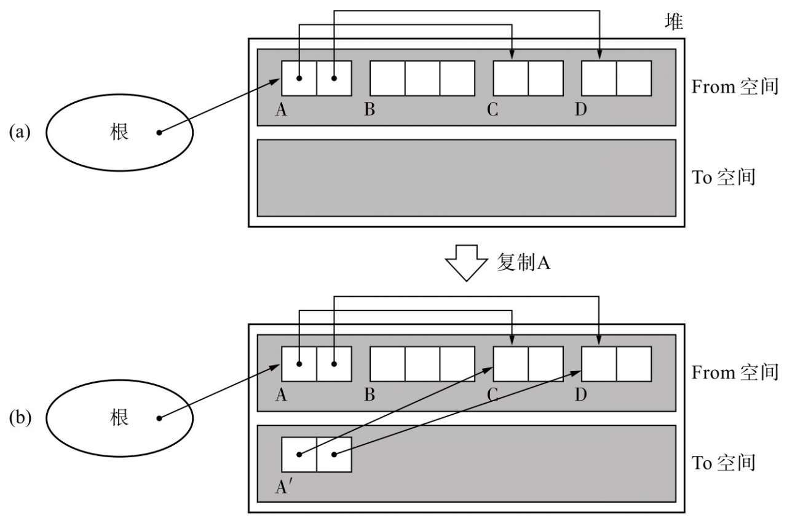
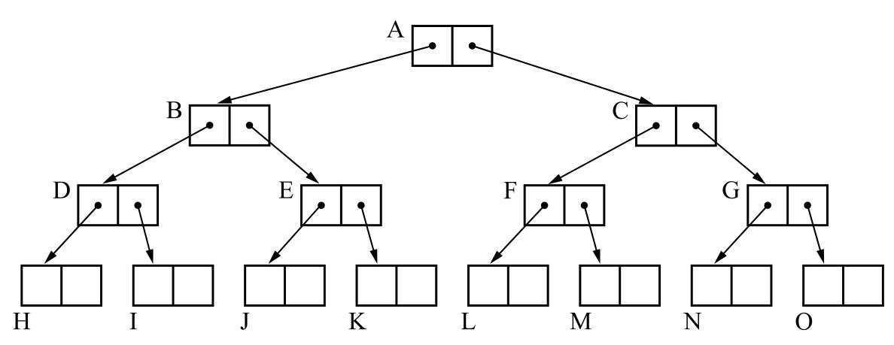
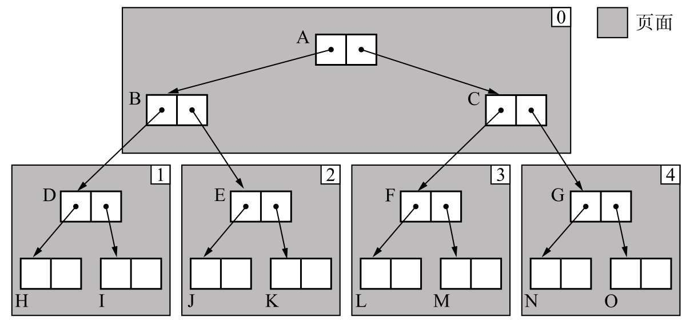
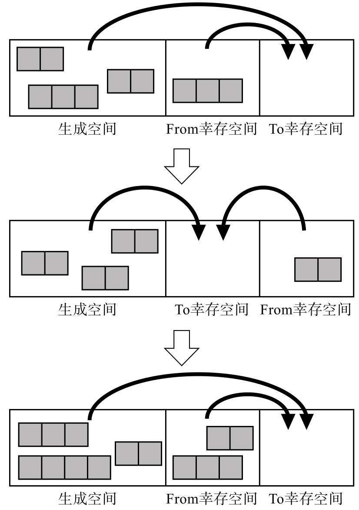
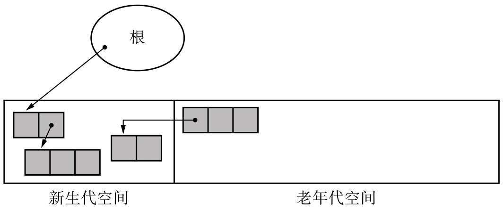
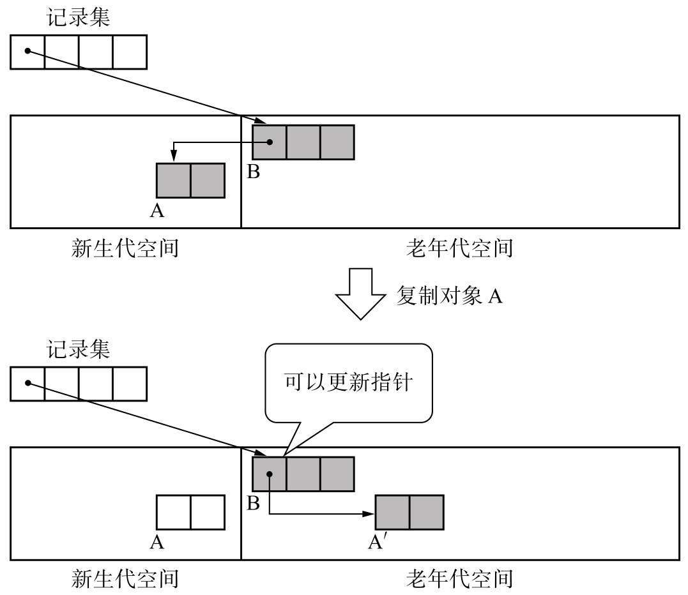
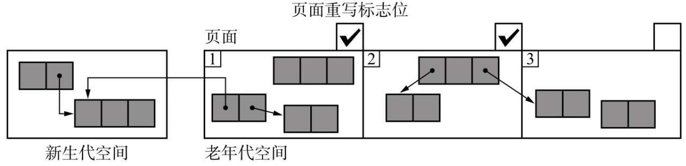
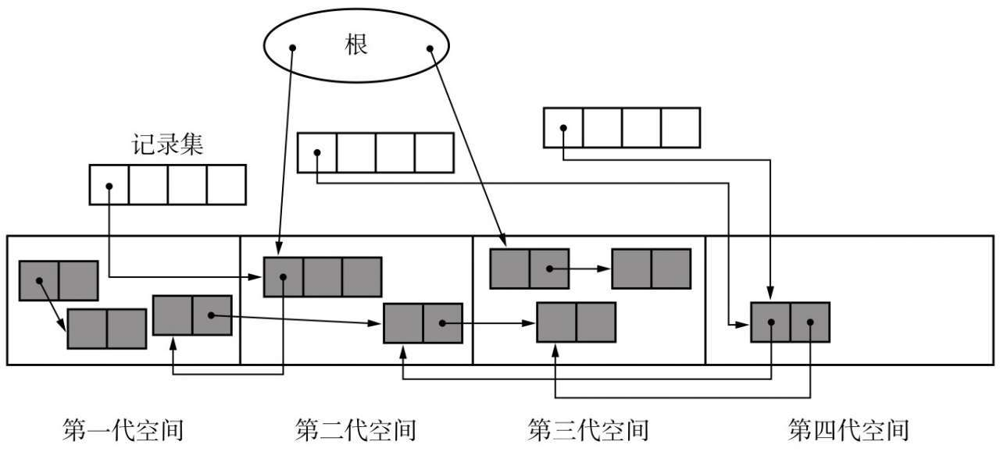
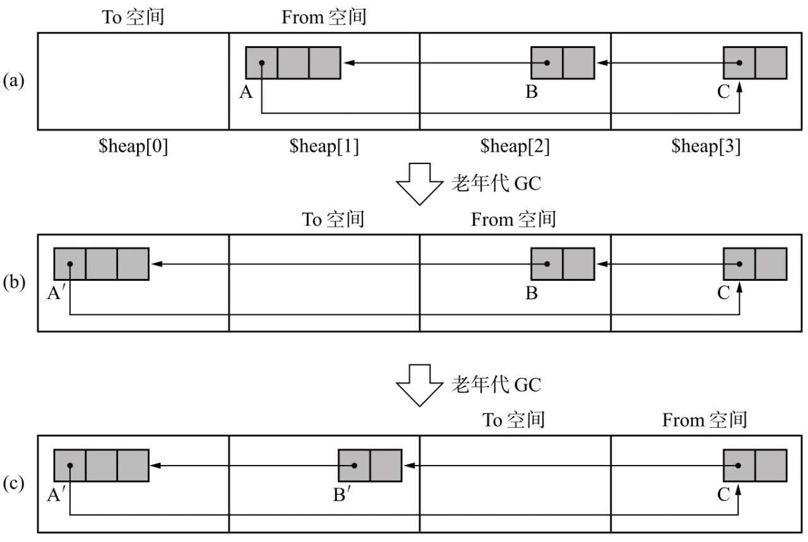

# 复制与分代回收

> 复制算法与分代垃圾回收：过程、优缺点、适用场景，以及"两跳复制"与卡表要付的技术账。
>
> 内容整理自语雀笔记，原书为《垃圾回收的算法与实现》（中村成洋 / 相川光）；内容整理自语雀笔记，原书为《垃圾回收的算法与实现》（中村成洋 / 相川光）；评价维度与横向选型见 [GC基础算法.md](GC基础算法.md)。

## 一、复制算法

GC复制算法（Copying GC）是Marvin L. Minsky在1963年研究出来的算法。说得简单点，就是只把某个空间里的活动对象复制到其他空间，把原空间里的所有对象都回收掉。这是一个相当大胆的算法。在此，我们将复制活动对象的原空间称为From空间，将粘贴活动对象的新空间称为To空间。

GC复制算法是利用From空间进行分配的。当From空间被完全占满时，GC会将活动对象全部复制到To空间。当复制完成后，该算法会把From空间和To空间互换，GC也就结束了。From空间和To空间大小必须一致。这是为了保证能把From空间中的所有活动对象都收纳到To空间里。




在GC复制算法中，请注意GC完成后只有1个分块的内存空间。在每次分配时，只要把所申请大小的内存空间从这个分块中分割出来给mutator就行了。也就是说，这里的分配跟GC标记-清除算法中的分配不同，不需要遍历空闲链表。

### 过程

为了给GC做准备，这里事先将$free指针指向To空间的开头。


假设就以这种状态开始GC。首先是从根直接引用的对象B和G，B先被复制到了To空间。B被复制后的堆状态如图所示。


在此我们将B被复制后生成的对象称为B′。我们看图4.6中的B，field1已经打上了复制完成的标签，field2里放了一个指向B′的forwarding指针。

但是，这里只把B′复制了过来，它的子对象A还在From空间里。下面我们要把这个A复制到To空间里。

这次才可以说在真正意义上复制了B。因为A没有子对象，所以对A的复制也就完成了。


接下来，我们要复制和B一样从根引用的G，以及其子对象E。虽然B也是G的子对象，不过因为已经复制完B了，所以只要把从G指向B的指针换到B′上就行了。

最后只要把From空间和To空间互换，GC就结束了。GC结束时堆的状态如图4.8所示。我们在以后的章节里还会引用这张图，请务必牢记。


当然了，对象C、D、F因为没法从根查找，所以会被回收。在这里程序是以B、A、G、E的顺序搜索对象的。不知大家发现了没有，这是我们在第2章的专栏中提到的深度优先搜索。这跟广度优先搜索有什么不同呢？关于这一点，我们会在4.3.3节和4.4.3节中为大家说明。

### 优点

**优秀的吞吐量**

GC标记-清除算法消耗的吞吐量是搜索活动对象（标记阶段）所花费的时间和搜索整体堆（清除阶段）所花费的时间之和。

另一方面，因为GC复制算法只搜索并复制活动对象，所以跟一般的GC标记-清除算法相比，它能在较短时间内完成GC。也就是说，其吞吐量优秀。

尤其是堆越大，差距越明显。GC标记-清除算法在清除阶段所花费的时间会不断增加，但GC复制算法就不会产生这种消耗。毕竟它消耗的时间是与活动对象的数量成比例的。

**可实现高速分配**

GC复制算法不使用空闲链表。这是因为分块是一个连续的内存空间。因此，调查这个分块的大小，只要这个分块大小不小于所申请的大小，那么移动$free指针就可以进行分配了。

比起GC标记-清除算法和引用计数法等使用空闲链表的分配，GC复制算法明显快得多。大家想一下，使用空闲链表时为了找到满足要求的分块，需要遍历空闲链表对吧？最坏的情况就是我们不得不从空闲链表中取出最后一个分块，这样就要花大把时间把所有分块都调查一遍。

**不会发生碎片化**

在GC复制算法中，每次运行GC时都会执行压缩。

因此GC复制算法有个非常优秀的特点，就是不会发生碎片化。也就是说，可以安排分块允许范围内大小的对象。

**与缓存兼容**

在GC复制算法中有引用关系的对象会被安排在堆里离彼此较近的位置。

请再看一下上图“GC结束后”。B′引用A′，G′引用E′，图中按照B′、A′、G′、E′的顺序排列。这种情况有一个优点，那就是mutator执行速度极快。近来很多CPU都通过缓存来高速读取位置较近的对象。这也是借助压缩来完成的，通过压缩来把有引用关系的对象安排在堆中较近的位置。

### 缺点

**堆使用效率低下**

GC复制算法把堆二等分，通常只能利用其中的一半来安排对象。也就是说，只有一半堆能被使用。相比其他能使用整个堆的GC算法而言，可以说这是GC复制算法的一个重大的缺陷。

**不兼容保守式GC算法**

GC标记-清除算法有着跟保守式GC算法相兼容的优点。因为GC标记-清除算法不用移动对象。另一方面，GC复制算法必须移动对象重写指针，所以有着跟保守式GC算法不相容的性质。

**递归调用函数**

在这里介绍的算法中，复制某个对象时要递归复制它的子对象。因此在每次进行复制的时候都要调用函数，由此带来的额外负担不容忽视。大家都知道比起这种递归算法，迭代算法更能高速地执行。

此外，因为在每次递归调用时都会消耗栈，所以还有栈溢出的可能。

为了消除这个缺点，我们会在下一节中为大家介绍Cheney的GC复制算法——迭代进行复制的算法。

### 优化

**Cheney的GC复制算法**

C. J. Cheney于1970年研究出了GC算法。相比Fenichel和Yochelson的GC复制算法，Cheney的GC复制算法不是递归地，而是迭代地进行复制。

Fenichel和Yochelson的GC复制算法采用的是深度优先搜索，而Cheney的复制算法采用的则是广度优先搜索。

广度优先搜索需要先入先出（FIFO）结构的队列，即把该搜索的对象保持在队列中，一边取出一边进行搜索。





**优点**

Fenichel和Yochelson的GC复制算法是递归算法，而Cheney的GC复制算法是迭代算法，因此它可以抑制调用函数的额外负担和栈的消耗。特别是拿堆用作队列，省去了用于搜索的内存空间这一点，实在是令人赞叹。

**缺点**

在Fenichel和Yochelson的GC复制算法中，具有引用关系的对象是相邻的，因此才能充分利用缓存的便利。另一方面，就像我们在图4.12中看到的那样，在Cheney的GC复制算法中，有引用关系的对象，也就是G′和E′、B′和A′并不相邻。

因此我们没法说Cheney的GC复制算法兼容缓存，只能说它比GC标记-清除算法和引用计数法要好一些而已。

**近似深度优先搜索方法**

**多空间复制算法**

GC复制算法最大的缺点是只能利用半个堆。这是因为该算法将整个堆分成了两半，每次都要腾出一半。

多空间复制算法说白了就是把堆N等分，对其中2块空间执行GC复制算法，对剩下的（N-2）块空间执行GC标记-清除算法，也就是把这2种算法组合起来使用。

**优点**

多空间复制算法没有将堆二等分，而是分割成了更多块空间，从而更有效地利用了堆。以往的GC复制算法只能使用半个堆，而多空间复制算法仅仅需要空出一个分块，不能使用的只有1/N个堆。

**缺点**

执行GC复制算法的只有N等分中的两块空间，对于剩下的（N-2）块空间执行的是GC标记-清除算法。因此就出现了GC标记-清除算法固有的问题——分配耗费时间、分块碎片化等。

---

## 二、分代垃圾回收

分代垃圾回收（Generational GC）在对象中导入了“年龄”的概念，通过优先回收容易成为垃圾的对象，提高垃圾回收的效率。

人们从众多程序案例中总结出了一个经验：“大部分的对象在生成后马上就变成了垃圾，很少有对象能活得很久。”分代垃圾回收利用该经验，在对象中导入了“年龄”的概念，经历过一次GC后活下来的对象年龄为1岁。

### 新生代对象和老年代对象

- 新生代GC（minor GC）-GC标记-复制算法
- 老年代GC（major GC）-GC标记-清除算法

分代垃圾回收中把对象分类成几代，针对不同的代使用不同的GC算法，我们把刚生成的对象称为新生代对象，到达一定年龄的对象则称为老年代对象。

众所周知，新生代对象大部分会变成垃圾。如果我们只对这些新生代对象执行GC会怎么样呢？除了引用计数法以外的基本算法，都会进行只寻找活动对象的操作（如GC标记-清除算法的标记阶段和GC复制算法等）。因此，如果很多对象都会死去，花费在GC上的时间应该就能减少。

### Ungar的分代垃圾回收

**过程**

在Ungar的分代垃圾回收中，堆的结构如图所示。我们总共需要利用4个空间，分别是生成空间、2个大小相等的幸存空间以及老年代空间，并分别用$new_start、$survivor1_start、$survivor2_start、$old_start这4个变量引用它们的开头。我们将生成空间和幸存空间合称为新生代空间。新生代对象会被分配到新生代空间，老年代对象则会被分配到老年代空间里。Ungar在论文里把生成空间、幸存空间以及老年代空间的大小分别设成了140K字节、28K字节和940K字节。


此外我们准备出一个和堆不同的数组，称为记录集（remembered set），设为$rs。

生成空间就如它的字面意思一样，是生成对象的空间，也就是进行分配的空间。当生成空间满了的时候，新生代GC就会启动，将生成空间中的所有活动对象复制，这跟GC复制算法是一个道理。目标空间是幸存空间。

2个幸存空间和GC复制算法里的From空间、To空间很像，我们经常只利用其中的一个。在每次执行新生代GC的时候，活动对象就会被复制到另一个幸存空间里。在此我们将正在使用的幸存空间作为From幸存空间，将没有使用的幸存空间作为To幸存空间。

不过新生代GC也必须复制生成空间里的对象。也就是说，生成空间和From幸存空间这两个空间里的活动对象都会被复制到To幸存空间里去。这就是新生代GC。

只有从一定次数的新生代GC中存活下来的对象才会得到晋升，也就是会被复制到老年代空间去。

**幸存空间满了怎么办？**

通常的GC复制算法把空间二等分为From空间和To空间，即使From空间里的对象都还活着，也确保能把它们收纳到To空间里去。不过在Ungar的分代垃圾回收里，To幸存空间必须收纳From幸存空间以及生成空间中的活动对象。From幸存空间和生存空间的总大小比To幸存空间大，所以如果活动对象很多，To幸存空间就无法容纳下它们。

当发生这种情况时，稳妥起见只能把老年代空间作为复制的目标空间。当然，如果频繁发生这种情况，分代垃圾回收的优点就会淡化。



在执行新生代GC时有一点需要注意，那就是我们必须考虑到从老年代空间到新生代空间的引用。新生代对象不只会被根和新生代空间引用，也可能被老年代对象引用。因此，除了一般GC里的根，我们还需要将从老年代空间的引用当作根（像根一样的东西）来处理。



分代垃圾回收的优点是只将垃圾回收的重点放在新生代对象身上，以此来缩减GC所需要的时间。不过考虑到从老年代对象的引用，结果还是要搜索堆中的所有对象，这样一来就大大削减了分代垃圾回收的优势。

通过新生代GC得到晋升的对象把老年代空间占满后，就要执行老年代GC了。老年代GC没什么难的地方，它只用到了我们在第2章中介绍过的GC标记-清除算法。

**记录集**

记录集被用于高效地寻找从老年代对象到新生代对象的引用。具体来说，在新生代GC时将记录集看成根（像根一样的东西），并进行搜索，以发现指向新生代空间的指针。


通过查找记录集，可知对象A是新生代GC的对象。执行新生代GC后，A晋升成A′。不过这个状态下我们无法把B的指针的引用目标由A改写为A′。这是因为在图7.4中，记录集里没有存储“老年代对象B引用了新生代对象A”这一信息。

因此，在记录集里不会记录引用的目标对象，而是记录发出引用的对象。这样一来，我们就能通过记录集搜索发出引用的对象，进而晋升引用的目标对象，再将发出引用的对象的指针更新到目标空间了。



**写入屏障**

在分代垃圾回收中，为了将老年代对象记录到记录集里，我们利用写入屏障（write barrier）。在mutator更新对象间的指针的操作中，写入屏障是不可或缺的。

**优点**

吞吐量得到改善。“很多对象年纪轻轻就会死”这一法则虽然是经验之谈，不过还是适用于大多数情况的。以这个法则为前提，新生代GC只将刚生成的对象当成对象，这样一来就能减少时间上的消耗。

反过来，因为老年代GC是针对很难变成垃圾的老年代对象执行的，所以要比新生代GC花的时间长。不过，在经过新生代GC而晋升的对象把老年代空间填满之前，老年代GC都不会被执行。因此，老年代GC的执行频率要比新生代GC低。

综合来看，通过使用分代垃圾回收，可以改善GC所花费的时间（吞吐量）。正如Ungar所说的那样：“据实验表明，分代垃圾回收花费的时间是GC复制算法的1/4。”可见分代垃圾回收的导入非常明显地改善了吞吐量。

另一方面，因为老年代GC很费时间，所以我们没法缩短mutator的最大暂停时间。关于使用分代垃圾回收来缩减mutator最大暂停时间的方法，我们将在下面的“列车垃圾回收”为大家介绍。

**缺点**

在部分程序中会起到反作用。

“很多对象年纪轻轻就会死”这个法则毕竟只适合大多数情况，并不适用于所有程序。当然，对象会活得很久的程序也有很多。对这样的程序执行分代垃圾回收，就会产生以下两个问题。

- 新生代GC所花费的时间增多
- 老年代GC频繁运行

考虑到这两点，恐怕我们没法利用到分代垃圾回收的优点，或者就算利用到了，效果也甚微。

而且，写入屏障导致的额外负担降低了吞吐量。只有当新生代GC带来的速度提升效果大于写入屏障对速度造成的影响时，分代垃圾回收才能够更好地发挥作用。当这个大小关系不成立时，分代垃圾回收就没有什么作用，或者说反而可能会起到反作用。这种情况下我们还是使用基本算法更好。

### 记录各代之间的引用的方法

Ungar的分代垃圾回收是使用记录集来记录各代间的引用的。

**卡片标记**


GC时会寻找位图表格。当找到设置了标志位的卡片时，就会从卡片开头开始寻找指向新生代空间的引用。这就是卡片标记。

卡片标记的一大特征就是能有效利用内存空间。因为每个128字节（1024位）的新生代空间都只需要一个位来用作标记，所以整个位表（bit table）只需要老年代空间的1/1024的空间。也就是说，我们只要多准备出老年代空间的0.1%大小的内存空间就够了。

此外，无论从老年代空间指向新生代空间的引用怎么增加，都不会发生像记录集那样溢出的情况。另一方面，这个方法还有个缺点，比如如果在标记表格里设置了很多位，那么可能就会在搜索卡片上花费大量时间。因此只有在局部存在从老年代空间指向新生代空间的引用时，卡片标记才能发挥作用。

**页面标记**



### 多代垃圾回收



分代数量越多，对象变成垃圾的机会也就越大，所以这个方法确实能减少活到最老代的对象。

但是我们也不能过度增加分代数量。分代数量越多，每代的空间也就相应地变小了，这样一来各代之间的引用就变多了，各代中垃圾回收花费的时间也就越来越长了。

> 综合来看，少设置一些分代能得到更优秀的吞吐量，据说分为2代或者3代是最好的。

### 列车垃圾回收

列车垃圾回收（Train GC）是由Richard L. Hudson和J. Eliot B. Moss发明的方法。它是为了在分代垃圾回收中利用老年代GC而采用的算法，可以控制老年代GC中暂停时间的增长。

**堆的结构**

列车垃圾回收中将老年代空间按照一定大小划分，每个划分出来的空间称为车厢，由1个以上的车厢连接成的东西就叫作列车。这就是列车垃圾回收名字的由来。1次老年代GC是以1个车厢作为GC对象的。

每个列车和每个车厢都按其产生的顺序被赋予了编号，互相连接。车厢就是以这个顺序作为GC对象的。

此外，我们要为各列车和各车厢准备记录集。列车的记录集里记录的是来自其他列车的引用，车厢的记录集中记录的则是来自同一列车的其他车厢的引用。


当通过新生代GC将对象从新生代空间晋升时，我们要准备已有的车厢或者空的车厢，将对象安排在分块里。各车厢里的分块是单独作为一个连续的内存空间存在的。也就是说，我们在这里执行GC时，也利用了GC复制算法的原理。

在新生代GC结束后，就该执行老年代GC了。在执行老年代GC时，开头列车的开头车厢是GC的对象。在老年代GC执行后，因为那些作为GC对象的车厢里只剩下了垃圾，所以我们将这些车厢作为空车厢保留，以便执行下一次新生代GC。

此外，列车垃圾回收里的对象结构和在Ungar的分代垃圾回收里用到的对象结构完全一致。


**记录集**


**记录集的溢出**

事实上我们在前面介绍write_barrier()函数的伪代码时留了一个陷阱，那就是没有考虑到记录集满了的情况。

如果新生代空间的记录集满了，就必须执行新生代GC来清空新生代空间，要不然就没法继续进行分配。

另一方面，在老年代空间中，如果某个车厢C的记录集满了应该怎么办呢？此时车厢C不一定是老年代GC的对象车厢。就算我们硬要对车厢C执行GC，也必须考虑C前面的列车及车厢对C的引用。此外，因为记录集已满，所以搜索记录集所需要的时间也会比平常所需时间长。

本来记录集满了就意味着此车厢里挤满了受欢迎（也就是被引用数非常大）的对象。这样的对象很难成为垃圾，每次执行GC都需要对其进行复制操作。

为了省去花费在这项复制操作上的时间，我们有个办法，那就是索性把车厢C排除到GC对象的范围之外去。这看上去像是白白浪费了一个车厢，不过考虑到车厢C中大多数对象都会在执行GC后存活下来，所以一开始就不对其执行GC可能要更为划算些。

**写入屏障**

**优点**

以Ungar的分代垃圾回收为代表的一般的分代垃圾回收都因为老年代GC而增加了mutator的最大暂停时间。这是因为分代垃圾回收将整个老年代空间这个比较大的堆当成了老年代GC的对象。而在列车垃圾回收中，一次老年代GC只将堆中非常小的一部分（即车厢）当成GC的对象，因此就能缩减各老年代GC所造成的mutator的最大暂停时间了。

此外，列车垃圾回收还能回收循环的大型垃圾，这一点不容忽视。列车垃圾回收之所以能回收跨多个块（在这里也就是车厢）的大型垃圾，是因为列车垃圾回收会把互相引用的对象安排在同一辆列车上。请大家回忆一下在老年代GC中是如何选择to_car的。在列车垃圾回收中，我们采用的方针是将要复制的对象跟发出引用的对象安排在同一辆列车上。这样一来，在重复执行老年代GC的过程中，所有构成垃圾的对象群早晚会被安排到同一辆列车上，因此我们就能整个回收这辆列车。

如果我们没有考虑到这点会怎么样呢？打个比方，通过使用在“GC复制算法”提到的多空间复制算法，就可以跟列车垃圾回收一样，在一次老年代GC中只针对老年代空间的一个块执行GC了。



对象群A到C形成了循环垃圾。在此状态下，如果我们将$heap[1]作为From空间，将$heap[0]作为To空间，以此来执行多空间复制算法，结果会如何呢？

虽然A本来是垃圾，不过因为它被其他块引用了，所以会被当成活动对象而复制到heap[0]去。同样，B、C也会被按顺序复制过去。

像这样，在循环垃圾对象群跨复数个块时，因为多空间复制算法只能将已经成为垃圾的对象群进行部分移动，所以再怎么重复执行GC，也没法回收这样的垃圾。

**缺点**

在列车垃圾回收中执行写入屏障所产生的额外负担，要比在Ungar的分代垃圾回收中执行时所产生的更大，因此在吞吐量方面，列车垃圾回收要比Ungar的分代垃圾回收差一些。不止是这样。

实际上minor_gc()函数和major_gc()函数的伪代码也有个很大的陷阱，那就是没有考虑到比车厢大的对象。列车垃圾回收是以每个对象都小于一个车厢为前提的。

本书中虽然没有提及，不过对于比车厢大的对象，需要将其安排到新生代空间和老年代空间以外的堆，使用跟列车垃圾回收不同的方法来执行GC。

---

## 三、复制的实现细节：指针、地址与两跳

### 半空间复制：to/from/scan 三指针，灰集合根本不用另存

```pseudocode
// 半空间复制(Cheney 形态): "未处理区"本身就是灰集合
to_start = to = from_end          // to..free 是 to 空间中已分配区
free     = to_start               // 分配指针(bump pointer)
for (scan = to_start; scan < free; scan = scan + size(obj)) {
    obj = object_at(scan)         // [to_start, free) 区间 = 灰色待扫对象
    for each reference field f of obj {
        if *f ∈ from_space {
            if already_forwarded(*f)  *f = forwarding(*f)
            else {
                new = (*f 复制到 free 端, free 前移)
                (*f 原地留 forwarding 指向 new)
                *f  = new               // 复制即改写, 一遍完成
            }
        }
    }
}
// 循环结束: [to_start, scan) 已处理(黑), [scan, free) 待处理(灰), 白色不在此空间
```

三个值得记住的实现要点：

- **为什么灰集合免费**：新复制来的对象天然"自身在场、子引用未追"——正是灰的定义。用空间布局代替显式队列，这是 Cheney 把堆当队列用的精髓。
- **为什么必须递归/迭代地把复制做下去**：复制一个对象只解决了"它自己在哪"，它字段里指向 from 空间的引用还悬着；追进去改写，直到闭包收敛。等价说法：复制是**把可达集从根开始重新排一遍**，漏追一层就是悬垂指针。
- **对象地址必变**：新地址 = 分配指针推进的位置，由遍历顺序决定。因此**一切引用入口**（根、对象字段、栈上/寄存器里的裸指针）都必须被找出来改写。找不到它们的系统（保守式）就只能配"不承诺搬家"的算法，或者走下面的间接引用。

### Lisp2（forwarding 指针）vs 不更新引用（间接/双跳转）

| 维度 | Lisp2：前向指针 + 全量更新 | 间接引用：不更新旧引用 |
| --- | --- | --- |
| 旧位置存什么 | 被移走对象的头部留 forwarding 指针（本书要求所有字段都是指针型才能放得下，Two-Finger 用域回收缓解了这点） | 句柄表/间接 cell 保持地址稳定，对象随便搬 |
| 引用修正 | 复制时顺便改写（如上面伪代码），或事后再扫一遍全堆（本书 Lisp2 的三步） | 无需修正，旧引用经一跳自动生效 |
| 访问代价 | 修正完成后与不搬家算法无异 | **每次访问多一次跳转**（load 句柄 + load 对象），缓存与寄存器压力上升 |
| 与保守式共存 | 不能（不知道哪是指针） | 能（根只指向稳定的句柄） |
| 代表思路 | Serial/ParNew/G1 的 Evacuation（常见描述，细节以版本文档为准） | Handle 体系；双跳转（to-space 对象再经原位置转发）作为省一遍扫描的变体 |

一句话："**搬家必留 forwarding，区别只在于是谁、在何时、为多少引用付改写的钱**"——Lisp2 让 GC 付（一遍扫全堆改引用），间接引用让 mutator 付（每次访问多一跳），两条付费路线贯穿了后面并发整理的所有设计。

---

## 四、分代的理论前提与卡表的技术账

**两条假说 + 一条隐含观察**（标签沿用 [JVM与垃圾回收.md](../java/JVM与垃圾回收.md) 的口径）：

- 弱分代假说：绝大多数对象朝生夕死 → 新生代只扫年轻对象就有活可干；
- 强分代假说：熬过越多轮 GC 的对象越难死 → 老年代可以放心少动；
- 隐含的第三条：**跨代引用稀少** → 卡表/记忆集才划得来。第三条不成立时（老对象疯狂指向新对象），分代退化成每次minor GC 都近乎扫全堆。

**卡表为什么不能省**：minor GC 的正确性要求找出**一切**指向年轻代的引用，其中来自老年代的那部分，要么每次全堆扫（分代优势清零），要么平时记账。**卡表就是"跨代引用的记账本"**：把老年代切成等长卡片（HotSpot 以 512 字节为卡，以官方文档为准），每卡一个字节的状态，即"脏卡 = 卡内可能有跨代引用"。

**写屏障怎么把卡标脏**（后写屏障，分代记账的标准形态）：

```pseudocode
// 把 ref 字段写入 old 对象后执行
if (new_value 可能位于年轻代) {
    card_index = (uintptr_t)&ref_field >> CARD_SHIFT   // 512B 卡 → 右移 9 位
    card_table[card_index] = DIRTY_VALUE               // 一次字节写
}
// minor GC 时: 脏卡覆盖的内存范围当作"像根一样的东西"扫描
```

屏障本体通常只是"比较 + 一次字节存"（配合"把脏值写成与 0 相反的一端，靠 memset 批量清干净"的技巧，正常路径近乎免费）；真正的成本在**扫描脏卡的补账**——粒度太粗，一张脏卡连带扫过整卡内无关字段；粒度太细，表体本身变大、脏卡分散、缓存不友好。

**记账结构的谱系**（按"记录粒度"从细到粗）：

| 结构 | 记录什么 | 优点 | 缺点 | 出现处 |
| --- | --- | --- | --- | --- |
| 记录集（本书/Ungar） | 发出引用的对象指针 | 精确 | 需写屏障维护、可能溢出 | 本书伪代码、Train GC |
| 卡表 | "这段内存里可能有跨代引用" | 成本极低、不会溢出 | 扫描时按卡粗化，做废扫 | JVM 各分代收集器 |
| G1 记忆集 | 每 Region 维护"谁引用了我"（卡级粒度的反向索引） | 回收单个 Region 时近乎精确 | 内存占用显著、屏障更重 | G1 |

（任务里提到的"集点表"即本书的**记录集**（remembered set，亦译记忆集），不另造名词。）

---

---

## 面试官会追问什么

- **复制算法为什么通常比标记-清除快？** → 它把"找垃圾"换成了"找存活"：**代价与存活对象数量成正比，而不是与堆大小成正比**。存活率低时极快（新生代都用它的原因）；但存活率高时会反复搬运，收益迅速消失。
- **"两跳复制"是什么，为什么不能直接改指针？** → 复制后对象地址变了，所有指向它的引用都要改；但**改的时候不能先破坏原对象**（还要靠它继续找其它引用）。所以第一跳先把"新旧地址对应关系"记在转发指针 / 复制保留区里，第二跳再统一按映射修正引用 —— 反过来做会丢引用。
- **分代回收凭什么假设"大部分对象朝生夕死"？** → 来自**弱分代假说**：绝大多数对象生命周期很短（临时变量、中间结果），只有少数活很久。于是新生代做小、用复制算法高频回收，老年代做大、低频回收，整体成本大幅下降。⚠️ 代价是**跨代引用**必须被记录，否则回收新生代时不知道老年代有没有引用它 —— 这就是卡表与写屏障存在的理由。

## 关联

- [GC基础算法.md](GC基础算法.md) — 评价维度与横向选型总表
- [标记类GC算法.md](标记类GC算法.md) — 原地标记的两种做法（清除 / 压缩）
- [引用计数与增量回收.md](引用计数与增量回收.md) — 增量式与 RC Immix
- [JVM与垃圾回收.md](../java/JVM与垃圾回收.md) — 该算法在 JVM 里的落地与对应收集器
- [内存分配器.md](../go/运行时/内存分配器.md) — Go 侧的分配器分层
- [内存逃逸.md](../go/运行时/内存逃逸.md) — 分配量从哪来
