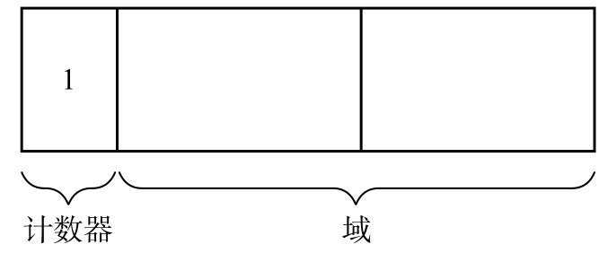
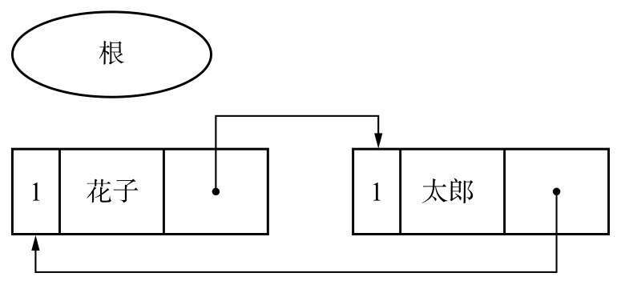
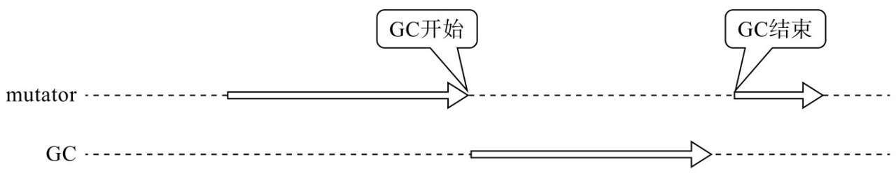

# 引用计数与增量回收

> 引用计数法、增量式垃圾回收与 RC Immix：三条"把回收摊开"的路线，各自的过程、代价与适用场景。
>
> 内容整理自语雀笔记，原书为《垃圾回收的算法与实现》（中村成洋 / 相川光）；内容整理自语雀笔记，原书为《垃圾回收的算法与实现》（中村成洋 / 相川光）；评价维度与横向选型见 [GC基础算法.md](GC基础算法.md)。

## 一、引用计数法

GC原本是一种“释放怎么都无法被引用的对象的机制”。那么人们自然而然地就会想到，可以让所有对象事先记录下“有多少程序引用自己”。让各对象知道自己的“人气指数”，从而让没有人气的对象自己消失，这就是引用计数法（Reference Counting），它是George E. Collins [6]于1960年钻研出来的。

引用计数法中引入了一个概念，那就是“计数器”。计数器表示的是对象的人气指数，也就是有多少程序引用了这个对象（被引用数）。

### 过程

在变更数组元素等的时候会进行指针的更新。通过更新指针，可能会产生没有被任何程序引用的垃圾对象。

引用计数法中会监督在更新指针的时候是否有产生垃圾，从而在产生垃圾时将其立刻回收。也就是说，这意味着在分配时没有分块的情况下，堆中所有的对象都为活动对象，这时没法新分配对象。另一方面，GC标记-清除算法即使产生了垃圾也不会将其马上回收，只会在没有分块的时候将垃圾一并回收。

像这样，可以说将内存管理和mutator同时运行正是引用计数法的一大特征。

### 优点

**可即刻回收垃圾**

在引用计数法中，每个对象始终都知道自己的被引用数（就是计数器的值）。当被引用数的值为0时，对象马上就会把自己作为空闲空间连接到空闲链表。也就是说，各个对象在变成垃圾的同时就会立刻被回收。要说这有什么意义，那就是内存空间不会被垃圾占领。垃圾全部都已连接到空闲链表，能作为分块再被利用。

另一方面，在其他的GC算法中，即使对象变成了垃圾，程序也无法立刻判别。只有当分块用尽后GC开始执行时，才能知道哪个对象是垃圾，哪个对象不是垃圾。也就是说，直到GC执行之前，都会有一部分内存空间被垃圾占用。

**最大暂停时间短**

在引用计数法中，只有当通过mutator更新指针时程序才会执行垃圾回收。也就是说，每次通过执行mutator生成垃圾时这部分垃圾都会被回收，因而大幅度地削减了mutator的最大暂停时间。

**没有必要沿指针查找**

引用计数法和GC标记-清除算法不一样，没必要由根沿指针查找。当我们想减少沿指针查找的次数时，它就派上用场了。打个比方，在分布式环境中，如果要沿各个计算节点之间的指针进行查找，成本就会增大，因此需要极力控制沿指针查找的次数。所以，有一种做法是在各个计算节点内回收垃圾时使用GC标记-清除算法，在考虑到节点间的引用关系时则采用引用计数法。

### 缺点

**计数器值的增减处理繁重**

虽然依据执行的mutator的动作不同而略有差距，我们不能一概而论，不过在大多数情况下指针都会频繁地更新。特别是有根的指针，会以近乎令人目眩的势头飞速地进行更新。这是因为根可以通过mutator直接被引用。在引用计数法中，每当指针更新时，计数器的值都会随之更新，因此值的增减处理必然会变得繁重。

**计数器需要占用很多位**

用于引用计数的计数器最大必须能数完堆中所有对象的引用数。打个比方，假如我们用的是32位机器，那么就有可能要让2的32次方个对象同时引用一个对象。考虑到这种情况，就有必要确保各对象的计数器有32位大小。也就是说，对于所有对象，必须留有32位的空间。这就害得内存空间的使用效率大大降低了。打比方说，假如对象只有2个域，那么其计数器就占了它整体的1/3。

**实现烦琐复杂**

引用计数的算法本身很简单，但事实上实现起来却不容易。进行指针更新操作的update_ptr()函数是在mutator这边调用的。打个比方，我们需要把以往写成 `*ptr=obj` 的地方都重写成 `update_ptr(ptr, obj)`。因为调用update_ptr()函数的地方非常多，所以重写过程中很容易出现遗漏。如果漏掉了某处，内存管理就无法正确进行，就会产生BUG。

**循环引用无法回收**

因为两个对象互相引用，所以各对象的计数器的值都是1。但是这些对象组并没有被其他任何对象引用。因此想一并回收这两个对象都不行，只要它们的计数器值都是1，就无法回收。像这样在两个及两个以上的对象互相循环引用形成对象组的情况下，即使这些对象组都成了垃圾，程序也无法将它们回收。

### 优化

**延迟引用计数法**

在讲引用计数法的缺点时，我们提到了其中一项是“计数器值的增减处理繁重”。下面就对改善此缺点的方法进行说明，即延迟引用计数法（Deferred Reference Counting）。这个方法是L. Peter Deutsch和Daniel G. Bobrow研究出来的。如2.2.3.1节中所述，计数器值增减处理繁重的原因之一是从根的引用变化频繁。因此，我们就让从根引用的指针的变化不反映在计数器上。打个比方，我们把重写全局变量指针的 `update_ptr($ptr, obj)` 改写成 `*$ptr=obj`。

**优点**

在延迟引用计数法中，程序延迟了根引用的计数，将垃圾一并回收。通过延迟，减轻了因根引用频繁发生变化而导致的计数器增减所带来的额外负担。

**缺点**

为了延迟计数器值的增减，垃圾不能马上得到回收，这样一来垃圾就会压迫堆，我们也就失去了引用计数法的一大优点——可即刻回收垃圾。

另外，scan_zct()函数导致最大暂停时间延长了。执行scan_zct()函数所花费的时间与$zct的大小成正比。$zct越大，要搜索的对象就越多，妨碍mutator运作的时间也就越长。要想缩减因scan_zct()函数而导致的暂停时间，就要缩小$zct。但是这样一来调用scan_zct()函数的频率就增加了，也压低了吞吐量。很明显这样就本末倒置了。

我们在延迟引用计数法中使用ZCT（Zero Count Table）。ZCT是一个表，它会事先记录下计数器值在dec_ref_cnt()函数的作用下变为0的对象。

**Sticky引用计数法**

减少计数器位宽的“Sticky引用计数法”。举个例子，我们假设用于计数器的位数为5位，那么这种计数器最多只能数到2的5次方减1，也就是31个引用数。如果此对象被大于31个对象引用，那么计数器就会溢出。这跟车辆速度计的指针爆表是一个状况。

针对计数器溢出（也就是爆表的对象），需要暂停对计数器的管理。对付这种对象，我们主要有两种方法。

**使用GC标记-清除算法进行管理**

我们在这里介绍的GC标记-清除算法和前面介绍的GC标记-清除算法主要有以下3点不同。

1. 一开始就把所有对象的计数器值设为0
2. 不标记对象，而是对计数器进行增量操作
3. 为了对计数器进行增量操作，算法对活动对象进行了不止一次的搜索

像这样，只要把引用计数法和GC标记-清除算法结合起来，在计数器溢出后即使对象成了垃圾，程序还是能回收它。另外还有一个优点，那就是还能回收循环的垃圾。

**1位引用计数法**

1位引用计数法（1bit Reference Counting）是Sticky引用计数法的一个极端例子。因为计数器只有1位大小，所以瞬间就会溢出，看上去几乎没什么意义。

不过，据Douglas W. Clark和C. Cordell Green [10]观察，“几乎没有对象是被共有的，所有对象都能被马上回收”。考虑到这一点，即使计数器只有1位，通过用0表示被引用数为1，用1表示被引用数大于等于2，这样也能有效率地进行内存管理。

**优点**

1位引用计数法的优点，是不容易出现高速缓存缺失。

缓存作为一块存储空间，比内存的读取速度要快得多。如果要读取的数据就在缓存里的话，计算机就能进行高速处理；但如果需要的数据不在缓存里（即高速缓存缺失）的话，就需要读取内存，从内存中查找数据并将其读取到缓存里，这样一来就会浪费许多时间。

**缺点**

1位引用计数法的缺点跟Sticky引用计数法的缺点基本一样。我们必须想个办法，看看怎么处理计数器溢出的对象。

据Clark和Green的观测结果表明，很多对象的计数器值都不足2。如果这个前提成立，那么把计数器溢出的对象放置不管也肯定没什么坏处。

然而，我们没法保证mutator能一直顺利运行，很可能会出现很多对象计数器溢出的情况。

上述情况下会生成大量计数器溢出的对象（也就是内存管理范围之外的对象），这会给堆带来巨大负担。这样一来，我们就很难保证分块了。

**部分标记-清除算法**

就是只对“可能有循环引用的对象群”使用GC标记-清除算法，对其他对象进行内存管理时使用引用计数法。

部分标记-清除算法的特征就是要涂色的对象和要进行计数器减量的对象不是同一对象，据此就可以很顺利地回收循环垃圾。

**限定搜索对象**

部分标记-清除算法的优点，就是把要搜索的对象限定在阴影对象及其子对象，也就是“可能是循环垃圾的对象群”中。

**部分标记-清除算法的局限性**

部分标记-清除算法并不是完美的，因为从队列搜索对象所付出的成本太大了。被队列记录的对象毕竟是候选垃圾，所以要搜索的对象绝对不在少数。这个算法总计需要查找3次对象，也就是说需要对从队列取出的阴影对象分别执行1次mark_gray()函数、scan_gray()函数以及collect_white()函数。这大大增加了内存管理所花费的时间。此外，搜索对象还害得引用计数法的一大优点——最大暂停时间短荡然无存。

---

## 二、增量式垃圾回收

增量式垃圾回收（Incremental GC）是一种通过逐渐推进垃圾回收来控制mutator最大暂停时间的方法。

通常的GC处理很繁重，一旦GC开始执行，不过多久mutator就没法执行了，这是常有的事。也就是说，GC本来是从事幕后工作的，可是它却一下子嚣张起来，害得mutator这个主角都没法发挥作用了。我们将像这样的在执行时害得mutator完全停止运行的GC叫作停止型GC。

根据应用程序（mutator）的用途不同，有时停止型GC是很要命的。因此人们想出了增量式垃圾回收这种方法。增量（incremental）这个词有“慢慢发生变化”的意思。

就如它的名字一样，增量式垃圾回收是将GC和mutator一点点交替运行的手法。

### 增量回收算法

**三色标记算法**

描述增量式垃圾回收的算法时我们有个方便的概念，那就是Edsger W. Dijkstra等人提出的三色标记算法（Tri-color marking）[15]。顾名思义，这个算法就是将GC中的对象按照各自的情况分成三种，这三种颜色和所包含的意思分别如下所示。

- 白色：还未搜索过的对象
- 灰色：正在搜索的对象
- 黑色：搜索完成的对象

GC开始运行前所有的对象都是白色。GC一开始运行，所有从根能到达的对象都会被标记，然后被堆到栈里。GC只是发现了这样的对象，但还没有搜索完它们，所以这些对象就成了灰色对象。

灰色对象会被依次从栈中取出，其子对象也会被涂成灰色。当其所有的子对象都被涂成灰色时，对象就会被涂成黑色。

当GC结束时已经不存在灰色对象了，活动对象全部为黑色，垃圾则为白色。

**GC标记-清除算法的分割**

增量式的GC标记-清除算法可分为以下三个阶段。

- 根查找阶段
- 标记阶段
- 清除阶段

我们在根查找阶段把能直接从根引用的对象涂成灰色。在标记阶段查找灰色对象，将其子对象也涂成灰色，查找结束后将灰色对象涂成黑色。在清除阶段则查找堆，将白色对象连接到空闲链表，将黑色对象变回白色。

**优点和缺点**

**缩短最大暂停时间。**

增量式垃圾回收不是一口气运行GC，而是和mutator交替运行的，因此不会长时间妨碍到mutator的运行。

增量式垃圾回收适合那些比起提高吞吐量，更重视缩短最大暂停时间的应用程序。

**降低了吞吐量。**

只要用到写入屏障，就会增加额外负担。在分代垃圾回收里，我们还能盼着通过缩短GC时间来抵消写入屏障带来的额外负担，但在增量式GC里就不用想了。因为我们的目的毕竟是缩短最大暂停时间，所以就要有做出一定的牺牲的心理准备。

**Steele的算法**

Steele 于 1977 年提出（论文名就叫 *Deletion*，面向实时 Lisp 系统）。核心手法是**前写屏障 + 删除式记录**：mutator 每次要覆盖一个指针字段，屏障先斩后奏地把**即将被删除的旧引用**记入一个类似记录集的集合，然后才真正执行写入。被删掉的路径因此"留了底"，白色对象虽然失去了灰侧的正常引用，仍可以从这个集合重新被标记到——维持的是**弱三色不变式**。代价是集合里的对象之后必须**重新扫描**（本书伪代码里对应的就是"重扫记录集"这一步），这笔账最终记在暂停或后续增量步里。它的思想直接影响了后来 CMS 一系"并发标记 + 停下补扫"的设计。

**汤浅的算法**

汤浅（Yuasa）1990 年的算法同样拦截"删除引用"这一侧，但做法更果断：写屏障触发时，**当场把被覆盖旧值所指向的对象"冻结"**（直接标成已保护的颜色），不给它留"以后再扫"的尾巴，所以基本免除大范围重扫。这个手法在文献里叫 freeze-on-attempt（尝试删除即冻结），Boehm GC 的 YUA（Yuasa's Unicolor Accumulator）是它的工程化后代。需要注意两点：

- 汤浅原文的颜色语义与现在通行的"白=未标、黑=完成"**相反**（原文是"从全黑开始、把疑似垃圾标灰"的思路），阅读原始文献时极易混淆；
- 冻结是**单向**的：当场保护的对象哪怕是垃圾也要留到下一轮，等于用更多的浮动垃圾换更小的重扫成本。

**比较各个写入屏障**

把本节出现的屏障放到一张表里对照（"拦哪条边"是理解一切变体的钥匙）：

| 屏障 | 拦截时机 | 保护对象 | 维护的不变式 | 重标记要不要重扫 | 代表 |
| --- | --- | --- | --- | --- | --- |
| 分代写屏障 | 写入**后**（后屏障） | 记下"写了指向年轻对象引用的老年对象" | 与三色无关（跨代记账） | 不需要，记录集/卡表直接当根 | Ungar 分代、JVM 卡表 |
| Steele（删除式） | 写入**前**（前屏障） | 被删除旧引用的目标对象（入集合待扫） | 弱三色 | **要**（重扫记录集） | 增量式回收 |
| 汤浅（freeze-on-attempt） | 写入**前** | 被删除旧值的目标，当场冻结 | 弱三色（保守化） | 基本不要 | Boehm GC（YUA） |
| Dijkstra 插入式 | 写入处 | **新加入**引用的目标染灰 | 强三色 | 不要，但"新分配对象"要特殊配合 | 教科书方案 |
| Shaston | 写入前 | 仅当"目标黑、新值白"时保护新值 | 强三色 | 不要 | IBM J9（snapshot within） |
| SATB（原始快照） | 写入**前** | 被覆盖的旧值记入缓冲区，由标记线程消化 | 弱三色 / 快照成立时点 | 不要重扫黑对象，只消化缓冲 | G1、Shenandoah |
| 增量更新 | 写入**前** | 记下字段被改的**黑对象**本身 | 强三色（暂时破坏、延后修复） | **要**（重扫被记录的黑对象） | CMS |
| 读屏障 | **读取**指针时 | 使用旧引用的现场（修正/拦截） | 与三色无关（多用于并发移动） | — | ZGC、（早期）Azul C4 |

细节以各收集器官方文档为准；本表只主张一点：**屏障的名字不重要，"在写发生前还是后、保护新边还是旧边"才决定它维护哪种不变式、留下什么代价**。

---

## 三、RC Immix 算法

RC Immix算法将引用计数法的一大缺点——吞吐量低改善到了实用级别。本算法将改善了引用计数法的“合并型引用计数法”（Coalesced Reference Counting）和我们在前面介绍的Immix组合了起来。

### 合并型引用计数法

在吞吐量方面，引用计数法比不上搜索型GC。原因之一就是“计数器增减频繁”。举个例子，某个对象A和对象B的计数器的变化如图所示。

在从（a）到（d）的过程中，每当X的指针发生变更，A和B的计数器都会有所增减。像这样，在引用计数法中，每当对象间的引用关系发生变化，都要增减该对象的计数器，以保证其数值一直是正确的。众所周知，这是通过写入屏障实现的。如果计数器频繁发生增减，那么写入屏障的执行频率就会增加，处理就会变得繁重。

由此可知，比起一直保持计数器的正确状态，通过使计数器的增量和减量互相抵消，更能有效地管理计数器。

把注意力放在某一时期最初和最后的状态上，在该期间内不进行计数器的增减。这就是合并型引用计数法（Coalesced Reference Counting）。在合并型引用计数法中，即使指针发生改动，计数器也不会增减。指针改动时的信息会被注册到更改缓冲区（Modified Buffer）。

如果在对象间的引用关系发生变化时计数器没有增减的话，就会导致有一段时间计数器值是错误的。不过这跟我们在第3章中介绍的“延迟引用计数法”没什么两样。在延迟引用计数法中，如果ZCT满了的话，我们就要查找ZCT，重新正确设置计数器的值。

另一方面，在合并型引用计数法中要将指针发生改动的对象和其所有子对象注册到更改缓冲区中。这项操作是通过写入屏障来执行的。不过因为这时候我们不更新计数器，所以计数器会保持错误的值。

### 优点和缺点

合并型引用计数法的优点是增加了吞吐量。它不是逐次进行计数器的增减处理，而是在某种程度上一并执行，所以能无视增量和减量相抵消的部分。尤其在一个对象频繁更新指针的情况下，合并型引用计数法能起到很大的作用。

它的缺点就是增加了mutator的暂停时间，这是因为在查找更改缓冲区的过程中需要让mutator暂停。当然，如果更改缓冲区的大小比较小，就能相应缩短暂停时间，不过这种情况下就没法指望增加吞吐量。这方面需要我们加以权衡好好调整。

### 优化

**合并型引用计数法和Immix的融合**

在以往的合并型引用计数法中，通过查找更改缓冲区，计数器值为0的对象会被连接到空闲链表，为之后的分配做准备。可见这和单纯的引用计数法是一样的。

**优点**

通过RC Immix，引用计数法最大的缺点——吞吐量低得到了大幅度的改善。据论文记载，与以往的引用计数法相比，其吞吐量平均提升了12%。根据基准测试程序的情况，甚至会超过搜索型GC。

吞吐量得到改善的原因有两个。其一是导入了合并型引用计数法。因为没有通过写入屏障来执行计数器的增减操作，所以即使对象间的引用关系频繁发生变化，吞吐量也不会下降太多。

另一个原因是撤除了空闲链表。通过以线为单位来管理分块，只要在线内移动指针就可以进行分配了。此外，这里还省去了把分块重新连接到空闲链表的处理。这部分我们在第4章讲GC复制算法的优点时已经解释过了。

**缺点**

RC Immix和合并型引用计数法一样，都会增加暂停时间。不过如前所述，可以通过调整更改缓冲区的大小来缩短暂停时间。

另一个缺点是“只要线内还有一个非垃圾对象，就无法将其回收”。在线的计数器是1，也就是说线内还有一个活动对象的情况下，会白白消耗大部分线。

---

---

## 面试官会追问什么

- **引用计数为什么处理不了循环引用？** → 它的可回收判据是"计数归零"，而环上的对象互相持有引用，**各自计数永远 ≥ 1**，即使整个环已经不可达。要处理环，只能引入外部的"标记"能力（追踪式 GC，或专门收集环的算法）。
- **增量式回收和并发回收差在哪？** → **增量**是"把一次 STW 拆成多次小 STW"：mutator 与 GC **轮流**跑，仍有停顿、只是更短；**并发**是让两者**同时**跑，必须靠写屏障保证正确性（见 [并发标记与写屏障.md](并发标记与写屏障.md)）。前者降低单次停顿，后者才能把停顿压到接近零，复杂度也差一个量级。
- **RC Immix 想解决引用计数的什么问题？** → 老问题有两个：**①计数更新的指令开销**（每次指针赋值都要增减）、**②内存碎片**（每个对象单独分配）。RC Immix 用"**延迟计数 + 块内合并**"缓解：把计数更新攒起来批量处理，并按"块"而非"单个对象"管理内存，让分配与回收都更缓存友好。

## 关联

- [GC基础算法.md](GC基础算法.md) — 评价维度与横向选型总表
- [标记类GC算法.md](标记类GC算法.md) — 标记-清除与引用计数的工程补遗
- [复制与分代回收.md](复制与分代回收.md) — 分代回收依赖的写屏障
- [JVM与垃圾回收.md](../java/JVM与垃圾回收.md) — 该算法在 JVM 里的落地与对应收集器
- [内存分配器.md](../go/运行时/内存分配器.md) — Go 侧的分配器分层
- [内存逃逸.md](../go/运行时/内存逃逸.md) — 分配量从哪来
