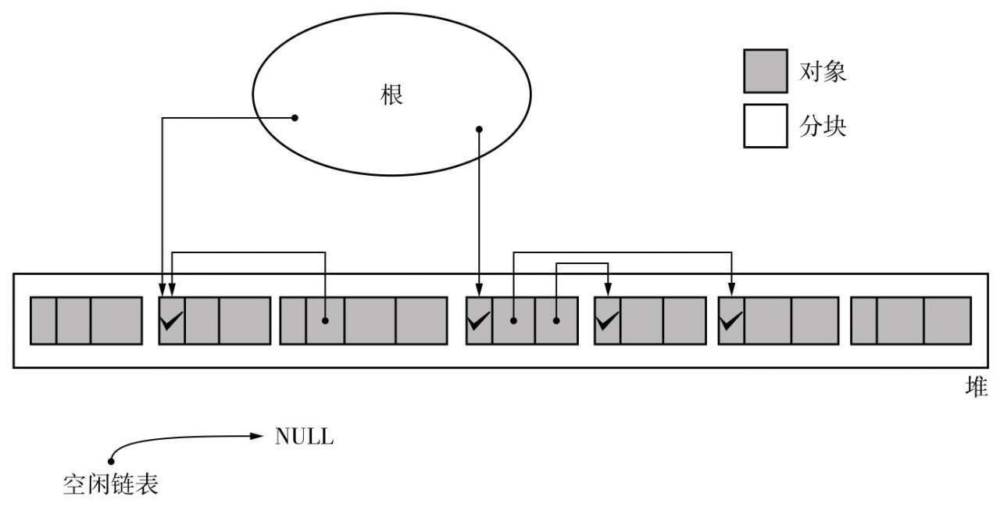
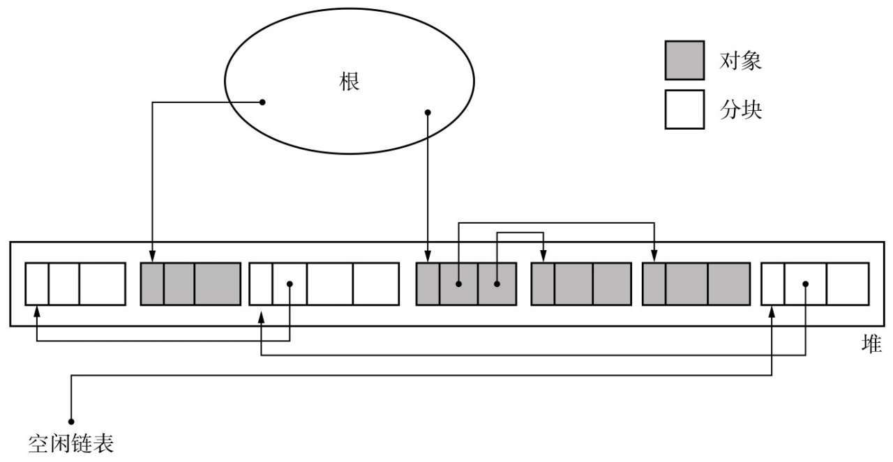
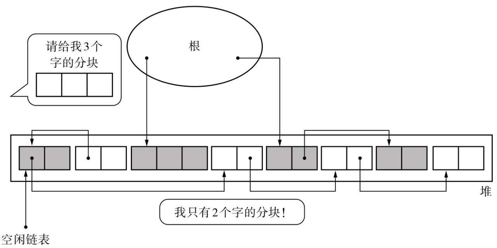
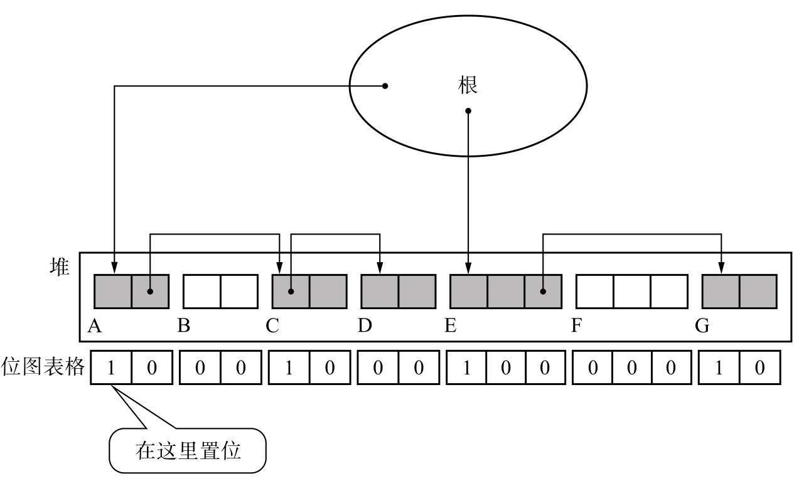

# 标记类 GC 算法

> 标记-清除、标记-压缩与保守式 GC：各自的过程、优缺点、适用场景，以及实现层面的三个关键细节。
>
> 内容整理自语雀笔记，原书为《垃圾回收的算法与实现》（中村成洋 / 相川光）；内容整理自语雀笔记，原书为《垃圾回收的算法与实现》（中村成洋 / 相川光）；评价维度与横向选型见 [GC基础算法.md](GC基础算法.md)。

## 一、标记-清除算法

GC标记-清除算法由标记阶段和清除阶段构成。标记阶段是把所有活动对象都做上标记的阶段。清除阶段是把那些没有标记的对象，也就是非活动对象回收的阶段。


### 过程

**标记阶段**

标记就是“遍历对象并标记”的处理过程。**这个过程执行一次。**




**搜索算法**

**深度优先搜索**


**广度优先搜索**


> 比较一下内存使用量（已存储的对象数量）就可以知道，深度优先搜索比广度优先搜索更能压低内存使用量。因此我们在标记阶段经常用到深度优先搜索。

**清除阶段**

我们必须把非活动对象回收再利用。回收对象就是把对象作为分块，连接到被称为“空闲链表”的单向链表。在之后进行分配时只要遍历这个空闲链表，就可以找到分块了。

在清除阶段，程序会遍历所有堆，进行垃圾回收。也就是说，所花费时间与堆大小成正比。堆越大，清除阶段所花费的时间就会越长。



### 分配

这里的分配是指将回收的垃圾进行再利用。

我们在清除阶段已经把垃圾对象连接到空闲链表了。搜索空闲链表并寻找大小合适的分块，这项操作就叫作分配。

### 合并

根据分配策略的不同可能会产生大量的小分块。但如果它们是连续的，我们就能把所有的小分块连在一起形成一个大分块。这种“连接连续分块”的操作就叫作合并（coalescing），合并是在清除阶段进行的。

### 优点

**实现简单**

说到GC标记-清除算法的优点，那当然要数算法简单，实现容易了。打个比方，接下来我们将在第3章中提到引用计数法，在引用计数法中就很难切实管理计数器的增减，实现也很困难。另外，如果算法实现简单，那么它与其他算法的组合也就相应地简单。在第3章和第4章中，我们会为大家介绍把GC标记-清除算法与其他GC算法相结合的方法。

**与保守式GC算法兼容**

在第6章中介绍的保守式GC算法中，对象是不能被移动的。因此保守式GC算法跟把对象从现在的场所复制到其他场所的GC复制算法（第4章）与标记-压缩算法（第5章）不兼容。而GC标记-清除算法因为不会移动对象，所以非常适合搭配保守式GC算法。事实上，在很多采用保守式GC算法的处理程序中也用到了GC标记-清除算法。

### 缺点

**碎片化**

在GC标记-清除算法的使用过程中会逐渐产生被细化的分块，不久后就会导致无数的小分块散布在堆的各处。我们称这种状况为碎片化（fragmentation）。



把具有引用关系的对象安排在堆中较远的位置，就会增加访问所需的时间。

因为分块在堆中的分布情况取决于mutator的运行情况，所以只要使用GC标记-清除算法，就会或多或少地产生碎片化。为了避免碎片化，可以采用将在第4章以及第5章中介绍的“压缩”，以及在本章介绍的“BiBOP法”。

**分配速度**

GC标记-清除算法中分块不是连续的，因此每次分配都必须遍历空闲链表，找到足够大的分块。最糟的情况就是每次进行分配都得把空闲链表遍历到最后。另一方面，因为在GC复制算法和GC标记-压缩算法中，分块是作为一个连续的内存空间存在的，所以没必要遍历空闲链表，分配就能非常高速地进行，而且还能在堆允许范围内分配很大的对象。本章在后面叙述的多个空闲链表（multiple free-list）和BiBOP法都是为了能在GC标记-清除算法中高速进行分配而想出的方法。

**与写时复制技术不兼容**

写时复制技术（copy-on-write）是在Linux等众多UNIX操作系统的虚拟存储中用到的高速化方法。打个比方，在Linux中复制进程，也就是使用fork()函数时，大部分内存空间都不会被复制。只是复制进程，就复制了所有内存空间的话也太说不过去了吧。因此，写时复制技术只是装作已经复制了内存空间，实际上是将内存空间共享了。

当我们对共享内存空间进行写入时，不能直接重写共享内存。因为从其他程序访问时，会发生数据不一致的情况。在重写时，要复制自己私有空间的数据，对这个私有空间进行重写。复制后只访问这个私有空间，不访问共享内存。像这样，因为这门技术是“在写入时进行复制”的，所以才被称为写时复制技术。

这样的话，GC标记-清除算法就会存在一个问题——与写时复制技术不兼容。即使没重写对象，GC也会设置所有活动对象的标志位，这样就会频繁发生本不应该发生的复制，压迫到内存空间。为了处理这个问题，我们采用位图标记（bitmap marking）的方法。

### 优化

**多个空闲链表**

之前我们讲的标记-清除算法中只用到了一个空闲链表，在这个空闲链表中，对大的分块和小的分块进行同样的处理。但是这样一来，每次分配的时候都要遍历一次空闲链表来寻找合适大小的分块，这样非常浪费时间。因此，我们有一种方法，就是利用分块大小不同的空闲链表，即创建只连接大分块的空闲链表和只连接小分块的空闲链表。这样一来，只要按照mutator所申请的分块大小选择空闲链表，就能在短时间内找到符合条件的分块了。


**BiBOP法**

BiBOP是Big Bag Of Pages的缩写。这么说可能比较难懂，用一句话概括就是“将大小相近的对象整理成固定大小的块进行管理的做法”。

把堆分割成固定大小的块，让每个块只能配置同样大小的对象。这就是BiBOP法。


但是，使用BiBOP法并不能完全消除碎片化。比方说在全部用于2个字的块中，只有1到2个活动对象，这种情况下就不能算是有效利用了堆。BiBOP法原本是为了消除碎片化，提高堆使用效率而采用的方法。但像上面这样，在多个块中分散残留着同样大小的对象，反而会降低堆使用效率。

**位图标记**

在单纯的GC标记-清除算法中，用于标记的位是被分配到各个对象的头中的。也就是说，算法是把对象和头一并处理的。然而之前在2.3.3节中也提过，这跟写时复制技术不兼容。

对此我们有个方法，那就是只收集各个对象的标志位并表格化，不跟对象一起管理。在标记的时候，不在对象的头里置位，而是在这个表格中的特定场所置位。像这样集合了用于标记的位的表格称为“位图表格”（bitmap table），利用这个表格进行标记的行为称为“位图标记”。位图表格的实现方法有多种，例如散列表和树形结构等。



- **优点**
  - **与写时复制技术兼容**：以往的标记操作都是直接对对象设置标志位，这会产生无谓的复制。然而，使用位图标记是不会对对象设置标志位的，所以也不会发生无谓的复制。当然，因为对位图表格进行了重写，所以在此处会发生复制。不过，因为位图表格非常小，所以即使被复制也不会有什么大的影响。
  - **清除操作更高效**：不仅在标记阶段，在清除阶段也可以得到好处。以往的清除操作都必须遍历整个堆，把非活动对象连接到空闲链表，同时取消活动对象的标志位。利用了位图表格的清除操作则把所有对象的标志位集合到一处，所以可以快速消去标志位。

**延迟清除法**

延迟清除法（Lazy Sweep）是缩减因清除操作而导致的mutator最大暂停时间的方法。

因为延迟清除法不是一下遍历整个堆，它只在分配时执行必要的遍历，所以可以压缩因清除操作而导致的mutator的暂停时间。这就是“延迟”清除操作的意思。

---

## 二、标记-压缩算法

GC标记-压缩算法（Mark Compact GC）是将GC标记-清除算法与GC复制算法相结合的产物。

GC标记-压缩算法由标记阶段和压缩阶段构成。

### 过程


**标记阶段**

这里的标记阶段和我们在讲解GC标记-清除算法时提到的标记阶段完全一样。

**压缩（Lisp2算法）**

压缩阶段由以下3个步骤构成。

1. 设定forwarding指针
2. 更新指针
3. 移动对象

### 优点

可有效利用堆，GC标记-压缩算法和其他算法相比而言，堆利用效率高。

在GC标记-压缩算法中会执行压缩。执行压缩所带来的优点我们已经在4.2节中提过了。

而且GC标记-压缩算法不会出现GC复制算法那样只能利用半个堆的情况。GC标记-压缩算法可以在整个堆中安排对象，堆使用效率几乎是GC复制算法的2倍。用“几乎”这个词，是因为要留出用于forwarding指针的空间，所以严格来说不到2倍。

另一方面，尽管GC标记-清除算法也能利用整个堆，但因为没有压缩的过程，所以会产生碎片化，不能充分有效地利用堆。

### 缺点

压缩花费计算成本。

如上所述，压缩有着巨大的好处。不过为了享受这些好处，我们也必须做出巨大的牺牲。

在本节介绍的Lisp2算法的压缩中，必须对整个堆进行3次搜索。也就是说，执行该算法所花费的时间是和堆大小成正比的。GC标记-压缩算法的吞吐量要劣于其他算法。

> 在GC标记-清除算法中，清除阶段也要搜索整个堆，不过搜索1次就够了。但GC标记-压缩算法要搜索3次，这样就要花费约3倍的时间，这是一个相当巨大的缺陷，特别是堆越大，所消耗的成本也就越大。

### 优化

**Two-Finger算法**

Two-Finger算法有着很大的制约条件，那就是“必须将所有对象整理成大小一致”。之前介绍的算法都没有这种限制，而Two-Finger算法就必须严格遵守这个制约条件。

Two-Finger算法由以下2个步骤构成。

1. 移动对象
2. 更新指针


在Lisp2算法中，通过执行压缩操作使活动对象往左边滑动。而在Two-Finger算法中，则是通过执行压缩操作来让活动对象填补空闲空间。此时为了让对象能恰好填补空闲空间，必须让所有对象大小一致。

**优点**

Lisp2算法要事先确保每个对象都留有1个字用于forwarding指针，这就压迫了堆。然而因为Two-Finger算法能把forwarding指针设置在移动前的对象的域里，所以不需要额外的内存空间以用于forwarding指针，因此在内存的使用效率上，该算法要比Lisp2算法的使用效率高。

> 此外，在Two-Finger算法中，压缩所带来的搜索次数只有2次，比Lisp2算法少1次，在吞吐量方面占优势。

**缺点**

就像我们在介绍GC复制算法时所说的那样，将具有引用关系的对象安排在堆中较近的位置，就能够通过缓存来提高访问速度。不过Two-Finger算法则不考虑对象间的引用关系，一律对其进行压缩，结果就导致对象的顺序在压缩前后产生了巨大的变化。因此，我们基本上也无法期待这个算法能沾缓存的光。

此外该算法还有一个限制条件，那就是所有对象的大小必须一致。因为能消除这个限制的处理系统不太多，所以这点制约了Two-Finger算法的应用范围。不过，我们用前面介绍到的BiBOP法就能克服这个问题。只要把同一大小的对象安排在同一个分块里，就能对每个分块应用Two-Finger算法了。

**表格算法**

这个算法和Two-Finger算法一样，都是执行2次压缩操作。

表格算法通过以下2个步骤来执行压缩。

1. 移动对象（群）以及构筑间隙表格（break table）
2. 更新指针

**优点**

在表格算法中，没有必要为压缩准备出多余的空间，这是因为该算法很好地利用了分块，保留了更换指针所必需的信息。

虽然在不需要多余空间这一点上表格算法跟Two-Finger一样，不过在压缩前后保留对象顺序这一点上，表格算法可以说比Two-Finger要优秀得多。这是因为在表格算法中，可以通过缓存来提高对象的访问速度。

**缺点**

要维持间隙表格需要付出很高的代价。考虑到每次移动活动对象群都要进行表格的移动和更新，代价高也是理所当然的。

此外，在更新指针时也不能忽略搜索表格所带来的消耗。在更新指针前，如果先将表格排序，则表格的搜索就能高速化。不过排序表格也需要相应的消耗，所以并不能从根本上解决问题。

**ImmixGC算法**

ImmixGC把堆分为一定大小的“块”（block），再把每个块分成一定大小的“线”（line）。这个算法不是以对象为单位，而是以线为单位回收垃圾的。分配时程序首先寻找空的线，然后安排对象。没找到空的线时就执行GC。

GC分为以下3个步骤执行。

1. 选定备用的From块
2. 搜索阶段
3. 清除阶段

**优点**

ImmixGC最大的特征是将对象分为块和线两个阶段进行管理。

打个比方，分配的时候我们优先使用的是RECYCLABLE块而不是FREE块对吧。这样一来就容易把对象安排在同一个块里，因此碎片化问题就得到了解决，同时也能将缓存加以利用。

不过另一方面，如果只以块为单位来管理对象，就会白白浪费很多堆。举个极端的例子，即使1个块里只有1个活动对象，也必须保留这个块里所有的残留垃圾。

因此，我们把块分成了更小的线。这样一来，就能更精确地管理块里的对象，抑制堆的消耗量。

此外，因为我们将碎片化严重的块拿来当备用From块，所以可以有效地解决碎片化问题。

**缺点**

在Immix的压缩过程中，对象不是按顺序保存的，所以不要期待ImmixGC能沾缓存的光。毕竟它只是为了防止碎片化而进行的压缩。

还请大家回忆一下，我们曾经做过保守的标记。那些没有活动对象的线有可能无法被回收。虽然我们对吞吐量予以了足够的重视，但却无法有效地使用堆。

---

## 三、保守式 GC（Conservative GC）

简单来说，保守式GC（Conservative GC）指的是“不能识别指针和非指针的GC”。

不明确的根（ambiguous roots）指的是什么呢？

1. 寄存器
2. 调用栈
3. 全局变量空间

事实上它们都是不明确的根。

在不明确的根这一条件下，GC不能识别指针和非指针。也就是说，不明确的根里所有的值都有可能是指针。然而这样一来，在GC时就会大量出现指针和被错误识别成指针的非指针。因此保守式GC会检查不明确的根，以“某种程度”的精度来识别指针。

> 在采用GC标记-清除算法的情况下，一找到貌似指针的非指针，程序就会将非指针指向的对象错误地识别为活动对象，对其进行标记。因为被错误识别的对象不会被废弃而会被保留，所以遵守了GC的原则——“不废弃活动对象”。像这样，在运行GC时采取的是一种保守的态度，即“把可疑的东西看作指针，稳妥处理”，所以我们称这种方法为“保守式GC”。

### 优点

语言处理程序不依赖于GC。

保守式GC的优点在于容易编写语言处理程序。处理程序基本上不用在意GC就可以编写代码。语言处理程序的实现者即使没有意识到GC的存在，程序也会自己回收垃圾。因此语言处理程序的实现要比准确式GC简单。

### 缺点

**识别指针和非指针需要付出成本**

识别不明确的根和数据结构的值为“指针”或“非指针”时，我们需要付出一定的成本。而这一成本在后面要为大家介绍的准确式GC里是不存在的。

**错误识别指针会压迫堆**

当存在貌似指针的非指针时，保守式GC会把被引用的对象错误识别为活动对象。如果这个对象存在大量的子对象，那么它们一律都会被看成活动对象。因为程序把已经死了的非活动对象看成了活动对象，所以垃圾对象会严重压迫堆。

**能够使用的GC算法有限**

在无法正确识别指针的环境中，我们基本上不能使用GC复制算法等移动对象的GC算法。就如我们之前在第4章中所讲的那样，GC复制算法在复制对象的时候，会将根的值重写到新空间。要是我们想用不明确的根这么办的话，就可能把非指针重写了。此外，在对象内重写指针时，也有可能因为不明确的数据结构而重写了非指针。一旦重写了非指针，就会产生意想不到的BUG。

### 优化（准确式GC）

准确式GC（Exact GC）和保守式GC正好相反，它是能正确识别指针和非指针的GC。

准确式GC和保守式GC不同，它是基于能精确地识别指针和非指针的“正确的根”（exact roots）来执行GC的。

创建正确的根的方法有很多种，不过这些方法有个共通点，就是需要“语言处理程序的支援”，所以正确的根的创建方法是依赖于语言处理程序的实现的。

本章中我们将为大家介绍几种创建方法。

**打标签**

第一个方法是打标签（tag），目的是将不明确的根里的所有非指针都与指针区别开来。打标签的方法种类繁多，在这里我们为大家解说的是用最基本的低1位作为标签的方法。

**优点**

首先，准确式GC完全没有保守式GC固有的问题——错误识别指针。也就是说，它不会认为已经死了的对象还活着。GC之后，堆里只会留下活动对象。此外，它可以实现GC复制算法等移动对象的算法。因为准确式GC能明确识别指针跟非指针，所以即使移动对象，重写根的值，这个对象也不可能是非指针。

**缺点**

当创建准确式GC时，语言处理程序必须对GC进行一些支援。也就是说，在创建语言处理程序时必须顾及GC。排除某些特殊的实现方法，这会给实现者带来相当沉重的负担。可见在处理程序的实现上，准确式GC比保守式GC麻烦。

此外，要创建正确的根就必须付出一定的代价，而这种代价在保守式GC中是不存在的。好比打标签，因为每次进行计算时都需要取消标签，然后再重新设置，这就关系到语言处理程序整体的执行速度了。

**间接引用**

不知道大家是否还记得，保守式GC有个缺点，就是“不能使用GC复制算法等移动对象的算法”。解决这个问题的方法之一就是“间接引用”。

为什么在保守式GC中无法使用GC复制算法这样的算法呢？大家可以想到，这是因为在重写不明确的根（或不明确的数据结构）时，重写的对象有可能是非指针。解决这个问题的办法就是经由句柄（handle）来间接地处理对象。

**优点**

因为在使用间接引用的情况下有可能实现GC复制算法，所以可以得到GC复制算法所带来的好处，例如消除碎片化等。详情请参考GC复制算法。

另外，我们还能实现GC标记-压缩算法。

**缺点**

因为必须将所有对象都（经由句柄）间接引用，所以会拉低访问对象内数据的速度，这会关系到整个语言处理程序的速度。

**MostlyCopyingGC**

MostlyCopyingGC就是“把那些不明确的根指向的对象以外的对象都复制的GC算法”。Mostly是“大部分”的意思。说白了，MostlyCopyingGC就是抛开那些不能移动的对象，将其他“大部分”的对象都进行复制的GC算法。

MostlyCopyingGC还有如下这些前提条件。

1. 根是不明确的根
2. 没有不明确的数据结构
3. 对象大小随意
4. CPU是32位

**优点和缺点**

说起MostlyCopyingGC的优点，首先就是能在保守式GC里使用GC复制算法。也就是说，使用MostlyCopyingGC的话，能够直接继承GC复制算法的优点。

话说回来，当然它的缺点也跟GC复制算法很像。MostlyCopyingGC特有的缺点就是，在包含有从根引用的对象的页内，所有的对象都会被看成活动对象。也就是说，垃圾对象也会被看成活动对象，这样一来就拉低了内存的使用效率。

**黑名单**

顾名思义，黑名单就是一种创建“需要注意的地址的名单”的方法。这个黑名单里记录的是“不明确的根内的非指针，其指向的是有可能被分配对象的地址”。我们将这项记录操作称为“记入黑名单”。

黑名单里记录的是“需要注意的地址”。一旦分配程序把对象分配到这些需要注意的地址中，这个对象就很可能被非指针值所引用。也就是说，即使分配后对象成了垃圾，也很有可能被错误识别成“它还活着”。

为此，在将对象分配到需要注意的地址时，所分配的对象有着如下限制条件。

1. 小对象
2. 没有子对象的对象

为什么只能分配上述这样的对象呢？因为如果这样的对象成了垃圾，即使被错误识别了，也不会有什么大的损失。

**优点和缺点**

这样一来，保守式GC因错误识别指针而压迫堆这个保守式GC的一大问题就得到了缓解，堆的使用效率也得到了提升。因此，这里的GC对象少于通常的保守式GC里的对象，GC的执行速度也大大提升了。不过相应地，在分配对象时则需要花功夫来检查黑名单。

---

## 四、实现细节：前缀和与不借空间的技巧

本书 Lisp2/Two-Finger/表格算法之外，现代实现共享几个构件：

**标记位图**：每堆字一个 bit 集中存放（对应本书"位图标记"）。除了兼容写时复制，它还有第二个红利：**清理工可以按机器字整块处理**——全 0 字（连续死区）、全 1 字（连续活区）一次带过，不必逐对象看标记位。压缩阶段与"空闲链/已用链"的交替扫描（Bit-su 一系的思路）都建立在位图可批量读之上。

**压缩 = 前缀和**：每个活对象的新地址 = 压缩区起点 + 它之前所有活对象的大小之和：

```text
堆:        [活4][死8][活4][死4][活8] ...
存活字节:    4          4        8
前缀和:      0          4        8      ← 各对象新家偏移
新地址 = 压缩基址 + (它之前的活对象大小之和)
```

麻烦在于：算前缀和与写新地址之间，"旧位置"还要放转发信息。不额外要空间的三类技巧：

1. **偷对象自己的字**：Lisp2/Cheney 形态（复制时顺手留 forwarding）；
2. **双向游标**：Two-Finger 把放得下转发的空间从死对象里"抠"出来（代价：不打乱顺序的要求满足不了）；
3. **方向位 + 撞位处理**：标记时顺手在对象头上放 1 bit"往哪个方向搬"，第一遍只算**目的地址**并就地存放，只有当两个对象撞进同一槽时才把其中之一暂存到别处（Thread-2/Stuart 一系的思想，现代 JVM 老年代压缩与位图组合使用的思路与此同源；具体实现以 JDK 版本文档为准）。它依赖一个前提——对象头有富余位，这也是位图标记常配"头位不够用位图补"的原因。

**压缩为什么改善缓存局部性**：整理后的布局是"可达性遍历序"的投影，引用相近的对象物理相邻（前文复制算法一节已论证），再加上空洞消失、预取器按线性地址流预测命中。反过来，标记-清除长期使用后局部性单调劣化——这就是"跑了 Full GC/压缩整理之后应用短暂无敌"这一工程玄学的算法解释。

**代价的本质**：移动对象 + 全量改引用，要么 STW，要么像上节 Brooks 指针/着色指针那样用屏障把成本摊平。**标记-压缩是"暂停换局部性"的算法，它和"屏障换并发度"是同一枚硬币的两面。**

---

## 五、工程补遗：标记-清除与引用计数

**标记-清除的"分配慢"还有一层**：前文讲了遍历空闲链。补两个工程细节：

- **合并时机二选一**：eager coalescing（释放时立刻合并相邻空闲块，成本前置）vs lazy coalescing（分配失败时才回头合并，成本落在最要命的分配路径上）。选哪头决定了"分配毛刺"出现在何时。
- **多线程分配的锁**：共享空闲链的每次摘取都要互斥，于是有了"每线程切一块再自由分配"（TLAB/mcache 思路，Go 侧对应 mcache/mcentral 分层，见 [内存分配器.md](../go/运行时/内存分配器.md)）——线程本地缓冲又引入新的碎片（缓冲里的零头归还时机）。碎片化的终极危害也不是浪费，而是**总量够但连续不够**：JVM 里的 promotion failure / concurrent mode failure 就是这么来的。

**引用计数：增量式 RC 与实时性账本**

- **增量式 RC**（Bacon & Rajan）：把计数拆成"外部引用数（跨内存块）+ 内部引用数（块内）"，块内指针怎么折腾，屏障只做两个计数器间的 ±1 搬运，O(1) 且与引用次数解耦；外部计数归零时才做**试探删除**（块内互减），剩下的才可能是真根。这是把"写屏障贵"从逐次摊薄到账本合并的代表作。
- **为什么实时/交互语言偏爱 RC**：回收就地发生，没有全局同步的 GC 周期，单次操作的延迟**有界且可解释**（多数写入只碰两个对象头）。风险也在这：析构级联（深层容器递归 drop）让一次释放的代价变成"引用链长度"，工程上要么改迭代断开、要么把级联甩给后台线程（Python 的参考计数 + 专管循环的代式收集器是标准组合）。
- 循环垃圾兜底与本书"部分标记-清除/延迟引用计数/Sticky"是同一思想族：**RC 负责绝大多数即时回收，周期式扫描只处理"RC 说不清"的那一小撮**。

---

---

## 面试官会追问什么

- **标记-清除为什么需要"空闲链表"？** → 清除后留下的是**不连续的空闲块**，分配器必须知道"哪里有洞、洞多大"，空闲链表就是记录这些洞的结构。所以它的分配**不是 O(1)**（要遍历链表找合适的块），这是它比复制算法慢的地方之一。
- **标记-压缩搬走对象后，指向它的指针怎么办？** → 必须**全部修正**：扫一遍根与所有已标记对象，把"旧地址"改成"新地址"。所以压缩的成本不只是"搬"，还包括"找出所有引用它的人" —— 这也是它**必须暂停**的根本原因。原文讲的"前缀和"技巧，就是让新地址能在 O(1) 内算出来、避免二次遍历。
- **保守式 GC 的"保守"保守在哪？** → 它**不区分"这个字是指针还是整数"**：只要值落在堆区间内就当作指针。好处是能用于没有类型信息的场景；代价有两条 —— ①**假引用**（一个恰好等于堆地址的整数会保住垃圾对象，产生浮动垃圾）；②**不能移动对象**（无法修正假指针），所以保守式基本只能配标记-清除。

## 关联

- [GC基础算法.md](GC基础算法.md) — 评价维度与横向选型总表
- [复制与分代回收.md](复制与分代回收.md) — 另一条路线：把存活对象搬走
- [引用计数与增量回收.md](引用计数与增量回收.md) — 不用标记的两种思路
- [JVM与垃圾回收.md](../java/JVM与垃圾回收.md) — 该算法在 JVM 里的落地与对应收集器
- [内存分配器.md](../go/运行时/内存分配器.md) — Go 侧的分配器分层
- [内存逃逸.md](../go/运行时/内存逃逸.md) — 分配量从哪来
