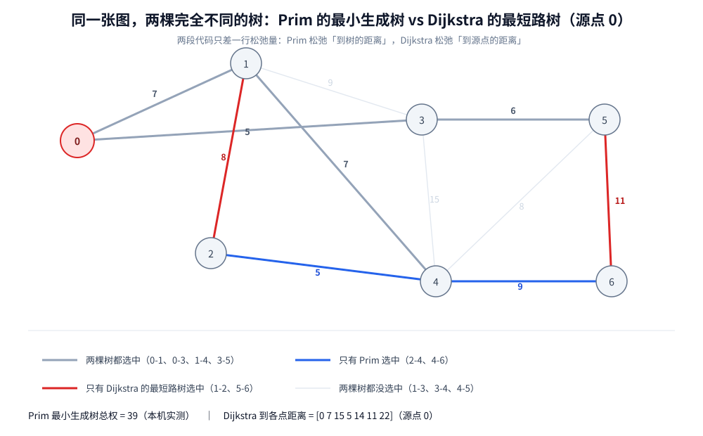

# Prim 最小生成树

> 换一个方向建同一棵最小生成树：**从一个点出发，每轮把「离当前树最近的那个点」拉进来**。
> 它和 Dijkstra **几乎是同一份代码，只差一行松弛量**（本篇把两段并排摆出来指出那一行）；
> 再讲朴素 `O(V²)` 与堆 `O(E log V)` 两个版本，以及「稠密图选 Prim、稀疏图看情况」的判据与实测。
>
> ⭐ 本篇与 [Kruskal.md](Kruskal.md) 是**一对零件篇**：两篇只讲「怎么挑边」这一个动作。
> 「最小生成树是什么 / 与最短路的区别」这一层**只写在 [Kruskal.md](Kruskal.md) 第一节**，本篇直接引用、不重复；
> 正确性证明（切分定理 / 环性质）在 [Kruskal.md](Kruskal.md) 第三节，本篇只补它在 Prim 语境下的一句话形式。
>
> 内容整理自个人学习笔记，素材见 [素材清单](../../../素材清单.md)。最短路的完整版图见
> [../最短路/Dijkstra.md](../最短路/Dijkstra.md)（本篇第二节与它正面对照）；小顶堆的接口见
> [../../数据结构.md](../../数据结构.md)；复杂度口径见 [../../复杂度分析.md](../../复杂度分析.md)。
>
> 📎 本篇所有输出均为本机实跑逐字抄录：**Go 1.26.5（windows/amd64）** 与 **JDK 1.8.0_321** 各实现一份，
> 输出**逐行对齐**（实验二的耗时数据除外 —— 那是两语言各自计时的必然差异）。实验代码在 `.workbuddy/tmp/mst_lab/prim/`。

---

## 一、Prim 是怎么一步步把树「长」出来的？

**本节要点**：全部机制一句话——**选一个起点，每轮把「离当前树最近的那一个点」拉进来，并更新其余点到树的距离**。看懂「谁是最近的」，就看懂了 Prim。

### 1.1 两条规则

Prim 从一个起点出发，把点分成「已在树里」和「还没进树」两拨，用一个数组 `dist` 记录**每个待定点到当前这棵树的距离**：

| 步骤 | 动作 |
|---|---|
| ① | 任选一个起点 `s` 入树，`dist[s] = 0`，其余点的 `dist` 为 `∞` |
| ② | 找出**还没进树、且 `dist` 最小**的那个点 `u`，把它拉进树（这条边就是它连回树的那条） |
| ③ | **松弛它的邻居**：对每条 `u → v`（权 `w`），若 `w < dist[v]`，就令 `dist[v] = w`（`v` 现在离树更近了） |
| ④ | 重复 ②③ 直到所有点都进树 |

⭐ 关键在于 `dist[v]` 的含义：**不是 `v` 到某个源点的距离，而是 `v` 到「已经长出来的这棵树」的最短一条边的权**。这一步之差，就是第二节要讲的全部内容。

⚠️ 与 Kruskal 的方向恰好相反：**Kruskal 有全局的边排序表、按边扫；Prim 只有「当前树的边界」、按点扩**。一个「从边出发」，一个「从点出发」。



### 1.2 逐步推演（本机实跑）

仍是 [Kruskal.md](Kruskal.md) 那张 7 点 11 边的图，从点 `0` 出发：

```text
================ 实验一：Prim 与 Dijkstra —— 同一张图、同一份骨架 ================
  图：7 点 11 边（沿用 Kruskal 篇那张）
  Prim     （源点 0）：dist[] 的含义是「到已建成的那棵树的距离」
    加入顺序 = [0 3 5 1 4 2 6]
    最小生成树总权 = 39
  Dijkstra （源点 0）：dist[] 的含义是「到源点 0 的距离」
    dist[]   = [0 7 15 5 14 11 22]
  ⚠️ 两份代码只差一行（松弛量不同）：
    Prim     : if w　　　　 < dist[v] { dist[v] = w　　　　 ; prev[v] = u }
    Dijkstra : if dist[u]+w < dist[v] { dist[v] = dist[u]+w ; prev[v] = u }
  ⭐ 取点规则、used[] 判据、「未访问中取最小」——全部相同；只有「松弛到什么」不同
  ⭐ 于是两者算出两棵完全不同的树：Prim 管「连通总代价最小」，Dijkstra 管「到源点最近」
```

三处必须看清的细节：

1. **加入顺序 `[0 3 5 1 4 2 6]`**：`0` 之后先拉 `3`（`dist = 5`，因为边 `0-3(5)` 最轻），再拉 `5`、`1`、`4`、`2`、`6`。**每一轮拉的都是「当前离树最近」的那个点**；
2. **⭐ 同一张图、同一个起点，Prim 与 Dijkstra 给出两棵不同的树**：Prim 拿了 `2-4(5)` 和 `4-6(9)`，Dijkstra 的最短路树拿的是 `1-2(8)` 和 `5-6(11)`（见第一节 SVG）；
3. **`dist[]` 数组不能直接比**：Prim 的 `dist` 是「到树」的、Dijkstra 的 `dist` 是「到 0」的 —— **同一个名字、两套完全不同的量**。这是把它们搞混的根源。

### 1.3 为什么 Prim 也是对的

Prim 每轮的候选边，正好是「**已进树的点集 `S`**」与「其余点」之间的横切边 —— 它挑的是其中**最轻的那一条**。而切分定理（见 [Kruskal.md](Kruskal.md) 第三节）保证：**任何切分的最轻横切边都在某棵 MST 里**。于是 Prim 每轮都不亏，归纳起来就得到了整棵 MST。

⭐ 一句话：**Prim 是切分定理最直白的实现** —— 它每长一步，就当场划一次切分、取一次最轻横切边。Kruskal 也在用切分定理，但它靠「全局排序 + 判环」间接实现，不如 Prim 这么露骨。

---

## 二、Prim 和 Dijkstra 几乎是同一份代码，只差一行

**本节要点**：这不是修辞。**取点规则、`used[]` 判据、堆/线性扫描的骨架全部相同**，只有「松弛什么」不同。看清这一行，就同时理解了两个算法。

### 2.1 并排看：唯一不同的一行

两段代码用的是同一套邻接表、同一个 `dist[]`、同一套「取未访问中最小」的循环。唯一的差别在松弛那一步：

```text
    Prim     : if w　　　　 < dist[v] { dist[v] = w　　　　 ; prev[v] = u }
    Dijkstra : if dist[u]+w < dist[v] { dist[v] = dist[u]+w ; prev[v] = u }
```

写成两份可对照的代码就是（同一套邻接表与 `used[]`，只有松弛那一行不同）：

```text
── Prim：dist[v] 是「v 到已建成的树」的距离 ──────────────
for 每个刚进树的点 u:
    for 每条出边 u → v（权 w）:
        if !used[v] && w < dist[v]:        ⭐ Prim 的松弛：直接就是这条边的权
            dist[v] = w
            prev[v] = u

── Dijkstra：dist[v] 是「v 到源点」的距离 ──────────────
for 每个刚定稿的点 u:
    for 每条出边 u → v（权 w）:
        if !used[v] && dist[u] + w < dist[v]:   ⭐ Dijkstra 的松弛：要累加 dist[u]
            dist[v] = dist[u] + w
            prev[v] = u
```

⭐ **两个符号之差**：Prim 的右边是 `w`（**单条边**的权）；Dijkstra 的右边是 `dist[u] + w`（**从源点累积过来**的总代价）。

### 2.2 为什么差这一行，结果就完全不同

| | Prim | Dijkstra |
|---|---|---|
| `dist[v]` 的含义 | `v` 到**树**的最短一条边 | `v` 到**源点**的最短路径长度 |
| 松弛用 `w` 还是 `dist[u]+w` | 用 `w`（换一条更近的边） | 用 `dist[u]+w`（换一条更短的路） |
| 生成的是 | 最小生成树（边权和最小） | 最短路树（源点到各点最近） |
| 第一个点 | 任意（谁当根结果总权都一样） | 必须是源点 |
| 边权能为负吗 | **能** | **不能**（见 [../最短路/Dijkstra.md](../最短路/Dijkstra.md) 第二节） |

⭐ **一句话记住**：**只关心「连进来这一步花多少」→ 用 `w`（Prim）；关心「从头走到这里一共花多少」→ 用 `dist[u]+w`（Dijkstra）。**
前者只做**单条边之间的比较**，所以负权无害；后者要把边权**沿路径累加**，一旦有负权，证明里的不等式就崩了。

### 2.3 两者算出的距离没有任何可比性

本机 1.2 的实测把这一点摆得很清楚：

- Prim 的 `dist[]` 最终含义已经变了（它描述的是「每次从树上伸出去的最短边」），**总权 39** 是所有选中边的和；
- Dijkstra 的 `dist[] = [0 7 15 5 14 11 22]` 是**到源点的距离**，把它们加起来（`0+7+15+5+14+11+22 = 74`）**与 MST 总权 39 毫无关系**。

⚠️ 所以**不要拿两者算出的数直接比** —— 它们的量纲看起来一样（都是「代价」），含义完全不同。

---

## 三、朴素 O(V²) 还是堆 O(E log V)？—— 稠密图该选谁？

**本节要点**：Prim 有「每轮线性扫描找最小」和「用小顶堆」两个版本。这一节用本机实测说明**哪个快不是由「堆更高级」决定的，而是由图的结构决定的**。

### 3.1 两种实现

| 实现 | 每轮找最小 | 总复杂度 | 备注 |
|---|---|---|---|
| **朴素（线性扫描）** | `O(V)` 扫一遍 `dist` | **`O(V² + E)`** | 代码最短，`V` 小或图稠密时很划算 |
| **小顶堆** | `O(log V)` | **`O(E log V)`** | 稀疏图的标准选择；本机 Go/Java 两版都用它 |

⭐ 两者的取舍跟 [../最短路/Dijkstra.md](../最短路/Dijkstra.md) 第四节里「朴素 vs 堆」**是同一笔账**：稠密图上 `E ≈ V²`，朴素版的 `O(V²)` 与 `O(E)` 同阶、常数额外小；稀疏图上朴素版每轮那 `O(V)` 里绝大多数是白扫的「还没连进树的点」。

### 3.2 本机实测

```text
================ 实验二：朴素 O(V^2) vs 堆 O(E log V) vs Kruskal 性能实测 ================
  每格 = 多轮累加后的「平均单次耗时」(ms)，总时间已撑到 100ms 量级；连跑 5 次给 min~max
  图                       边数    朴素Prim(ms)     堆Prim(ms)   Kruskal(ms)      朴素/堆
  稀疏图 3000 点           15000 57.304~89.962  5.368~11.404  8.081~36.367      8.78
  稠密图 1200 点          719400 16.744~24.282 12.237~30.527 455.017~788.510      0.96
  三者最小生成树总权一致 = true（稀疏 359406、稠密 1798）
  堆版实际入堆次数：稀疏 7602（E = 15000）、稠密 8336（E = 719400）
  ⭐ 稀疏图上堆版明显快（约 5~13 倍）：朴素版每轮都要花 O(V) 找最小，而那 O(V) 里绝大多数是「还没连进树的点」
  ⚠️ 稠密图上两者差距缩到同一量级（2 倍左右）：堆版实际入堆次数远小于 E，O(E log V) 只是最坏界，不是真实工作量
  ⭐ 判据（本机数据）：稠密图上 Kruskal 崩得最惨（要排 E = 719400 条边，比 Prim 慢一个数量级）⇒ 稠密选 Prim
  ⭐ 稀疏图上 Kruskal 与堆 Prim 大致相当（同为 10ms 量级），朴素 Prim 最差 ⇒ 稀疏选 Kruskal 或堆 Prim
```

⚠️ **耗时数字波动很大**（连跑 5 次取 min~max 仍不稳；跨多次完整运行观察到的 Go 侧区间约为：稀疏朴素 48~170ms、稀疏堆 4.8~33ms、稠密 Kruskal 373~1091ms）。**所以只断言趋势，不引用单次绝对值。**

⭐ **三个读得出来的结论**：

1. **稀疏图上堆版快约 5~13 倍** —— 朴素版每轮 `O(V)` 扫描的绝大多数是还没连进树的点，纯浪费；
2. **稠密图上两者缩到同一量级**（本机 Go 侧几乎打平、Java 侧堆版约慢 2 倍，**差距远小于稀疏图上的 5~13 倍**）：因为**堆版实际入堆次数远小于 `E`**（实测稠密图只入堆 8336 次，而 `E = 719400`）。`O(E log V)` 只是**最坏界**，随机图上的真实工作量小得多。⚠️ 这也说明教科书的「稠密图用朴素 `O(V²)`」不是无条件成立 —— 它要在 `V` 更大、入堆次数更接近 `E` 时才会兑现，本机这个规模还没到；
3. **稠密图上 Kruskal 反而崩得最惨**（要排 `E = 719400` 条边，比 Prim 慢一个数量级）—— **判据看的不是「堆更高级」，而是图的结构**。

### 3.3 判据：稠密选 Prim、稀疏看情况

| 图的特征 | 推荐 | 理由 |
|---|---|---|
| **稠密图**（`E ≈ V²`） | **Prim**（本机数据：比 Kruskal 快一个数量级） | Kruskal 要排全部 `E` 条边，`O(E log E)` 随稠密度急剧变贵；Prim 不必全局排序 |
| **稀疏图**（`E ≈ V`） | **Kruskal 或堆 Prim 皆可**（本机实测大致相当） | 两者都退到「按边扫一遍」的量级；选 Kruskal 常常是因为**实现更简单**（一个排序 + 并查集，不需要堆） |
| **图可能不连通** | **Kruskal** | 它天然给出最小生成**森林**；Prim 从一个点出发只能覆盖一个连通分量（见 [Kruskal.md](Kruskal.md) 5.1） |
| **要边集在线增量维护** | **Kruskal**（按权顺序） | 加边顺序天然有序；Prim 没有「按权增量」的语义 |

⭐ **一句话判据**：**稠密图用 Prim（谁让你排 `V²/2` 条边呢），稀疏图随便挑、实现简单优先**。⚠️ 而「朴素 vs 堆」在同一张图上按 `V` 大小决定 —— `V` 很小时朴素版代码最短、常数最小，不必上堆。

---

## 使用：Prim 在你的系统里以什么形式出现

Prim 的落点与 Kruskal（见 [Kruskal.md](Kruskal.md) 使用一节）**高度重合**，区别只在工程形态上偏好「按点扩展」的场景：

**第一层：已有一个「中心」时的扩张式组网**。Prim 从一个点开始长，天然贴合「以某个已存在的机房 / 网关为核心，逐步把外围节点接入」的叙事 —— 每一步只问「当前网络边界上哪条线最便宜」。⚠️ 注意这与 Kruskal「一次拿全局边表」不同：**数据是逐批到来、无法一次性拿到全部边时，Prim 的可增量形态更自然**。

**第二层：稠密图 / 场景本身图就小**。当你有一个节点数不大、但两两之间都有候选连线的场景（比如十几台机器选布线），`O(V²)` 的朴素 Prim 代码最短、跑得也快，不需要堆。判据与实测见第三节。

**第三层：任何「按最近邻逐步扩张」的模型**。⚠️ 这里要特别小心一个退化：**Prim 每轮只拉「离树最近的一个点」，这个贪心只对 MST 成立**，不能拿去做聚类或路径规划 —— 那类问题要么改成 Kruskal 提前停止（单链聚类），要么换成 [../最短路/Dijkstra.md](../最短路/Dijkstra.md)。

⭐ **归纳成一条判断**：**Prim 与 Kruskal 是同一件事（求 MST）的两个方向** —— 一个按点扩、一个按边扫。**选谁看图的稠密度与数据是「一次拿到」还是「逐批到来」，不看谁更高级。**

---

## 延伸追问

- **Prim 与 Dijkstra 到底差在哪？** → **只差一行松弛量**（本机 2.1 并排对照）：Prim 用 `w`（到树的距离），Dijkstra 用 `dist[u]+w`（到源点的距离）。取点规则、`used[]` 判据、骨架全部相同。
- **为什么 Prim 能处理负权，Dijkstra 不能？** → 因为 Prim 只做**单条边之间的比较**（`w < dist[v]`），从不累加；Dijkstra 要算 `dist[u]+w`，**累加**一旦遇到负权，证明里的不等式就崩了（2.2）。
- **Prim 从不同起点出发，结果一样吗？** → **总权一定一样**（都是 MST），**边集可能不同**（同权边谁先被拉进来会影响形状，见 [Kruskal.md](Kruskal.md) 5.2）。所以「换个起点树就变了」不代表算错。
- **`dist[]` 能直接和 Dijkstra 的 `dist[]` 比吗？** → **不能**。两者同名不同义：一个是「到树」、一个是「到源点」（本机 2.3 实测，把它们相加得到 74，与 MST 总权 39 无关）。
- **Prim 和「每次取最小横切边」是一回事吗？** → **是**。Prim 每轮的候选边正是「已进树点集 vs 其余点」的横切边，它取其中最轻的 —— 这就是切分定理的直接实现（1.3）。
- **稠密图上堆版一定输给朴素版吗？** → **不一定**。本机稠密图上两者基本同一量级（Go 侧几乎打平、Java 侧堆版约慢 2 倍），**远没有稀疏图那种 5~13 倍的差距**。原因：堆版**实际入堆次数远小于 `E`**（稠密实测只 8336 次 vs `E = 719400`），`O(E log V)` 只是最坏界。教科书的「稠密用朴素」要在 `V` 更大时才兑现（3.2）。
- **图不连通时 Prim 会怎样？** → 它**只覆盖起点所在的连通分量**，其余点永远进不了树（`dist` 停在 `∞`）。要生成森林请用 Kruskal（[Kruskal.md](Kruskal.md) 5.1）。
- **为什么 Prim 要用 `prev[]`？** → 为了记下「是谁把 `v` 拉进树的」，即那条选中边。有了 `prev` 才能既拿到总权、又还原出整棵树的边集（本机 1.2 的加入顺序就是这么来的）。

## 关联

- [Kruskal.md](Kruskal.md) — **本篇的姊妹零件篇**：同样求 MST，但**按边扫描**；「最小生成树是什么 / 与最短路的区别」在它的第一节，正确性证明在第三节
- [../最短路/Dijkstra.md](../最短路/Dijkstra.md) — **只差一行松弛量的邻居**：本篇第二节把两段代码并排摆出来；「负权为什么不行」的完整实测也在那篇
- [../最短路/Bellman-Ford.md](../最短路/Bellman-Ford.md) — 同为「按点扩展 + 松弛」，但用轮数而非堆来定稿；能处理负权
- [../../数据结构.md](../../数据结构.md) — 堆版的**小顶堆**接口与带权邻接表表示
- [../../复杂度分析.md](../../复杂度分析.md) — `O(V²)` 与 `O(E log V)` 的推导口径，以及「最坏界 ≠ 真实工作量」
- [../../查找与排序对比.md](../../查找与排序对比.md) — 与 Kruskal 的对比里，「排序全部边」是它的主要代价
- [../../../网络/网络通信链路详解.md](../../../网络/网络通信链路详解.md) — 「使用」一节：组网选路里 MST 与最短路的分工
