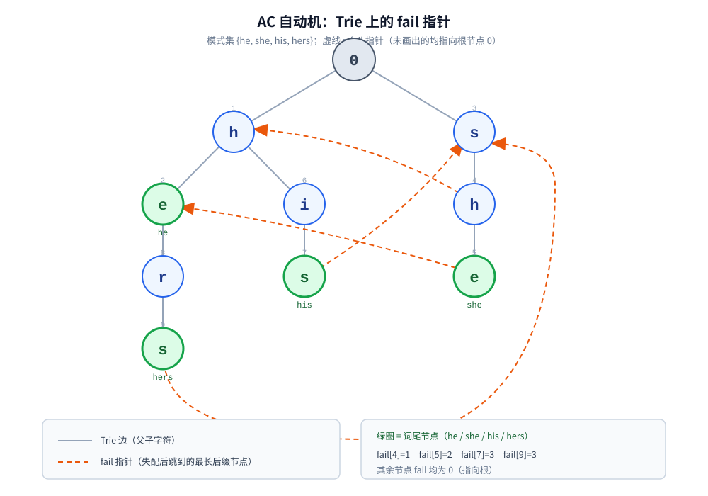

# AC自动机

> 多模式串匹配的标准解：**Trie + fail 指针**。fail 指针的本质是「**Trie 上的 KMP**」——
> 当前节点失配时，跳到「它代表的字符串的最长后缀」所对应的节点。本篇的篇幅主要留给它。
>
> ⭐ 三篇之三，按 **单模式 → 多模式** 递进：[KMP.md](KMP.md)（单模式，主串不回退）→ [BM.md](BM.md)（单模式，从右往左）→ **本篇**（多模式）。
> ⚠️ **Trie 的结构与内存代价见 [../数据结构.md](../数据结构.md) 的「字典树（Trie）与前缀匹配」一节，本篇不重复**；
> ⚠️ **前缀函数的完整讲解见 [KMP.md](KMP.md) 第二节**，本篇只引用它来解释 fail 指针。
>
> 内容整理自个人学习笔记，素材见 [素材清单](../../素材清单.md)。一层层往下推的通用套路见 [../BFS广度优先遍历.md](../BFS广度优先遍历.md)；
> 复杂度口径见 [../复杂度分析.md](../复杂度分析.md)。
>
> 📎 本篇所有输出均为本机实跑逐字抄录：**Go 1.26.5（windows/amd64）** 与 **JDK 1.8.0_321** 各实现一份，
> 输出**逐行一致**（本篇没有计时实验，两版输出完全相同）。实验代码在 `.workbuddy/tmp/string_lab/`。

---

## 一、多模式匹配：为什么不能「跑 k 次 KMP」？

**本节要点**：能跑通，但**要扫 `k` 遍文本**。AC 自动机的全部意义就是把这 `k` 遍压成 **1 遍**。

### 1.1 朴素做法与它的代价

要找 `k` 个模式，最直接的做法是每个模式各自跑一次单模式匹配（[KMP.md](KMP.md) 或 [BM.md](BM.md)）：

| 做法 | 文本扫描遍数 | 代价 |
|---|---|---|
| `k` 次 KMP | `k` 遍 | `O(k · (n + m))` |
| **AC 自动机** | **1 遍** | `O(n + 所有命中数)`（预处理 `O(总模式长度)`） |

⭐ 关键差别不在常数，而在**文本被读了几遍**：`k` 遍意味着 `k` 次完整扫描，而 AC 的扫描次数恒为 1。

本机实测（8 个模式、65536 字符的随机文本）：

```text
    AC 一次扫描   ：转移 65536 次，goto 处 fail 跳转 65534 次，输出链检查 100353 次，命中 2068 处
    AC 合计工作量 ：231423 次（转移 + fail 跳转 + 输出链检查）
    逐模式 KMP 合计：比较 653288 次
```

⭐ 8 个模式上，AC 合计工作量约为逐模式 KMP 的 **1/3**；⚠️ 模式数越多，这个差距越大 —— 因为 KMP 那一列会随 `k` 线性增长，AC 的转移次数**恒为 `n`**。

### 1.2 一次扫描靠什么做到

把 `k` 个模式**塞进同一棵树**：共用前缀的部分自然共享路径。这样「文本扫到某个字符时，我处在所有模式的哪一个前缀上」就变成一个**树上的位置**，而不是 `k` 个独立的状态。

⭐ 于是问题变成两件事：① 怎么建这棵树（Trie）；② **当树上的位置对不上下一个字符时，该退到哪**。第二件事就是 fail 指针。

---

## 二、Trie：多模式的「公共前缀」

**本节要点**：结构本身见 [../数据结构.md](../数据结构.md)，这里只看它在多模式场景下的账面。⚠️ **本节刻意写短，把篇幅留给 fail。**

把 `{he, she, his, hers}` 逐条插入，公共前缀自动合并（模式集与插入顺序都会影响节点编号，但不影响匹配结果）：

```text
========== 实验一：Trie 的建立（模式集 {he, she, his, hers}）==========
  节点表（编号 = 创建顺序，0 为根）：
    编号  深度  字符  父节点  是否词尾  词
    0     0     -      -        否         -
    1     1     h      0        否         -
    2     2     e      1        是         he
    3     1     s      0        否         -
    4     2     h      3        否         -
    5     3     e      4        是         she
    6     2     i      1        否         -
    7     3     s      6        是         his
    8     3     r      2        否         -
    9     4     s      8        是         hers
  边（按字母序，只列有孩子的节点）：
    0: h→1 s→3
    1: e→2 i→6
    2: r→8
    3: h→4
    4: e→5
    6: s→7
    8: s→9
```

⭐ 两处一眼可见的收益：`he` 与 `hers` 共享路径 `1→2`，`h` 与 `his` 共享节点 `1`。**整棵树含根只有 10 个节点**；若不共享，四条链一共要 `2+3+3+4 = 12` 个节点 —— 省下 3 个。

⚠️ 代价同样要认账：**Trie 的收益来自前缀共享**，`{he, she, his, hers}` 这样前缀高度重合的模式集很划算；若模式集是随机串（如一批 UUID），共享几乎为零，就退化成「每字符一个节点」的纯开销 —— 见 [../数据结构.md](../数据结构.md) 的失效点。

---

## 三、fail 指针：Trie 上的 KMP

**本节要点**：这是全篇的核心。**fail 指针的定义、用途、与 `next` 的对应关系**，三句话讲完，然后用实测把每一步摊开。



### 3.1 定义

对每个节点 `v`（`v ≠ root`），记它从根到 `v` 的路径是字符串 `s`。则：

> **`fail[v]` = 节点 `u`，其中 `u` 从根出发的路径是 `s` 的一个真后缀，且 `u` 是该后缀所对应的最长者。**

⭐ **它就是 [KMP.md](KMP.md) 的 `next` 挪到树上**：

| | KMP（[KMP.md](KMP.md) 第二节） | **AC 自动机（本篇）** |
|---|---|---|
| 载体 | 一条模式串的线性结构 | **一棵 Trie** |
| 定义 | `next[i]` = `p[0..i]` 的**最长真前后缀**长度 | **`fail[v]` = 从根到 `v` 的串的「最长真后缀」节点** |
| 失配时 | `j = next[j-1]`（回退到更短的**前缀**） | `cur = fail[cur]`（跳到更短的**后缀**节点） |
| 用途 | 复用已匹配的前缀 | **复用已匹配的后缀 —— 因为 Trie 共享的是前缀** |

⭐ 一句话直觉：当前节点到了 `she`，下一个字符是 `r`，可 `she` 没有 `r` 这条边 —— **那就顺着 `fail` 跳到 `she` 的最长后缀 `he`，看 `he` 有没有 `r` 这条边：有，于是落到 `her`**。这正是 fail 指针在做的事（本机第五节实测里 `i=4` 那一行就是它）。

### 3.2 实测：`{he, she, his, hers}` 的 fail 数组

```text
  fail 数组 = [0 0 0 0 1 2 0 3 0 3]
```

逐条对照（节点号见第二节的节点表）：

| 节点 | 路径 | `fail` | 含义 |
|---|---|---|---|
| `1` | `h` | `0` | `h` 的真后缀没有在树里的 → 回根 |
| `2` | `he` | `0` | `e` 不在根的孩子里 → 回根 |
| `3` | `s` | `0` | → 回根 |
| `4` | `sh` | **`1`** | `sh` 的真后缀 `h` 在树里（节点 `1`） |
| `5` | `she` | **`2`** | `she` 的真后缀 `he` 在树里（节点 `2`，且 `he` 是个完整模式） |
| `6` | `hi` | `0` | `i` 不在根的孩子里 → 回根 |
| `7` | `his` | **`3`** | `his` 的真后缀 `s` 在树里（节点 `3`） |
| `8` | `her` | `0` | `er`、`r` 都不在树里 → 回根 |
| `9` | `hers` | **`3`** | `hers` 的真后缀 `s` 在树里（节点 `3`） |

⭐ 注意 **`fail[5] = 2` 这一条**：`he` 既是 `she` 的真后缀、**又是一个完整模式**。所以扫到 `she` 时，`he` 也必须被报出来 —— 这就是「重叠命中」的来源（见第五节）。

### 3.3 ⚠️ fail 链与输出链

从任一节点 `v` 出发反复走 `fail`，得到的是一条**逐级变短的链**：`he ← she`、`s ← his`、`s ← hers`、`his` 里的 `s` 又指向根……

⭐ **匹配时到达节点 `v` 还不够，必须沿 `fail` 链一路往上，把所有「词尾节点」都报出来**。因为 `v` 自身的路径是最长匹配，**链上每一个词尾又代表一个更短的命中**。

```go
for t := cur; t != 0; t = m.nodes[t].fail {
	if m.nodes[t].word != -1 {
		// 命中：起点 = 当前位置 - 该节点的深度 + 1
		report(m.nodes[t].word, i-m.nodes[t].depth+1)
	}
}
```

⚠️ **漏掉这条链 = 漏报**。这是实现 AC 最常见的错误，本机实验五专门用暴力匹配把它对齐（见第五节）。

---

## 四、⚠️ 为什么 fail 指针能用 BFS 一层层算出来？

**本节要点**：这是本文最该讲透的一点。结论是 **`fail[v]` 只依赖「比 `v` 更浅的节点」与「`v` 的父节点的 `fail`」**，所以按层处理一定安全。

### 4.1 递推式

设 `v` 的父节点是 `p`，`v` 对应的字符（`p` 到 `v` 那条边上的字符）是 `c`。要算 `fail[v]`，只需**从 `fail[p]` 出发**：

> 从 `f = fail[p]` 开始，**沿着 `fail` 链往上找**，直到某个节点 `f` **有字符 `c` 的出边**。若找到，`fail[v] = f` 的 `c`-孩子；若一路退到根都没有，`fail[v] = root`。

⭐ **为什么这是对的**：`v` 的路径 = `p` 的路径 + `c`。它的真后缀必然形如「`p` 的某个真后缀 + `c`」。而「`p` 的所有真后缀」正是从 `fail[p]` 开始的整条 `fail` 链 —— 于是只需要在这条链上找一个有 `c` 出边的节点。**这与 [KMP.md](KMP.md) 第二节里「顺着 `next` 链往前跳」是同一个动作**。

### 4.2 逐层实测

```text
========== 实验二：fail 指针的 BFS 构造过程 ==========
  第 1 层（2 个节点）：
    节点 1('h')：父=0，fail[父]=0；节点0 的 'h' 孩子 = 1 → fail=0
    节点 3('s')：父=0，fail[父]=0；节点0 的 's' 孩子 = 3 → fail=0
  第 2 层（3 个节点）：
    节点 2('e')：父=1，fail[父]=0；节点0 没有 'e' 孩子 → fail=0
    节点 6('i')：父=1，fail[父]=0；节点0 没有 'i' 孩子 → fail=0
    节点 4('h')：父=3，fail[父]=0；节点0 的 'h' 孩子 = 1 → fail=1
  第 3 层（3 个节点）：
    节点 8('r')：父=2，fail[父]=0；节点0 没有 'r' 孩子 → fail=0
    节点 7('s')：父=6，fail[父]=0；节点0 的 's' 孩子 = 3 → fail=3
    节点 5('e')：父=4，fail[父]=1；节点1 的 'e' 孩子 = 2 → fail=2
  第 4 层（1 个节点）：
    节点 9('s')：父=8，fail[父]=0；节点0 的 's' 孩子 = 3 → fail=3
  fail 数组 = [0 0 0 0 1 2 0 3 0 3]
  ⭐ 算 fail[v] 只用到 fail[父] 与更浅层的孩子 —— BFS 保证这些值已算好，所以逐层推是安全的
```

### 4.3 为什么 BFS 的顺序是「必须的」而不是「随便选的」

⚠️ 这是本节真正的问题。看递推式 `fail[v] ← (fail[p] 的链上找一个有 c 出边的节点)`，它用到了两样东西：

| 用到的 | 层级 | BFS 是否已算好 |
|---|---|---|
| `fail[p]` | `p` 比 `v` **浅一层** | ✅ 上一层刚算完 |
| 「`fail[p]` 整条链上的节点」（用来沿链找） | 都**比 `p` 更浅** | ✅ 它们的 `fail` 更早就算好了 |
| 链上节点的 `c`-孩子（被拿来当 `fail[u]` 的值） | 比那些节点**深一层** | ✅ 只需要这个**节点的编号**，不需要它自己的 `fail` |

⭐ **关键**：`fail[p]` 的深度一定**小于** `p`，而 `p` 又比 `v` 浅 —— 所以只要**按深度从小到大**处理，算 `fail[v]` 时它需要的一切都已经就绪。**BFS 恰好就是「按深度从小到大」**，于是天然满足这个依赖顺序。

⚠️ **反过来看会更清楚**：如果改用 DFS，就可能出现「访问到 `v` 时，它要用的某个浅层节点的 `fail` 还没算」的情况 —— 依赖被打破，结果就是错的。**这不是「BFS 更快」，而是「BFS 的访问顺序恰好就是依赖顺序」。**

构造代码：

```go
// 先把根的孩子入队（它们的 fail 一定是根）
for c := 0; c < 26; c++ {
	if next[0][c] != -1 {
		fail[next[0][c]] = 0
		queue = append(queue, next[0][c])
	}
}
for len(queue) > 0 {
	v := queue[0]
	queue = queue[1:]
	for c := 0; c < 26; c++ {
		u := next[v][c]
		if u == -1 {
			continue
		}
		f := fail[v]                        // ⭐ v 是 u 的父节点：从 fail[父] 出发
		for f != 0 && next[f][c] == -1 {
			f = fail[f]                     // 沿 fail 链往上找有 c 出边的节点
		}
		if next[f][c] != -1 {
			fail[u] = next[f][c]
		} else {
			fail[u] = 0
		}
		queue = append(queue, u)            // BFS：孩子一层层入队
	}
}
```

---

## 五、多模式匹配与重叠命中

**本节要点**：扫描阶段本身很简单（一个字符一步），**难点全在「输出链」上** —— 命中不止来自当前节点。

### 5.1 逐字符推演（本机实测）


```text
========== 实验三：多模式匹配与重叠命中（文本 "ushers"）==========
  文本 = "ushers"，模式集 = {he, she, his, hers}
  逐字符推进（到达节点后沿 fail 链收集词尾）：
    i=0 'u' → 节点0   （无输出）
    i=1 's' → 节点3   （无输出）
    i=2 'h' → 节点4   （无输出）
    i=3 'e' → 节点5   → 输出 she@1，he@2
    i=4 'r' → 节点8   （无输出）
    i=5 's' → 节点9   → 输出 hers@2
  命中汇总（含重叠）：
    she   @ 1
    he    @ 2
    hers  @ 2
  共 3 处命中
  扫描统计：转移 6 次，goto 处 fail 跳转 1 次，输出链检查 8 次
```

⭐ **最有信息量的是 `i=3` 那一行**：到达节点 `5`（路径 `she`），除了报出 `she`，还**沿 fail 链跳到节点 `2`（路径 `he`）又报了一次**。这就是本篇第三节说的「输出链」在实战里的样子。

⭐ 末尾那行统计也值得读：**6 个字符只转移了 6 次、goto 时只跳了 1 次 fail，但输出链检查走了 8 次** —— 输出链的开销与「文本长度」不成正比，而与「有多少节点带后缀」有关（这正是 5.2 说的优化点）。

⚠️ **三处命中全部彼此重叠**：`she` 覆盖 `[1,3]`、`he` 覆盖 `[2,3]`（完全落在 `she` 里）、`hers` 覆盖 `[2,5]`（与 `he` 共用起点 `2`）。⭐ 这与单模式匹配很不一样 —— **AC 的产出天然是一个「允许重叠的命中列表」**，业务上要不要去重是下游的事。

### 5.2 扫描代码

```go
cur := 0
for i := 0; i < len(text); i++ {
	c := text[i] - 'a'
	for cur != 0 && next[cur][c] == -1 {
		cur = fail[cur]                 // ⭐ 失配：沿 fail 往上退，文本指针不动
	}
	if next[cur][c] != -1 {
		cur = next[cur][c]
	} else {
		cur = 0
	}
	for t := cur; t != 0; t = fail[t] { // ⭐ 输出链：把所有词尾都报出来
		if word[t] != -1 {
			report(word[t], i-depth[t]+1)
		}
	}
}
```

⭐ 主循环里**文本指针 `i` 也是一直向前的**（与 [KMP.md](KMP.md) 第四节完全一致）—— 因为失配时只动 `cur`（相当于 KMP 的 `j`），不动 `i`。

⚠️ 上面这版「每次沿 `fail` 链收集输出」是**教学版**。真实实现会给每个节点额外存一条「**输出链**」（`last` / `dictSuffix`，指向最近的词尾祖先），把「沿链找词尾」的多次跳转压成一次。本机的 `输出链检查 100353 次` 就是这个开销（见 1.1）—— 用输出链能把它显著压低。

### 5.3 正确性验证（本机实测）

⚠️ fail 链**漏收或多收**都会让命中数对不上，而两者都不会报错。所以拿暴力匹配当基准：

```text
========== 实验五：正确性验证（与逐模式暴力匹配对齐）==========
  200 组随机：文本 200（abcd），模式 4 个（长度 3~5）
  AC 命中总数 = 逐模式暴力命中总数（完全一致）= true
  累计命中 1794 处
  ⭐ fail 链漏收或多收都会让命中数对不上 —— 用暴力匹配做基准最直接
```

⚠️ 本机第一版这个实验**失败了**（打印 `false`），根因是**随机截取的模式可能彼此重复**：暴力匹配会把重复模式算两次，而 Trie 的同一个节点只会保留最后一次写入的词编号，于是只算一次。⭐ **这不是 AC 的 bug，是测试用例的 bug** —— 修法是先给模式集去重（本机加了 `seen` 判重）。**这条也提醒：验证脚本本身也要被验证。**

---

## 使用：AC 自动机在你的系统里以什么形式出现

**第一层：敏感词 / 关键词过滤（最经典的落地）**。内容安全、评论审核、昵称校验里的「一次扫完、命中所有黑词」，底层几乎都是 AC。⚠️ **这类库的复杂性不在算法，而在策略**：命中要不要重叠、要不要大小写 / 全半角归一化、要不要做变体还原 —— 而 AC 只负责「给定一串已经归一化的文本，报出所有命中位置」。

**第二层：它和全文检索的分工**。⚠️ **不要以为 Elasticsearch 的全文检索就是 AC**。它走的是「词典定位 + 倒排表求交并」（见 [../../数据存储/elasticsearch/ElasticSearch.md](../../数据存储/elasticsearch/ElasticSearch.md)），词典结构是 FST，与 AC 是两条路线。⭐ **判据很清晰**：**要「在一段文本里找出所有出现位置」→ AC；要「在一堆文档里找出包含某词的那些」→ 倒排索引。** 前者是流式的、一次一遍；后者是批量的、面向集合。

**第三层：它其实是「Trie 上的 KMP」这一族的一个特例**。把 [KMP.md](KMP.md) 的前缀函数、本篇的 fail 指针、以及 [../数据结构.md](../数据结构.md) 里的 Trie 放在一起看，会发现它们回答的是同一个问题：**「已经匹配的一段里，有多长可以复用？」** 单模式是一条链上的答案（`next`），多模式是一棵树上的答案（`fail`）。

---

## 延伸追问

- **fail 指针和 KMP 的 `next` 是一回事吗？** → **是同一个概念的两个版本**：`next` 是「一条串的最长真前后缀长度」，`fail` 是「树上一个节点的最长真后缀节点」。⚠️ 方向感不同是因为**载体不同** —— Trie 共享前缀，所以失配后要退到后缀（第三节对照表）。
- **为什么 fail 必须用 BFS 算？DFS 行不行？** → **DFS 可能算错**。`fail[v]` 依赖 `fail[父节点]` 与更浅层的节点，BFS（按深度递增）天然满足这个顺序；DFS 可能先深后浅，依赖没就绪（4.3）。
- **扫到一个节点，为什么只报当前节点不够？** → 因为**更短的命中藏在 `fail` 链上**。节点 `5`（`she`）的 `fail` 是节点 `2`（`he`），两者都要报（5.1 实测 `i=3` 输出两个）。⚠️ 漏掉链 = 静默漏报。
- **命中为什么会重叠？能避免吗？** → **重叠是这个问题的固有形态**（`she` 里就含 `he`），不是实现缺陷。本机实测 `ushers` 上 3 处命中全部重叠。要去重得在下游按「同一模式不重复计」或「取最长」的策略做。
- **AC 的复杂度是多少？** → 预处理 `O(总模式长度)`，扫描 `O(n + 命中数)`。⚠️ 「命中的输出开销」不能算进 `n` —— 命中极多时，**输出本身就比扫描贵**（这也是 1.1 里 `输出链检查 100353` 的来源）。
- **那 100353 次输出链检查能省吗？** → **能**。给每个节点存一条「最近的词尾祖先」链接（输出链 / `dictSuffix`），沿链只需要跳**命中次数**那么多步，而不是每个字符都走一遍 `fail` 链（5.2）。
- **Trie 内存爆了怎么办？** → 缩小字符集（把 `[26]int` 换成哈希 / 压缩边），或改用 [../数据结构.md](../数据结构.md) 提到的**基数树 / DAWG**。⚠️ 但代价是失配跳转变复杂 —— 这是空间与实现复杂度的交换。
- **多模式里混长短模式会怎样？** → 长模式会成为短模式的 `fail` 链下游。本机 `{he, she, his, hers}` 就是这种情况：`she` 的 `fail` 指向 `he`。⭐ **只要输出链走到底，长短模式都会命中**，不需要额外逻辑。

## 关联

- [KMP.md](KMP.md) — 三篇之一：**前缀函数**的完整讲解在那一篇；AC 的 fail 指针就是它挪到 Trie 上的版本
- [BM.md](BM.md) — 三篇之二：单模式 + 从右往左；BM 无法像 AC 这样一次扫描命中全部模式
- [../数据结构.md](../数据结构.md) — **Trie 的结构、内存代价与压缩变体**（基数树 / DAWG）都在这里，本篇不重复
- [../BFS广度优先遍历.md](../BFS广度优先遍历.md) — fail 指针的构造就是一次 BFS；「按层推进 = 满足依赖顺序」是本篇第四节的一般形式
- [../复杂度分析.md](../复杂度分析.md) — 为什么「预处理 `O(总模式长)` + 扫描 `O(n + 命中数)`」要把命中数单独拎出来算
- [../../数据存储/elasticsearch/ElasticSearch.md](../../数据存储/elasticsearch/ElasticSearch.md) — 「使用」第二层的对照：全文检索走倒排索引与 FST，而不是 AC
