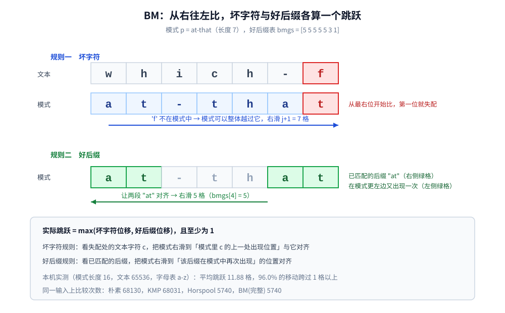

# BM

> Boyer-Moore：**从右往左比较**、坏字符规则 + 好后缀规则。它为什么在实践中常常比 KMP 快 —— 因为**一次能跳很多格**；
> 以及 Horspool / Sunday 这些简化版砍掉了什么、又付出了什么代价。
>
> ⭐ 三篇之二，按 **单模式 → 多模式** 递进：[KMP.md](KMP.md)（单模式，主串不回退）→ **本篇**（单模式，从右往左）→
> [AC自动机.md](AC自动机.md)（多模式，Trie + fail 指针）。⚠️ **前缀函数的完整讲解不在本篇**，本文只引用 [KMP.md](KMP.md) 的结论做对照。
>
> 内容整理自个人学习笔记，素材见 [素材清单](../../素材清单.md)。「先花成本建表、之后每次都省」这一思路与
> [查找与排序对比.md](../基础算法/查找与排序对比.md) 的预排序同理；复杂度口径见 [复杂度分析.md](../基础算法/复杂度分析.md)。
>
> 📎 本篇所有输出均为本机实跑逐字抄录：**Go 1.26.5（windows/amd64）** 与 **JDK 1.8.0_321** 各实现一份，
> 输出**逐行一致**（本篇没有计时实验，两版输出完全相同）。实验代码在 `.workbuddy/tmp/string_lab/`。

---

## 一、BM 和 KMP 差在哪一句话？

**本节要点**：只差**比较方向**。但这个方向的改变，带来了「一次能跳过很多格」的可能 —— 这是 BM 全部力量的来源。

### 1.1 方向反了

| | KMP（[KMP.md](KMP.md)） | **BM（本篇）** |
|---|---|---|
| 比较方向 | 从左往右（`p[0]` 起） | **从右往左（`p[m−1]` 起）** |
| 预处理的表 | `next`（前缀函数） | **坏字符表 + 好后缀表** |
| 失配后的动作 | 回退模式指针 `j`，**主串指针不动** | **整个模式向右跳若干格** |
| 最坏复杂度 | `O(n + m)`，与输入无关 | `O(n·m)`（完整版可做到 `O(n + m)`，但实现更繁） |
| 实践表现 | 稳定，但**跳不动** | 大字母表随机文本上**快一个量级** |

⭐ 一句话：**KMP 是「不回头地往前走」，BM 是「大胆地往前跳」。**

### 1.2 为什么从右往左比就有机会跳

对齐窗口时，**最后一位**携带的信息最多：如果 `t[i+m−1] ≠ p[m−1]`，而 `t[i+m−1]` 这个字符**根本不在模式里**，那么从 `i` 到 `i+m−1` 这一段**没有任何一个起点可能匹配** —— 模式可以整体越过它，**一次跳 `m` 格**。

```text
文本：  ... x x x x w q z ...
模式：      a t - t h a t
                   ↑ 最右位就失配，且 'z' 不在模式里 → 整个模式可以越过 'z'
```

⭐ 这解释了为什么 BM 在**大字母表**上特别强：字母越多，「随便一个字符就不在模式里」的概率越高，跳跃越大。⚠️ 反过来，在 `{a,b}` 这种小字母表上，**只靠坏字符**的跳跃会被压得很小（见第五节实测）。



---

## 二、坏字符规则：一步能跳多远？

**本节要点**：规则只有一句 —— **把模式右滑到「文本里那个失配字符」与「它在模式中的上一处出现位置」对齐**。如果没有更早的出现，就整段越过。

### 2.1 规则与位移公式

设窗口对齐在起点 `i`，从右往左比到第 `j` 位时失配（即 `t[i+j] ≠ p[j]`，而 `p[j+1..m−1]` 都已匹配）。记 `c = t[i+j]`：

| 情况 | 位移 |
|---|---|
| `c` 在 `p[0..j−1]` 中**最后一次**出现在位置 `k` | `j − k` |
| `c` 在 `p[0..j−1]` 中不出现 | `j + 1`（连 `c` 一起越过） |

```go
// 失配发生在模式第 j 位、文本字符是 c 时，坏字符规则给出的位移
bcShift := j + 1
if k := lastIndexBefore(p, j, c); k >= 0 {
	bcShift = j - k
}
```

⚠️ 注意 `lastIndexBefore` 只查 `p[0..j−1]`：**已经匹配过的那一段右边不需要再看**。这是坏字符规则最容易被写错的地方。

### 2.2 逐位推演（本机实测）

```text
========== 实验一：坏字符表 + BM 的逐位推演 ==========
  模式 p = "at-that"（长度 7）
  坏字符表（每个字符在 p 中最后出现的位置）：
    'a' → 4    't' → 6    '-' → 2    'h' → 5    其余字符 → -1
  好后缀表 bmgs = [5 5 5 5 5 3 1]
  文本 t = "which-finally-halts.-at-that-point"，从右往左比：
  i=0   窗口="which-f"  p[6]='t' ≠ 'f'  坏字符=7 好后缀=1 → 跳 7
  i=7   窗口="inally-"  p[6]='t' ≠ '-'  坏字符=4 好后缀=1 → 跳 4
  i=11  窗口="ly-halt"  p[5]='a' ≠ 'l'  坏字符=6 好后缀=3 → 跳 6
  i=17  窗口="ts.-at-"  p[6]='t' ≠ '-'  坏字符=4 好后缀=1 → 跳 4
  i=21  窗口="at-that"  整体匹配             → 命中，跳 5
  i=26  窗口="at-poin"  p[6]='t' ≠ 'n'  坏字符=7 好后缀=1 → 跳 7
  命中位置 = [21]，总比较 13 次
```

⭐ 这段推演把 BM 的两条规则都摆在了一行里。逐行读：

- **`i=0` 一次跳过 7 格**：失配字符是 `'f'`，它不在模式里，于是坏字符规则给出 `j+1 = 7` —— 一个长度 7 的模式**一步就滑过了整段长度**；
- **`i=11` 是唯一「两位都大」的一行**：坏字符给 6、好后缀给 3，取大的 6。⚠️ **真实实现取的是 `max`，不是「两个都用」**；
- **`i=21` 命中后跳 5**：走的是 `bmgs[0] = 5`（模式自身的周期），而不是 1 —— 这样不会在同一个位置反复命中。

⚠️ **文本只有 34 个字符，比较却只做了 13 次**：`which` / `finally` 这些词根本没被逐字扫过。

---

## 三、好后缀规则：已经匹配上的部分怎么利用？

**本节要点**：坏字符规则**完全无视已经匹配好的那一段**。好后缀规则专门利用它：**如果后缀在模式里还出现过，就滑到下一个出现位置**。

### 3.1 规则

失配发生在模式第 `j` 位时，`p[j+1..m−1]` 这一段已经和文本对齐且相同。记它为**好后缀**。看它在模式里**是否还出现过**：

| 情况 | 位移 |
|---|---|
| 好后缀在模式中**还有一处完整出现** | 滑到那一处与文本对齐 |
| 好后缀只有**某个后缀**是模式的前缀 | 滑到让该前缀对齐 |
| 都不满足 | 整段滑过 `m` |

⭐ **它的价值在「坏字符规则恰好跳不动」时兜底**：比如 `c` 就出现在 `p[j−1]`（位移只能是 1），此时好后缀规则可能给出一个大得多的位移。

### 3.2 三张表怎么算

先看 `suffixes(p)`：`suff[i]` = 「既是 `p[0..i]` 的后缀、又是整个 `p` 的后缀」的**最长长度**。

```go
func suffixes(p string) []int {
	m := len(p)
	suff := make([]int, m)
	suff[m-1] = m
	for i := m - 2; i >= 0; i-- {
		j := i
		for j >= 0 && p[j] == p[m-1-(i-j)] {
			j--
		}
		suff[i] = i - j
	}
	return suff
}
```

再由 `suff` 推出 `bmgs`（每个 `j` 处失配时该滑多少）：

```go
func preBmGs(p string) []int {
	m := len(p)
	suff := suffixes(p)
	bmgs := make([]int, m)
	for i := range bmgs {
		bmgs[i] = m
	}
	j := 0
	for i := m - 1; i >= 0; i-- {          // 情形一：好后缀的某个后缀 = 模式前缀
		if suff[i] == i+1 {
			for ; j < m-1-i; j++ {
				if bmgs[j] == m {
					bmgs[j] = m - 1 - i
				}
			}
		}
	}
	for i := 0; i <= m-2; i++ {            // 情形二：好后缀完整地再次出现
		bmgs[m-1-suff[i]] = m - 1 - i
	}
	return bmgs
}
```

本机实测 `preBmGs("at-that") = [5 5 5 5 5 3 1]`。

⭐ **`bmgs` 与 `next` 是同一种东西的两种包装**：都在回答「已匹配的一段里，有多长可以复用」。区别是 `next` 复用**前缀**（因为从左往右比），`bmgs` 复用**后缀**（因为从右往左比）—— 方向反过来，表也跟着反。

### 3.3 主循环

```go
for i+m <= n {
	j := m - 1
	for j >= 0 {
		cmp++
		if t[i+j] != p[j] {
			break
		}
		j--
	}
	var shift int
	if j < 0 {                             // 整体匹配
		hits = append(hits, i)
		shift = bmgs[0]
	} else {
		gsShift := bmgs[j]
		bcShift := j + 1
		if k := lastIndexBefore(p, j, t[i+j]); k >= 0 {
			bcShift = j - k
		}
		if bcShift > gsShift {
			shift = bcShift              // ⭐ 取两者较大值
		} else {
			shift = gsShift
		}
	}
	i += shift
}
```

⚠️ **必须取 `max`**。如果误用 `min` 或只看坏字符规则，程序**仍能找到一部分命中**，但会漏掉靠好后缀规则才能跳到的那些。⚠️ 这种 bug **不崩不报错**，只能靠「与朴素匹配逐一对齐」验出来 —— 本机实验四就是这么做的。

---

## 四、简化版砍掉了什么？

**本节要点**：完整 BM 要算三张表（`last` / `suff` / `bmgs`），实现繁琐。工程上更常见的是**只留坏字符规则**的简化版。

### 4.1 三个简化版

| 版本 | 用了哪张表 | 位移依据 | 特点 |
|---|---|---|---|
| **Horspool（BMH）** | 只用坏字符，且**只看窗口最后一个字符** | `t[i+m−1]` | 代码最短（十几行）；大字母表上实测与完整版持平，小字母表上略逊 |
| **Sunday** | 坏字符，看**窗口后一个字符** `t[i+m]` | `t[i+m]` | 比较方向回到**从左往右**；小字母表上可能很差 |
| **完整 BM** | 坏字符 + 好后缀 | 两者取 `max` | 最稳，但 `bmgs` 的实现最容易写错 |

Horspool 的位移表只要一行循环：

```go
func horspoolShift(p string) [256]int {
	var sh [256]int
	m := len(p)
	for c := 0; c < 256; c++ {
		sh[c] = m
	}
	for i := 0; i < m-1; i++ {
		sh[p[i]] = m - 1 - i    // ⚠️ 不含最后一位 p[m-1]
	}
	return sh
}
```

⭐ **Horspool 为什么敢只看最后一个字符**：从右往左比时，窗口最后一位的信息「最便宜也最新鲜」—— 无论在哪里失配，它都已经看过了。

### 4.2 本机实测对照（同一输入，五种算法）

```text
========== 实验二：同一输入上五种算法的比较次数 ==========
  (a) 朴素匹配的最坏输入：文本 8000 个 'a'，模式 79 个 'a' + 一个 'b'
  (b) 大字母表随机：文本 65536 字符（a-z），模式 = 文本中截取的 16 字符
  (c) 小字母表随机：文本 65536 字符（ab），模式 = 文本中截取的 16 字符
    输入   朴素        KMP         Horspool    Sunday      BM(完整)
    (a)    633760      15922       8001        316960      8001       
    (b)    68130       68031       5740        5748        5740       
    (c)    130719      89965       98285       86904       33087      
  ⭐ (b) 大字母表上 BM 一次能跳很远，比较次数约是 KMP 的 1/12；
     (c) 小字母表上只靠坏字符的 Horspool / Sunday 优势消失（已与 KMP 同档甚至更差），
         只有 BM 完整版靠好后缀规则仍保住约 2.7 倍优势
```

三行读出来的结论完全不同，值得逐行说：

| 输入 | 谁赢 | 为什么 |
|---|---|---|
| **(a) 全 a + 末位 b** | **Horspool / BM（8001）** | 从右往左第一位就失配（`'a' ≠ 'b'`），每次只比 1 次；朴素却要一路比到末尾（633760 次） |
| **(b) 大字母表随机** | **BM 系（5740）** | 字母表 26 个字符，一次跳跃平均十几格（见实验三），比较次数约为 KMP（68031）的 1/12 |
| **(c) 小字母表随机** | **只有 BM 完整版（33087）** | 字母表只剩 2 个字符，跳跃被压小；**只靠坏字符的 Horspool（98285）/ Sunday（86904）反而不如 KMP（89965）**，是好后缀规则把完整版撑住了 |

⚠️ **(c) 是这条对照里最该记住的一行**：它说明「BM 快」并不是「只要从右往左就快」，而是**坏字符 + 好后缀两条规则合起来**才稳。⚠️ 另外 **Sunday 在 (a) 上崩了（316960）**：它按 `t[i+m]` 定位移，而 (a) 里 `t[i+m]` 恒为 `'a'`，位移表给出的步长是 2 —— 移动次数多、每次又比得久，于是比朴素还差。⭐ **没有一个版本在所有输入上都最优。**

---

## 五、实测：BM 到底靠什么变快？

**本节要点**：答案只有一个字 —— **跳**。这一节把跳跃距离直接统计出来，并验证正确性。

### 5.1 跳跃距离统计

```text
========== 实验三：BM 完整版的跳跃距离统计（输入 (b)）==========
  模式长度 = 16，文本长度 = 65536
  总移动次数 = 5515，累计跳跃 = 65529，平均跳跃 = 11.88
  最大跳跃 = 16，跳跃 > 1 的次数 = 5294（占比 96.0%）
  ⭐ 平均跳跃远超 1 → 每次对齐只需很少的比较次数；这正是 BM 实测更快的原因
```

⭐ 三个数字连起来看：**平均一次跳 11.88 格、最大跳满 16 格、96% 的移动都跨过了 1 格以上**。长度 16 的模式在 65536 字符上只对齐了 5515 次 —— 这就是 `5740` 次比较的来源。

⚠️ 注意 **最大跳跃恰好等于 `m`（16）**：一次跳跃的上界就是「模式整体越过当前窗口」，不会更多。

### 5.2 正确性验证（本机实测）

⚠️ 跳跃表算错的表现是**静默漏报**，不会崩。所以必须拿一个「一定对」的基准来对齐：

```text
========== 实验四：正确性验证（同一 LCG 随机串，与朴素匹配对齐）==========
  200 组随机模式（长度 3~8，均取自文本内部）
  朴素 = Horspool = Sunday = BM(完整) 的命中位置完全一致 = true
  累计命中 370 处（含重叠）
  ⭐ 三张跳跃表算错了都会「找得到但不全」—— 所以正确性必须与朴素匹配逐一对齐
```

⭐ 基准就是朴素匹配（写法见 [KMP.md](KMP.md) 第一节），**200 组随机模式、命中位置逐个对齐**，四种实现全部一致才敢用。⚠️ 随机串用同一 LCG 生成，Go 与 Java 两版输出因此逐行一致。

---

## 使用：BM 在你的系统里以什么形式出现

BM 几乎总是**以「被实现好的库」的形式**出现在你脚下，但知道它在哪一层，能帮你解释「为什么某次搜索突然变慢」。

**第一层：文本编辑器与 IDE 的查找**。你在 VS Code / Vim / `less` 里按 `Ctrl+F` 找一段长文本时，走的多半是 BM 系（或它的 Horspool 变体）。⚠️ **判据是「模式有多长」**：短模式（几个字符）时建表成本不值得，实现一般退回朴素；**模式越长、字母表越大，BM 的优势越明显**（第五节实测）。这也是为什么「搜一个长文件名」通常比「搜一个单字符」感觉更快。

**第二层：`grep` / `ripgrep` / 日志检索**。这些工具在单模式匹配上普遍用 BM 或其变体做内层。⚠️ **它们真正的性能瓶颈通常不是匹配算法**（I/O 与正则回溯才是），所以不要期待「换算法就能提速十倍」—— 匹配算法只解决「已经读进内存的那一段怎么扫」。

**第三层：为什么标准库反而常不用它**。Go 1.26.5 的 `strings.Index` 走的是 **`IndexByte` 找首字符 + 朴素比较**，只在「误报太多」时才退化为 Rabin-Karp（源码见 `src/internal/stringslite/strings.go`），而不是 BM。原因是**权衡**：BM 的三张表要额外的预计算与内存，而标准库要照顾「模式很短、调用极频繁」的普遍情形。⭐ **这正好呼应第四节的结论：BM 赢在长模式 + 大字母表，而不是无条件更快。**

---

## 延伸追问

- **BM 为什么从右往左比？** → 因为**最右位的信息最有用**：一旦 `t[i+m−1]` 这个字符不在模式里，整个窗口就可以被跳过（1.2）。⚠️ 这是 BM 全部加速的来源，不是为了对称好看。
- **坏字符和好后缀必须都实现吗？** → **不必，但小字母表上就很需要**。只留坏字符就是 Horspool，本机 (a)(b) 上与完整版持平；但 (c) 的 `{a,b}` 上，Horspool（98285）已经不比 KMP（89965）好，正是好后缀规则把完整版拉回 33087（4.2）。
- **既然取 `max`，如果两者冲突怎么办？** → **永远取较大的**，且至少为 1。取 `min` 不会崩，只会**变慢**（多了很多无意义的对齐）；漏掉好后缀则会**漏报命中**（3.3）。
- **BM 的最坏复杂度是 `O(n·m)`，那它凭什么比 KMP 快？** → 因为**实测输入不是最坏输入**。BM 的 `O(n·m)` 最坏情形要刻意构造（如周期串 + 小字母表），而真实文本上它平均跳跃十几格（5.1）。⭐ 这与 [KMP.md](KMP.md) 的处境正好相反：**KMP 赢在最坏保证，BM 赢在平均表现**。
- **`bmgs` 和 `next` 是不是一回事？** → 是同一件事的两个方向：`next` 复用**前缀**（从左往右比），`bmgs` 复用**后缀**（从右往左比）。两者都由 `suff` 一类的自匹配信息导出（3.2）。
- **Sunday 是不是总比 Horspool 好？** → **不是**。Sunday 看窗口后一位，理论上跳得更远；但本机实测 (a) 上它反而最差（316960 次），(c) 上又略优于 Horspool。⚠️ 又一次说明**没有全胜的版本**。
- **小字母表（如 DNA 的 `{A,C,G,T}`）上该用谁？** → **只靠坏字符不够**。本机 (c) 用 `{a,b}` 实测：Horspool（98285）与 Sunday（86904）已经不比 KMP（89965）好，但 **BM 完整版靠好后缀规则仍有 33087**（约 2.7 倍优势）。⭐ 所以要在小字母表上用 BM，**好后缀规则不能省**。
- **BM 能直接扩展到多模式吗？** → 可以（如 Wu-Manber），但复杂度和实现成本都上去了。**多模式的正解是 [AC自动机.md](AC自动机.md)**：它一次扫描命中所有模式，且复杂度与模式集合大小无关。

## 关联

- [KMP.md](KMP.md) — 三篇之一：单模式 + **主串指针不回退**；本篇的 `bmgs` 与它的 `next` 是同一件事的两个方向
- [AC自动机.md](AC自动机.md) — 三篇之三：**多模式**匹配；BM 只能一次找一个，AC 一次扫描命中全部
- [数据结构.md](../基础算法/数据结构.md) — 字符表 / 索引表这类「预计算结构」的通用取舍
- [查找与排序对比.md](../基础算法/查找与排序对比.md) — 「建表成本 vs 每次查询省下的量」这门账，与本篇第四节的简化版取舍同源
- [复杂度分析.md](../基础算法/复杂度分析.md) — 为什么「最坏 `O(n·m)` 但平均很快」是常见的工程现实
- [../../数据存储/elasticsearch/ElasticSearch.md](../../数据存储/elasticsearch/ElasticSearch.md) — 全文检索不逐字符扫文本，而是走「词典 + 倒排表」，是这类问题的另一种解法
> 反向引用（本篇被下列文档引到）：[二分查找.md](../基础算法/二分查找.md)、[排序算法.md](../基础算法/排序算法.md)
