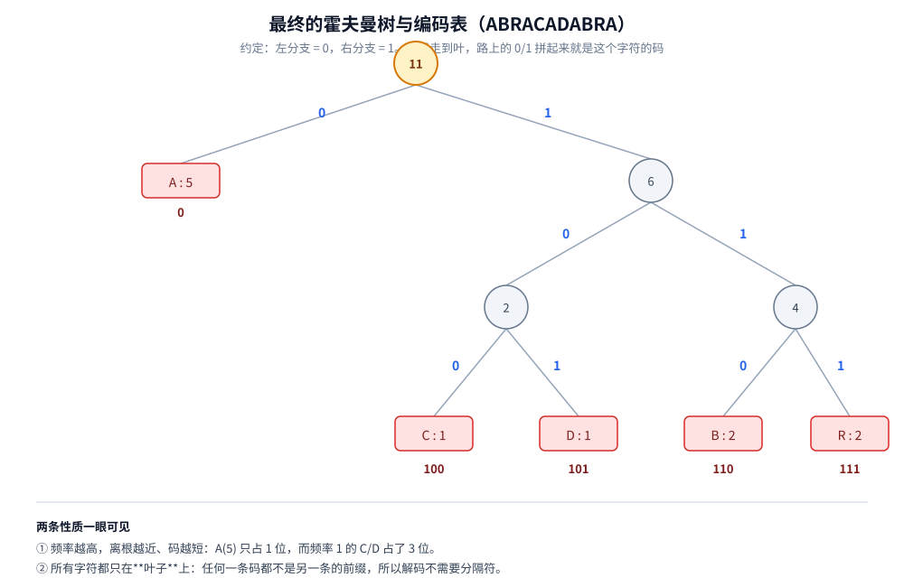

# 霍夫曼编码

> 贪心怎么在一棵树上做选择：**每轮取频率最小的两个合并**、为什么这样做是最优的（交换论证 + 最优子结构）、
> 前缀码性质与「不需要分隔符」的解码，以及四个边界情况 —— 其中一个是本篇实测里**真踩到的 bug**。
>
> ⭐ 本篇讲**霍夫曼编码这个算法本身**（贪心选择 → 二叉树 → 前缀码）。
> 「Huffman 在整个压缩体系里排第几、与算术编码 / LZ 怎么组合、真实压缩器怎么用两层叠加」见
> [../压缩算法.md](../压缩算法.md) 第二节 —— 两篇不重复：那里是**选型与量级**，这里是**算法内部**。
>
> 内容整理自个人学习笔记，素材见 [素材清单](../../素材清单.md)。最小堆的接口与实现见 [../数据结构.md](../数据结构.md)；
> 复杂度口径见 [../复杂度分析.md](../复杂度分析.md)。
>
> 📎 本篇所有输出均为本机实跑逐字抄录：**Go 1.26.5（windows/amd64）** 与 **JDK 1.8.0_321** 各实现一份，
> 输出**逐行对齐**（同样的合并次序、同样的编码串、同样的加权总码长）。实验代码在 `.workbuddy/tmp/huffman_lab/`。

---

## 一、霍夫曼编码是怎么构造的？

**本节要点**：全部机制一句话——**每轮把频率最小的两个合并成一个新节点**。看懂「堆怎么变」，就看懂了贪心在这里到底选了什么。

### 1.1 为什么需要它：定长编码的浪费

要把 `ABRACADABRA` 编码成 0/1 串，最直白的做法是**定长**：5 种字符 → 每种 3 位。

```text
A → 000    B → 001    R → 010    C → 011    D → 100
11 个字符 × 3 位 = 33 位
```

问题是：`A` 出现了 5 次（占 45%），却和只出现 1 次的 `C` 一样占 3 位。**变长编码**的思路是「常用的给短码、少用的给长码」，但立刻遇到一个新问题——

```text
如果这样分：A → 0    B → 01
那么 "0" "01" 连起来是 001：到底是 AAB 还是 AB？
```

⚠️ **所以变长编码必须满足「前缀码」**：任何一条码都不是另一条的前缀。**霍夫曼编码的价值就在于：它用贪心自动造出一棵满足前缀码的树**（前缀码 ⟺ 所有字符都在叶子，见 3.2）。

### 1.2 构造规则：每轮取最小的两个合并

| 步骤 | 动作 |
|---|---|
| ① | 统计每个字符的频率，每个字符是一个**只有根的树**（森林） |
| ② | 从森林里取出**频率最小的两棵**，合并成一棵新树（新树根频率 = 两者之和） |
| ③ | 把新树放回森林 |
| ④ | 重复 ②③，直到森林里只剩一棵树 —— 它就是霍夫曼树 |

⭐ 第二步就是**贪心选择**：只看「当前最小」，从不回头、也不做全局搜索。


### 1.3 逐步推演（本机实跑）

以 `ABRACADABRA` 为例（字符频率 `A=5 B=2 R=2 C=1 D=1`）：

```text
【建树过程】
  初始堆（按频率升序）：C(1)  D(1)  B(2)  R(2)  A(5)

  第 1 次合并：取最小的两个  C(1) + D(1) → 新节点(2)，堆里还剩 4 个
  第 2 次合并：取最小的两个  B(2) + R(2) → 新节点(4)，堆里还剩 3 个
  第 3 次合并：取最小的两个  内(2) + 内(4) → 新节点(6)，堆里还剩 2 个
  第 4 次合并：取最小的两个  A(5) + 内(6) → 新节点(11)，堆里还剩 1 个
```

四步里藏着三个必须看清的点：

1. **次数是确定的**：`n` 种字符恰好合并 `n − 1` 次（每次森林里少一棵树）。这里 5 种 → 4 次；
2. **⚠️ 第 3 次合并容易看错**：合并出「内(2)」后，堆里是 `内(2) B(2) R(2) A(5)`。此时最小的是 `内(2)` 和 `B(2)`（都是 2）——**不是** `内(2)` 和 `内(4)`。要等 `B(2)+R(2)` 先合并出 `内(4)`，下一轮才是 `内(2) + 内(4)`；
3. **频率高的最后被合并 → 离根最近**：`A(5)` 是最后才被合并的，所以它直接挂在根下、只占 1 位。

### 1.4 结果：树、编码表

```text
             根(11)
           0/      \1
         A(5)      内(6)
                 0/      \1
              内(2)      内(4)
             0/   \1    0/   \1
           C(1)  D(1)  B(2)  R(2)
```



约定**左分支 = 0、右分支 = 1**，从根走到叶、把路上的 0/1 拼起来：

```text
【编码表】（约定左分支=0、右分支=1）
  A  →  0       频率 5   码长 1
  C  →  100     频率 1   码长 3
  D  →  101     频率 1   码长 3
  B  →  110     频率 2   码长 3
  R  →  111     频率 2   码长 3

  加权总码长 = 23 bit，平均码长 = 2.091 bit/字符
```

⭐ **两条性质一眼可见**：

- **频率越高、码越短**：`A(5)` 只占 1 位，而频率 1 的 `C`/`D` 占 3 位；
- **代价可以这样算**：加权总码长 = **Σ(频率 × 码长)**。它同时等于「所有**内部节点**的频率之和」——这里 `2 + 4 + 6 + 11 = 23`。**这个等式是后面证明最优性的钥匙**（见 2.2）。

---

## 二、为什么「每次取最小的两个」是对的？

**本节要点**：贪心最容易「看起来对」。这一节给出**能讲出口的证明**：先证「最低频的两个一定可以放在最深层」，再用交换论证。

### 2.1 先看直觉：低频的应该埋得更深

在**等长**编码的树里，每个字符都在同一层。要让总码长最小，直觉是「**频率低的往深处放**」——因为它被用的次数少，多花几位不心疼；而频率高的每多一位，代价要乘上它巨大的出现次数。

霍夫曼的规则正好实现这个直觉：**每轮合并最小的两个** → 最小的那两个会被最先合并、因而埋得最深；最大的最后合并、因而离根最近（1.4 里 `A(5)` 只占 1 位）。

### 2.2 贪心选择性质：最低频的两个一定能放在最深层

**结论**：设 `x`、`y` 是频率最小的两个字符，则存在**一棵最优树**，其中 `x` 与 `y` 是兄弟、且位于最深层。

**证明（交换论证）**：任取一棵最优树 `T`。记 `D` 为 `T` 的**最大深度**。

1. **先取最深层的一对兄弟叶**。最深层必然存在一对兄弟：若最深层只有一个叶子 `u` 而它的父节点 `p` 没有别的孩子，那 `p` 就是多余的一层 —— 把 `u` 上移到 `p` 的位置，深度减 1、总代价变小，与「`T` 最优」矛盾。设这对兄弟为 `a`、`b`，二者深度都是 `D`；
2. **换 `x` 与 `a`**。设 `x` 在原树里的深度为 `d(x)`（必然 `≤ D`）。交换两者位置后，只有这两条码变了，总代价的变化量是
   `Δ = [f(x)·D + f(a)·d(x)] − [f(x)·d(x) + f(a)·D] = (D − d(x))·(f(x) − f(a))`；
3. **定号**。`D − d(x) ≥ 0`（`D` 是最大深度）；又 `x` 是频率最小的字符之一，故 `f(x) − f(a) ≤ 0`。两者相乘，`Δ ≤ 0`；
4. **但 `T` 已是最优**，不可能存在使代价变小的改动，所以 `Δ = 0`：交换后的 `T₁` **仍是最优树**，且 `x` 现在位于最深层（深度 `D`）；
5. **再换 `y` 与 `b`**。此时 `x` 已在最深层与 `b` 做兄弟，`y` 的深度仍 `≤ D`、`f(y) ≤ f(b)`，同 2~4 步的推导可得 `Δ ≤ 0`，于是交换后仍是最优树，且 `x`、`y` 正是最深层的一对兄弟。∎

⭐ **一句话直觉版**：**把最小的那两个换到最深处不会变差**（因为它们的频率最小，加深的代价最小），所以「总存在一棵最优树让它们在最深」——既然如此，就可以放心地先把它们合并掉。

### 2.3 最优子结构：合并之后问题还长一个样

把 `x`、`y` 合并成一个新字符 `z`（频率 `f(z) = f(x) + f(y)`），原问题规模从 `n` 降到 `n − 1`。

**结论**：原问题的最优解 = 「合并后问题的最优解」+ 把 `z` 拆回 `x`、`y` 两层。

**为什么**：设合并后最优树的代价是 `W'`，则原树代价 `W = W' + f(x) + f(y)`（因为 `z` 变深了一层，而这层代价正好是 `f(z)`）。`W'` 最小 ⟺ `W` 最小（`f(x)+f(y)` 是常数），所以**子问题的最优解能拼出原问题的最优解** ✓

⭐ **2.2 + 2.3 合起来就是贪心正确性的完整证明**：贪心选择性质（2.2）保证「第一步选最小的两个不亏」；最优子结构（2.3）保证「做完第一步后的子问题仍是同类问题、可递归」——**归纳成立**。

### 2.4 复杂度

| 实现 | 建树 | 说明 |
|---|---|---|
| **用最小堆** | `O(n log n)` | 建堆 `O(n)` + `n−1` 次「两次弹出 + 一次插入」，每次 `O(log n)` —— 本机 Go/Java 两版都用这个 |
| 用有序数组 + 双队列 | `O(n log n)`（排序后 `O(n)`） | 排序 `O(n log n)`；之后新节点频率单调不减，可用两个队列做到线性 |
| 朴素找最小（每轮扫一遍） | `O(n²)` | 只有字符种类很少（如 256 种字节）时才够用 |

⚠️ **注意 `n` 是什么**：是**字符种类数**，不是文本长度。字节流场景下 `n ≤ 256`，所以「朴素找最小」的 `O(n²)` 也只有 `65536` 次比较，实践中并不慢。**这也是为什么很多实现（如 DEFLATE）压根不用堆。**

### 2.5 ⚠️ 这个证明不覆盖什么

- 它只保证**在「每个字符固定一个整数位码长」的所有前缀码中最优**（见 4.3 与 [../压缩算法.md](../压缩算法.md)：平均码长仍有 `≥ 信息熵` 的下界，算术编码才能突破）；
- 它不保证**树形唯一**（见 5.3）：同频节点谁先合并会改变形状，但代价相同；
- 它**默认频率是已知且准确的**。真实压缩器是先扫一遍统计（DEFLATE 用动态码表），或用预定义码表（固定 Huffman）。

---

## 三、编码表与解码

**本节要点**：编码是「从树生成一张表」，解码是「按位下行」。**前缀码性质**是解码不需要分隔符的全部依据。

### 3.1 从树到码

一次深度优先遍历即可：向左走记 `0`、向右走记 `1`，走到叶子就把路径写进编码表。这就是「**每个字符的码 = 从根到该叶的唯一路径**」。

### 3.2 前缀码性质（本机实测）

```text
========== 实验二：前缀码性质 ==========
  两两检查 20 组，前缀冲突 0 处
  → ✅ 编码表是前缀码：解码不需要分隔符
```

⭐ **为什么一定成立**：编码表里每一条码都对应**一个叶子**。而前缀码的定义「任何一条码不是另一条的前缀」，在树上等价于「**没有任何一个字符落在另一个字符的祖先位置**」—— 由于只有叶子才对应字符、内部节点只是合并出来的，这个条件天然成立 ✓

⚠️ **反过来看这个等价关系很有用**：如果编码表里出现了「一个是另一个的前缀」，那就说明**某个字符被放在了内部节点上** —— 那不是一个合法的霍夫曼编码。

### 3.3 解码：按位下行，不需要分隔符

```text
  编码结果 = 01101110100010101101110（23 bit）
  解码回来 = "ABRACADABRA"  → 往返一致 = true（err=<nil>）
```

解码算法只有三行：**从根开始，读一位走一步；走到叶子就吐出一个字符、回到根**。因为没有任何码是别的前缀，所以**永远不会「走错一半」**——这就是前缀码的直接收益。

`01101110100010101101110` 逐段对照：

```text
0        110      111      0        100       101      0        110      111      0
A        B        R        A        C         D        A        B        R        A
```

⭐ 读法：**解码器只需要那棵树**（等价地：一张编码表）。它不需要知道原文本多长、也不需要任何分隔符。

---

## 四、压缩率到底有多少？

**本节要点**：**只算数据、不算编码表**会高估收益。这一节把两者都算出来——结论可能反直觉。

### 4.1 经典例子（不算表）

```text
【与定长编码对比】
  5 种字符 → 定长需要 ⌈log2(5)⌉ = 3 bit/字符
  霍夫曼平均 2.091 bit/字符 → 压缩比 1.43×
  整段文本：定长 33 bit vs 霍夫曼 23 bit，省 30.3%
```

### 4.2 把「编码表开销」算进去（本机实测）

换一段 350 字符、28 种字符的文本：

```text
========== 实验三：更长文本 + 把「编码表开销」也算进去 ==========
  文本 350 字符，字符种类 28
  定长        ：5 bit/字符 × 350 = 1750 bit
  霍夫曼数据  ：平均 4.286 bit/字符 → 1500 bit
  编码表开销  ：28 种字符，平均 21.2 bit/字符 ≈ 594 bit
  霍夫曼合计  ：1500 + 594 = 2094 bit
  最终压缩到  ：119.7%（只算数据 85.7%）
  解码往返 = true
```

⚠️⚠️ **只算数据是「省 14%」，算上编码表变成「多花 20%」**。原因：解码方必须拿到编码表，而表里每种字符要存「字符本身 + 码长 + 码字」（这里按 1 字节 + 1 字节 + 码字估），28 种就是 594 bit，**几乎等于数据部分省下来的 250 bit 的两倍多**。

⭐ **这解释了真实压缩格式的三个设计**：

| 真实做法 | 解决的就是这个问题 |
|---|---|
| **预定义码表**（固定 Huffman） | 表不占空间（写死在算法里），代价是不能适配数据分布 |
| **先把码表本身也压缩** | DEFLATE 用一个「码长序列 + 再 Huffman 一次」的技巧，把表压到很小 |
| **分块 + 每块重新统计** | 块太小表不划算、块太大分布会漂移 —— 这是压缩格式里最核心的取舍之一 |

⭐ **判据**：**霍夫曼编码适合「长文本 + 频率明显不均」**。短文本上「表开销 > 数据收益」，是负收益。

### 4.3 什么时候不值得用

| 场景 | 为什么没用 |
|---|---|
| **数据已被压缩 / 加密**（近似随机） | 频率天然均匀，码长趋近 8 位/字节，一分不省；加密数据甚至会略微变长 |
| **频率均匀**（本机 5.2 实测） | 每个码长都等于 `⌈log2(n)⌉` → 与定长完全等价，**零收益** |
| **字符种类极多、每种都很少** | 编码表开销吃掉全部收益（4.2 实测） |
| **要求随机访问第 k 个字符** | 变长码无法直接定位，必须从头解码（这是它相对定长编码的结构性代价） |

---

## 五、四个边界情况（本机实测）

**本节要点**：这些都不是「理论上可能」，而是本机真跑出来的。其中 5.1 是**写这篇时才踩到的真 bug**。

### 5.1 只有一个字符 —— 编码看起来正常，解码才炸

```text
【4.1 只有一个字符】
  "aaaa" → 树里只有一个节点（根即叶），编码表 a→"0"
  用「普通解码」：编码 0000 → 抛异常「走到空指针」
  用「单字符特判」：解码 "aaaa" → 往返 true
```

**这个 bug 值得单独说清**：

1. 建树时只有一种字符 → 森林里只有**一个节点**，循环「合并」一次都不执行，**根就是叶**；
2. 生成编码表时，从根到叶的路径是**空串**。所以代码里补了一位 `0`，否则码就是空的；
3. **编码阶段完全正常**（`"aaaa"` → `"0000"`，4 位，看起来没问题）；
4. **解码时才炸**：解码从根开始，读第一个 `0` 就去走 `cur.left` —— 而根是叶子，`left` 是 `nil`。

⭐ **根因**：编码表里「补一位」是人为约定的，但**树结构并没有对应的分支**，两边对不上。

⚠️ **修法**：解码函数开头特判「根就是叶」的情况，直接输出 `len(bits)` 个该字符：

```go
func decode(bits string, root *node) (string, error) {
	// ⚠️ 单字符特判：此时「根 == 叶」，树里没有任何分支，
	//    按位下行第一步就会走到 nil —— 必须单独处理
	if isLeaf(root) {
		return strings.Repeat(string(root.ch), len(bits)), nil
	}
	return decodeNaive(bits, root)
}
```

⚠️ 另外注意：**这种情况「压缩」后反而变长**（4 字符 → 4 bit），因为字符种类是 1、`⌈log2(1)⌉ = 0` 位就够表示。真实格式一般直接特判跳过压缩。

### 5.2 频率全部相同 → 退化成定长

```text
【4.2 频率全部相同】
  a → 00（码长 2）
  b → 01（码长 2）
  c → 10（码长 2）
  d → 11（码长 2）
  每个码长都是 2 bit = ⌈log2(4)⌉ → 与定长编码完全等价，零收益
```

⭐ **霍夫曼的收益只来自「频率不均」**。输入 `abcd` 时它老老实实给出 2 位码 —— 这时它**就是**定长编码，只是费了半天劲建了棵树。

### 5.3 树形不唯一，但加权总码长唯一

```text
【4.3 树形不唯一，但加权总码长唯一】
  输入 "aabbcde"，频率：a=2 b=2 c=1 d=1 e=1
  e → 00
  a → 01
  b → 10
  c → 110
  d → 111
  加权总码长 = 16
```

这里有**三个同频的 `1`**（c、d、e），「谁先跟谁合并」会得到不同形状的树、不同的具体码字（`e` 拿到了 `00`，而如果换个 tiebreak 顺序可能是别的），但**加权总码长恒为 16** ✓

⭐ **这是最优性的必然**：2.2/2.3 的证明只保证**代价最小**，不保证**形态唯一**。

⚠️ **工程后果必须记住**：**解码方必须拿到与编码方完全一致的那棵树**（同一份编码表，或同一份频率统计 + 同一套 tiebreak 规则）。本机 Go/Java 两版为此都在堆的比较里加了 `seq`（入堆序号）做同频 tiebreak —— **否则同频节点的弹出顺序取决于堆的内部实现，输出不可复现**。

### 5.4 表外字符 → 静默丢字符

建树只用「出现过的字符」，所以**频率为 0 的字符根本不在表里**。若编码时遇到表外的字符（例如后续数据流里出现了新字符），查表得到空串 → **这个字符被无声地丢掉了，而且解码端也不会报错**（只是解出来的文本少一个字符）。

⚠️ **真实格式必须显式处理**：要么保证「统计阶段见过了全部字符」，要么把表外字符转义 / 落到预定义码。**「静默丢数据」在压缩这种场景里比报错危险得多。**

---

## 使用：这条算法在你的系统里以什么形式出现

霍夫曼编码**几乎不会被自己实现**，它以「被用」的形式出现在项目的三层里。结合本仓库已有篇目逐层看：

**第一层：HTTP 传输（最常碰到）**。你在 nginx / 网关里看到 `gzip on;`，那背后就是 DEFLATE = LZ77 + Huffman。⚠️ 这也是**唯一一处「不配置就等于没开」的收益** —— 服务器默认往往不压缩响应体。响应里已经有 `Content-Encoding: gzip`，客户端（浏览器 / Go `http.Client`）自动解压，业务代码完全无感。相关：网关侧的压缩配置在 [../../中间件/网关选型.md](../../中间件/网关选型.md) 与 [../../中间件/OpenResty.md](../../中间件/OpenResty.md) 的典型应用一节。

**第二层：存储压缩（省钱的地方）**。MySQL 的页压缩（`ROW_FORMAT=COMPRESSED`）用的就是 zlib（同样是 LZ + Huffman）。⚠️ **这里的取舍与 4.2 完全一样**：压得太狠 → 页小、但要频繁解压；不压 → 磁盘 IO 大。所以它不是「开了就好」，而是要在「CPU ↔ IO ↔ 空间」之间调。相关：[../../数据存储/mysql/日志与落盘.md](../../数据存储/mysql/日志与落盘.md)。

**第三层：消息与日志**。Kafka 的 `compression.type`（gzip / snappy / lz4 / zstd）里，gzip 与 zstd 都含 Huffman 层。⚠️ **批量越大、压缩收益越高**（因为 4.2 的表开销被摊薄、且 LZ 能抓到更多重复），这也是 Kafka 生产端「攒一批再发」的动机之一，与吞吐是同一笔账。相关：[../../中间件/消息队列/Kafka.md](../../中间件/消息队列/Kafka.md)。

⭐ **归纳成一条判断**：**你几乎不会「用」霍夫曼编码，但你会「选」它**。而 4.2/4.3 那两节给出的判据 —— **长文本 + 分布不均 + 表开销能被摊薄** —— 正好就是「这个开关该不该开」的判据。

---

## 延伸追问

- **霍夫曼编码是唯一的吗？** → **不是**。同频节点谁先合并会得到不同形状的树与不同码字，但**加权总码长相同**（本机 5.3 实测）。⚠️ 所以「编码表」必须跟着数据一起传，不能两边各自算 —— 除非约定同一套 tiebreak 规则。
- **为什么低频的放深层反而更省？** → 因为总代价是 **Σ(频率 × 码长)**：给一个出现 1000 次的字符加 1 位，代价是 1000；给出现 1 次的字符加 5 位，代价才 5。**代价要按频率加权看** —— 这也是 2.1 直觉的量化版。
- **它就是最优的变长编码吗？** → 在**「每个字符固定整数位码长 + 前缀码」**这个约束下，是最优的。但**平均码长仍有 `≥ 信息熵` 的下界**：Huffman 只能给整数位，所以够不到熵极限；算术编码用区间细分能做到小数位，才更接近。相关见 [../压缩算法.md](../压缩算法.md) 第二节。
- **为什么工程实现里很少见到堆？** → 因为 `n` 是**字符种类数**：字节流场景下 `n ≤ 256`，朴素找最小的 `O(n²)` 也只有 6 万多次比较。⚠️ 反而是「把树序列化成能传给解码方的形式」更值得花心思 —— 那才是真实格式的难点（DEFLATE 用码长序列 + 二次 Huffman）。
- **解码为什么不需要分隔符？** → 因为前缀码（实测 3.2）：每条码都对应树上的一个**叶子**，所以按位下行时**不存在「走到一半就撞上另一个字符」的情况**。等价地说：**任何一条码都不是另一条的前缀**。
- **「只有一种字符」为什么是个真 bug？** → 因为此时「根 = 叶」，编码表里人为补的 `0` 与树结构对不上，解码第一步就走空。⚠️ 而且**编码阶段完全看不出来**（本机 5.1 实测），只有解码才炸。修法是解码端对「根是叶」做特判。
- **代码里的 `seq`（入堆序号）是干什么的？** → **同频 tiebreak**。没有它，同频节点谁先弹出取决于堆的内部实现（Go 的 `container/heap` 与 Java 的 `PriorityQueue` 就可能不同），输出不可复现、两语言也无法逐行对齐。**这也是「两版实现输出能对齐」的唯一原因。**
- **熵编码在现代压缩器里还是主角吗？** → 是「最后一层」，但现代格式把重心挪到了**上下文建模**（如 brotli、zstd 的 FSE 与 LZ 匹配器）。Huffman 的优点是**解码极快**（按位走树即可），所以在 gzip 这种「要快、要简单」的场景里仍是标配。

## 关联

- [../压缩算法.md](../压缩算法.md) — **本篇的上一层**：Huffman 在压缩体系里的定位、与算术编码 / LZ 的组合关系、真实压缩器的两层叠加
- [../数据结构.md](../数据结构.md) — 建树用的**最小堆**接口，以及树的表示
- [../复杂度分析.md](../复杂度分析.md) — `O(n log n)` 的推导口径与「摊还」分析
- [../查找与排序对比.md](../查找与排序对比.md) — 同属「用对数据结构换掉复杂度」的思路：Top-K 用堆也是同理
- [../../中间件/网关选型.md](../../中间件/网关选型.md) — 「使用」一节的第一层：HTTP 传输压缩开关
- [../../数据存储/mysql/日志与落盘.md](../../数据存储/mysql/日志与落盘.md) — 第二层：页压缩在「CPU ↔ IO ↔ 空间」之间的取舍
- [../../中间件/消息队列/Kafka.md](../../中间件/消息队列/Kafka.md) — 第三层：消息批量压缩，摊薄编码表开销
- [../图论算法/最短路/Dijkstra.md](../图论算法/最短路/Dijkstra.md) — 同样靠小顶堆取极值，但**取法不同**：这里「每轮取最小的两个」是建树，那里「每轮取最小的一个」是定稿；两篇遇到的 `seq` tiebreak 也是同一个可复现性问题
> 反向引用（本篇被下列文档引到）：[LCS.md](../动态规划/LCS.md)、[LIS.md](../动态规划/LIS.md)、[背包问题.md](../动态规划/背包问题.md)、[数独.md](../回溯/数独.md)、[Kruskal.md](../图论算法/最小生成树/Kruskal.md)、[Bellman-Ford.md](../图论算法/最短路/Bellman-Ford.md)、[Floyd.md](../图论算法/最短路/Floyd.md)、[KMP.md](../字符串匹配/KMP.md)、[区间调度.md](区间调度.md)、[活动选择.md](活动选择.md)
